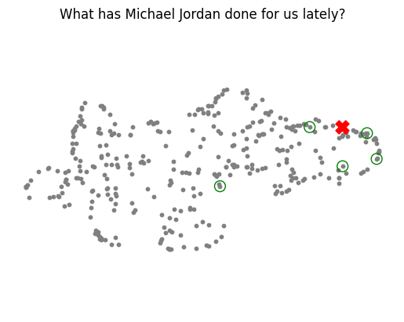

Little bit about some of the pitfalls of retrieval with vectors. I want to show you some cases where simple vector search really isn't enough to make retrieval work for your AI application. Just because things are semantically close as vectors under a particular embedding model, doesn't always mean you're going to get good results right out of the box. Let's take a look.

First thing we need to do is just get set up. Our helper utilities this time will let us load up everything we need to load from Chroma, have the right embedding function ready to go, and we're just going to do a little bit of setup. So again, we're going to create the same embedding function, and we're going to use our helper function this time to load our Chroma collection. 


```python
from helper_utils import load_chroma, word_wrap
from chromadb.utils.embedding_functions import SentenceTransformerEmbeddingFunction

embedding_function = SentenceTransformerEmbeddingFunction()

chroma_collection = load_chroma(filename='microsoft_annual_report_2022.pdf', collection_name='microsoft_annual_report_2022', embedding_function=embedding_function)
chroma_collection.count()
```


And we're just going to output the count to make sure we've got the right number of vectors in there. And again, don't worry about any of these warnings you might see. So yeah, that's the right output. There are 349 chunks embedded in Chroma.

So one thing that I personally find useful is to visualize the embedding space. Remember that embeddings and their vectors are a geometric data structure and you can reason about them spatially. Obviously embeddings are very high dimensional. Sentence transformer embeddings have 348 dimensions like we talked about, but we can project them down into two dimensions which humans can visualize, and this can be useful for reasoning about the structure of embedding space.


To do that, we're going to use something called UMAP. UMAP is Uniform Manifold Approximation, and it's an open source library that you can use exactly for projecting high dimensional data down into two dimensions or three dimensions so that you can visualize it. This is a similar technique to something like PCA or t-SNE, except UMAP explicitly tries to preserve the structure of the data in terms of the distances between points as much as it can, unlike for example, PCA, which just tries to find the dominant directions and project data down in that way. So we're gonna import UMAP and we'll grab NumPy. And we'll grab tqdm.

```python
import umap
import numpy as np
from tqdm import tqdm

embeddings = chroma_collection.get(include=['embeddings'])['embeddings']
umap_transform = umap.UMAP(random_state=0, transform_seed=0).fit(embeddings)
```

If you don't know what tqdm is, it's a tool that shows you a progress bar, which is quite handy when dealing with long-running processes. It allows you to gauge how long the iterations are taking and how much longer you might have to wait. We'll be extracting all of the embeddings from the Chroma Collection and fitting a UMAP transform to it. UMAP essentially fits a manifold to your data to project it down into two dimensions. We'll set the random seed to zero for reproducibility, ensuring we get the same projection each time.

```python
def project_embeddings(embeddings, umap_transform):
    umap_embeddings = np.empty((len(embeddings),2))
    for i, embedding in enumerate(tqdm(embeddings)): 
        umap_embeddings[i] = umap_transform.transform([embedding])
    return umap_embeddings   
```

After fitting the transform, we'll use it to project the embeddings. We'll define a function called project_embeddings, which takes an array of embeddings and the transform itself as inputs. We'll initialize an empty NumPy array with the same length as our embeddings array but with dimension two, as we are obtaining two-dimensional projections. The embeddings will be projected one by one to maintain consistency, since UMAP's projection can be sensitive to its inputs. This approach also ensures reproducible results. Once we've defined the function, we'll run it on our dataset, which will take some time.

Once the process is completed, we'll project the embeddings and take a look at them. To visualize our data, we'll use matplotlib, a library that many of you are probably quite familiar with by now.


```python
import matplotlib.pyplot as plt

plt.figure()
plt.scatter(projected_dataset_embeddings[:, 0], projected_dataset_embeddings[:, 1], s=10)
plt.gca().set_aspect('equal', 'datalim')
plt.title('Projected Embeddings')
plt.axis('off')
```

We're going to make a figure and just do a scatterplot of the projected embeddings. You can see we have projected dataset embeddings, the first element of each one, and the second element of each one, and we're going to make them size 10 just because it's visually pleasing. We'll set some other properties of our axes, and there we go. This is what our dataset looks like inside Chroma projected down to two dimensions, and you can see that we've preserved some structure. More advanced visualization would allow you to hover over each of these dots and see what's actually in there, and you would find that things with similar meanings end up next to each other even in the projection.

Sometimes there are unusual structures because a two-dimensional projection cannot represent all of the structure of the higher-dimensional space. But as I said, it is useful for visualization. It's particularly helpful to bring your own thinking into a more geometric setting and actually consider vectors and points, which is what embedding space retrieval is all about. Evaluating the quality and performance of a retrieval system is really all about relevancy and distraction.

So let's revisit our original query, the one used in our RAG example, "What's the total revenue?" We're going to do the same thing as we did last time: query the Chroma Collection with this query, ask for five results, and include the documents and the embeddings because we'd like to see the comparison.


to use those embeddings for visualization. And so we're going to grab our retrieved documents out of the results again, and let's print them out. We see again, the same results as we saw before. Retrieval is deterministic in this case, and we see that there are several revenue-related documents, but also there are things here that might not be directly related to revenue. We see things like potentially costs, things that are to do with money, but not necessarily revenue. So let's take a look at how this query actually looks when visualized. We're going to grab the embedding for our query using the embedding function, and we're going to grab our retrieved embeddings as well, which we get from our result.


We're going to use our projection function to project both of these down to two dimensions. And then, now that we've got the projections, we can visualize them. We can visualize them against the projection of the dataset. I'll just copy-paste this in. But it's, again, a scatterplot of the dataset embeddings of the query embedding, and of the retrieved embedding. We're going to set the query embedding to be a red X. And we're going to see the selected or retrieved embeddings as empty circles, which are green.

So let's go ahead and see what that looks like. 


This is a visualization of the query and the retrieved embeddings. You can see the query here is this red X. And the green circles basically circle those data points that we actually end up retrieving. Notice that it doesn't look in the projection like these are the actually nearest neighbors. But remember, we're trying to squash down many, many higher dimensions into this two-dimensional representation. So it's not always going to be perfect.

But the important thing is to basically look at the structure of these results. And you can see some are more outlier than others. And this is actually the heart of the entire issue. The embedding model that we use to embed queries and embed our data does not have any knowledge of the task or query we're trying to answer at the time we actually retrieve the information.


So the reason that a retrieval system may not perform the way that we expect is because we're asking it to perform a specific task using only a general representation. And that makes things more complicated. Let's try visualizing a couple other queries in a similar way. So here I'm just going to copy-paste the whole thing. But the query now is what's the strategy around artificial intelligence, that is AI. So let's run and see what results we get. You see here that AI is mentioned in most of these documents. And this is sort of vaguely related to AI. We have a commitment to responsible AI development. But then we have something about this information about a database which is not directly related to AI. And here we're talking about mixed reality applications and metaverse, which is tangentially related to technology investments, but not necessarily directly AI related. So let's visualize.

```python
query = "What is the total revenue?"

results = chroma_collection.query(query_texts=query, n_results=5, include=['documents', 'embeddings'])

retrieved_documents = results['documents'][0]

for document in results['documents'][0]:
    print(word_wrap(document))
    print('')
```

```python
query_embedding = embedding_function([query])[0]
retrieved_embeddings = results['embeddings'][0]

projected_query_embedding = project_embeddings([query_embedding], umap_transform)
projected_retrieved_embeddings = project_embeddings(retrieved_embeddings, umap_transform)
```


```python
# Plot the projected query and retrieved documents in the embedding space
plt.figure()
plt.scatter(projected_dataset_embeddings[:, 0], projected_dataset_embeddings[:, 1], s=10, color='gray')
plt.scatter(projected_query_embedding[:, 0], projected_query_embedding[:, 1], s=150, marker='X', color='r')
plt.scatter(projected_retrieved_embeddings[:, 0], projected_retrieved_embeddings[:, 1], s=100, facecolors='none', edgecolors='g')

plt.gca().set_aspect('equal', 'datalim')
plt.title(f'{query}')
plt.axis('off')
```

First, we'll project the same way as we did in the previous query. And then we will plot. Let's take a look. Here's our query and our related results. And they're all coming from the same part of the dataset. But you can see that some of the results that we get, you know, and here, this point appears to be bang on where our query landed. So it's super, super relevant. So you can see that, obviously, where the query lands in the space has geometric meaning and we're pulling in related results. But again, what's related is from the general purpose embedding model, not from the specific tasks that we're performing. So let's take a look at another query.

What has been the investment in research and development? This is a very general query, and it should be reflected in the annual statement. So let's see what kind of documents we get back. 


```python
query = "What has been the investment in research and development?"
results = chroma_collection.query(query_texts=query, n_results=5, include=['documents', 'embeddings'])

retrieved_documents = results['documents'][0]

for document in results['documents'][0]:
    print(word_wrap(document))
    print('')
```
Output documents received


```
operating expenses increased $ 1. 5 billion or 14 % driven by
investments in gaming, search and news advertising, and windows
marketing. operating expenses research and development ( in millions,
except percentages ) 2022 2021 percentage change research and
development $ 24, 512 $ 20, 716 18 % as a percent of revenue 12 % 12 %
0ppt research and development expenses include payroll, employee
benefits, stock - based compensation expense, and other headcount -
related expenses associated with product development. research and
development expenses also include third - party development and
programming costs, localization costs incurred to translate software
for international markets, and the amortization of purchased software
code and services content. research and development expenses increased
$ 3. 8 billion or 18 % driven by investments in cloud engineering,
gaming, and linkedin. sales and marketing

competitive in local markets and enables us to continue to attract top
talent from across the world. we plan to continue to make significant
investments in a broad range of product research and development
activities, and as appropriate we will coordinate our research and
development across operating segments and leverage the results across
the company. in addition to our main research and development
operations, we also operate microsoft research. microsoft research is
one of the world ’ s largest corporate research organizations and works
in close collaboration with top universities around the world to
advance the state - of - the - art in computer science and a broad
...
and territories with our global skills initiative, we introduced a new
initiative to support a more skills - based labor market, with greater
flexibility and accessible learning paths to develop the right skills
```

Lets project and plot the received documents

```python
query_embedding = embedding_function([query])[0]
retrieved_embeddings = results['embeddings'][0]

projected_query_embedding = project_embeddings([query_embedding], umap_transform)
projected_retrieved_embeddings = project_embeddings(retrieved_embeddings, umap_transform)
```

Plotting the projected embeddings

```python
# Plot the projected query and retrieved documents in the embedding space
plt.figure()
plt.scatter(projected_dataset_embeddings[:, 0], projected_dataset_embeddings[:, 1], s=10, color='gray')
plt.scatter(projected_query_embedding[:, 0], projected_query_embedding[:, 1], s=150, marker='X', color='r')
plt.scatter(projected_retrieved_embeddings[:, 0], projected_retrieved_embeddings[:, 1], s=100, facecolors='none', edgecolors='g')

plt.gca().set_aspect('equal', 'datalim')
plt.title(f'{query}')
plt.axis('off')
```

We see that we start with general ideas about investments. Some of it is about research and development. For example, this document, research and development expenses, included third-party development and programming costs. But we see that there are also distractors in this result. A distractor is a result that is not actually relevant to the query.


A distractor is a result that is not actually relevant to the query, named so because it can cause the large language model (LLM) to become distracted in a Retrieval-Augmented Generation (RAG) loop, leading to suboptimal results. This issue is particularly significant because diagnosing and debugging model behavior affected by distractors is challenging for both users and developers. Therefore, ensuring the retrieval system is robust and returns only relevant results without distractions is crucial.

Visualizing the projection of data is an effective method to develop intuitions about the geometric nature of embedding spaces. In such visualizations, results that are more spread out can indicate that a query landed outside the "data cloud," pulling nearest neighbors from various parts of the cloud and resulting in a diverse set of results. This geometrical intuition helps in understanding how queries interact with the data space.

To illustrate the impact of irrelevant queries, consider querying a system about Michael Jordan's contributions to Microsoft's annual report from 2022. As expected, such a query is highly unlikely to yield relevant results, demonstrating the retrieval system's function to return the nearest neighbors, even when the query is unrelated to the dataset. This underscores the importance of query relevance in the context of RAG loops.


I mentioned earlier, understanding and debugging from both the application user's and developer's perspectives can be very difficult when dealing with irrelevant queries and results. To address these challenges, examining the projection can offer insights.

After projecting, the visualization reveals that results concerning Michael Jordan scatter widely, which aligns with expectations given the irrelevance of the query to the dataset. Encouraging the exploration of various queries and their impact on the results' structure can be enlightening. By experimenting with different queries, you can observe how they position within the dataset and what the returned results reveal about the information in those specific areas.

This lab has illustrated how a basic embedding space retrieval system might return distracting or irrelevant results, even for straightforward queries. It also introduced a method to visualize data to develop an understanding of the reasons and mechanisms behind the results returned. In the forthcoming lab, techniques to enhance the quality of your queries using Large Language Models (LLMs) through query expansion will be explored, offering strategies to refine the retrieval process further.


