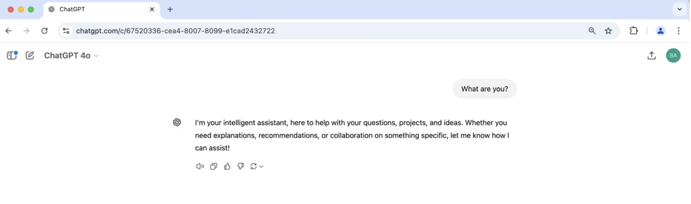

Here's the transcript formatted with paragraphs and headings:

# Deep Dive into LLMs like ChatGPT

## Introduction
Hi everyone! I've wanted to make this video for a while. It's a comprehensive, yet general audience introduction to large language models (LLMs) like ChatGPT. My goal with this video is to give you mental models for thinking through what this tool is. It's obviously magical and amazing in some respects, really good at some things, but not very good at others. There are also a lot of sharp edges to be aware of. What exactly is behind this text box where you put anything and press enter? What should we be putting there, and how are these words generated back? How does this work, and what are you talking to exactly? 

I'm hoping to address all those topics in this video. We're going to go through the entire pipeline of how this stuff is built, but I'm going to keep everything accessible to a general audience. Let's take a look at first how you build something like ChatGPT, and along the way, I'm going to talk about some of the cognitive psychological implications of these tools.

## Building ChatGPT: The Pre-training Stage

Okay, so let's build ChatGPT. There will be multiple stages arranged sequentially.

The first stage is called the pre-training stage, and the first step of this stage is to download and process the internet. To get a sense of what this roughly looks like, I recommend looking at resources like the Fine Web data set from Hugging Face. This company collected, created, and curated this data set, and their blog post goes into a lot of detail on how they constructed it. All major LLM providers like OpenAI, Anthropic, and Google will have some internal equivalent to the Fine Web data set.

Roughly, what are we trying to achieve here? We're trying to get a ton of text from the internet from publicly available sources. We want a huge quantity of very high-quality documents and a very large diversity of documents because we want to embed a lot of knowledge inside these models. Achieving this is quite complicated and, as you can see, takes multiple stages to do well. For example, the Fine Web data set, which is fairly representative of what you would see in a production-grade application, ends up being only about 44 terabytes of disk space. You can get a USB stick for like a terabyte very easily, or this could fit on a single hard drive today. 

   

### Fine Web Dataset

**Building Large-Scale Text Datasets: The FineWeb Example**

Creating massive text datasets for training AI models involves significant data collection and rigorous filtering. Even with the vastness of the internet, the process, particularly with aggressive filtering, results in substantial but manageable data volumes. For instance, the FineWeb dataset, despite its origins in extensive web crawling, ultimately amounts to approximately **44 terabytes** of text.

<a href="https://huggingface.co/spaces/HuggingFaceFW/blogpost-fineweb-v1">FineWeb Dataset Blog</a>

**The Journey from Raw Web to Refined Text:**

The journey of data transformation typically begins with **Common Crawl**, an organization that has been systematically indexing the internet since 2007. As of 2024, Common Crawl has indexed an astounding **2.7 billion web pages**, collecting a colossal amount of raw web data. This serves as the primary input for many large-scale text dataset initiatives.

However, this raw Common Crawl data undergoes a series of critical processing and filtering stages to produce a clean and usable dataset:

1.  **URL Filtering:** This initial step involves removing undesirable content by applying **blocklists of URLs and domains**. This typically includes sites associated with malware, spam, marketing, adult content, and objectionable material (such as racist websites), ensuring they are excluded from the dataset.

    

2.  **Text Extraction:** Web pages are primarily raw HTML, containing various markups and code. This stage focuses on extracting only the meaningful text content from the HTML, discarding navigation elements, CSS, and other non-textual components.

3.  **Language Filtering:** A language classifier is employed to identify the language of each web page. For example, FineWeb specifically retains web pages that are **more than 65% English**. This is a crucial design decision; a dataset heavily focused on one language will result in a model that performs exceptionally well in that language but may struggle with others. Companies decide the degree to which they prioritize multilingual performance.

    

4.  **Deduplication and PII Removal:** Subsequent filtering steps involve **deduplication** to eliminate redundant content and **Personally Identifiable Information (PII) removal**. This includes detecting and filtering out sensitive data like addresses and Social Security numbers, ensuring privacy and data hygiene.

**The Result: A Vast Tapestry of Text**

After these extensive pre-processing stages, datasets like FineWeb become publicly accessible, showcasing the final filtered text. These datasets, comprising tens of terabytes of text (e.g., **40 terabytes** for FineWeb), serve as the foundational input for training neural networks. The goal is for these networks to internalize the patterns and flow of this massive "tapestry" of text data, enabling them to mimic and generate human-like text.

**Representing Text for Neural Networks:**

Before feeding text into neural networks, it must be represented as a **one-dimensional sequence of symbols from a finite set**. 

Binary encoding of the text

While raw text can be UTF-8 encoded into a long sequence of binary bits (0s and 1s), this is inefficient due to the extreme sequence length. To optimize this, groups of consecutive bits (e.g., **eight bits**) are combined into a single "byte."

This results in a sequence that is **eight times shorter** but introduces a larger "vocabulary" of **256 possible symbols** (0 to 255). These symbols are best understood as unique IDs or distinct tokens, analogous to a sequence of unique emojis, which allows for more efficient processing by neural networks.

## Tokenization

In production, for state-of-the-art language models, you actually want to go even beyond this. You want to continue to shrink the length of the sequence because it is a precious resource in return for more symbols in your vocabulary. This is done by running what's called the **Byte Pair Encoding (BPE) algorithm**. The way this works is we're basically looking for consecutive bytes or symbols that are very common. For example, the sequence "116" followed by "32" is quite common and occurs very frequently. So, we're going to group this pair into a new symbol. We're going to mint a symbol with an ID (e.g., 256) and rewrite every single pair "116 32" with this new symbol.

We can iterate this algorithm as many times as we wish, and each time we mint a new symbol, we're decreasing the length and increasing the symbol size. In practice, a pretty good setting for the vocabulary size turns out to be about 100,000 possible symbols. In particular, GPT-4 uses 100,277 symbols. This process of converting from raw text into these symbols, or as we call them, **tokens**, is the process called **tokenization**.

Let's take a look at how GPT-4 performs tokenization, converting from text to tokens and from tokens back to text. One website I like to use to explore these token representations is called "tiktokenizer." 

You can put in text, and it shows you the tokenization of that text. For example, "hello world" turns out to be exactly two tokens: "hello" (ID 15339) and " world" (ID 1917). If I were to join these two, I would again get two tokens, but it's the token "H" followed by "L world" without the "H." 

If I put two spaces between "hello" and "world," it's again a different tokenization; there's a new token "220." You can play with this and see what happens. 

Also, keep in mind this is case-sensitive. If it's a capital "H," it's something else, or if it's "Hello World," this actually ends up being three tokens instead of just two. You can play with this and get an intuitive sense of how these tokens work. 

We're actually going to loop around to tokenization a bit later in the video. For now, I just wanted to show you the website and that this text, at the end of the day, for example, if I take one line here, this is what GPT-4 will see it as. This text will be a sequence of length 62. 

This is the sequence here, and this is how the chunks of text correspond to these symbols. Again, there are 100,277 possible symbols, and we now have one-dimensional sequences of those symbols. We'll come back to tokenization, but that's where we are for now.

## Neural Network Training

What I've done now is I've taken this sequence of text in the data set and I have re-represented it using our tokenizer into a sequence of tokens. This is what that looks like. When we go back to the Fine Web data set, they mentioned that not only is this 44 terabytes of disk space, but this is about a 15 trillion token sequence in this data set. These are just some of the first few thousand tokens of this data set, but there are 15 trillion here. Keep in mind that all of these represent little text chunks; they're all just like atoms of these sequences, and the numbers here don't make any sense; they're just unique IDs.

Now we get to the fun part, which is the **neural network training**. This is where a lot of the heavy lifting happens computationally when you're training these neural networks. What we do here is we want to model the statistical relationships of how these tokens follow each other in the sequence. So, we come into the data and we take windows of tokens from this data, fairly randomly. The window length can range anywhere between zero tokens all the way up to some maximum size that we decide on. For example, in practice, you could see a window of, say, 8,000 tokens. In principle, we can use arbitrary window lengths, but processing very long sequences would just be very computationally expensive. So, we just decide that, say, 8,000 is a good number, or 4,000 or 16,000, and we crop it there. In this example, I'm going to be taking the first four tokens just so everything fits nicely.

So these tokens, we're going to take a window of four tokens: "this," "bar," "view," "in," and "space single," which are these token IDs. What we're trying to do here is basically predict the token that comes next in the sequence. So "3962" comes next. These four tokens are called the **context**, and they feed into a neural network. This is the input to the neural network.

I'll go into the detail of what's inside this neural network in a little bit. For now, it's important to understand the input and the output of the neural net. The input are sequences of tokens of variable length, anywhere between zero and some maximum size like 8,000. The output is a prediction for what comes next. Because our vocabulary has 100,277 possible tokens, the neural network is going to output exactly that many numbers, and all of those numbers correspond to the probability of that token coming next in the sequence. So, it's making guesses about what comes next.

In the beginning, this neural network is randomly initialized. We'll see in a little bit what that means, but it's a random transformation. So, these probabilities in the very beginning of the training are also going to be kind of random. Here I have three examples, but keep in mind that there are 100,000 numbers here. For instance, the neural network might say that the probability of "space Direction" is 4% likely right now, "11799" is 2%, and "3962" (which is "post") is 3%. Of course, we've sampled this window from our data set, so we know what comes next; we know that the correct answer is that "3962" actually comes next in the sequence.

Now, we have a mathematical process for updating the neural network; we have a way of tuning it. We'll go into a little bit of detail in a bit, but basically, we know that this probability of 3% for "post" needs to be higher, and we want the probabilities of all the other tokens to be lower. So, we have a way of mathematically calculating how to adjust and update the neural network so that the correct answer has a slightly higher probability. If I update the neural network now, the next time I feed this particular sequence of four tokens into the neural network, it will be slightly adjusted. It might then say "post" is maybe 4%, and "case" is maybe 1%, and "Direction" could become 2%, or something like that. So, we have a way of nudging, of slightly updating the neural net to basically give a higher probability to the correct token that comes next in the sequence.

This process happens not just for this one token where these four tokens fed in and predicted this one; this process happens at the same time for all of these tokens in the entire data set. In practice, we sample little windows, little batches of windows, and then at every single one of these tokens, we want to adjust our neural network so that the probability of that token becomes slightly higher. This all happens in parallel in large batches of these tokens. This is the process of training the neural network: it's a sequence of updating it so that its predictions match up the statistics of what actually happens in your training set, and its probabilities become consistent with the statistical patterns of how these tokens follow each other in the data.

## Neural Network Internals (Deep Dive)

Let's now briefly get into the internals of these neural networks just to give you a sense of what's inside. So, for neural network internals, as I mentioned, we have these inputs that are sequences of tokens. In this case, it's four input tokens, but this can be anywhere from zero up to, let's say, 8,000 tokens. In principle, this could be an infinite number of tokens, but it would just be too computationally expensive to process an infinite number of tokens, so we just crop it at a certain length, and that becomes the maximum context length of that model.

These inputs (X) are mixed up in a giant mathematical expression together with the parameters or the weights of these neural networks. Here I'm showing six example parameters and their setting, but in practice, modern neural networks will have billions of these parameters. In the beginning, these parameters are completely randomly set. With a random setting of parameters, you might expect that this neural network would make random predictions, and it does in the beginning—it's totally random predictions. But it's through this process of iteratively updating the network (and we call that process training a neural network) that the setting of these parameters gets adjusted such that the outputs of our neural network become consistent with the patterns seen in our training set.

Think of these parameters as kind of like knobs on a DJ set. As you're twiddling these knobs, you're getting different predictions for every possible token sequence input. Training a neural network just means discovering a setting of parameters that seems to be consistent with the statistics of the training set.

Let me just give you an example of what this giant mathematical expression looks like, just to give you a sense. Modern networks are massive expressions with trillions of terms, probably, but let me just show you a simple example here. It would look something like this. These are the kinds of expressions, just to show you that it's not very scary. We have inputs (X), like X1, X2 in this case (two example inputs), and they get mixed up with the weights of the network (W0, W1, W2, W3, etc.). This mixing involves simple things like multiplication, addition, exponentiation, division, etc. It is the subject of neural network architecture research to design effective mathematical expressions that have a lot of convenient characteristics: they are expressive, optimizable, parallelizable, etc. But at the end of the day, these are not complex expressions, and basically, they mix up the inputs with the parameters to make predictions. We're optimizing the parameters of this neural network so that the predictions come out consistent with the training set.

I would like to show you an actual production-grade example of what these neural networks look like. For that, I encourage you to go to this website that has a very nice visualization of one of these networks. This is what you will find on this website. This neural network, used in production settings, has a special kind of structure: it's called the **Transformer**. This particular one, as an example, has roughly 85,000 parameters. Here, at the top, we take the inputs, which are the token sequences, and then information flows through the neural network until the output, which are the logit softmax values—these are the predictions for what token comes next. There's a sequence of transformations, and all these intermediate values are produced inside this mathematical expression as it's predicting what comes next.

For example, these tokens are embedded into a distributed representation, as it's called. Every possible token has a vector that represents it inside the neural network. First, we embed the tokens, and then those values flow through this diagram. These are all very simple mathematical expressions individually. So, we have layer norms, matrix multiplications, soft Maxes, and so on. Here, you see the attention block of this Transformer, and then information flows into the multi-layer perceptron block and so on. All these numbers here are the intermediate values of the expression. You can almost think of these as the firing rates of these synthetic neurons. But I would caution you not to think of it too much like neurons because these are extremely simple neurons compared to the neurons you would find in your brain. Your biological neurons are very complex dynamical processes that have memory and so on. There's no memory in this expression; it's a fixed mathematical expression from input to output with no memory—it's stateless. So these are very simple neurons in comparison to biological neurons, but you can still loosely think of this as a synthetic piece of brain tissue, if you like. Information flows through, all these "neurons" fire until we get to the predictions.

I'm not going to dwell too much on the precise mathematical details of all these transformations. Honestly, I don't think it's that important to understand what's really important to grasp is that this is a mathematical function. It's parameterized by some fixed set of parameters, like say 85,000 of them, and it's a way of transforming inputs into outputs. As we "twiddle" the parameters, we get different kinds of predictions, and then we need to find a good setting of these parameters so that the predictions match up with the patterns seen in the training set. So, that's the Transformer.

## Inference (Generating New Data)

I've shown you the internals of the neural network, and we talked a bit about the process of training it. I want to cover one more major stage of working with these networks, and that is the stage called **inference**. In inference, we're generating new data from the model. We want to basically see what kind of patterns it has internalized in the parameters of its network.

To generate from the model is relatively straightforward. We start with some tokens that are basically your prefix, what you want to start with. So, say we want to start with the token "91." We feed it into the network, and remember that the network gives us probabilities. It gives us this probability vector. What we can do now is basically flip a biased coin. We can sample a token based on this probability distribution. The tokens that are given a high probability by the model are more likely to be sampled when you flip this biased coin. So, we sample from the distribution to get a single unique token. For example, token "860" might come next. "860" is a relatively likely token; it might not be the only possible token, but it's relatively likely, and indeed, in our training example, "860" does follow "91."

Let's now say that we continue the process. After "91," there's "860." We append it, and we again ask, "What is the third token?" Let's sample, and let's just say that it's "287." Let's do that again. We come back in. Now we have a sequence of three, and we ask, "What is the likely fourth token?" And we sample from that and get this one. Now, let's say we do it one more time: we take those four, we sample, and we get this one, "13659." This is not actually "3962," as we had before. This token is the token "article" instead. So, "viewing a single article." In this case, we didn't exactly reproduce the sequence that we saw here in the training data.

Keep in mind that these systems are **stochastic**; they involve sampling and flipping coins. Sometimes we get lucky and reproduce a small chunk of the text in the training set, but sometimes we get a token that was not verbatim part of any of the documents in the training data. So, we're going to get remixes of the data that we saw in the training because at every step of the way, we can flip and get a slightly different token. Once that token makes it in, if you sample the next one and so on, you very quickly start to generate token streams that are very different from the token streams that occurred in the training documents. Statistically, they will have similar properties, but they are not identical to your training data; they're kind of like inspired by the training data. In this case, we got a slightly different sequence. Why would we get "article"? You might imagine that "article" is a relatively likely token in the context of "bar viewing single," etc., and that the word "article" followed this context window somewhere in the training documents to some extent, and we just happened to sample it here at that stage. So, basically, inference is just predicting from these distributions one at a time. We continue feeding back tokens and getting the next one, and we're always flipping these coins. Depending on how lucky or unlucky we get, we might get very different kinds of patterns depending on how we sample from these probability distributions. So, that's inference.

In most common scenarios, downloading the internet and tokenizing it is a preprocessing step. You do that a single time. Then, once you have your token sequence, we can start training networks. In practical cases, you would try to train many different networks of different kinds of settings, arrangements, and sizes. So, you'll be doing a lot of neural network training. Once you have a neural network and you train it and you have some specific set of parameters that you're happy with, then you can take the model and do inference. You can actually generate data from the model. When you're on ChatGPT and you're talking with a model, that model is trained and has been trained by OpenAI many months ago, probably. They have a specific set of weights that work well. When you're talking to the model, all of that is just inference. There's no more training; those parameters are held fixed, and you're just talking to the model, giving it some tokens, and it's completing token sequences. That's what you're seeing generated when you actually use the model on ChatGPT. That model then just does inference alone.

## GPT-2 Example and Training Costs

Let's look at a concrete example of training and inference to give you a sense of what this actually looks like when these models are trained. The example I'd like to work with, and that I'm particularly fond of, is OpenAI's GPT-2. GPT stands for Generatively Pre-trained Transformer, and this is the second iteration of the GPT series by OpenAI. When you are talking to ChatGPT today, the model underlying all the magic of that interaction is GPT-4, the fourth iteration of that series.

GPT-2 was published in 2019 by OpenAI in this paper. The reason I like GPT-2 is that it was the first time a recognizably modern stack came together. All the pieces of GPT-2 are recognizable today by modern standards; it's just everything has gotten bigger. I won't be able to go into the full details of this paper because it is a technical publication, but some details I'd like to highlight are as follows:

* **GPT-2 was a Transformer neural network**, just like the neural networks you would work with today.
* It had **1.6 billion parameters**. Today, modern Transformers would have a lot closer to a trillion or several hundred billion.
* The maximum context length here was **1,024 tokens**. This means when we are sampling chunks or windows of tokens from the data set, we're never taking more than 1,024 tokens. So, when you are trying to predict the next token in a sequence, you will never have more than 1,024 tokens in your context to make that prediction. This is also tiny by modern standards. Today, context lengths would be a lot closer to a couple hundred thousand or maybe even a million. So, you have a lot more context, a lot more tokens in history, and you can make a lot better prediction about the next token in the sequence that way.
* Finally, GPT-2 was trained on approximately **100 billion tokens**. This is also fairly small by modern standards. As I mentioned, the Fine Web data set that we looked at has 15 trillion tokens, so 100 billion is quite small.

I actually tried to reproduce GPT-2 for fun as part of a project called lm.c. You can see my write-up of that on GitHub under the lm.c repository. In particular, the cost of training GPT-2 in 2019 was estimated to be approximately $40,000. But today, you can do significantly better than that. Here, it took about one day and about $600. This wasn't even trying too hard; I think you could really bring this down to about $100 today.

Why is it that the costs have come down so much?
1.  These data sets have gotten a lot better, and the way we filter, extract, and prepare them has gotten a lot more refined. So, the data set is just of a lot higher quality.
2.  The biggest difference is that our computers have gotten much faster in terms of the hardware.
3.  The software for running these models and really squeezing out all the speed from the hardware has also gotten much better as everyone has focused on these models and tried to run them very quickly.

I won't be able to go into the full detail of this GPT-2 reproduction, as it's a long technical post, but I would like to still give you an intuitive sense for what it looks like to actually train one of these models as a researcher—what you're looking at, what it feels like.

### Live Training Observation

This is what it looks like when I'm training a GPT-2 model right now. Every single line here represents one **update to the model**. Remember how we're making the prediction better for every one of these tokens and updating these weights or parameters of the neural net? Here, every single line is one update to the neural network where we change its parameters a little bit so that it is better at predicting the next token in the sequence. In particular, every single line here is improving the prediction on 1 million tokens in the training set. We've basically taken 1 million tokens out of this data set, and we've tried to improve the prediction of that token coming next in a sequence on all 1 million of them simultaneously. At every single one of these steps, we are making an update to the network.

The number to watch closely is this number called **loss**. The loss is a single number that tells you how well your neural network is performing right now, and it's designed so that a low loss is good. You'll see that the loss is decreasing as we make more updates to the neural network, which corresponds to making better predictions on the next token in a sequence. The loss is the number you, as a neural network researcher, are watching closely, making sure that with every update, your loss is improving, and the network is getting better at prediction. Here, you see that we are processing 1 million tokens per update. Each update takes about 7 seconds, roughly. We are going to process a total of 32,000 steps of optimization. So, 32,000 steps with 1 million tokens each is about 33 billion tokens that we are going to process. We are currently only about 420 steps out of 32,000, so we are still only a bit more than 1% done because I've only been running this for 10 or 15 minutes.

Every 20 steps, I have configured this optimization to do inference. So, what you're seeing here is the model predicting the next token in a sequence. You start it randomly, then continue plugging in the tokens. We're running this inference step, and this is the model predicting the next token in the sequence. Every time you see something appear, that's a new token. You can see that this isn't yet very coherent. Keep in mind that this is only 1% of the way through training, so the model is not yet very good at predicting the next token in the sequence. What comes out is a little bit of gibberish, but it still has a little bit of local coherence ("since she is mine," "it's a part of the information," "should discuss my father," "great companions," "Gordon showed me sitting over at," etc.).

I know it doesn't look very good, but let's scroll up and see what it looked like when I started the optimization, all the way at step one. After 20 steps of optimization, you see that what we're getting here looks completely random. That's because the model has only had 20 updates to its parameters, so it's giving you random text because it's a random network. You can see that at least in comparison, this model is starting to do much better. Indeed, if we waited the entire 32,000 steps, the model will have improved to the point that it's actually generating fairly coherent English, and the token stream correctly, and they kind of make up English a lot better. This has to run for about a day or two more now. At this stage, we just make sure that the loss is decreasing, everything is looking good, and we just have to wait.

## The Cost of Computation

Let me turn now to the story of the computation that's required because, of course, I'm not running this optimization on my laptop; that would be way too expensive. We have to run this neural network, and we have to improve it, and we need all this data and so on. You can't run this too well on your computer because the network is just too large. All of this is running on a computer that is out there in the cloud. I want to address the compute side of training these models and what that looks like.

The computer that I'm running this optimization on is an 8x H100 node. There are eight H100s in a single node or a single computer. I am renting this computer, and it is somewhere in the cloud; I'm not sure where it is physically. The place I like to rent from is called Lambda, but many other companies provide this service. When you scroll down, you can see that they have on-demand pricing for computers that have these H100s, which are GPUs. On demand, an 8x NVIDIA H100 GPU machine costs, for example, $3 per GPU per hour. So, you can rent these, and you get a machine in the cloud, and you can go in and train these models.

These GPUs look like this: one H100 GPU. This is what it looks like, and you slot this into your computer. GPUs are a perfect fit for training neural networks because they are very computationally expensive but display a lot of parallelism in the computation. So, you can have many independent workers working all at the same time in solving the matrix multiplication that's under the hood of training these neural networks. This is just one of these H100s, but you would put multiple of them together. You could stack eight of them into a single node, and then you can stack multiple nodes into an entire data center or an entire system.

So, when we look at a data center, we start to see things that look like this: one GPU goes to eight GPUs goes to a single system goes to many systems. These are the bigger data centers, and they would, of course, be much, much more expensive. What's happening is that all the big tech companies really desire these GPUs so they can train all these language models because they are so powerful. That is fundamentally what has driven the stock price of NVIDIA to be $3.4 trillion today, for example, and why NVIDIA has exploded. This is the gold rush: getting the GPUs, getting enough of them so they can all collaborate to perform this optimization. What are they all doing? They're all collaborating to predict the next token on a data set like the Fine Web data set. This is the computational workflow that is extremely expensive. The more GPUs you have, the more tokens you can try to predict and improve on, and you're going to process this data set faster, and you can iterate faster and get a bigger network and train a bigger network and so on. This is what all those machines are doing, and this is why all of this is such a big deal. For example, this is an article from about a month ago, and this is why it's a big deal that, for example, Elon Musk is getting 100,000 GPUs in a single data center. All of these GPUs are extremely expensive, are going to take a ton of power, and all of them are just trying to predict the next token in the sequence and improve the network by doing so, and probably get a lot more coherent text than what we're seeing here a lot faster.

Unfortunately, I do not have a couple hundred million dollars to spend on training a really big model like this. But luckily, we can turn to some big tech companies who train these models routinely and release some of them once they are done training. So, they've spent a huge amount of compute to train this network, and they release the network at the end of the optimization. It's very useful because they've done a lot of compute for that. There are many companies who train these models routinely, but actually not many of them release these "base models." The model that comes out at the end here is what's called a base model. What is a base model? It's a token simulator, an internet text token simulator. That is not by itself useful yet because what we want is what's called an assistant. We want to ask questions and have it respond to answers. These models won't do that. They just create remixes of the internet; they dream internet pages. So, the base models are not very often released because they're kind of just only a step one of a few other steps that we still need to take to get an assistant. However, a few releases have been made. For example, the GPT-2 model released the 1.5 billion model back in 2019, and this GPT-2 model is a base model. What is a model release?

<!-- parta-->

<!--Here's the content from the file `tactiq-free-transcript-7xTGNNLPyMI_partab.txt`, formatted with paragraphs and headings:-->

## Model Release: Code and Parameters
...does it look like to release these models? This is the GPT-2 repository on GitHub. Well, you basically need two things to release a model. Number one, we need the Python code, which usually describes the sequence of operations in detail that they make in their model. So, if you remember back to the Transformer, the sequence of steps taken in this neural network is what is being described by this code. This code is sort of implementing what's called the "forward pass" of this neural network. So, we need the specific details of exactly how they wired up that neural network. This is just computer code, and it's usually just a couple hundred lines of code; it's not that crazy. This is all fairly understandable and usually fairly standard.

What's not standard are the **parameters**; that's where the actual value is. What are the parameters of this neural network? Because there are 1.6 billion of them, and we need the correct setting, or a really good setting. That's why, in addition to this source code, they release the parameters, which in this case is roughly 1.5 billion parameters. These are just numbers, a single list of 1.5 billion numbers – the precise and good setting of all the "knobs" such that the tokens come out well. So, you need those two things to get a base model release.

## From GPT-2 to Llama 3: Evolution of Base Models
Now, GPT-2 was released, but that's actually a fairly old model, as I mentioned. So, the model we're going to turn to next is called Llama 3. GPT-2, again, was 1.6 billion parameters trained on 100 billion tokens. Llama 3 is a much bigger and much more modern model. It is released and trained by Meta, and it is a 405 billion parameter model trained on 15 trillion tokens in very much the same way, just much, much bigger.

Meta has also made a release of Llama 3 as part of a recent paper. This paper goes into a lot of detail. The biggest base model they released is the Llama 3.1 405 billion parameter model. This is the base model. In addition to the base model, they also released the "instruct model" – foreshadowing for later sections of the video. The instruct model means that this is an assistant; you can ask it questions, and it will give you answers. We still have yet to cover that part later. For now, let's just look at this base model, this token simulator. Let's play with it and try to think about what this thing is and how it works, and what we get at the end of this optimization if you let this run until the end for a very big neural network on a lot of data.

My favorite place to interact with these base models is a company called Hyperbolic, which is serving the base model of the 405B Llama 3.1. When you go to the website (you may have to register), make sure that in the models, you are using "Llama 3.1 405 billion base" – it must be the base model. Let's set the max tokens to 128 (so we don't waste compute; we just want the next 128 tokens) and leave the other settings alone.

## Understanding Base Model Behavior (Llama 3 Example)
Fundamentally, what's going to happen here is identical to what happens during inference. This model is just going to continue the token sequence of whatever prefix you give it. I want to first show you that this model is not yet an assistant. For example, you can ask it "what is 2 plus 2?" It's not going to tell you "oh, it's four, what else can I help you with?" It's not going to do that because "what is 2 plus 2" is going to be tokenized, and those tokens just act as a prefix. Then, what the model is going to do is just get the probability for the next token. It's just a glorified autocomplete; it's a very, very expensive autocomplete of what comes next, depending on the statistics of what it saw in its training documents, which are basically web pages. So, let's just hit enter to see what tokens it comes up with as a continuation.

Okay, so here it actually somewhat answered the question and then started to go off into some philosophical territory. Let's try it again. So, let me copy and paste and try again from scratch: "what is 2 plus 2?" Okay, so it just goes off again. Notice one more thing that I want to stress: the system, I think every time you put it in, just kind of starts from scratch. It doesn't... the system here is **stochastic**. For the same prefix of tokens, we're always getting a different answer. The reason for that is that we get this probability distribution and we sample from it, and we always get different samples, and we always go into a different territory afterwards. So here, in this case, I don't know what this is. Let's try one more time. It just continues on. It's just doing the stuff that it saw on the internet, and it's just kind of regurgitating those statistical patterns.

So, first thing: it's not an assistant yet; it's a token autocomplete. Second: it is a stochastic system. Now, the crucial thing is that even though this model is not yet very useful for a lot of applications, it is still very useful because in the task of predicting the next token in the sequence, the model has learned a lot about the world and it has stored all that knowledge in the parameters of the network. So, remember that our text looked like this: internet web pages. Now, all of this is sort of compressed in the weights of the network. You can think of these 405 billion parameters as a kind of compression of the internet. You can think of the 405 billion parameters as kind of like a zip file, but it's not a lossless compression; it's a lossy compression. We're kind of left with a "ghoul" of the internet, and we can generate from it.

Now, we can elicit some of this knowledge by prompting the base model accordingly. For example, here's a prompt that might work to elicit some of that knowledge that's hiding in the parameters: "Here's my top 10 list of the top landmarks to see in Paris..." I'm doing it this way because I'm trying to prime the model to now continue this list. Let's see if that works when I press enter. Okay, so you see that it started a list, and it's now kind of giving me some of those landmarks. Notice that it's trying to give a lot of information here. You might not be able to fully trust some of the information here. Remember that this is all just a recollection of some of the internet documents, so things that occur very frequently in the internet data are probably more likely to be remembered correctly compared to things that happen very infrequently. So, you can't fully trust some of the information that is here because it's all just a vague recollection of internet documents. The information is not stored explicitly in any of the parameters; it's all just the recollection. That said, we did get something that is probably approximately correct, and I don't actually have the expertise to verify that this is roughly correct, but you see that we've elicited a lot of the knowledge of the model. This knowledge is not precise and exact; this knowledge is vague, probabilistic, and statistical, and the kinds of things that occur often are the kinds of things that are more likely to be remembered in the model.

## Model Behaviors: Memorization and Hallucination
I want to show you a few more examples of this model's behavior. The first thing I want to show you is this example: I went to the Wikipedia page for "zebra," and let me just copy-paste the first sentence here and put it in. When I click enter, what kind of completion are we going to get? Let me just hit enter. "There are three living species..." etc. What the model is producing here is an **exact regurgitation** of this Wikipedia entry. It is reciting this Wikipedia entry purely from memory, and this memory is stored in its parameters. It is possible that at some point in these 512 tokens, the model will stray away from the Wikipedia entry, but you can see that it has huge chunks of it memorized. It will eventually deviate because it won't be able to remember exactly.

The reason that this happens is because these models can be extremely good at **memorization**, and usually this is not what you want in the final model. This is something called **regurgitation**, and it's usually undesirable to cite things directly that you have trained on. The reason that this happens is actually because for a lot of documents, like Wikipedia, when these documents are deemed to be of very high quality as a source, it is very often the case that when you train the model, you will preferentially sample from those sources. Basically, the model has probably done a few "epochs" on this data, meaning that it has seen this web page maybe probably 10 times or so. It's a bit like you: when you read some kind of a text many, many times, say you read something a hundred times, then you'll be able to recite it. It's very similar for this model; if it sees something way too often, it's going to be able to recite it later from memory. Except these models can be a lot more efficient per presentation than humans. So, probably it's only seen this Wikipedia entry 10 times, but it has remembered this article exactly in its parameters.

The next thing I want to show you is something that the model has definitely not seen during its training. For example, if we go to the paper, and then we navigate to the pre-training data, we'll see that the data set has a knowledge cut-off until the end of 2023. So, it will not have seen documents after this point, and certainly, it has not seen anything about the 2024 election and how it turned out. Now, if we prime the model with tokens from the future, it will continue the token sequence, and it will just take its best guess according to the knowledge that it has in its own parameters. Let's take a look at what that could look like.

"The Republican Party candidate Trump, President of the United States from 2017..." Let's see what it says after this point. For example, the model will have to guess at the running mate and who it's against, etc. So, let's hit enter. It thinks that Mike Pence was the running mate instead of JD Vance, and the ticket was against Hillary Clinton and Tim Kaine. This is a kind of interesting parallel universe potentially of what could have happened according to the LLM. Let's get a different sample with the identical prompt and resample. Here, the running mate was Ron DeSantis, and they ran against Joe Biden and Kamala Harris. So, this is again a different parallel universe. The model will take educated guesses and it will continue the token sequence based on this knowledge. All of what we're seeing here is what's called **hallucination**. The model is just taking its best guess in a probabilistic manner.

## Mitigating Hallucinations

The next thing I would like to show you is that even though this is a base model and not yet an assistant model, it can still be utilized in practical applications if you are clever with your prompt design. Here's something that we would call a **few-shot prompt**. What it is, is that I have 10 pairs of words, where each pair is an English word followed by its Korean translation. What the model does here is at the end, we have "teacher" and then a completion of, say, just five tokens. These models have what we call **in-context learning abilities**. This refers to the fact that as it reads this context, it learns in place that there's some kind of algorithmic pattern going on in my data, and it knows to continue that pattern. So, it takes on the role of a translator. When we hit completion, we see that the translation for "teacher" is "Sim," which is correct. This is how you can build apps by being clever with your prompting, even though we still just have a base model for now, and it relies on this "in-context learning" ability, done by constructing a few-shot prompt.

Finally, I want to show you that there is a clever way to actually instantiate a whole language model assistant just by prompting. The trick is that we structure a prompt to look like a web page that is a conversation between a helpful AI assistant and a human, and then the model will continue that conversation. To write this prompt, I actually turned to ChatGPT itself, which is kind of meta. I told it, "I want to create an LLM assistant, but all I have is the base model, so can you please write my prompt?" This is what it came up with, which is quite good: "Here's a conversation between an AI assistant and a human. The AI assistant is knowledgeable, helpful, capable of answering a wide variety of questions," etc. It's not enough to just give it a description; it works much better if you create this few-shot prompt. So, here are a few turns of human-assistant conversation, and then at the end, we put the actual query that we like.

Let me copy-paste this into the base model prompt, and then I'll do "human: " and put our actual prompt: "Why is the sky blue?" Let's run it. "Assistant: The sky appears blue due to the phenomenon called Rayleigh scattering," etc. You see that the base model is just continuing the sequence, but because the sequence looks like this conversation, it takes on that role. It is a little subtle because here it just ends the assistant's turn and then hallucinates the next question by the human, etc., so it'll just continue going on and on. But you can see that we have accomplished the task. If you just took "Why is the sky blue?" and put it in a fresh base model, we don't expect this to work; it would just give more questions. So, this is one way to create an assistant even though you may only have a base model.

## Conclusion: The LLM Landscape

This is a brief summary of the things we talked about over the last few minutes. We discussed training LLM assistants like ChatGPT. We've covered the first stage, the pre-training stage, and we saw that it really comes down to taking internet documents, breaking them up into tokens (these atoms of little text chunks), and then predicting token sequences using neural networks. The output of this entire stage is the **base model**, which is the setting of the parameters of this network. This base model is basically an internet document simulator at the token level, meaning it can generate token sequences that have the same statistics as internet documents. We saw that we can use it in some applications, but we actually need to do better. We want an assistant; we want to be able to ask questions and have the model give us answers.

So, we need to go into the second stage, called the **post-training stage**. We take our base model, our internet document simulator, and hand it off to post-training. We're now going to discuss a few ways to do "post-training" of these models. These stages in post-training are going to be computationally much less expensive. Most of the computational work, all the massive data centers, and all the heavy compute costing millions of dollars, are in the pre-training stage. Now we go into the slightly cheaper but still extremely important stage called post-training, where we turn this LLM model into an assistant.

Let's take a look at how we can get our model to not sample internet documents but to give answers to questions. In other words, we want to start thinking about conversations, and these are conversations that can be multi-turn. In the simplest case, a conversation between a human and an assistant. For example, when a human says, "What is 2 + 2?", the assistant should respond with something like, "2 + 2 is 4." When a human follows up and says, "What if it was star instead of a plus?", the assistant could respond accordingly. Similarly, the assistant could also have some kind of a personality, like being nice. In a third example, when a human asks for something we don't wish to help with, we can produce what's called a **refusal**, saying that we cannot help with that. In other words, we want to think through how an assistant should interact with the human, and we want to program the assistant and its behavior in these conversations.

Because these are neural networks, we're not going to be programming these explicitly in code. Everything is done through neural network training on data sets. Because of that, we are going to be implicitly programming the assistant by creating data sets of conversations. These are independent examples of conversations in a data set. An actual data set could have hundreds of thousands of conversations that are multi-turn, very long, etc., and cover a diverse breadth of topics. But the way this works is an assistant is being programmed by example. Where is this data coming from (like "2 * 2 = 4," same as "2 + 2")? This comes from **human labelers**. We will basically give human labelers some conversational context and ask them to give the ideal assistant response in this situation. A human will write out the ideal response for an assistant in any situation, and then we're going to get the model to basically train on this and to imitate those kinds of responses.

The way this works then is we are going to take our base model, which we produced in the pre-training stage, and this base model was trained on internet documents. We're now going to take that data set of internet documents and throw it out, substituting a new data set: a data set of conversations. We're going to continue training the model on these conversations on this new data set. What happens is that the model will very rapidly adjust and will learn the statistics of how this assistant responds to human queries. Then later, during inference, we'll be able to prime the assistant and get the response, and it will be imitating what the human labelers would do in that situation, if that makes sense. We're going to see examples of that, and this is going to become more concrete.

I also wanted to mention that this post-training stage simply continues training the model. However, the pre-training stage can, in practice, take roughly three months of training on many thousands of computers. The post-training stage will typically be much shorter, like 3 hours, because the data set of conversations that we're going to create here manually is much, much smaller than the data set of text on the internet. So, this training will be very short. Fundamentally, we're just going to take our base model, and we're going to continue training using the exact same algorithm, everything exactly the same, except we're swapping out the data set for conversations.

The questions now are: What are these conversations? How do we represent them? How do we get the model to see conversations instead of just raw text? And then, what are the outcomes of this kind of training, and what do you get in a certain psychological sense when we talk about the model? Let's turn to those questions now.

### Tokenization of Conversations

Let's start by talking about the **tokenization of conversations**. Everything in these models has to be turned into tokens because everything is just about token sequences. So, how do we turn conversations into token sequences? For that, we need to design some kind of encoding. This is similar to, if you're familiar, the TCP/IP packet on the internet, where there are precise rules and protocols for how you represent information and how everything is structured together, laid out on a paper that everyone can agree on. It's the same thing now happening in LLMs: we need some kind of data structures, and we need to have some rules around how these data structures, like conversations, get encoded and decoded to and from tokens.

I want to show you how I would recreate this conversation in the token space. If you go to "tiktokenizer," I can take that conversation, and this is how it is represented for the language model. Here, we are iterating a user and an assistant in this two-turn conversation. It looks ugly, but it's actually relatively simple the way it gets turned into a token sequence. This conversation between a user and assistant ends up being 49 tokens; it is a one-dimensional sequence of 49 tokens, and these are the tokens.

All the different LLMs will have a slightly different format or protocols; it's a bit of a wild west right now. But for example, GPT-40 does it in the following way: You have this special token called `im_start` (short for "imaginary monologue start," though I don't know why it's called that, to be honest). Then you have to specify whose turn it is, for example, "user" (which is token "428"). Then you have an internal monologue separator, and then it's the exact question (the tokens of the question). Then you have to close it with `im_end` (the end of the imaginary monologue).

Basically, the question from a user, "What is 2 + 2?", ends up being the token sequence of these tokens. The important thing here is that `im_start` is not text; `im_start` is a special token that gets added. It's a new token that we create in the post-training stage and introduce. These special tokens like `im_sep`, `im_start`, etc., are introduced and interspersed with text so that they get the model to learn that, "Hey, this is the start of a turn for someone; whose turn is it? It's the user's. And then this is what the user says, and then the user ends. And then it's a new start of a turn, and it is by the assistant. And then what does the assistant say? Well, these are the tokens of what the assistant says," etc.

So, this conversation is now turned into a sequence of tokens. The specific details here are not actually that important. All I'm trying to show you in concrete terms is that our conversations, which we think of as a structured object, end up being turned, via some encoding, into one-dimensional sequences of tokens. Because this is a one-dimensional sequence of tokens, we can apply all the stuff that we applied before. Now it's just a sequence of tokens, and now we can train a language model on it. So, we're just predicting the next token in a sequence, just like before, and we can represent and train on conversations, and then what does it look like at test time during inference?

### Inference in Conversation

Say we've trained a model on these kinds of data sets of conversations, and now we want to do inference. What does this look like when you're on ChatGPT? Well, you come to ChatGPT, and you have a dialogue with it. The way this works is basically, say that this was already filled in: "What is 2 + 2? 2 + 2 is 4." And now you issue, "What if it was times?" (and then `im_end`). What basically ends up happening on the servers of OpenAI is they put in `im_start` assistant `im_sep`, and this is where they end it. They construct this context, and now they start sampling from the model. It's at this stage that they will go to the model and say, "Okay, what is a good first token? What is a good second token? What is a good third token?" This is where the LLM takes over and creates a response that looks something like this. It doesn't have to be identical, but it will have the flavor of this if this kind of a conversation was in the data set. That's roughly how the protocol works, although the details of this protocol are not important. Again, my goal is just to show you that everything ends up being just a one-dimensional token sequence, so we can apply everything we've already seen, but we're now training on conversations, and we're now basically generating conversations as well.

### Data Sets in Practice: InstructGPT and Beyond

Now I would like to turn to what these data sets look like in practice. The first paper I'd like to show you, and the first effort in this direction, is this paper from OpenAI in 2022 called **InstructGPT** (or the technique they developed). This was the first time OpenAI talked about how you can take language models and fine-tune them on conversations. This paper has a number of details I'd like to take you through.

The first stop is in section 3.4, where they talk about the **human contractors** they hired (from Upwork or through Scale AI) to construct these conversations. So, human labelers are involved whose job it is professionally to create these conversations. These labelers are asked to come up with prompts and then they are asked to also complete the ideal assistant responses. These are the kinds of prompts people came up with: "List five ideas for how to regain enthusiasm for my career," "What are the top 10 science fiction books I should read next," or "Translate this sentence to Spanish," etc. People first come up with the prompt, and then they also answer that prompt and give the ideal assistant response.

How do they know what the ideal assistant response is that they should write for these prompts? When we scroll down a little bit further, we see an excerpt of **labeling instructions** given to the human labelers. The company developing the language model (like OpenAI) writes up labeling instructions for how the humans should create ideal responses. Here, for example, is an excerpt: on a high level, you're asking people to be helpful, truthful, and harmless. You can pause the video if you'd like to see more, but on a high level, basically, just answer, try to be helpful, try to be truthful, and don't answer questions that we don't want the system to handle later in ChatGPT. Roughly speaking, the company comes up with the labeling instructions. Usually, they are not this short; usually, they are hundreds of pages, and people have to study them professionally, and then they write out the ideal assistant responses following those labeling instructions. So, this is a very human-heavy process as it was described in this paper.

The data set for InstructGPT was never actually released by OpenAI, but we do have some open-source reproductions that tried to follow this kind of setup and collect their own data. One I'm familiar with, for example, is the effort of Open Assistant from a while back. This is just one of many examples. Here, people on the internet were asked to basically create these conversations, similar to what OpenAI did with human labelers. Here's an entry of a person who came up with this prompt: "Can you write a short introduction to the relevance of the term 'monopsony' in economics? Please use examples," etc. Then the same person, or potentially a different person, will write up the response (the assistant response). Then the same person or a different person will actually write out this ideal response, and this is an example of maybe how the conversation could continue: "Now explain it to a dog," and then you can try to come up with a slightly simpler explanation. This then becomes the label, and we end up training on this.

What happens during training is that, of course, we're not going to have full coverage of all the possible questions that the model will encounter at test time during inference. We can't possibly cover all the possible prompts that people are going to be asking in the future. But if we have a data set of a few of these examples, then the model during training will start to take on this persona of this helpful, truthful, harmless assistant. It's all programmed by example. These are all examples of behavior, and if you have conversations of these example behaviors, and you have enough of them (like 100,000), and you train on it, the model sort of starts to understand the statistical pattern, and it kind of takes on this personality of this assistant.

It's possible that when you get the exact same question at test time, the answer will be recited exactly as what was in the training set. But more likely than that, the model will do something of a similar vibe and will understand that this is the kind of answer that you want. That's what we're doing: we're programming the system by example, and the system adopts statistically this persona of this helpful, truthful, harmless assistant, which is reflected in the labeling instructions that the company creates.

I want to show you that the state-of-the-art has advanced in the last 2 or 3 years since the InstructGPT paper. In particular, it's not very common for humans to be doing all the heavy lifting just by themselves anymore. That's because we now have language models, and these language models are helping us create these data sets and conversations. It is very rare that people will literally just write out the response from scratch. It is a lot more likely that they will use an existing LLM to basically come up with an answer, and then they will edit it or things like that. So, there are many different ways in which LLMs have started to permeate this post-training stack, and LLMs are basically used pervasively to help create these massive data sets of conversations.

UltraChat is one such example of a more modern data set of conversations. It is to a very large extent synthetic, but I believe there's some human involvement (I could be wrong, but usually there will be a little bit of human involvement alongside a huge amount of synthetic help). This is all constructed in different ways, and UltraChat is just one example of many SFT (Supervised Fine-Tuning) data sets that currently exist. The only thing I want to show you is that these data sets now have millions of conversations. These conversations are mostly synthetic, but they're probably edited to some extent by humans, and they span a huge diversity of areas. So, these are fairly extensive artifacts by now, and there are all these SFT mixtures, as they're called. You have a mixture of lots of different types and sources; it's partially synthetic, partially human, and it's gone in that direction since. But roughly speaking, we still have SFT data sets; they're made up of conversations, and we're training on them, just like we did before.

### Dispel the Magic: LLMs as Statistical Imitators

The last thing to note is that I want to dispel a little bit of the magic of talking to an AI. When you go to ChatGPT and you give it a question and then you hit enter, what comes back is statistically aligned with what's happening in the training set. And these training sets really just have a seed in humans following labeling instructions. So, what are you actually talking to in ChatGPT, or how should you think about it? It's not coming from some magical AI. Roughly speaking, it's coming from something that is statistically imitating human labelers, which comes from labeling instructions written by these companies. So, you're getting an imitation; it's almost as if you're asking a human labeler, and imagine that the answer given to you from ChatGPT is some kind of a simulation of a human labeler. It's like asking what would a human labeler say in this kind of a conversation.

And it's not just a random person from the internet because these companies actually hire experts. For example, when you are asking questions about code, the human labelers involved in the creation of these conversation data sets will usually be educated, expert people. You're kind of asking a question of a simulation of those people. So, you're not talking to a magical AI; you're talking to an average labeler. This average labeler is probably fairly highly skilled, but you're talking to an instantaneous simulation of that kind of a person that would be hired in the construction of these data sets.

Let me give you one more specific example before we move on. For example, when I go to ChatGPT and I say, "Recommend the top five landmarks to see in Paris," and then I hit enter, what's coming out here? How do I think about it? It's not some kind of a magical AI that has gone out and researched all the landmarks and then ranked them using its infinite intelligence. What I'm getting is a statistical simulation of a labeler that was hired by OpenAI. If this specific question is in the post-training data set somewhere at OpenAI, then I'm very likely to see an answer that is probably very, very similar to what that human labeler would have put down for those five landmarks. How does the human labeler come up with this? Well, they go off and they go on the internet and they do their own little research for 20 minutes, and they just come up with a list. So, if they come up with this list and this is in the data set, I'm probably very likely to see what they submitted as the correct answer from the assistant.

Now, if this specific query is not part of the post-training data set, then what I'm getting here is a little bit more emergent. That's because the model statistically understands the kinds of landmarks that are in this training set are usually the prominent landmarks, the landmarks that people usually want to see, the kinds of landmarks that are usually very often talked about on the internet. And remember that the model already has a ton of knowledge from its pre-training on the internet. So, it's probably seen a ton of conversations about Paris, about landmarks, about the kinds of things that people like to see. So, it's the pre-training knowledge that has then combined with the post-training data set that results in this kind of an imitation. That's roughly how you can think about what's happening behind the scenes here in this statistical sense.

## LLM Psychology: Hallucinations

Now I want to turn to the topic of LLM psychology, as I like to call it, which is what are the emergent cognitive effects of the training pipeline that we have for these models. In particular, the first one I want to talk about is, of course, **hallucinations**. You might be familiar with model hallucinations: when LLMs make stuff up, they totally fabricate information, etc. It's a big problem with LLM assistants. It's a problem that existed to a large extent with early models from many years ago, and I think the problem has gotten a bit better because there are some mitigations that I'm going to go into in a second. For now, let's just try to understand where these hallucinations come from.

Here's a specific example of three conversations that you might have in your training set, and these are pretty reasonable conversations you could imagine being in a training set. For example, "Who is Tom Cruise?" "Tom Cruise is a famous American actor and producer," etc. "Who is John Barasso?" "This turns out to be a U.S. senator," for example. "Who is Genghis Khan?" "Genghis Khan was blah, blah, blah." This is what your conversations could look like at training time. The problem with this is that when the human is writing the correct answer for the assistant in each one of these cases, the human either knows who this person is, or they research them on the internet, and they come in and they write this response that has a confident tone.

What happens basically is that at test time, when you ask for someone like "who is Orson Kovacs?" (this is a totally random name I came up with; I don't think this person exists), the problem is that the assistant will not just tell you, "Oh, I don't know." Even if the assistant and the language model itself might know inside its features, activations, inside its "brain," that this person is not someone it's familiar with, saying "Oh, I don't know who this is" is not going to happen. That's because the model statistically imitates its training set. In the training set, questions of the form "Who is blah?" are confidently answered with the correct answer. So, it's going to take on the style of the answer, and it's going to do its best; it's going to give you statistically the most likely guess, and it's just going to basically make stuff up. These models, again, as we just talked about, don't have access to the internet; they're not doing research. These are statistical token tumblers, trying to sample the next token in the sequence, and they're going to basically make stuff up.

Let's take a look at what this looks like. I have here what's called the "inference playground" from Hugging Face, and I am on purpose picking on a model called Falcon 7B, which is an old model from a few years ago. So, it's an older model, and it suffers from hallucinations. As I mentioned, this has improved over time recently. But let's say, "Who is Orson Kovacs?" Let's ask Falcon 7B instruct. "Oh yeah, Orson Kovacs is an American author and science fiction writer." This is totally false; it's a hallucination. Let's try again. These are statistical systems, so we can resample. This time: "Orson Kovacs is a fictional character from this 1950s TV show." It's total BS, right? Let's try again: "He's a former minor league baseball player." Basically, the model doesn't know, and it's given us lots of different answers because it doesn't know. It's just sampling from these probabilities. The model starts with the tokens "Who is Orson Kovacs assistant," and then it comes in here, and it's getting these probabilities, and it's just sampling from the probabilities, and it just comes up with stuff. The stuff is statistically consistent with the style of the answer in its training set, and it's just doing that. But you and I experience it as made-up factual knowledge. But keep in mind that the model basically doesn't know, and it's just imitating the format of the answer, and it's not going to go off and look it up because it's just imitating the answer.

How can we mitigate this? When we go to ChatGPT and I say, "Who is Orson Kovacs?" (and I'm now asking the state-of-the-art model from OpenAI), this model will tell you... This model is even smarter because you saw very briefly it said, "Searching the web." We're going to cover this later; it's actually trying to do tool use. I don't want it to do web search. "There's no well-known historical or public figure named Orson Kovacs." This model is not going to make up stuff. This model knows that it doesn't know, and it tells you that it doesn't appear to be a person that this model knows. So, somehow, we've improved hallucinations, even though they clearly are an issue in older models. It makes total sense why you would be getting these kinds of answers if this is what your training set looks like.

So, how do we fix this? Clearly, we need some examples in our data set where the correct answer for the assistant is that the model doesn't know about some particular fact. But we only need to have those answers be produced in the cases where the model actually doesn't know. The question is, how do we know what the model knows or doesn't know? Well, we can empirically probe the model to figure that out. Let's take a look at how Meta dealt with hallucinations for the Llama 3 series of models, as an example. In this paper they published from Meta, we can go into hallucinations, which they call here "factuality," and they describe the procedure by which they basically interrogate the model to figure out what it knows and doesn't know, to figure out the boundary of its knowledge, and then they add examples to...

---
## Post-Training Stage: Reinforcement Learning

The post-training stage, often referred to as Supervised Fine-Tuning (SFT), is algorithmically identical to pre-training; the only change is the dataset. Instead of internet documents, we now create and curate a very nice dataset of conversations. We aim for millions of conversations on all kinds of diverse topics between a human and an assistant. Fundamentally, these conversations are created by humans: humans write the prompts, and humans write the ideal responses based on labeling documentation. In the modern stack, this isn't done fully manually; humans often have a lot of help from language models to create these datasets, though human curation remains essential. This human element is crucial for injecting ethical considerations, nuanced understanding of user intent, and domain-specific correctness that even advanced LLMs might struggle to generate autonomously. They provide the "gold standard" for what an ideal assistant response should look like. We create these conversations, which now become our dataset, and then fine-tune or continue training the model on them to get an assistant.

We've already explored some cognitive implications of this assistant, such as its tendency to hallucinate without proper mitigations. We also saw that models, while impressive, can lean on tools like web search to reduce hallucinations or a code interpreter to accurately run calculations. The integration of these tools makes the models more robust and reliable, allowing them to overcome intrinsic limitations of their internal knowledge by leveraging external capabilities.

Now, I'd like to cover the last major stage of this pipeline: **Reinforcement Learning (RL)**. RL is still considered part of post-training but is the third major stage and a different way of training language models, typically following the SFT step. Within companies like OpenAI, separate teams handle each stage: pre-training data and training, conversation generation for supervised fine-tuning, and reinforcement learning. This organizational structure highlights the distinct expertise and computational resources required for each phase. It's a handoff process: you get your base model, then fine-tune it to be an assistant, and then it proceeds into reinforcement learning. Each stage refines the model's capabilities, moving it closer to a truly helpful and robust AI.

## Motivation for Reinforcement Learning: Learning from Practice

To motivate the reinforcement learning stage, consider the analogy of going to school. Just as you go to school to become good at something, we put large language models through "school." We have a few paradigms for transferring knowledge and skills, mirroring how humans learn complex subjects.

Think about textbooks in school, which contain three main types of information:

1.  **Exposition:** Most of the text is expository, providing background knowledge and context. This includes definitions, theories, historical information, and general facts. Reading this is roughly equivalent to **pre-training**, where the model builds a foundational knowledge base from a vast corpus of text, gaining a broad sense of various topics and their underlying statistical patterns. This is where the model learns the "rules" of language and the general concepts of the world as represented in text.

2.  **Worked Solutions:** Textbooks also present problems with their worked solutions. A human expert (the author) provides not just the problem but also the step-by-step solution, clearly demonstrating the logical progression to arrive at the answer. This is equivalent to the ideal response for an assistant in a conversational setting. Reading these solutions is akin to **training on expert data**, enabling the model to imitate the expert's problem-solving style and reasoning process directly. This corresponds to the **SFT model** we've already covered, where the model learns to mimic high-quality, human-curated responses.

3.  **Practice Problems:** The third stage, and the core of reinforcement learning, involves practice problems. These are critical for learning because they require you to practice and discover ways of solving problems yourself, often without explicit step-by-step guidance. You're given a problem description and the final answer (usually in an answer key), but not the intermediate solution steps. You try different approaches, iterate, and refine your method. This self-discovery process, relying on background information (pre-training) and some imitation of human experts (SFT), allows you to truly internalize how to reach the final answer. This iterative trial-and-error process, where the learning agent actively explores and optimizes its strategy based on outcomes, is precisely what reinforcement learning is all about. It moves beyond rote memorization or simple imitation to develop genuine problem-solving capabilities.

## Reinforcement Learning in Practice: Guess and Check

Let's revisit our earlier math problem: "Emily buys three apples and two oranges. Each orange costs $2. The total cost is $13. What is the cost of apples?" The model always works with one-dimensional token sequences, from left to right, processing information sequentially.

If you, as a human data labeler, were creating a conversation for the training set, you wouldn't necessarily know which solution path (e.g., setting up equations, talking through it in English, or directly stating the answer) is best for the LLM. What's easy or hard for humans often differs significantly from what's easy or hard for an LLM; its cognition and computational mechanisms are fundamentally different. For example, a human might find a detailed, step-by-step textual explanation clear, while an LLM might find compressing all that intermediate computation into a single token a difficult "mental leap." Conversely, some verbose explanations might be computationally trivial for the LLM, effectively wasting precious token budget and training cycles. If our sole focus is on the final answer and economic efficiency (separate from human presentation style), we don't know how to optimally annotate this example because our human intuition about problem-solving does not directly map to the LLM's internal mechanisms.

The core idea of reinforcement learning is simple: guess and check. We need the LLM to discover for itself what token sequences reliably lead to the answer given the prompt. This happens through iterative trial and error, where the model is its own teacher.

We take a prompt and run the model multiple times to generate various solutions. Since models are stochastic, each attempt will be a different generation, leading to slightly different paths or intermediate steps. Some solutions will be correct (green path), and some will be incorrect (red path). We then want to **encourage** the solutions that lead to correct answers, reinforcing the specific token sequences and internal activations that led to successful outcomes.

The training sequences now come from the model itself, not human annotators. This is a crucial distinction from SFT. The model is actively practicing: it tries out solutions, identifies which ones work (based on external verification, like comparing the final answer to a known correct answer), and then "trains" on those successful sequences. This is analogous to a student independently solving problems, checking their own answers, and then internalizing the methods that led to success. In practice, you might sample thousands or even millions of solutions for a single prompt, allowing for vast exploration of the solution space. We then use a reward signal (derived from correctness and other desired properties like brevity or clarity) to select the "best" solution (e.g., shortest, most accurate) and train the model on it. This makes the model more likely to take that optimal path in similar future scenarios.

As this iterative process continues across tens of thousands of diverse prompts (math, physics, logical reasoning, etc.), the model discovers for itself what token sequences lead it to correct answers. It's not human-driven imitation; the model is effectively playing in a "playground," knowing its ultimate goal (the correct answer), and finding the most efficient and reliable sequences of internal "thoughts" (token generation) that consistently lead to that goal. These are sequences that don't make mental leaps that are too large for its fixed computational steps, seem to work reliably and statistically, and fully utilize the model's inherent knowledge from pre-training. This is the essence of reinforcement learning: guessing many solutions, checking them against a ground truth, and systematically doing more of what worked well.

## Training LLMs: An Analogy to Training Children

In short, we train LLMs very similarly to how we train children, but with distinct, sequential stages. The main difference is that children often integrate these learning modes (reading, observing, practicing) within a single lesson or chapter, while for AIs, it's almost like we train them stage by stage, depending on the type of learning:

1.  **Pre-training:** This initial, computationally intensive stage is equivalent to a child **reading all the expository material** in countless textbooks simultaneously to build a foundational knowledge base. It's about absorbing a vast quantity of raw information to understand patterns and relationships.

2.  **SFT Stage:** This phase involves the model **observing and imitating all the fixed, worked solutions from human experts** across all textbooks. This yields an SFT model that can replicate expert responses, albeit somewhat blindly. It statistically mimics the behavior of trained human labelers, learning the desired conversational style and response format.

3.  **RL Stage:** The final stage, where the model engages in **all the practice problems** across all textbooks, independently. This is where the model moves beyond imitation to self-discovery, learning to generate robust and accurate solutions through active experimentation and self-correction. This process sharpens its internal "thinking" capabilities.

So, at a high level, the way we train LLMs is very much equivalent to the cognitive and pedagogical processes we use for training children, but optimized and segmented for artificial intelligence.

## The Frontier of RL: Emergent Reasoning and Unverifiable Domains

While pre-training and supervised fine-tuning have been standard for years, RL training is still much earlier in its development and not yet standardized in the field. This is because I've skipped over many intricate details and mathematical nuances regarding how to pick the best solutions, how much to train on them, what the optimal prompt distribution should be for effective learning, and how to set up the training run to make this process truly robust and scalable. Getting these precise details right is non-trivial and remains an active area of research, representing significant intellectual property for leading AI companies.

The recent paper from DeepSeek AI was a significant development because it publicly discussed reinforcement learning for LLMs and emphasized its profound importance in bringing out advanced reasoning capabilities. This paper reinvigorated public interest and provided crucial algorithmic and practical details needed to reproduce their results and make this stage work effectively for large language models. Their transparency significantly accelerated research in the open-source community.

When RL is correctly applied to language models, it leads to a notable improvement in mathematical problem-solving accuracy. For example, on simple to moderately complex math problems, models show a consistent and impressive increase in accuracy as they undergo thousands of RL training steps. This demonstrates that the models are not just memorizing answers but are developing a deeper, more generalized understanding of problem-solving.

Even more incredible than the quantitative results is the **qualitative** means by which the model achieves these results. DeepSeek's research showed that as optimization progresses, the average response length goes up, meaning the model implicitly learns to use more tokens to achieve higher accuracy. These solutions become very long because the model learns to do internal "thinking" or "reasoning." It starts to include explicit phrases like "wait, wait, wait, that's not right," "let's reevaluate this step by step," or "let's try it from a slightly different perspective." The model is essentially rediscovering the internal, often unstated, processes that humans use for complex problem-solving (e.g., retrace, reframe, backtrack, break down problems into sub-steps) but which are rarely explicitly written in typical human-provided solutions. No human can practically hardcode this intricate, iterative thought process in an ideal assistant response; it's a powerful emergent property of reinforcement learning. The model learns what we call **"chains of thought"** in its head, which inherently bloats the response length but, crucially, significantly increases problem-solving accuracy. The model discovers ways to "think"—developing sophisticated cognitive strategies for manipulating a problem, approaching it from different angles, and self-correcting along the way.

When we give our example math problem to a "reasoning" or "thinking" model (trained with RL, like DeepSeek-R1), the output is strikingly different from an SFT model. The RL model engages in an internal monologue, saying things like "Let me try to figure this out," "Wait a second, let me check my math again," actively trying different approaches and then concluding with confidence. Only after this internal thinking process does it condense and write up a nice, presented solution for the human. This "thinking process" is what emerges directly from the reinforcement learning process, contributing to higher accuracy and revealing "aha moments" and new, effective problem-solving strategies.

You can access these thinking models on platforms like DeepSeek Chat or inference providers like Together.ai, where DeepSeek-R1 is available. Notably, OpenAI's "01" and "03" models (which are often behind their paid tiers) also utilize advanced reasoning capabilities, having been trained with RL techniques very similar to those pioneered by DeepSeek-R1, according to public statements by OpenAI employees. In contrast, GPT-4 or GPT-40 mini in the free tier are still predominantly SFT models, focusing more on direct, high-quality responses rather than explicit internal reasoning. For prompts requiring advanced logical reasoning, complex calculations, or deep problem-solving, it's highly advisable to use these "thinking" models, though they may take longer to generate responses due to their internal "thought" process. Even Google's AI Studio offers an experimental thinking model (Gemini 2.0 Flash thinking experimental), showcasing the industry-wide adoption of this advanced paradigm.

## RL Beyond Human Performance: The Game of Go Analogy

The discovery that reinforcement learning is an extremely powerful way of learning is not new to the field of AI. A famous and compelling demonstration of this power is in the game of Go with DeepMind's AlphaGo. In the AlphaGo paper, there's a fascinating plot showing the ELO rating (a measure of player strength) in Go over time. A model trained purely by supervised learning (SFT), which essentially imitates human expert players by learning from millions of human game records, can get very good. However, it eventually tops out, never quite surpassing the strongest human players like Lee Sedol. This is because supervised learning is fundamentally constrained by the ceiling of human performance; it can only replicate and generalize from what humans have already demonstrated.

However, a model trained with reinforcement learning in Go plays moves that empirically and statistically lead to winning the game, even if those moves are unconventional from a human perspective. AlphaGo, for instance, learned to play against itself using RL to create vast numbers of "rollouts" (simulated trial games). Games that lead to a win are reinforced, strengthening the specific sequences of actions (moves) that consistently lead to victory. Crucially, reinforcement learning is not constrained by human performance and can significantly outperform even the top human players. This demonstrates the profound power of RL to discover novel and superior strategies that go beyond human intuition. We are only beginning to see hints of this paradigm-shifting capability in large language models for open-ended reasoning problems. We cannot rely solely on imitating human experts for ultimate performance; we need to set up clever "game environments" and allow the system to discover unique and profoundly effective reasoning traces or problem-solving approaches.

In RL, nothing inherently prevents the model from veering off the distribution of how humans play or think. AlphaGo famously played "Move 37," a move that was initially perceived as highly unusual by human Go masters. It was a move with an estimated 1 in 10,000 probability of being played by a human expert, but which was retrospectively recognized as brilliant and pivotal. AlphaGo, in the process of reinforcement learning, discovered a strategy for playing that was completely unknown to humans. This highlights the power of RL: models can discover strategies and patterns that transcend human intuition and established knowledge.

In principle, if we continue scaling this paradigm in language models to increasingly complex tasks, they might discover analogies humans cannot create, entirely new thinking strategies, or even their own optimal "language" for internal thought processes, unconstrained by the conventions of human language like English. All of this is possible if we have a very large, diverse set of problems—effectively, a vast "curriculum" of game environments—in which these strategies can be refined and perfected. This pursuit is a major area of frontier LLM research: designing and creating these large and diverse "game environments" where LLMs can autonomously practice and hone their thinking abilities, leading to genuinely novel solutions.

## Learning in Unverifiable Domains

There's one more aspect within reinforcement learning to cover: learning in **unverifiable domains**. So far, we've looked at problems in "verifiable domains," where any candidate solution can be easily scored against a concrete, objective answer (e.g., a mathematical solution of "$3$"). In these cases, we can automatically check for equality or use an LLM judge to determine consistency with high reliability. This allows for fully automated evaluation with no human intervention required in the loop.

However, we cannot easily apply this automated verification strategy in **unverifiable domains**. These usually include tasks where the "correct" answer is subjective, qualitative, or open-ended. Examples include creative writing tasks, such as "write a joke about..."

Here's the content you provided, formatted with Markdown headings and paragraphs:

## Learning in Unverifiable Domains (Continued)

...or write a poem or summarize a paragraph. In these kinds of domains, it becomes harder to score our different solutions to this problem. So for example, writing a joke about pelicans: we can generate lots of different jokes, of course, that's fine. For example, we can go to ChatGPT and we can get it to generate a joke about pelicans. "Pelicans carry so much stuff in their beaks because they don't 'bell-can' in backpacks!" What? Okay, we can try something else. "Why don't pelicans ever pay for their drinks? Because they always 'bill it' to someone else! Haha." Okay, so these models are not obviously not very good at humor. Actually, I think it's pretty fascinating because I think humor is secretly very difficult, even though the models may have some capability.

The problem that we are facing is how do we score them. Now, in principle, we could, of course, get a human to look at all these jokes, just like I did right now. The problem with that is, if you are doing reinforcement learning, you're going to be doing many thousands of updates. And for each update, you want to be looking at, say, thousands of prompts, and for each prompt, you want to be potentially looking at hundreds or thousands of different kinds of generations. And so there's just way too many of these to look at. In principle, you could have a human inspect all of them and score them and decide that, "Okay, maybe this one is funny, and maybe this one is funny, and this one is funny," and we could train on them to get the model to become slightly better at jokes, at least in the context of pelicans. The problem is that it's just way too much human time; this is an unscalable strategy. We need some kind of an automatic strategy for doing this.

One solution to this was proposed in this paper that introduced what's called **Reinforcement Learning from Human Feedback (RLHF)**. This was a paper from OpenAI at the time, and many of these people are now co-founders in Anthropic. And this kind of proposed an approach for basically doing reinforcement learning in unverifiable domains.

### How RLHF Works: The Reward Model

So, let's take a look at how that works. This is the cartoon diagram of the core ideas involved. As I mentioned, the naive approach is if we just had infinite human time, we could just run RL in these domains just fine. So, for example, we can run RL as usual if I have infinite humans. I just want to do (and these are just cartoon numbers) 1,000 updates, where each update will be on 1,000 prompts, and for each prompt, we're going to have 1,000 rollouts that we're scoring. So, we can run RL with this kind of a setup. The problem is, in the process of doing this, I will need to ask a human to evaluate a joke a total of 1 billion times. And so that's a lot of people looking at really terrible jokes, so we don't want to do that.

Instead, we want to take the RLHF approach. So, in our RLHF approach, the core trick is that of **indirection**. We're going to involve humans just a little bit. And the way we cheat is that we basically train a whole separate neural network that we call a **reward model**. And this neural network will kind of imitate human scores. So, we're going to ask humans to score rollouts, and we're going to then imitate human scores using a neural network. And this neural network will become a kind of simulator of human preferences. And now that we have a neural network simulator, we can do RL against it. So, instead of asking a real human, we're asking a simulated human for their score of a joke, as an example. And so once we have a simulator, we're often in a good position because we can query it as many times as we want to, and it's a whole automatic process. And we can now do reinforcement learning with respect to the simulator. And the simulator, as you might expect, is not going to be a perfect human, but if it's at least statistically similar to human judgment, then you might expect that this will do something, and in practice, indeed, it does. So, once we have a simulator, we can do RL, and everything works great.

So, let me show you a cartoon diagram a little bit of what this process looks like, although the details are not 100% super important; it's just a core idea of how this works. So, here I have a cartoon diagram of a hypothetical example of what training the reward model would look like. So, we have a prompt like "Write a joke about pelicans," and then here we have five separate rollouts. So, these are all five different jokes, just like this one. Now, the first thing we're going to do is we are going to ask a human to order these jokes from the best to worst. So, here this human thought that this joke is the best, the funniest (number one joke); this is number two joke, number three joke, four, and five (so this is the worst joke). We're asking humans to order instead of give scores directly because it's a bit of an easier task; it's easier for a human to give an ordering than to give precise scores.

Now, that is the supervision for the model. So, the human has ordered them, and that is kind of like their contribution to the training process. But now separately, what we're going to do is we're going to ask a reward model about its scoring of these jokes. Now, the reward model is a whole separate neural network, completely separate neural net, and it's also probably a Transformer. But it's not a language model in the sense that it generates diverse language, etc.; it's just a scoring model. So, the reward model will take as an input the prompt (number one) and (number two) a candidate joke. So, those are the two inputs that go into the reward model. So here, for example, the reward model would be taking this prompt and this joke. Now, the output of a reward model is a single number, and this number is thought of as a score, and it can range, for example, from zero to one. So, zero would be the worst score, and one would be the best score. So, here are some examples of what a hypothetical reward model at some stage in the training process would give as scoring to these jokes: 0.1 is a very low score, 0.8 is a really high score, and so on.

And so now, we compare the scores given by the reward model with the ordering given by the human. And there's a precise mathematical way to actually calculate this, basically setting up a loss function and calculating a kind of like a correspondence here and update a model based on it. But I just want to give you the intuition, which is that as an example here for this second joke: the human thought that it was the funniest, and the model kind of agreed (0.8 is a relatively high score). But this score should have been even higher, right? So, after an update, we would expect that maybe this score will actually grow after an update of the network to be, say, 0.81 or something. For this one here, they actually are in a massive disagreement because the human thought that this was number two, but here the score is only 0.1. And so this score needs to be much higher. So, after an update on top of this kind of a supervision, this might grow a lot more, maybe it's 0.15 or something like that. And then here the human thought that this one was the worst joke, but here the model actually gave it a fairly high number, so you might expect that after the update, this would come down to maybe 0.3 or 0.35.

Basically, we're doing what we did before: we're slightly nudging the predictions from the models using a neural network training process, and we're trying to make the reward model scores be consistent with human ordering. And so, as we update the reward model on human data, it becomes a better and better simulator of the scores and orders that humans provide, and then becomes kind of like the neural simulator of human preferences, which we can then do RL against. But critically, we're not asking humans 1 billion times to look at a joke. We're maybe looking at 1,000 prompts and five rollouts each, so maybe 5,000 jokes that humans have to look at in total, and they just give the ordering. And then we're training the model to be consistent with that ordering. And I'm skipping over the mathematical details, but I just want you to understand the high-level idea that this reward model is basically giving us this score, and we have a way of training it to be consistent with human orderings. And that's how RLHF works. Okay, so that is the rough idea: we basically train simulators of humans and RL with respect to those simulators.

### Upsides of RLHF

Now I want to talk about first the upside of reinforcement learning from human feedback. The first thing is that this allows us to run reinforcement learning, which we know is an incredibly powerful set of techniques, and it allows us to do it in arbitrary domains, including the ones that are unverifiable. So, things like summarization and poem writing, joke writing, or any other creative writing, really, in domains outside of math and code, etc.

Now, empirically, what we see when we actually apply RLHF is that this is a way to improve the performance of the model. And I have a top answer for why that might be, but I don't actually know that it is super well-established on why this is. You can empirically observe that when you do RLHF correctly, the models you get are just like a little bit better. But as to why, I think it's not as clear. So, here's my best guess: my best guess is that this is possibly mostly due to the **discriminator-generator gap**. What that means is that in many cases, it is significantly easier to discriminate than to generate for humans.

So, in particular, an example of this is when we do supervised fine-tuning (SFT). We're asking humans to generate the ideal assistant response. And in many cases here, as I've shown it, the ideal response is very simple to write, but in many cases, it might not be. So, for example, in summarization or poem writing or joke writing, how are you as a human labeler supposed to give the ideal response in these cases? It requires creative human writing to do that. And so, RLHF kind of sidesteps this because we get to ask people a significantly easier question as data labelers: they're not asked to write poems directly; they're just given five poems from the model, and they're just asked to order them. And so that's just a much easier task for a human labeler to do. And so what I think this allows you to do basically is it allows for much higher accuracy data because we're not asking people to do the generation task, which can be extremely difficult. We're not asking them to do creative writing; we're just trying to get them to distinguish between creative writings and find the ones that are best. And that is the signal that humans are providing (just the ordering), and that is their input into the system. And then the system in RLHF just discovers the kinds of responses that would be graded well by humans. And so that step of indirection allows the models to become a bit better. So, that is the upside of RLHF: it allows us to run RL, it empirically results in better models, and it allows people to contribute their supervision even without having to do extremely difficult tasks, as is the case in writing ideal responses.

### Downsides of RLHF and The "Gameable" Reward Model

Unfortunately, RLHF also comes with significant downsides. And so, the main one is that basically, we are doing reinforcement learning not with respect to humans and actual human judgment, but with respect to a **lossy simulation of humans**, right? And this lossy simulation could be misleading because it's just a simulation, right? It's just a language model that's kind of outputting scores, and it might not perfectly reflect the opinion of an actual human with an actual brain in all the possible different cases. So, that's number one. Which is actually something even more subtle and devious going on that really dramatically holds back RLHF as a technique that we can really scale to significantly kind of smart systems.

And that is that **reinforcement learning is extremely good at discovering a way to game the model, to game the simulation**. So, this reward model that we're constructing here that gives the scores—these models are Transformers, these Transformers are massive neural nets, they have billions of parameters, and they imitate humans. But they do so in a kind of like a simulation way. Now, the problem is that these are massive, complicated systems, right? There's a billion parameters here that are outputting a single score. It turns out that there are ways to "game" these models. You can find types of inputs that were not part of their training set, and these inputs inexplicably get very high scores, but in a fake way.

So, very often, what you find if you run RLHF for very long (so, for example, if we do 1,000 updates, which is like say a lot of updates), you might expect that your jokes are getting better and that you're getting like real "bangers" about pelicans. But that's not exactly what happens. What happens is that in the first few hundred steps, the jokes about pelicans are probably improving a little bit, and then they actually dramatically fall off the cliff, and you start to get extremely nonsensical results. Like, for example, you start to get the top joke about pelicans starts to be "the the the theth." And this makes no sense, right? Like, when you look at it, why should this be a top joke? But when you take "the the the theth" and you plug it into your reward model, you'd expect a score of zero, but actually the reward model loves this as a joke; it will tell you that "the the the theth" is a score of 1.0. This is a top joke! And this makes no sense, right? But it's because these models are just simulations of humans, and they're massive neural nets, and you can find inputs at the "bottom" that kind of get into the part of the input space that kind of gives you nonsensical results. These examples are what's called **adversarial examples**, and I'm not going to go into the topic too much, but these are adversarial inputs to the model. They are specific little inputs that kind of go between the nooks and crannies of the model and give nonsensical results at the top.

Now, here's what you might imagine doing: you say, "Okay, 'the the the theth' is obviously not a score of one; it's obviously a low score." So, let's take "the the the theth," let's add it to the data set, and give it an ordering that is extremely bad, like a score of five. And indeed, your model will learn that "the the the theth" should have a very low score, and it will give it a score of zero. The problem is that there will always be basically an infinite number of nonsensical adversarial examples hiding in the model. If you iterate this process many times and you keep adding nonsensical stuff to your reward model and giving it very low scores, you'll never win the game. You can do this many, many rounds, and reinforcement learning, if you run it long enough, will always find a way to game the model. It will discover adversarial examples; it will get really high scores with nonsensical results. And fundamentally, this is because our scoring function is a giant neural net, and RL is extremely good at finding just the ways to trick it.

So, long story short, you always run RLHF for maybe a few hundred updates, the model is getting better, and then you have to "crop it," and you are done. You can't run too much against this reward model because the optimization will start to game it, and you basically crop it and you ship it. And you can improve the reward model, but you kind of come across these situations eventually at some point.

RLHF, basically, what I usually say is that RLHF is not "real" RL. What I mean by that is RLHF is RL, obviously, but it's not RL in the magical sense. This is not RL that you can run indefinitely. These kinds of problems, like where you are getting a correct answer, you cannot game this as easily; you either got the correct answer or you didn't. And the scoring function is much, much simpler; you're just looking at the boxed area and seeing if the result is correct. So, it's very difficult to game these functions. But gaming a reward model is possible now. In these verifiable domains, you can run RL indefinitely; you could run for tens of thousands, hundreds of thousands of steps, and discover all kinds of really crazy strategies that we might not even ever think about, performing really well for all these problems. In the game of Go, there's no way to beat or basically game the winning or losing of a game; we have a perfect simulator. We know where all the different stones are placed, and we can calculate whether someone has won or not. There's no way to game that, and so you can do RL indefinitely, and you can eventually beat even Lee Sedol. But with models like this, which are gameable, you cannot repeat this process indefinitely. So, I kind of see RLHF as not "real" RL because the reward function is gameable. So, it's kind of more like in the realm of little fine-tuning; it's a little improvement. But it's not something that is fundamentally set up correctly where you can insert more compute, run for longer, and get much better and magical results. So, it's not RL in that sense; it's not RL in the sense that it lacks "magic." It can fine-tune your model and get a better performance, and indeed, if we go back to ChatGPT, the GPT-40 model has gone through RLHF because it works well, but it's just not RL in the same sense. RLHF is like a little fine-tune that slightly improves your model; that's maybe how I would think about it.

## Conclusion and Future Capabilities

Okay, so that's most of the technical content that I wanted to cover. I took you through the three major stages and paradigms of training these models: pre-training, supervised fine-tuning, and reinforcement learning. And I showed you that they loosely correspond to the process we already use for teaching children. And so, in particular, we talked about pre-training being the basic knowledge acquisition of reading exposition, supervised fine-tuning being the process of looking at lots and lots of worked examples and imitating experts, and practice problems in the RL stage where the model learns through trial and error. The only difference is that we now have to effectively write textbooks for LLMs and AIs across all the disciplines of human knowledge and also in all the cases where we actually would like them to work, like code and math, and basically all the other disciplines. So, we're in the process of writing textbooks for them, refining all the algorithms that I've presented at a high level, and then, of course, doing a really, really good job at the execution of training these models at scale and efficiently. So, in particular, I didn't go into too many details, but these are extremely large and complicated distributed jobs that have to run over tens of thousands or even hundreds of thousands of GPUs, and the engineering that goes into this is really at the state-of-the-art of what's possible with computers at that scale. So, I didn't cover that aspect too much, but this is very kind of serious and underlies all these very simple algorithms.

Ultimately, now I also talked about the theory of mind a little bit of these models. And the thing I want you to take away is that these models are really good, but they're extremely useful as tools for your work. You shouldn't trust them fully, and I showed you some examples of that. Even though we have mitigations for hallucinations, the models are not perfect, and they will hallucinate still. It's gotten better over time and it will continue to get better, but they can hallucinate. In other words, in addition to that, I covered what I call the "Swiss cheese model" of LLM capabilities that you should have in your mind. The models are incredibly good across so many different disciplines, but then fail randomly almost in some unique cases. So, for example, what is bigger, 9.11 or 9.9? The model doesn't know. But simultaneously, it can turn around and solve Olympiad questions. And so this is a hole in the Swiss cheese, and there are many of them, and you don't want to trip over them. So, don't treat these models as infallible models. Check their work. Use them as tools, use them for inspiration, use them for the first draft, but work with them as tools and be ultimately responsible for the product of your work.

And that's roughly what I wanted to talk about: this is how they're trained, and this is what they are. Let's now turn to what are some of the future capabilities of these models—probably what's coming down the pipe, and also where can you find these models. I have a few bullet points on some of the things that you can expect coming down the pipe.

### Future Capabilities of LLMs

1.  **Multimodal Models:** The first thing you'll notice is that the models will very rapidly become multimodal. Everything I talked about above concerned text, but very soon, we'll have LLMs that can not just handle text but can also operate natively and very easily over audio (so they can hear and speak) and also images (so they can see and paint). And we're already seeing the beginnings of all of this, but this will be all done natively inside the language model, and this will enable kind of like natural conversations. And roughly speaking, the reason that this is actually no different from everything we've covered above is that, as a baseline, you can tokenize audio and images and apply the exact same approaches of everything that we've talked about above. So, it's not a fundamental change; it's just we have to add some tokens. So, as an example, for tokenizing audio, we can look at slices of the spectrogram of the audio signal, and we can tokenize that and just add more tokens that suddenly represent audio, and just add them into the context windows and train on them, just like above. The same for images: we can use patches, and we can separately tokenize patches. And then what is an image? An image is just a sequence of tokens, and this actually kind of works, and there's a lot of early work in this direction. And so we can just create streams of tokens that are representing audio, images, as well as text, and intersperse them and handle them all simultaneously in a single model. So, that's one example of multimodality.

2.  **Long-Running Agents:** Secondly, something that people are very interested in is currently most of the work is that we're handing individual tasks to the models on kind of like a silver platter, like "Please solve this task for me," and the model sort of does this little task. But it's up to us to still organize a coherent execution of tasks to perform jobs. And the models are not yet at the capability required to do this in a coherent, error-correcting way over long periods of time. So, they're not able to fully string together tasks to perform these longer-running jobs, but they're getting there, and this is improving over time. But probably what's going to happen here is we're going to start to see what's called **agents**, which perform tasks over time, and you supervise them and you watch their work, and they come up to once in a while report progress and so on. So, we're going to see more long-running agents for tasks that don't just take a few seconds of response, but many tens of seconds or even minutes or hours over time. But these models are not infallible, as we talked about above, so all of this will require supervision. So, for example, in factories, people talk about the human-to-robot ratio for automation. I think we're going to see something similar in the digital space where we are going to be talking about human-to-agent ratios, where humans become a lot more supervisors of agent tasks in the digital domain.

3.  **Pervasive and Invisible AI (Computer Usage):** Next, I think everything is going to become a lot more pervasive and invisible. So, it's kind of like integrated into the tools and everywhere. And in addition, kind of like computer using capabilities. Right now, these models aren't able to take actions on your behalf, but if you saw ChatGPT launch the "operator" feature, that's one early example of that, where you can actually hand off control to the model to perform keyboard and mouse actions on your behalf. So, that's also something that I think is very interesting.

4.  **Test-Time Training (Continued Research):** The last point I have here is just a general comment that there's still a lot of research to potentially do in this domain. One example of that is something along the lines of **test-time training**. So, remember that everything we've done above and that we talked about has two major stages: there's first the training stage where we tune the parameters of the model to perform the tasks well. Once we get the parameters, we fix them, and then we deploy the model for inference. From there, the model is fixed; it doesn't change anymore. It doesn't learn from all the stuff that it's doing at test time; it's a fixed number of parameters, and the only thing that is changing is now the tokens inside the context windows. And so, the only type of learning or test-time learning that the model has access to is the in-context learning of its dynamically adjustable context window, depending on what it's doing at test time. So, but I think this is still different from humans who are actually able to learn depending on what they're doing, especially when you sleep, for example; your brain is updating your parameters or something like that. So, there's no kind of equivalent of that currently in these models and tools. So, there's a lot of more "wonky" ideas, I think, that are to be explored still, and in particular, I think this will be necessary because the context window is a finite and precious resource. And especially once we start to tackle very long-running multimodal tasks and we're putting in videos, and these token windows will basically start to grow extremely large, like not thousands or even hundreds of thousands, but significantly beyond that. And the only trick, the only kind of trick we have available to us right now is to make the context windows longer, but I think that that approach by itself will not scale to actual long-running tasks that are multimodal over time. And so, I think new ideas are needed in some of those disciplines, in some of those kind of cases, in the domain where these tasks are going to require very long contexts. So, those are some examples of some of the things you can expect coming down the pipe.

## Where to Find and Track LLM Progress

Let's now turn to where you can actually keep track of this progress and be up-to-date with the latest and greatest of what's happening in the field. So, I would say the three resources that I have consistently used to stay up-to-date are:

1.  **LM Arena:** So, let me show you LM Arena. This is basically an LLM leaderboard, and it ranks all the top models, and the ranking is based on human comparisons. So, humans prompt these models, and they get to judge which one gives a better answer. They don't know which model is which; they're just looking at which model is the better answer, and you can calculate a ranking, and then you get some results. And so what you can see here is the different organizations, like Google Gemini for example, that produce these models. When you click on any one of these, it takes you to the place where that model is hosted. And then here we see Google is currently on top, with OpenAI right behind. Here we see DeepSeek in position number three. Now, the reason this is a big deal is the last column here you see "License." DeepSeek is an MIT license model; it's open weights. Anyone can use these weights, anyone can download them, anyone can host their own version of DeepSeek, and they can use it in whatever way they like. And so it's not a proprietary model that you don't have access to; it's basically an open-weight release. And so this is kind of unprecedented that a model this strong was released with open weights, so pretty cool from the team. Next up, we have a few more models from Google and OpenAI, and then when you continue to scroll down, you start to see some other usual suspects: so xAI here, Anthropic with Sonnet, here at number 14, and then Meta with Llama over here. So, Llama, similar to DeepSeek, is an open-weights model. Now I will say that this leaderboard was really good for a long time. I do think that in the last few months, it's become a little bit gamed, and I don't trust it as much as I used to. I think, just empirically, I feel like a lot of people, for example, are using Sonnet from Anthropic, and it's a really good model, but that's all the way down here in number 14. And conversely, I think not as many people are using Gemini, but it's ranking really, really high. So, I think use this as a first pass, but sort of try out a few of the models for your tasks and see which one performs better.

2.  **AI News Newsletter:** The second thing that I would point to is the AI News newsletter. So, AI News is not very creatively named, but it is a very good newsletter produced by Swyx and friends. And it's been very helpful to me because it is extremely comprehensive. So, if you go to archives, you see that it's produced almost every other day, and it is very comprehensive (some of it is written by humans and curated by humans, but a lot of it is constructed automatically with LLMs). So, you'll see that these are very comprehensive, and you're probably not missing anything major if you go through it. Of course, you're probably not going to go through it because it's so long, but I do think that these summaries all the way up top are quite good and I think have some human oversight. So, this has been very helpful to me.

3.  **X (formerly Twitter):** The last thing I would point to is just X and Twitter. A lot of AI happens on X, and so I would just follow people who you like and trust and get all your latest and greatest on X as well. So, those are the major places that have worked for me over time.

### Where to Use LLMs

Finally, a few words on where you can find the models and where you can use them:

1.  **Proprietary Models:** For any of the biggest proprietary models, you just have to go to the website of that LLM provider. For example, for OpenAI, that's chat.openai.com. Now, for Gemini, I think it's gemini.google.com or AI Studio (I think they have two for some reason that I don't fully understand, and no one does).

2.  **Open-Weights Models:** For the open-weights models like DeepSeek, Llama, etc., you have to go to some kind of an inference provider of LLMs. My favorite one is Together.ai. And I showed you that when you go to the playground of Together.ai, then you can sort of pick lots of different models, and all of these are open models of different types, and you can talk to them there as an example.

3.  **Base Models:** Now, if you'd like to use a base model, this is where I think it's not as common to find base models even on these inference providers; they are all targeting assistants and chat. So, I think even here, I couldn't see base models here. So, for base models, I usually go to Hyperbolic because they serve my Llama 3.1 base, and I love that model, and you can just talk to it here. So, as far as I know, this is a good place for a base model, and I wish more people hosted base models because they are useful and interesting to work with in some cases.

4.  **Local Models:** Finally, you can also take some of the models that are smaller and you can run them locally. And so, for example, DeepSeek, the biggest model, you're not going to be able to run locally on your MacBook. But there are smaller versions of the DeepSeek model that are what's called "distilled," and then also you can run these models at smaller precision (so, not at the native precision of, for example, FP8 on DeepSeek or BF16 Llama).