Here is the transcript formatted in Markdown, with timestamps and speaker names removed.

---

## Welcome to Attention in Transformers: Concepts and Code in PyTorch

In this course, you'll learn about the **attention mechanism**, which is a key technical breakthrough that eventually led to **Transformers**. You'll learn about how these ideas developed over time, how it works, and how it is implemented.

The transformer architecture and the attention algorithm have been hugely important in the development of large language models.

### The History of Attention

Let me just draw on the history, and then Josh will dive into the details of the algorithms and implementation with some great illustrations and examples.

Back from 2014, a lot of researchers were working on **machine translation**—the task of, say, inputting a sentence in English and translating it into French. A very basic approach was to take each English word and look up the French word that the word translates into. But this approach doesn't work that well.

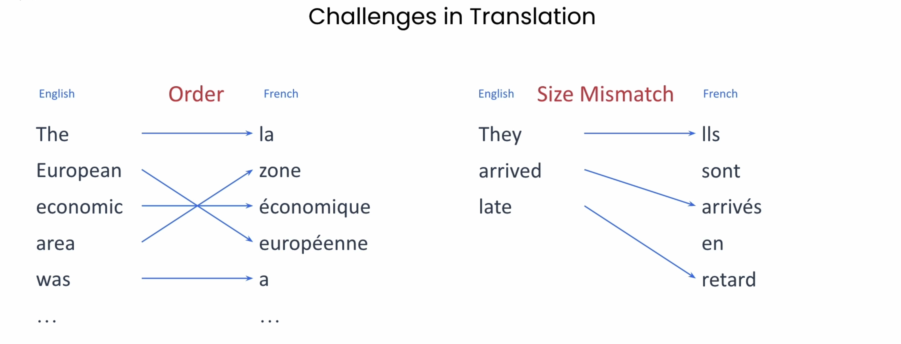

For example, the 'word order' may not be the same in English and French. Here, the English sentence starts: "the European Economic Area was..." but the word order is changed in French. Sentences can also be of different lengths. This three-word sentence in English: "They arrived late" is five words in French.

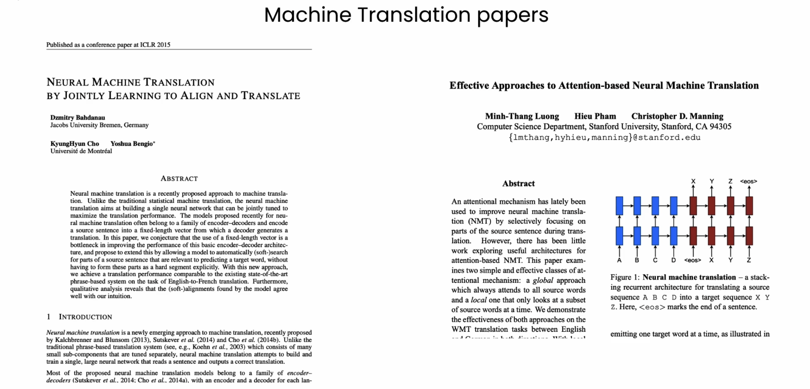

To manage these challenges, a couple of research groups—Yoshua Bengio's group at University of Montreal and Chris Manning's group at Stanford University—independently came up with similar approaches and invented an **attention mechanism**. The papers society is here on the slide.

### The Encoder-Decoder Mechanism

Both research groups found an **encoder-decoder** mechanism can be effective for translation. Let me show you how this worked.

The **encoder** reads in one word at a time and produces output vectors, one per word. Early approaches produced a single dense vector that represented the meaning of the entire sentence. But in these new papers, the vectors from each individual word were preserved and made available to the decoder.

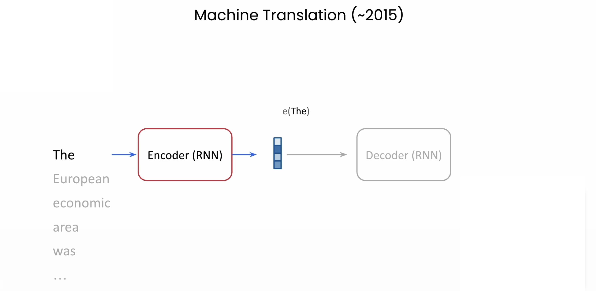

These dense, per-word vectors captured the meaning of words in the context of the sentence. Today, we might call these **contextual embeddings**, where the embedding depends not just on the word, but also on the words around it—on the context.

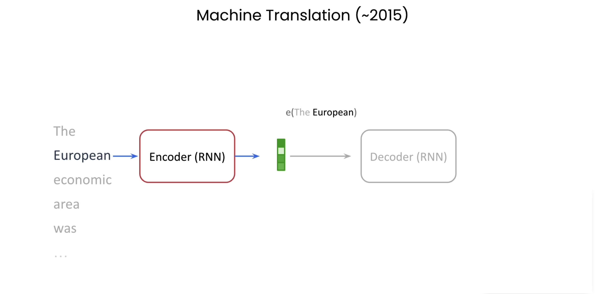

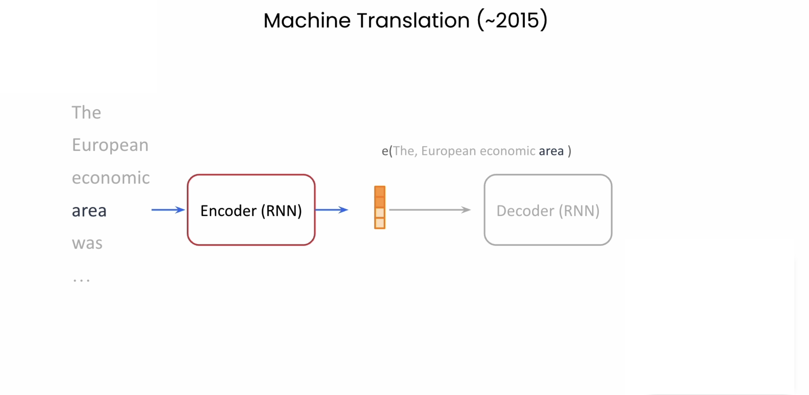

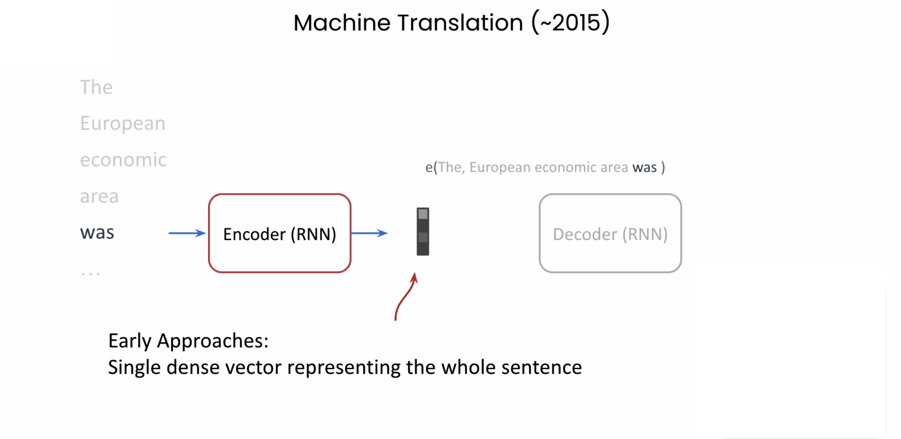

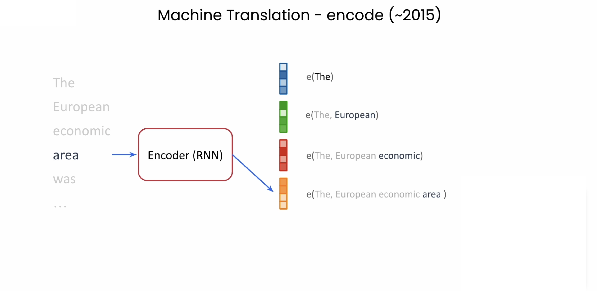

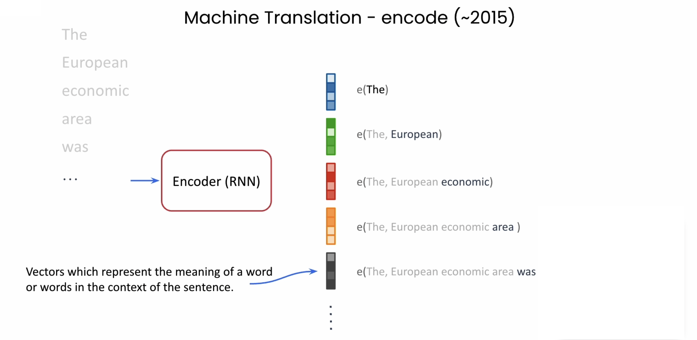

Once the input sentence is converted into vectors, the **decoder** then uses these vectors as inputs. The decoder would generate the outputs one word at a time to produce, say, that French output from the English inputs.

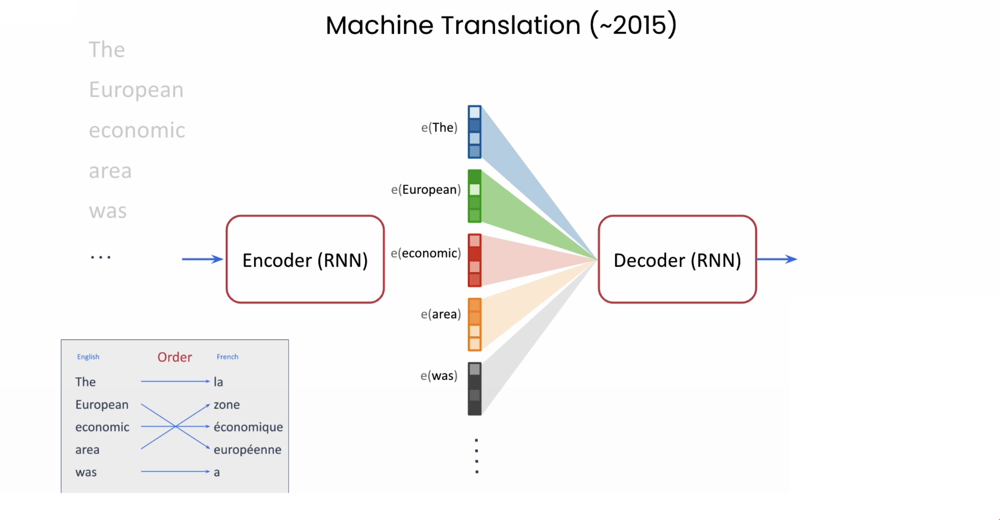

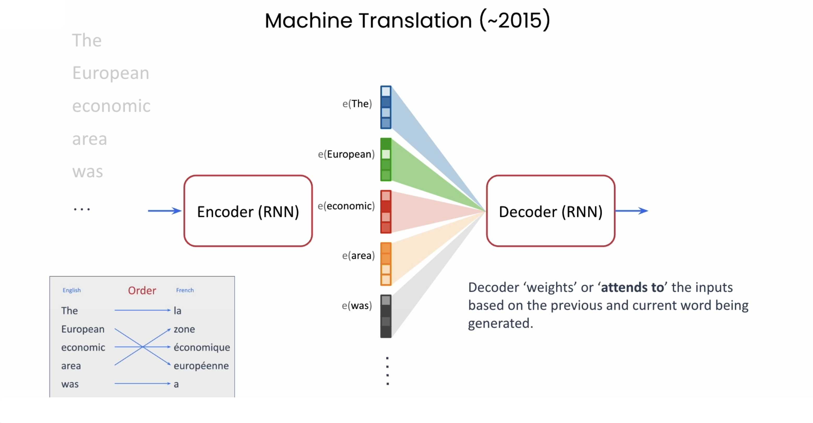

Now here's the important part: the decoder has a means of weighting, or what we also say **attending to** or **paying attention to**, each input word (or really, each input word's embedding) independently, based on where it is in the input and where it is in producing the output.

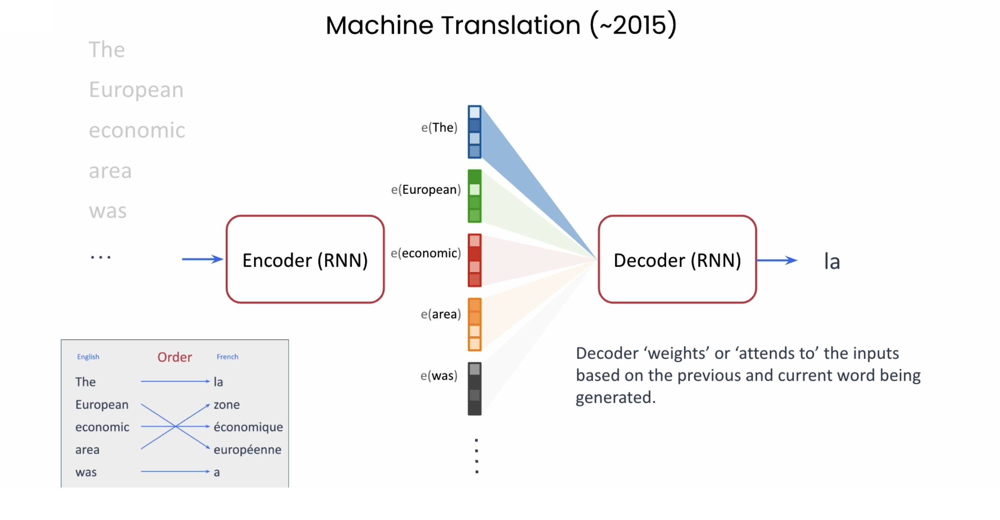

* So for example, when the translation starts and is trying to generate the first French word, it might weigh, or **attend to**, the first English word in the input most heavily.

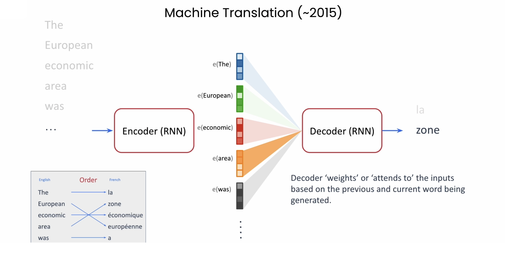

* For the second word, however, in this example, it will **attend to** the fourth input vector (the vector for "Area") due to the change in word order in French.
* Continuing, the model weighs or attends to or pays attention to the words most relevant for that step of the translation.

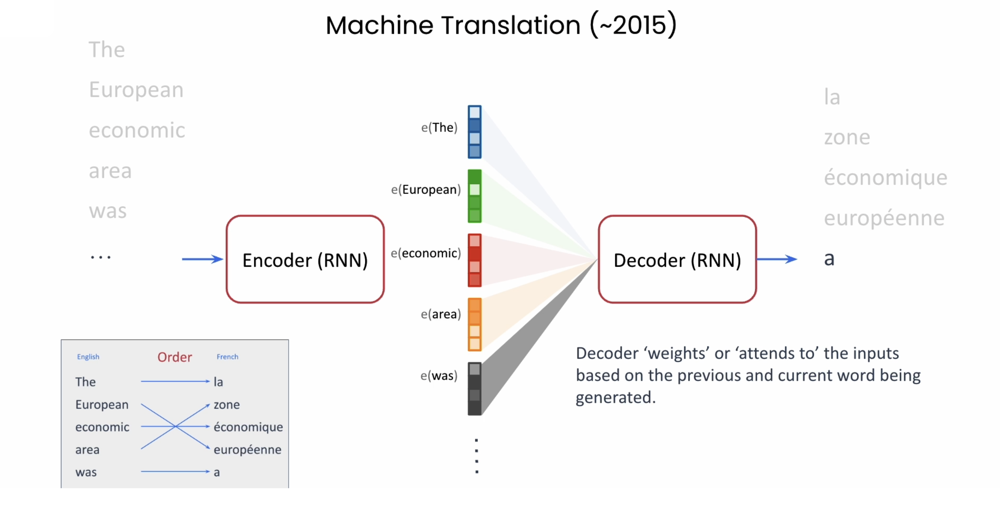

And this gave us an early form of attention.

### "Attention Is All You Need"

Just a few years later, in 2017, the paper "**Attention is all you need**" by Ashish Vaswani, Noam Shazeer, Nikki Parmar, Jakob Uszkoreit, Llion Jones, Aidan N. Gomez, Lukasz Kaiser, whose actually done some teaching with DeepLearning.AI, and Illia Polosukhin was published from my former team, the Google Brain team.

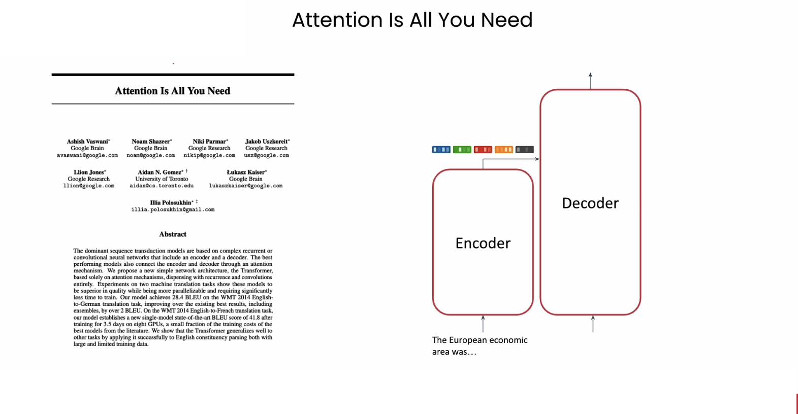

This paper introduced the **transformer architecture** and a more general form of attention, which Josh will be describing today. It was designed specifically to be highly scalable using GPUs. Chatting with Aiden, he told me about how back then when they designed this architecture, the number one criteria for large design choices was: can we scale this on a GPU? And that turned out to be a great decision.

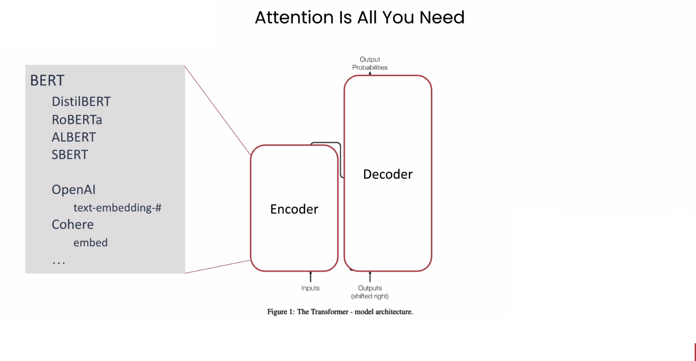

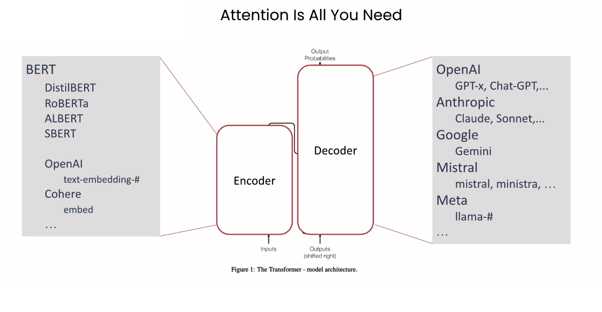

This paper also studied machine translation, and the model described also had an encoder and then also a decoder.

* The **encoder** creates contextual embeddings for the input sentence in a single pass.
* The **decoder** then produces the output one word at a time. Each output is fed to the input of the decoder to serve as a context for the next step, so when it's generating the next word, it also knows the previous words it already generated.

The encoder model would go on to be the basis for the **BERT** algorithm. BERT stands for "Bidirectional Encoder Representations from Transformers," which in turn is the basis of nearly all of the embedding models you might use to create embedding vectors for RAG or recommender applications today.

The decoder model has since been used as the basis for the **GPT**, or "Generative Pre-trained Transformer," family in large language models that OpenAI has been building, and which you might use in ChatGPT. And this decoder is also the basis for most other popular models, such as those from Anthropic, Google, Mistral, and Meta.

The original paper just used six layers of attention, while for example, Llama 3.2-405B by Meta has 126 layers, but the basic architecture is the same as you'll be learning with Josh today.

### Course Layout

Here's how the course is laid out.
* We'll start by describing the main ideas behind **Transformers** and **Attention**.

  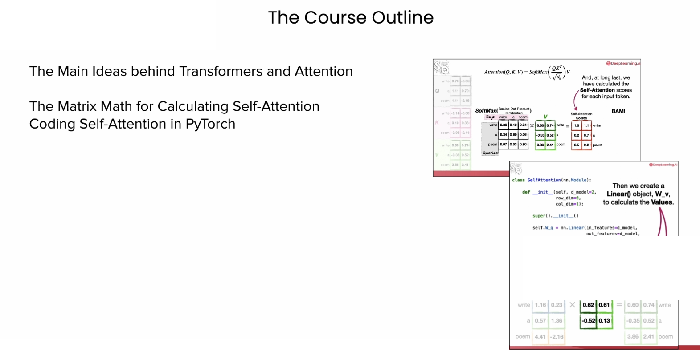

* And then go on to work through the **matrix math and coding of attention**.
* You will then learn the difference between **self-attention** and **masked self-attention** and work through the PyTorch implementation.

  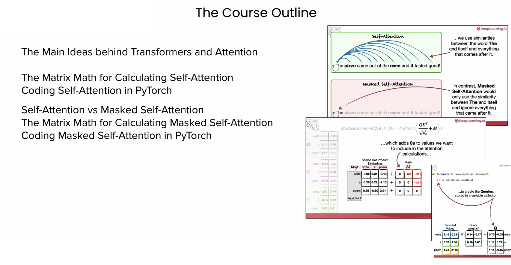

* Then you will learn the details of the **encoder-decoder architecture** Andrew just described, as well as **Multi-head attention**.

   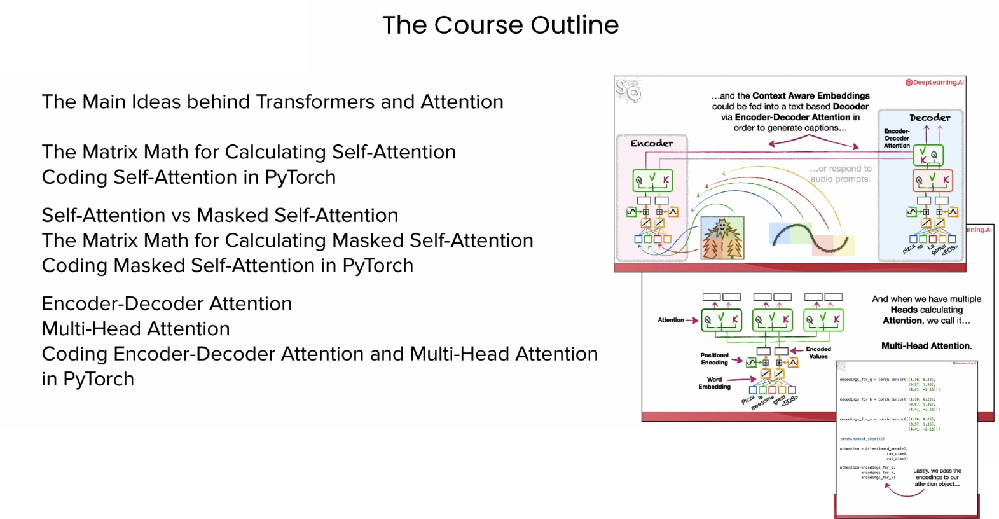