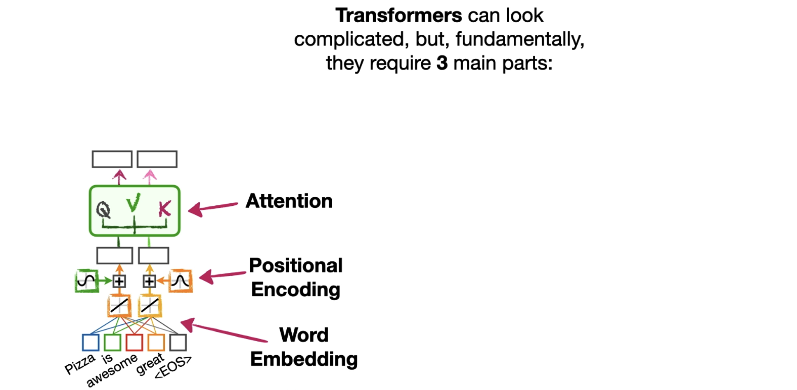
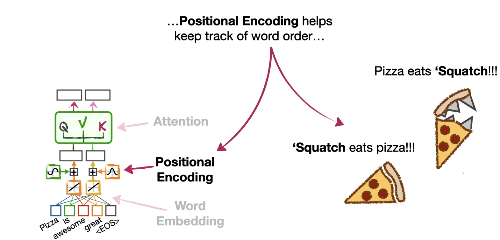

<!--the-main-ideas-behind-transformers-and-attention-->

# Main Ideas behind Tranformer and Attention

Right now people are going bonkers about something called ChatGPT. For example, our friend StatSquatch might type something into ChatGPT like:

> tell me about pizza.
>
> Pizza is awesome. Bam!

Anyway, there's a lot to be said about how ChatGPT works, but fundamentally it is based on something called the **Transformer**.

Transformers can look complicated, but fundamentally they require three main parts:
* Word embedding
* Positional encoding
* Attention

---

### 1. Word Embedding

The first part, **word embedding**, converts words, bits of words, and symbols (collectively called **tokens**) into numbers. 

We need this because transformers are a type of neural network, and neural networks only have numbers for input values.

So if the input is "tell me about pizza", then the word embedding layer will translate that into numbers. Bam!

---

### 2. Positional Encoding

Now that we understand the purpose of word embedding, let's talk about **positional encoding**, which helps keep track of word order.

    For example, if Norm said:
    > "Squatch eats pizza"

    ...then Squatch might say "yum."

    In contrast, if Norm said:
    > "Pizza eats squatch."

    ...then Squatch might say "Yikes!"

So these two phrases, 'Squatch eats pizza' and 'Pizza eats Squatch', use the exact same words but have very different meanings. So keeping track of word order is super important.

There are a bunch of ways to implement positional encoding, but the details are out of the scope of this lesson. So, for now, just know that positional encoding helps keep track of word order. Double bam!

---

### 3. Attention

Now that we know that positional encoding helps keep track of word order, let's talk about how a transformer establishes relationships among words with **attention**.

For example, if the input sentence was this:
> "the pizza came out of the oven and it tasted good"

...then this word "it" could refer to pizza or potentially it could refer to the word oven.

> **Josh:** I've heard of good-tasting pizza, but never a good-tasting oven.
>
> **Squatch:** I know Squatch. That's why it's important that the transformer correctly associates the word "it" with pizza.

The good news is that transformers have something called attention, which is a mechanism to correctly associate the word "it" with the word pizza.

Note: there are a few different types of attention, so we'll start by describing the most basic, **self-attention**.

In general terms, self-attention works by seeing how similar each word is to all of the other words in the sentence, including itself.
* For example, self-attention calculates the similarity between the first word, "the", and all of the other words in the sentence, including itself.
* And self-attention calculates these similarities for every word in the sentence.

Once the similarities are calculated, they are used to determine how the transformer encodes each word.

For example, if you looked at a lot of sentences about pizza and the word "it" was more commonly associated with pizza than oven, then the similarity score for pizza will cause it to have a larger impact on how the word "it" is encoded by the transformer. Bam!

---

### Summary

Now that we understand the main idea of how attention tries to establish relationships among words, we understand the main ideas behind Transformer's three fundamental building blocks:

1.  **Word embedding** converts the input into numbers.

   

2.  **Positional encoding** helps keep track of word order.

   

3.  **Attention** helps establish relationships among words.

   

