Here is the content formatted in Markdown:

## The Matrix Math of Self-Attention

In this lesson, you'll go through the matrix math required to calculate self-attention one step at a time. You'll learn both the *how* and *why* the equation works the way it does.

All right, let's go.

At first glance, the equation for calculating self-attention can be a little intimidating.

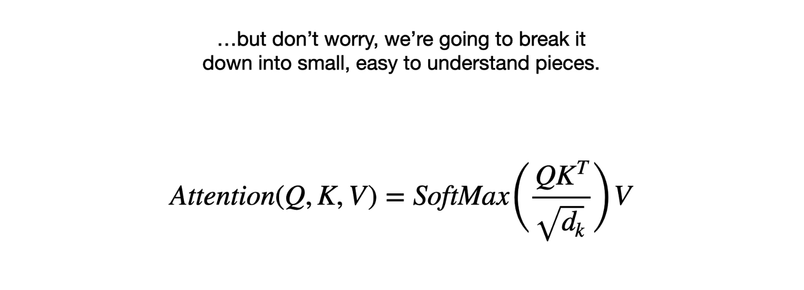

But don't worry, we're going to break it down into small, easy-to-understand pieces. We'll start with these variables:

* **Q** stands for **Query**.
* **K** stands for **Key**.
* **V** stands for **Value**.

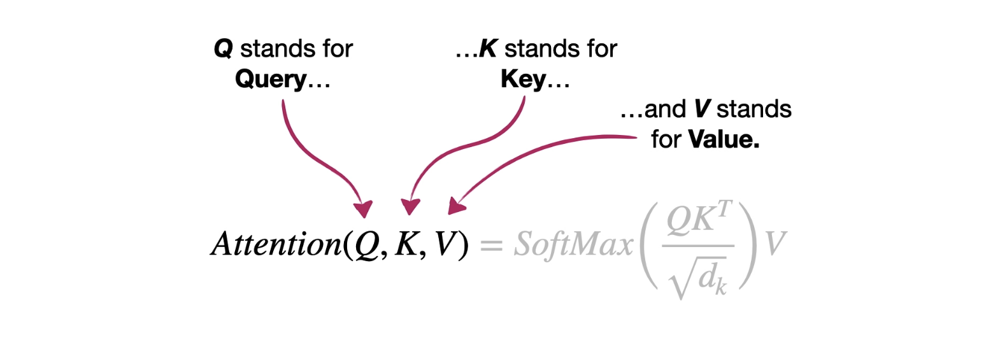

---

### The Database Analogy: Query, Key, and Value

The terms query, key, and value come from database terminology. So let's talk about databases for a little bit.

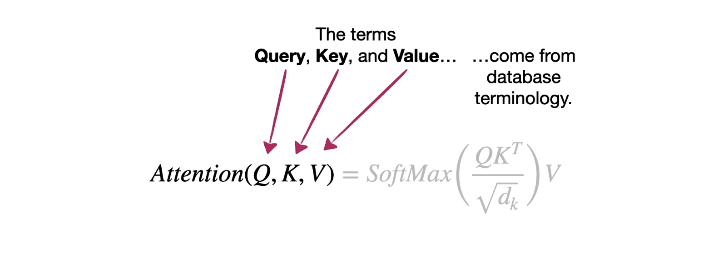

Imagine we had a database of guests at a hotel that paired each guest's last name with their room number.

Now imagine Stat Squatch is working at the desk one night, and I check in and tell Squatch my last name: "Starmer." However, instead of correctly spelling my last name *Starmer*, Squatch types *Stammer* into the computer.

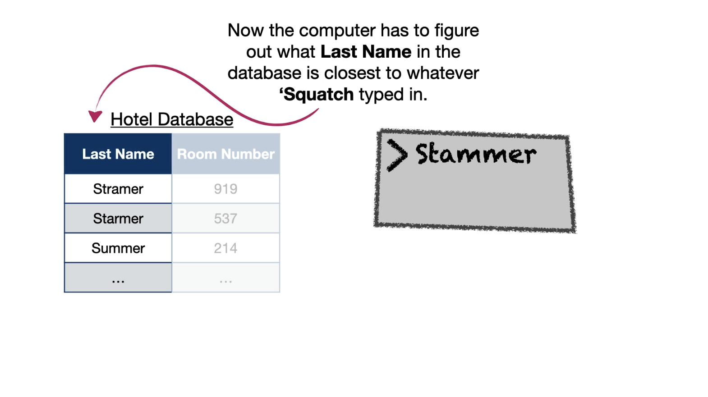

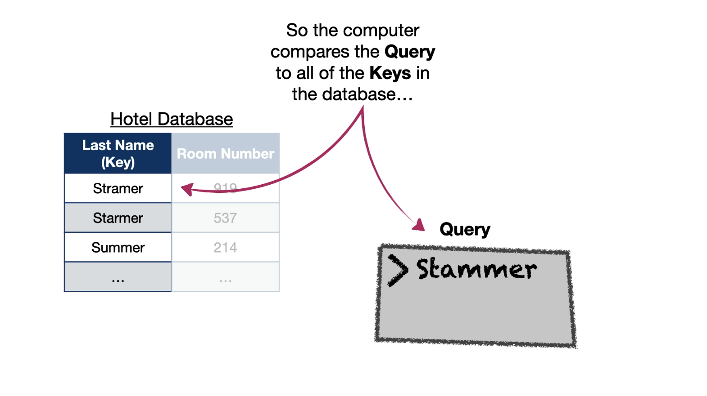

Now the computer has to figure out what last name in the database is closest to whatever Squatch typed in.

* In database terminology, what is typed in—the search term—is called the **query**.
* And the actual names in the database that we are searching are the **keys**.

So the computer compares the query ("Stammer") to all of the keys in the database and ranks each one. In this case, the query "Stammer" is closest to the key for "Starmer."

And so the computer returns my room number: 537.

* In database terminology, we'd call the room number the **value**.

To summarize the database terminology:
> The **query** is the thing we are using to search the database.
> The computer calculates similarities between the query and all of the **keys** in the database.
> And the **values** are what the database returns as the results of the search. Bam!

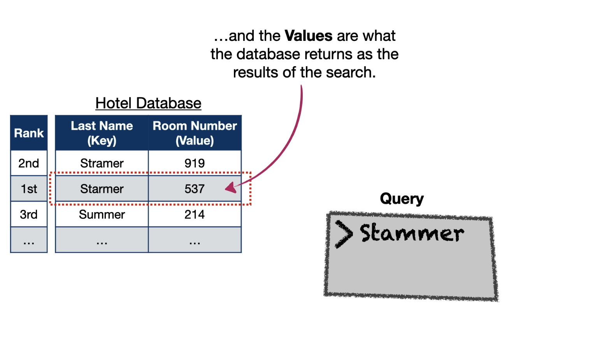

---

### Creating Q, K, and V for Transformers

Going back to the equation for self-attention, we now have a better idea of what the Q, K, and V variables refer to. 

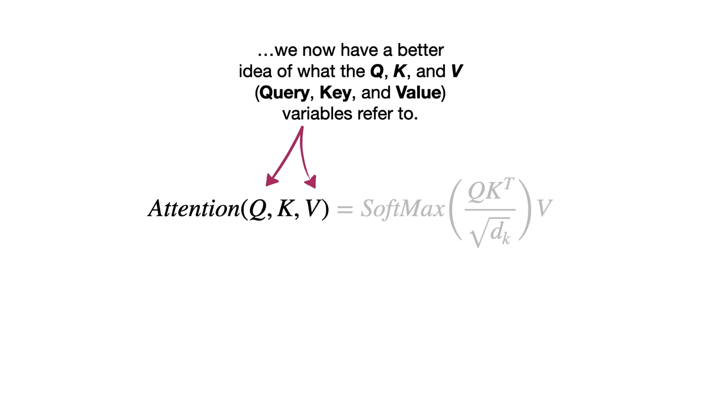

<!--Now let's talk about how we determine the queries, keys, and values in the context of a transformer.-->

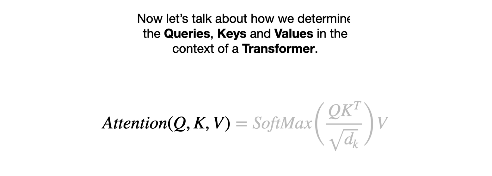

First, let's remember that self-attention calculates similarity between each word and itself and all of the other words, and self-attention calculates these similarities for every word in the sentence. 

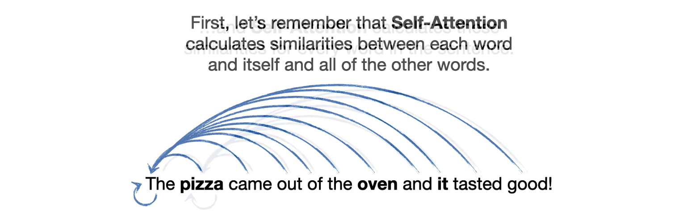

And that means we need to calculate a query and a key for each word. And just like we saw in the database example, each key needs to return a value.

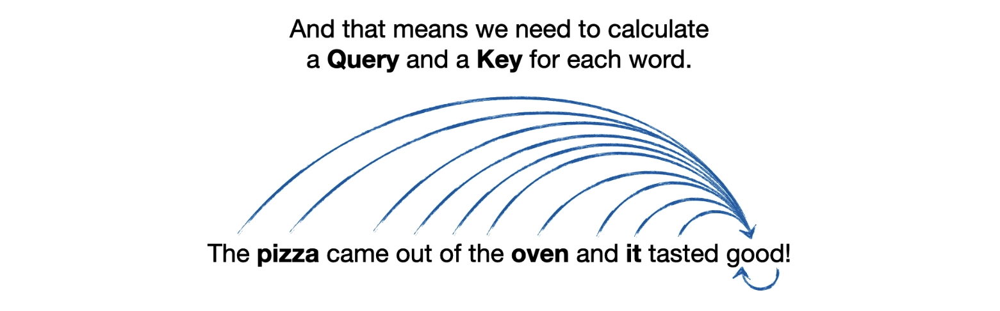

So, in order to keep our examples small enough that we can easily calculate things by hand, let's use the prompt: **"Write a poem."**

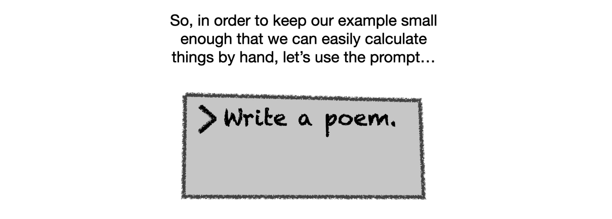

1.  Just like we saw in a previous lesson, the first thing a transformer does is convert each word in the prompt into **word embeddings**.
2.  Then the transformer adds **positional encoding** to the word embeddings to get these numbers (or encodings) that represent each word in the prompt.

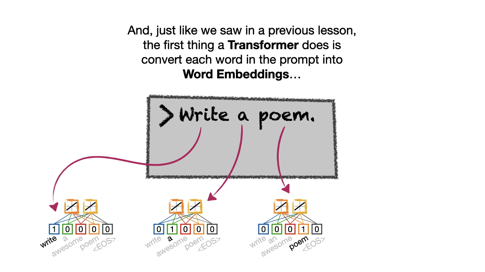

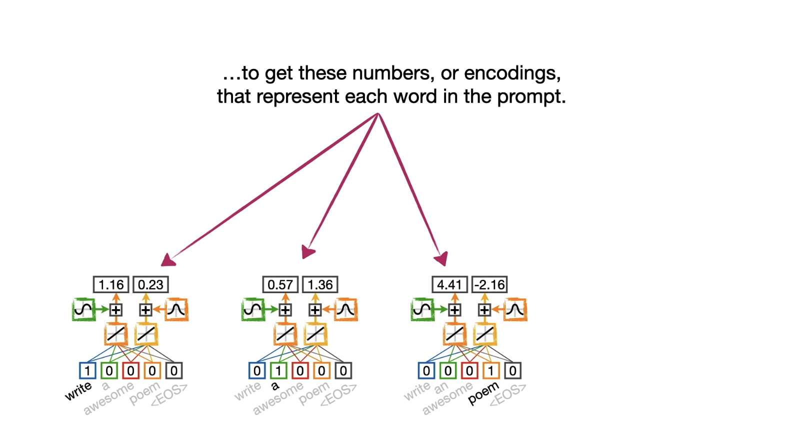

(Note: In this simple example, we're just going to use two numbers to represent each word in the prompt. However, it's much more common to use 512 or more numbers to represent each word.)

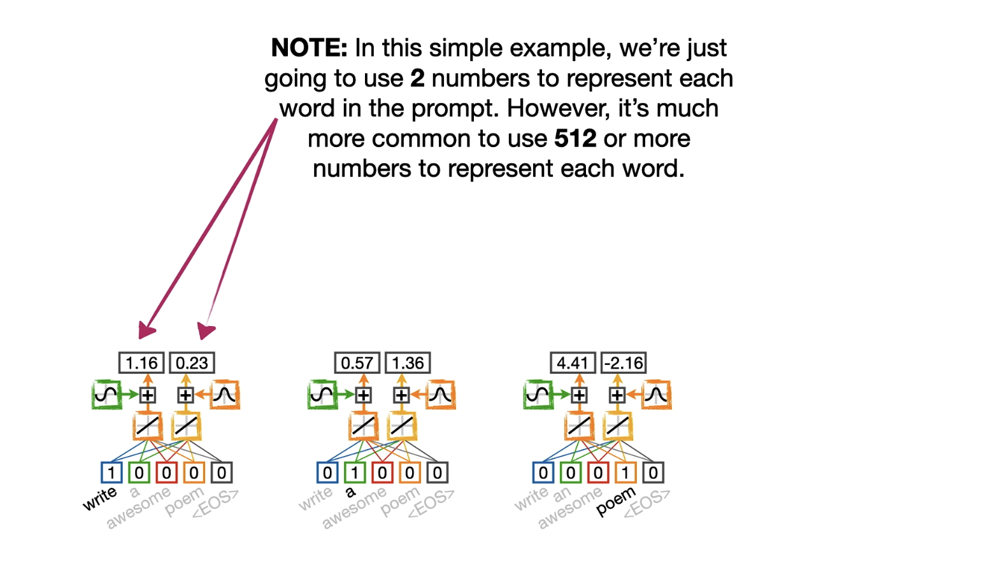

Anyway, in order to create the queries for each word, we stack the encodings in a matrix and multiply that matrix by a two-by-two matrix of **query weights** to calculate two query numbers per word.

(Note: We multiplied the encoded values by a two-by-two matrix because we started with two encoded values per word, and a two-by-two matrix allows us to end up with two query numbers per word. If instead, we had started with 512 word embeddings per word, and thus 512 encoded values per word, then a common thing to do would be to use a 512 by 512 matrix to create 512 query numbers per word. That being said, the only rule that you really have to follow is that the matrix math has to be possible.)

(Also, I want to point out that I've labeled the query weights matrix with the transpose symbol. This is because PyTorch prints out the weights in a way that requires them to be transposed before we can get the math to work out correctly. Small Bam!)

Now we create the **keys** by multiplying the encoded values by a two-by-two matrix of **key weights**, and we create the **values** by multiplying the encoded values by a two-by-two matrix of **value weights**.

---

### Calculating Self-Attention: Step-by-Step

Now that we have the query, key, and values for each token, we can use them to calculate self-attention.

#### Step 1: Multiply Q by K-Transpose (Calculate Similarity)

We start by multiplying the query matrix $Q$ by the transpose of the key matrix $K$.

> **Squatch:** Why do we need to transpose $K$ when we do this multiplication?
>
> **Josh:** Well, in this specific case, the obvious thing is that the multiplication wouldn't work if we didn't transpose $K$...
>
> However, there's actually a much more important reason to transpose $K$. And to understand it, let's go through the multiplication one step at a time.

We start with the first row in $Q$ (the query for the word "write") and the first column in $K$ transposed (the key for the word "write"). The matrix multiplication gives us the sum of these products, which is -0.09.

This process of multiplying pairs of corresponding numbers together and adding them up... is called calculating a **dot product**. So -0.09 is the dot product of the query and the key for the word "write."

**Dot products can be used as an unscaled measure of similarity between two things.** And this metric is closely related to something called the **cosine similarity**. The big difference is that the cosine similarity scales the dot product to be between -1 and 1. In contrast, the dot product similarity isn't scaled, so that makes -0.09 an unscaled similarity between the query and the key for the word "write."

Likewise, we calculate:
* The unscaled dot product similarity between the query for "write" and the key for "a" is 0.06.
* The unscaled dot product similarity between the query for "write" and the key for "poem" is -0.61.

Likewise, we calculate the unscaled dot product similarities between the query for "a" and all of the keys, and the unscaled dot product similarities between the query for "poem" and all of the keys.

Thus, by multiplying $Q$ by the transpose of $K$, we end up with the unscaled dot product similarities between all possible combinations of queries and keys for each word. Double bam!

#### Step 2: Scale the Similarities

Now the next thing we do is scale the dot product similarities by the square root of $d_k$.

$d_k$ is the dimension of the key matrix, and in this case, dimension refers to the number of values we have for each token, which is two. So we scale each dot product similarity by the square root of two, and that gives us a matrix of scaled dot product similarities.

(Note: Scaling by just the square root of the number of values per token doesn't scale the dot product similarities in any kind of systematic way. That said, even with this limited scaling, the original authors of the transformer said it improved performance. Small bam!)

#### Step 3: Apply Softmax

The next thing we do is take the **softmax** of each row in the matrix of scaled dot product similarities. And taking the softmax of each row gives us these new rows.

Note: This **softmax function makes it so that the sum of each row is one.** So we can think of these values as a summary of the relationships among the tokens.

For example, the word "write" is:
* 36% similar to itself
* 40% similar to "a"
* 24% similar to "poem"
Bam!

#### Step 4: Multiply by V (Values)

Now let's put these new rows back together to form a matrix. And the last thing we do to calculate self-attention is multiply the percentages by the values in matrix $V$.

To understand exactly why we do this multiplication, let's go through it step by step.

When we multiply the first row of percentages by the first column in $V$, we calculate 36% of the first value for the word "write," and add it to 40% of the first value for "a," and then add 24% of the first value for "poem." And that gives us 1.0, the first self-attention score for the word "write."

In other words, **the percentages that come out of the softmax function tell us how much influence each word should have on the final encoding for any given word.**

Likewise, we scale the second column of values to get the second self-attention score for the word "write." Then we scale the values by the percentages for "a" to get the self-attention scores for "a," and then scale the values by the percentages for "poem" to get the self-attention scores for "poem."

And at long last, we have calculated the **self-attention scores** for each input token. Bam!

---

### Summary

In summary, the equation for self-attention may look intimidating:
$$\text{Attention}(Q, K, V) = \text{softmax}\left(\frac{Q K^T}{\sqrt{d_k}}\right) V$$
...but all it does is:
1.  Calculate the scaled **dot product similarities** among all of the words.
2.  Convert those scaled similarities into **percentages** with the softmax function.
3.  And then use those percentages to scale the **values** to become the self-attention scores for each word.

Triple bam!