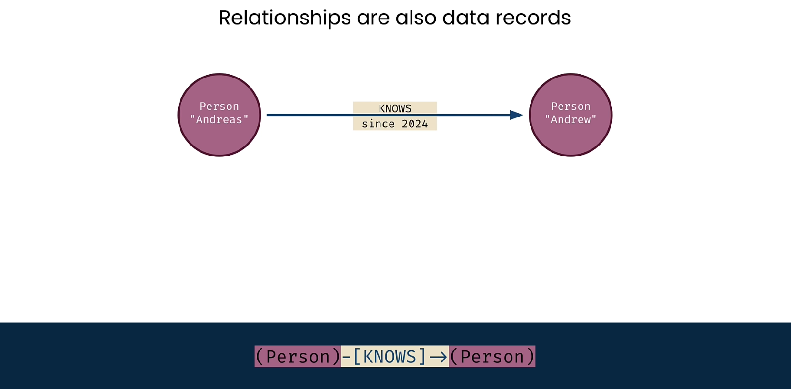
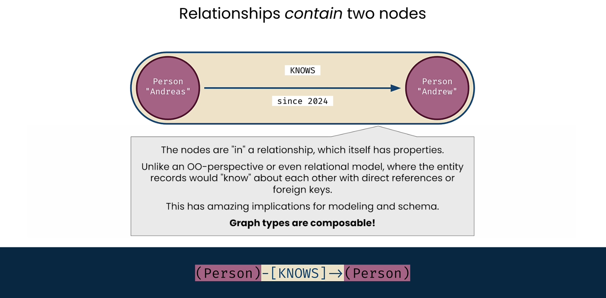
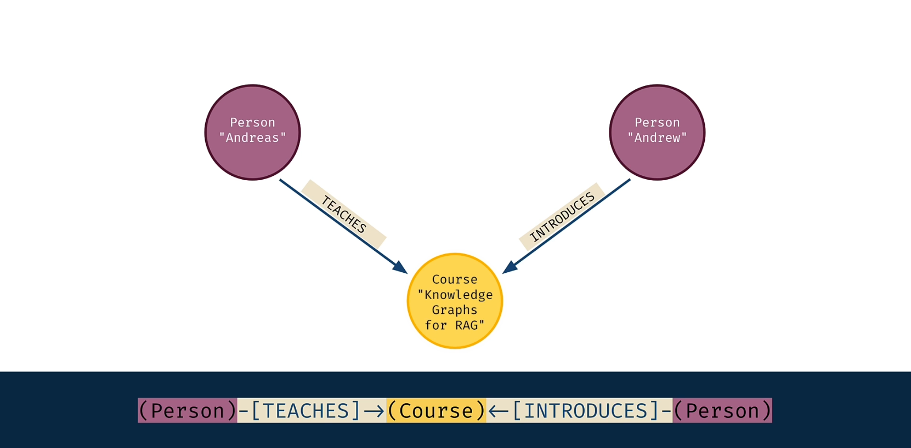
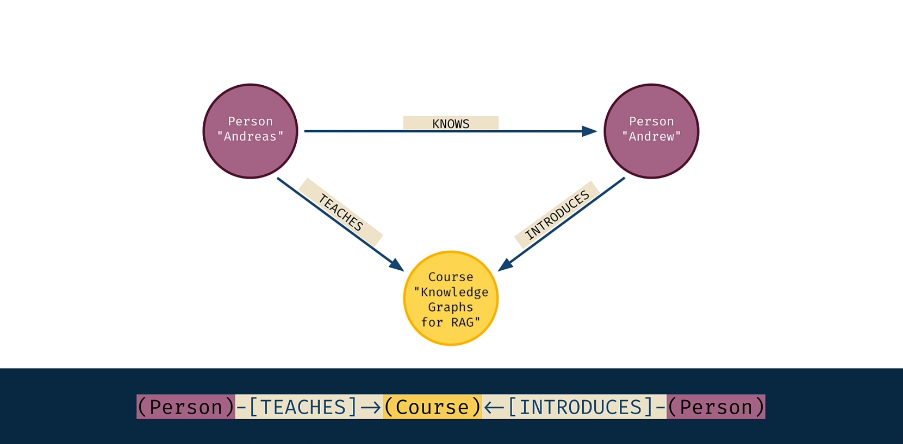
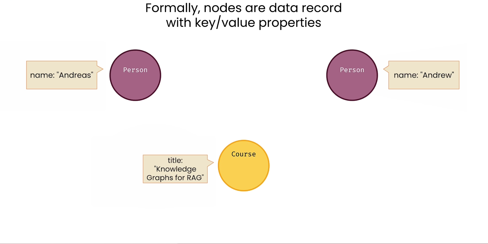
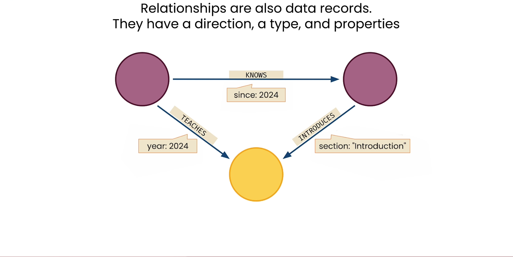
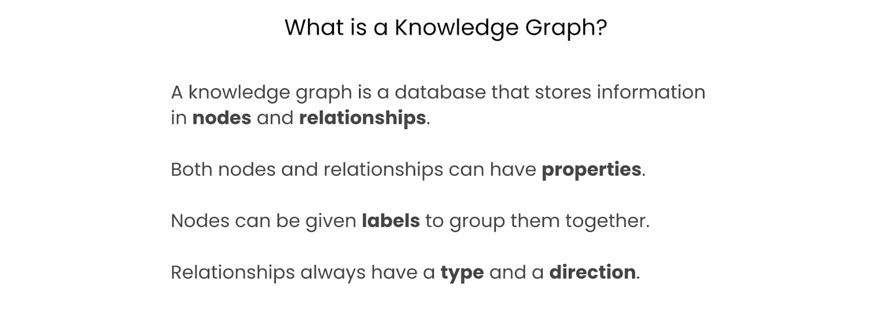

# Knowledge Graph Fundamentals

<!-- 
0:01 You've been introduced to the idea of Knowledge Graphs
$\underline{0: 09}$ Let's start by taking a look at these concepts in more detail.
0:12 Come on, let's dive in.
0:14 So, nodes are data records.
0:17 We're going to start exploring what that really means
0:19 inside of a Knowledge Graph by actually just drawing
0:30 That's me, of course.
0:32 And if you want to talk about this very small graph,
0:34 you'd be tempted to look at that nice, you know,
0:36 kind of round circle we've got there and talk
0:38 about that in like a Slack channel, let's say.
0:40 You could use parentheses around the person, and that would very obviously mean,
1:08 To make it into a full graph, of course, we don't want just a thing.
1:12 We want relationships between those things.
1:14 And these relationships are also data records.
1:17 We have a person Andreas, a person Andrew,
1:19 and a relationship that person Andreas knows the person Andrew and knows since 2024.
1:26 Again, in text representation, we've got those nice parentheses around the nodes,
1:58 Different terms for exactly the same ideas.
2:01 Now, as a data structure,
2:02 the reason that we actually use the word relationship instead of edge is that the
2:06 relationship is really a pair of nodes and then information about that pair.
2:14 So here, there's a nose relationship that contains Andreas
2:22 To expand our small graph a little bit, we have the idea that there's a person,
2:26 Andreas, who knows another person, Andrew.
2:28 And what do they have in common? They also have this course,
2:31 Rag with Knowledge Graphs, in common. So,
2:37 We know that person, Andreas, teaches this course.
2:48 Andrew also has a relationship to this course.
2:50 Andrew helped introduce this course.
2:57 If you look at that in the text representation here on the bottom,
3:00 this becomes a little bit longer of a data pattern,
3:02 but you can still read through this and it's worth taking the time to do that.
3:07 You can see that there's a person who teaches a course going from left to right.
3:11 But then, on the other side,
3:18 Putting that all together in one line,
$3: 20$ you then have directions going from left to right, but also right to left,
$3: 23$ meaning in the middle at that course.
3:26 A little side note here that I think is interesting when you're
3:28 thinking about how to data model within a knowledge grasp.
3:31 You could say that, you know, this person who's Andreas is a teacher.
3:34 You could say that this person Andrew is an introducer, I suppose.
3:38 But instead of that, we don't really need to add those extra labels to the
3:43 people themselves because Andreas is a teacher because he is teaching.
3:46 Andrew might be an introducer because he does introductions. So,
4:01 Okay, here's a completed very small graph with
4:04 just three nodes and also three relationships.
4:06 A person who knows another person,
4:08 that person has taught a class or teaches a class called Rag with Knowledge Graphs,
4:16 That is our completed graph for this small introduction.
4:20 Okay, now formally, nodes have labels.
4:23 We already introduced the idea that we have persons and we have this course.
4:26 In the knowledge graph, we call those labels of those nodes.
4:29 Labels are a way of grouping multiple nodes together. So,
4:38 Nodes, because they're data records, also have values, of course.
4:42 And those values are properties.
4:43 They are key value properties that are stored inside of the node.
5:05 Because relationships are data records, they have
5:07 a direction, a type, and also properties.
5:22 That this person knows another one since 2024,
5:25 the teaching relationship also has a year 2024,
5:27 and the introduction is actually for what section of the course is being introduced.
5:36 A Knowledge Graph is a database that stores information in nodes and relationships.
5:41 Both nodes and relationships can have properties, key value pairs,
5:44 and nodes can be given labels to help group them together.
5:48 Relationships always have a type and a direction.
6:04 To do this, you'll use a query language called Cypher.
6:07 Join me in the next lesson to try this out.
-->

## Introduction to Knowledge Graphs

You've been introduced to the idea of Knowledge Graphs. Let's start by taking a look at these concepts in more detail. Come on, let's dive in.

### Nodes as Data Records

So, nodes are data records. We're going to start exploring what that really means inside of a Knowledge Graph by actually just drawing. 

That's me, of course. And if you want to talk about this very small graph, you'd be tempted to look at that nice, you know, kind of round circle we've got there and talk about that in like a Slack channel, let's say. You could use parentheses around the person, and that would very obviously mean.

### Relationships Between Nodes

To make it into a full graph, of course, we don't want just a thing. We want relationships between those things. 

And these relationships are also data records. We have a person Andreas, a person Andrew, and a relationship that person Andreas knows the person Andrew and knows since 2024. Again, in text representation, we've got those nice parentheses around the nodes.

### Relationship vs. Edge Terminology

Different terms for exactly the same ideas. 

Now, as a data structure, the reason that we actually use the word relationship instead of edge is that the relationship is really a pair of nodes and then information about that pair. So here, there's a nose relationship that contains Andreas.

### Expanding the Graph with Shared Connections

To expand our small graph a little bit, we have the idea that there's a person, Andreas, who knows another person, Andrew. And what do they have in common? They also have this course, Rag with Knowledge Graphs, in common. 

So, we know that person, Andreas, teaches this course. Andrew also has a relationship to this course. Andrew helped introduce this course. If you look at that in the text representation here on the bottom, this becomes a little bit longer of a data pattern, but you can still read through this and it's worth taking the time to do that. You can see that there's a person who teaches a course going from left to right. But then, on the other side, putting that all together in one line, you then have directions going from left to right, but also right to left, meaning in the middle at that course.

### Considerations for Data Modeling

A little side note here that I think is interesting when you're thinking about how to data model within a knowledge grasp. You could say that, you know, this person who's Andreas is a teacher. You could say that this person Andrew is an introducer, I suppose. But instead of that, we don't really need to add those extra labels to the people themselves because Andreas is a teacher because he is teaching. Andrew might be an introducer because he does introductions.

### A Small Completed Knowledge Graph

Okay, here's a completed very small graph with just three nodes and also three relationships. A person who knows another person, that person has taught a class or teaches a class called Rag with Knowledge Graphs, That is our completed graph for this small introduction.

### Formal Properties of Nodes: Labels and Values

Okay, now formally, nodes have labels. We already introduced the idea that we have persons and we have this course. In the knowledge graph, we call those labels of those nodes. Labels are a way of grouping multiple nodes together. So, nodes, because they're data records, also have values, of course. And those values are properties. They are key value properties that are stored inside of the node.

### Formal Properties of Relationships: Direction, Type, and Values

Because relationships are data records, they have a direction, a type, and also properties. That this person knows another one since 2024, the teaching relationship also has a year 2024, and the introduction is actually for what section of the course is being introduced.

### Summary of a Knowledge Graph

A Knowledge Graph is a database that stores information in nodes and relationships. Both nodes and relationships can have properties, key value pairs, and nodes can be given labels to help group them together. Relationships always have a type and a direction.

### Querying Knowledge Graphs with Cypher

To do this, you'll use a query language called Cypher. Join me in the next lesson to try this out.