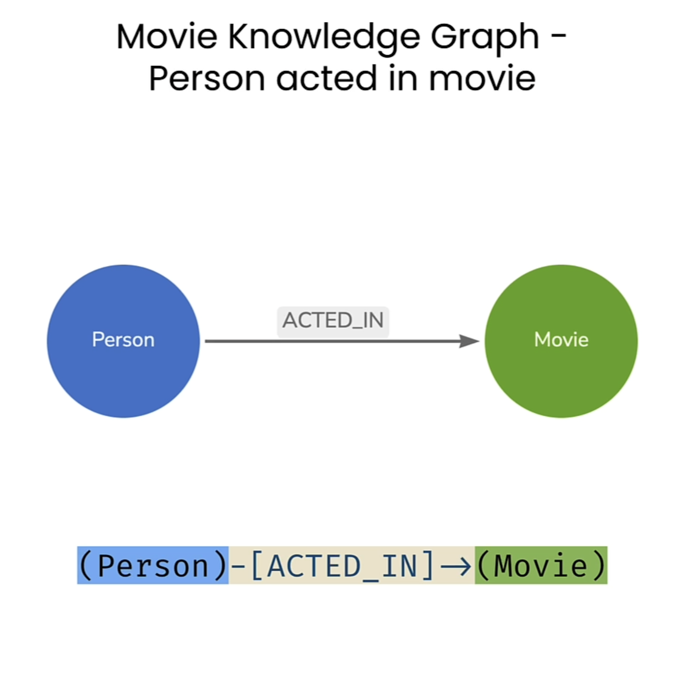

<!-- 0:07 In this lesson, you'll use the Cypher query language to interact with
0:11 a fun Knowledge Graph that contains data about actors and movies.
0:15 Let's dive in.
0:17 Okay. To get this notebook started,
0:19 we're going to import some packages that we need for just getting everything
0:22 set up for being able to access Neo4j and getting the environment.
0:26 Those are classic packages. We're going to get from
0:32 Also, we're going to be loading from Langchain the Neo4j graph
0:34 class itself which is how we're going to be accessing Neo4j.
0:46 And of course, you know, loading from.env and then setting up some variables here.
0:53 This very first one, the Neo4j URI is basically the connection
0:56 string for like where's Neo4j located at what port,
$0: 59$ those typical kinds of things. We of course need a username, and a password,
1:07 And so, let's run that as well.
1:09 Okay, now, that we have our environment set up,
1:28 Okay, now, the notebook is ready to start sending
1:42 On the left here, we've got some person nodes.
1:44 We know that they acted in some movies.
1:47 The actor becomes an actor because they've acted in something.
1:51 If you can read that out as a sentence, of course,
$1: 52$ it's that a person acted in a movie.
1:54 That's the fundamental pattern that we'll be looking
$1: 56$ for when we're dealing with this dataset.
1:59 For both of those nodes, for the persons and the movies,
2:01 we know that they have properties,
2:03 the properties that are available for the person or that they all have names.
2:06 They also have a born value which is just the
2:11 The movies have a title and tagline, both as strings,
2:14 and they also have a release date,
2:15 also just an integer about the year the movie was released.
$\underline{2: 20}$ And finally, just in the same way that I mentioned that a person acted in a movie,
$2: 24$ there's more relationships that a person might have with a movie.
2:31 We know that they've acted in a movie. A person might also have directed that movie.
2:35 Sometimes for some movies, we know that a person both acted in and directed a movie.
2:39 Also, they might have written a movie. So,
2:50 That's all the different relationships between the
2:51 persons and the movies within this data set.
2:52 But then, the persons themselves have a relationship with other persons.
2:56 Here is the idea that if somebody has reviewed a movie,
2:59 somebody else might be a follower of that reviewer. And so,
3:10 What those persons' roles are,
3:12 the relationships around them to the movies and to
3:14 each other persons is what really determines the
$3: 16$ type of a person that they are or the job that they
3:19 have or their behaviors within the data set.
3:22 It's worth observing, of course, that these are potential relationships.
3:25 The actual relationships themselves for particular people on particular
3:28 movies ends up being dynamic based on the data itself.
3:32 So now, you have some idea about what the graph looks like.
3:42 And the querying that we're gonna be doing is based on Cypher.
3:45 Cypher is Neo4j's query language.
3:47 It is using pattern matching to find things inside of the grass.
3:50 And it looks like this. Here,
4:50 And in that query, each of the rows is then a dictionary where the dictionary keys
4:54 are based on what you've returned from the return clause up here in the cipher.
4:59 So here, we've been returning count N.

-->

### Interacting with a Knowledge Graph using Cypher

In this lesson, you'll use the Cypher query language to interact with a fun Knowledge Graph that contains data about actors and movies. Let's dive in.

### Setting Up the Notebook Environment

To get this notebook started, we're going to import some packages that we need for just getting everything set up for being able to access Neo4j and getting the environment. Those are classic packages. We're going to get from. Also, we're going to be loading from Langchain the Neo4j graph class itself which is how we're going to be accessing Neo4j. And of course, you know, loading from .env and then setting up some variables here. This very first one, the Neo4j URI, is basically the connection string for like where's Neo4j located at what port, those typical kinds of things. We of course need a username, and a password. And so, let's run that as well. Okay, now, that we have our environment set up, the notebook is ready to start sending.

### Understanding the Graph Data Model

On the left here, we've got some person nodes. We know that they acted in some movies. The actor becomes an actor because they've acted in something. If you can read that out as a sentence, of course, it's that a person acted in a movie. That's the fundamental pattern that we'll be looking for when we're dealing with this dataset.



### Node Properties: Persons and Movies

For both of those nodes, for the persons and the movies, we know that they have properties. The properties that are available for the person or that they all have names. They also have a born value which is just the. 


The movies have a title and tagline, both as strings, and they also have a release date, also just an integer about the year the movie was released.

### Relationships in the Graph

And finally, just in the same way that I mentioned that a person acted in a movie, there's more relationships that a person might have with a movie. We know that they've acted in a movie. A person might also have directed that movie. Sometimes for some movies, we know that a person both acted in and directed a movie. Also, they might have written a movie. That's all the different relationships between the persons and the movies within this data set. But then, the persons themselves have a relationship with other persons. 


Here is the idea that if somebody has reviewed a movie, somebody else might be a follower of that reviewer. And so, what those persons' roles are, the relationships around them to the movies and to each other persons is what really determines the type of a person that they are or the job that they have or their behaviors within the data set. It's worth observing, of course, that these are potential relationships. The actual relationships themselves for particular people on particular movies ends up being dynamic based on the data itself. So now, you have some idea about what the graph looks like.

### Cypher: The Query Language

#### Querying the movie knowledge graph 

And the querying that we're gonna be doing is based on Cypher. Cypher is Neo4j's query language. It is using pattern matching to find things inside of the grass. It looks like this.

- Match all nodes in the graph


```python
cypher = """
  MATCH (n) 
  RETURN count(n)
  """
```

I that query, each of the rows is then a dictionary where the dictionary keys are based on what you've returned from the return clause up here in the cipher. So here, we've been returning count n. So we got a key for count n and the value of t.

```python
result = kg.query(cypher)
result
```


    [{'count(n)': 171}]

<!--
5:01 So we got a key for count $N$ and the value of that is 171 .
5:24 That's a little bit friendly, right?
5:37 Cool. Now, that we know that we're getting that back,
5:44 I can run this as well.
5:48 Okay, so with that cipher match that we just did,
5:50 we looked for a pattern of all the nodes within the graph,
$\underline{5: 53}$ returned a count of that. What if we don't want to find all the nodes in the graph,
5:57 but just the movies or just the persons?
5:59 The movies and the persons show up as labels on nodes. So,
6:09 We'll start with the same cipher query we had earlier.
6:13 And this small change we have to make is instead of this end being all by itself,
6:17 we're gonna add a colon. And then, we're gonna say movie.
6:26 We'll just say it's the number of movies.
6:34 Running that then of course shows us the number
6:36 of movies are 38 within this dataset.
6:38 Pretty good, just enough for us to play with.
6:41 That's great. We got the result we expected and that's really nice.
6:43 There's one more small change we can make here to this
6:46 query to improve the readability of the query.
6:48 We've been using this variable $n$ to capture
6:50 all of the patterns that match these nodes.
6:53 But we know that we're grabbing movies,
6:55 and movies begin with the letter $m$ instead of $n$.
6:58 Let's go ahead and change that.
7:00 We can use m colon movie. And then return, account to those m's.
7:04 Running this again gets us the same result all we've done is change
7:08 the name of the variable to help readability of the query.
7:32 We're again gonna do a count with those nodes and
$\underline{7: 36}$ we'll rename the result to number of people.
7:41 And let's run that.
7:42 Cool, perfect.
7:44 So now, for any set of nodes within the graph,
7:52 When you're exploring the graph, you can of course add more match criteria.
7:56 For instance, looking for a very specific value.
7:58 Value-based criteria are introduced with object notation inside of curly braces.
8:07 So for example, if we want to find not just all people, but a very specific person,
-->

So we got a key for count N and the value of that is 171. That's a little bit friendly, right? Cool. Now, that we know that we're getting that back, I can run this as well.

```python
cypher = """
  MATCH (n) 
  RETURN count(n) AS numberOfNodes
  """
```

```python
result = kg.query(cypher)
result
```


    [{'numberOfNodes': 171}]

### Counting Nodes with Labels

Okay, so with that Cypher match that we just did, we looked for a pattern of all the nodes within the graph, returned a count of that. What if we don't want to find all the nodes in the graph, but just the movies or just the persons? The movies and the persons show up as labels on nodes.

### Querying for Movies

We'll start with the same Cypher query we had earlier. And this small change we have to make is instead of this N being all by itself, we're gonna add a colon. And then, we're gonna say movie. We'll just say it's the number of movies.

- Match only the `Movie` nodes by specifying the node label


```python
cypher = """
  MATCH (n:Movie) 
  RETURN count(n) AS numberOfMovies
  """
kg.query(cypher)
```


    [{'numberOfMovies': 38}]

Running that then of course shows us the number of movies are 38 within this dataset. Pretty good, just enough for us to play with. That's great. We got the result we expected and that's really nice.

### Improving Query Readability

There's one more small change we can make here to this query to improve the readability of the query. We've been using this variable N to capture all of the patterns that match these nodes. But we know that we're grabbing movies, and movies begin with the letter M instead of N. Let's go ahead and change that. We can use M colon movie. And then return, a count to those M's. 


```python
cypher = """
  MATCH (m:Movie) 
  RETURN count(m) AS numberOfMovies
  """
kg.query(cypher)
```

Running this again gets us the same result all we've done is change the name of the variable to help readability of the query.


    [{'numberOfMovies': 38}]

### Counting People

We're again gonna do a count with those nodes and we'll rename the result to number of people.

 Match only the `Person` nodes


```python
cypher = """
  MATCH (people:Person) 
  RETURN count(people) AS numberOfPeople
  """
kg.query(cypher)
```

Let's run that. Cool, perfect. So now, for any set of nodes within the graph,

    [{'numberOfPeople': 133}]

### Adding Match Criteria for Specific Values

When you're exploring the graph, you can of course add more match criteria. For instance, looking for a very specific value. Value-based criteria are introduced with object notation inside of curly braces. So for example, if we want to find not just all people, but a very specific person,

```python
cypher = """
  MATCH (tom:Person {name:"Tom Hanks"}) 
  RETURN tom
  """
kg.query(cypher)
```

    [{'tom': {'born': 1956, 'name': 'Tom Hanks'}}]


- Match a single `Movie` by specifying the value of the `title` property


```python
cypher = """
  MATCH (cloudAtlas:Movie {title:"Cloud Atlas"}) 
  RETURN cloudAtlas
  """
kg.query(cypher)
```

    [{'cloudAtlas': {'tagline': 'Everything is connected',
       'title': 'Cloud Atlas',
       'released': 2012}}]
<!--
8:11 we'll just make a copy of this and modify it.
8:34 And we don't need a count of Tom Hanks. Let's just go ahead and return Tom himself.
8:53 We found Tom Hanks, we can see when he was born,
8:55 and that's all the properties we have on this particular node.
8:59 You can of course do the same thing if you happen to
9:01 know that there's a movie that you're looking for.
9:03 Let's copy all these over and we'll change it. Instead looking for a person,
9:31 Everything is connected.
9:32 Why it's so close to my heart, of course.
9:34 The title is Cloud Atlas and it was released way back in 2012.
9:38 For these last couple of queries, we've been looking for specific nodes,
9:41 maybe based on some exact match criteria.
9:44 If we didn't want to return the entire node of Cloud Atlas and just, let's say,
9:47 the release date, we can return just that.
9:50 Let's make a copy of this query and just modify the return clause.
9:55 So here, Cloud Atlas will be all of the nodes that have this title Cloud Atlas.
9:59 We know that they have a title and they also have a release date.
10:27 And now, we get a dictionary back in this list that has
10:33 For the patterns, we've been describing so far,
10:52 Let's say you want to do for these movies,
10:55 this is kind of a classic set of movies we've got here.
10:59 Let's find all the movies that are back from the 90s.
11:02 In Toad, the cipher query looks like this.
11:04 The first part is exactly what we've done before.
11:07 We have a match clause here with just a single node pattern.
11:11 And now, we're going to use a where clause to
12:08 We'll do that with a slightly bigger pattern.
12:11 The Cypher query itself starts off very similar to what we had before.
12:15 We're gonna match clause.
12:17 It's gonna match some actors who we know have the label person.
12:21 And now, here's the fun part of the relationships that we're introducing.
12:31 For the patterns that are matched inside of the database
12:34 that have those actors and those movies,
12:36 we're just going to turn the actor name and the movie title,
$\underline{12: 39}$ and we'll limit the results to just 10.
12:48 Cool.
12:49 So, now, we have a bunch of actor's names and movies they've been in. Of course,
12:57 And you probably recognize some of these names, but maybe not this first name.
13:01 I'm not sure that's quite right.
13:04 Let's come back to that later.
-->
### Querying Specific Nodes

We'll just make a copy of this and modify it. And we don't need a count of Tom Hanks. Let's just go ahead and return Tom himself. We found Tom Hanks, we can see when he was born, and that's all the properties we have on this particular node. You can of course do the same thing if you happen to know that there's a movie that you're looking for. Let's copy all these over and we'll change it. Instead looking for a person, everything is connected. Why it's so close to my heart, of course. The title is Cloud Atlas and it was released way back in 2012.

- Return only the `released` property of the matched `Movie` node


```python
cypher = """
  MATCH (cloudAtlas:Movie {title:"Cloud Atlas"}) 
  RETURN cloudAtlas.released
  """
kg.query(cypher)
```

    [{'cloudAtlas.released': 2012}]


### Returning Specific Properties

For these last couple of queries, we've been looking for specific nodes, maybe based on some exact match criteria. If we didn't want to return the entire node of Cloud Atlas and just, let's say, the release date, we can return just that. Let's make a copy of this query and just modify the return clause. 

```python
cypher = """
  MATCH (cloudAtlas:Movie {title:"Cloud Atlas"}) 
  RETURN cloudAtlas.released, cloudAtlas.tagline
  """
kg.query(cypher)
```

    [{'cloudAtlas.released': 2012,
      'cloudAtlas.tagline': 'Everything is connected'}]

So here, Cloud Atlas will be all of the nodes that have this title Cloud Atlas. We know that they have a title and they also have a release date. And now, we get a dictionary back in this list that has.

### Filtering by Property Values

For the patterns, we've been describing so far, let's say you want to do for these movies, this is kind of a classic set of movies we've got here. Let's find all the movies that are back from the 90s. In Toad, the Cypher query looks like this. The first part is exactly what we've done before. We have a match clause here with just a single node pattern. 

## Cypher patterns with conditional matching


```python
cypher = """
  MATCH (nineties:Movie) 
  WHERE nineties.released >= 1990 
    AND nineties.released < 2000 
  RETURN nineties.title
  """

```


And now, we're going to use a where clause to.


```python
kg.query(cypher)
```


    [{'nineties.title': 'The Matrix'},
     {'nineties.title': "The Devil's Advocate"},
     {'nineties.title': 'A Few Good Men'},
     {'nineties.title': 'As Good as It Gets'},
     {'nineties.title': 'What Dreams May Come'},
     {'nineties.title': 'Snow Falling on Cedars'},
     {'nineties.title': "You've Got Mail"},
     {'nineties.title': 'Sleepless in Seattle'},
     {'nineties.title': 'Joe Versus the Volcano'},
     {'nineties.title': 'When Harry Met Sally'},
     {'nineties.title': 'That Thing You Do'},
     {'nineties.title': 'The Birdcage'},
     {'nineties.title': 'Unforgiven'},
     {'nineties.title': 'Johnny Mnemonic'},
     {'nineties.title': 'The Green Mile'},
     {'nineties.title': 'Hoffa'},
     {'nineties.title': 'Apollo 13'},
     {'nineties.title': 'Twister'},
     {'nineties.title': 'Bicentennial Man'},
     {'nineties.title': 'A League of Their Own'}]

### Querying with Relationships

We'll do that with a slightly bigger pattern. The Cypher query itself starts off very similar to what we had before. We're gonna match clause. It's gonna match some actors who we know have the label person. And now, here's the fun part of the relationships that we're introducing. For the patterns that are matched inside of the database that have those actors and those movies, we're just going to turn the actor name and the movie title, and we'll limit the results to just 10. Cool. 

```python
cypher = """
  MATCH (actor:Person)-[:ACTED_IN]->(movie:Movie) 
  RETURN actor.name, movie.title LIMIT 10
  """
kg.query(cypher)
```


    [{'actor.name': 'Emil Eifrem', 'movie.title': 'The Matrix'},
     {'actor.name': 'Hugo Weaving', 'movie.title': 'The Matrix'},
     {'actor.name': 'Laurence Fishburne', 'movie.title': 'The Matrix'},
     {'actor.name': 'Carrie-Anne Moss', 'movie.title': 'The Matrix'},
     {'actor.name': 'Keanu Reeves', 'movie.title': 'The Matrix'},
     {'actor.name': 'Hugo Weaving', 'movie.title': 'The Matrix Reloaded'},
     {'actor.name': 'Laurence Fishburne', 'movie.title': 'The Matrix Reloaded'},
     {'actor.name': 'Carrie-Anne Moss', 'movie.title': 'The Matrix Reloaded'},
     {'actor.name': 'Keanu Reeves', 'movie.title': 'The Matrix Reloaded'},
     {'actor.name': 'Hugo Weaving', 'movie.title': 'The Matrix Revolutions'}]


So, now, we have a bunch of actor's names and movies they've been in. Of course, and you probably recognize some of these names, but maybe not this first name. I'm not sure that's quite right. Let's come back to that later.

<!--
13:06 If there's a particular actor we care about and finding out what movies they've had,
13:09 we can do that as well using some of the conditional
13:11 matching that we looked at before.
13:25 We're going to say there's a person whose name is Tom Hanks,
13:28 and that he acted in some Tom Hanks movies.
13:31 Let's return that person's name, Tom.name, and also the TomHanksMovies.titles.
13:37 Fantastic. Now, we see that we've got Tom Hanks and all
13:42 While we're dealing with Tom Hanks,
13:44 it might be interesting to extend this pattern a little bit even further.
13:48 The pattern that we have right now is from a person who acted in a movie.
13:52 We can think about, well, who else acted in that movie?
14:15 Tom acted in some movies, we're just gonna call him.
14:19 And here, we're not even gonna use the label for the movies.
14:21 We know that the person who acted in something is gonna end up in some movies.
14:24 And then, coming in from the other direction,
14:47 And as before, kg.queer to run this bit of Cypher.
14:56 Cool. So, here's all the people that have acted with Tom Hanks in various movies.
15:02 Maybe not quite Kevin Bacon long, but quite long.
15:06 You may recall that earlier we noticed an actor
15:08 named Emil Efrem in the Matrix movie.
15:11 Emil is not an actor in the Matrix.
15:14 He's actually the founder of Neo4j.
15:16 We can leave him in the Knowledge Graph because he is a person,
15:35 Let's return Emil's name and the title of those movies.
15:40 Okay, so he only has one claim for being in the matrix.
15:53 You can take the query we just had because the matching is perfect,
15:56 but instead of returning some data, we're gonna use a new clause called delete.
16:01 And delete will delete whatever we want to from the database.
16:10 Cool. We didn't return any results from this query
$\underline{16: 13}$ so the result set itself is actually empty.
16:16 Let's verify that Emil is now gone and is no longer an actor in the movie.
16:35 Exactly what we want to see.
16:38 Let's take a look at creating data.
16:40 Creating data is very similar to doing matching on single nodes.
16:43 Let's take a look at, for instance, creating a new person. I'll create just myself.
16:47 If Emil is going to be in this Knowledge Graph, I can be there too.
16:53 Instead of a match clause, we're now going to have a create clause.
16:56 We're going to create an Andreas. We're going to give it a label person.
16:59 And we're going to give Andreas a name property where the value is Andreas.
17:03 And then, we'll return the node we just created.
17:08 And just like that, I'm part of the Knowledge Graph too.
17:13 We can take this one more step.
17:24 Adding relationships is a little bit different than adding
17:26 nodes because of relationships contain two nodes.
17:29 The first step is to have a Cypher query where you're going
$17: 32$ to find the nodes you want to create a relationship between. -->

### Finding Movies by Actor

If there's a particular actor we care about and finding out what movies they've had, we can do that as well using some of the conditional matching that we looked at before. We're going to say there's a person whose name is Tom Hanks, and that he acted in some Tom Hanks movies. Let's return that person's name, Tom.name, and also the TomHanksMovies.titles. 


```python
cypher = """
  MATCH (tom:Person {name: "Tom Hanks"})-[:ACTED_IN]->(tomHanksMovies:Movie) 
  RETURN tom.name,tomHanksMovies.title
  """
kg.query(cypher)
```


    [{'tom.name': 'Tom Hanks', 'tomHanksMovies.title': 'Apollo 13'},
     {'tom.name': 'Tom Hanks', 'tomHanksMovies.title': "You've Got Mail"},
     {'tom.name': 'Tom Hanks', 'tomHanksMovies.title': 'A League of Their Own'},
     {'tom.name': 'Tom Hanks', 'tomHanksMovies.title': 'Joe Versus the Volcano'},
     {'tom.name': 'Tom Hanks', 'tomHanksMovies.title': 'That Thing You Do'},
     {'tom.name': 'Tom Hanks', 'tomHanksMovies.title': 'The Da Vinci Code'},
     {'tom.name': 'Tom Hanks', 'tomHanksMovies.title': 'Cloud Atlas'},
     {'tom.name': 'Tom Hanks', 'tomHanksMovies.title': 'Cast Away'},
     {'tom.name': 'Tom Hanks', 'tomHanksMovies.title': 'The Green Mile'},
     {'tom.name': 'Tom Hanks', 'tomHanksMovies.title': 'Sleepless in Seattle'},
     {'tom.name': 'Tom Hanks', 'tomHanksMovies.title': 'The Polar Express'},
     {'tom.name': 'Tom Hanks', 'tomHanksMovies.title': "Charlie Wilson's War"}]


Fantastic. Now, we see that we've got Tom Hanks and all.

### Extending Patterns: Actors in the Same Movie

While we're dealing with Tom Hanks, it might be interesting to extend this pattern a little bit even further. The pattern that we have right now is from a person who acted in a movie. We can think about, well, who else acted in that movie? Tom acted in some movies, we're just gonna call him. And here, we're not even gonna use the label for the movies. We know that the person who acted in something is gonna end up in some movies. And then, coming in from the other direction, and as before, kg.queer to run this bit of Cypher. Cool. 


```python
cypher = """
  MATCH (tom:Person {name:"Tom Hanks"})-[:ACTED_IN]->(m)<-[:ACTED_IN]-(coActors) 
  RETURN coActors.name, m.title
  """
kg.query(cypher)
```

    [{'coActors.name': 'Ed Harris', 'm.title': 'Apollo 13'},
     {'coActors.name': 'Gary Sinise', 'm.title': 'Apollo 13'},
     {'coActors.name': 'Kevin Bacon', 'm.title': 'Apollo 13'},
     {'coActors.name': 'Bill Paxton', 'm.title': 'Apollo 13'},
     {'coActors.name': 'Parker Posey', 'm.title': "You've Got Mail"},
     {'coActors.name': 'Greg Kinnear', 'm.title': "You've Got Mail"},
     {'coActors.name': 'Meg Ryan', 'm.title': "You've Got Mail"},
     {'coActors.name': 'Steve Zahn', 'm.title': "You've Got Mail"},
     {'coActors.name': 'Dave Chappelle', 'm.title': "You've Got Mail"},
     {'coActors.name': 'Madonna', 'm.title': 'A League of Their Own'},
     {'coActors.name': "Rosie O'Donnell", 'm.title': 'A League of Their Own'},
     {'coActors.name': 'Geena Davis', 'm.title': 'A League of Their Own'},
     {'coActors.name': 'Bill Paxton', 'm.title': 'A League of Their Own'},
     {'coActors.name': 'Lori Petty', 'm.title': 'A League of Their Own'},
     {'coActors.name': 'Nathan Lane', 'm.title': 'Joe Versus the Volcano'},
     {'coActors.name': 'Meg Ryan', 'm.title': 'Joe Versus the Volcano'},
     {'coActors.name': 'Liv Tyler', 'm.title': 'That Thing You Do'},
     {'coActors.name': 'Charlize Theron', 'm.title': 'That Thing You Do'},
     {'coActors.name': 'Ian McKellen', 'm.title': 'The Da Vinci Code'},
     {'coActors.name': 'Audrey Tautou', 'm.title': 'The Da Vinci Code'},
     {'coActors.name': 'Paul Bettany', 'm.title': 'The Da Vinci Code'},
     {'coActors.name': 'Jim Broadbent', 'm.title': 'Cloud Atlas'},
     {'coActors.name': 'Halle Berry', 'm.title': 'Cloud Atlas'},
     {'coActors.name': 'Hugo Weaving', 'm.title': 'Cloud Atlas'},
     {'coActors.name': 'Helen Hunt', 'm.title': 'Cast Away'},
     {'coActors.name': 'Sam Rockwell', 'm.title': 'The Green Mile'},
     {'coActors.name': 'Bonnie Hunt', 'm.title': 'The Green Mile'},
     {'coActors.name': 'Patricia Clarkson', 'm.title': 'The Green Mile'},
     {'coActors.name': 'James Cromwell', 'm.title': 'The Green Mile'},
     {'coActors.name': 'Michael Clarke Duncan', 'm.title': 'The Green Mile'},
     {'coActors.name': 'David Morse', 'm.title': 'The Green Mile'},
     {'coActors.name': 'Gary Sinise', 'm.title': 'The Green Mile'},
     {'coActors.name': 'Meg Ryan', 'm.title': 'Sleepless in Seattle'},
     {'coActors.name': 'Victor Garber', 'm.title': 'Sleepless in Seattle'},
     {'coActors.name': 'Bill Pullman', 'm.title': 'Sleepless in Seattle'},
     {'coActors.name': 'Rita Wilson', 'm.title': 'Sleepless in Seattle'},
     {'coActors.name': "Rosie O'Donnell", 'm.title': 'Sleepless in Seattle'},
     {'coActors.name': 'Julia Roberts', 'm.title': "Charlie Wilson's War"},
     {'coActors.name': 'Philip Seymour Hoffman',
      'm.title': "Charlie Wilson's War"}]


So, here's all the people that have acted with Tom Hanks in various movies. Maybe not quite Kevin Bacon long, but quite long.


### Identifying and Removing Incorrect Data

You may recall that earlier we noticed an actor named Emil Efrem in the Matrix movie. Emil is not an actor in the Matrix. He's actually the founder of Neo4j. We can leave him in the Knowledge Graph because he is a person. Let's return Emil's name and the title of those movies. Okay, so he only has one claim for being in the matrix. You can take the query we just had because the matching is perfect, but instead of returning some data, we're gonna use a new clause called delete. And delete will delete whatever we want to from the database. Cool. We didn't return any results from this query so the result set itself is actually empty. 


```python
cypher = """
MATCH (emil:Person {name:"Emil Eifrem"})-[actedIn:ACTED_IN]->(movie:Movie)
RETURN emil.name, movie.title
"""
kg.query(cypher)
```


    [{'emil.name': 'Emil Eifrem', 'movie.title': 'The Matrix'}]


Let's verify that Emil is now gone and is no longer an actor in the movie. 


```python
cypher = """
MATCH (emil:Person {name:"Emil Eifrem"})-[actedIn:ACTED_IN]->(movie:Movie)
DELETE actedIn
"""
kg.query(cypher)
```

    []

Exactly what we want to see.

### Creating New Data: Nodes

Let's take a look at creating data. Creating data is very similar to doing matching on single nodes. Let's take a look at, for instance, creating a new person. I'll create just myself. If Emil is going to be in this Knowledge Graph, I can be there too. Instead of a match clause, we're now going to have a create clause. We're going to create an Andreas. We're going to give it a label person. And we're going to give Andreas a name property where the value is Andreas. 


```python
cypher = """
CREATE (andreas:Person {name:"Andreas"})
RETURN andreas
"""

kg.query(cypher)
```


    [{'andreas': {'name': 'Andreas'}}]


And then, we'll return the node we just created. And just like that, I'm part of the Knowledge Graph too. We can take this one more step.

### Creating New Data: Relationships

Adding relationships is a little bit different than adding nodes because of relationships contain two nodes. The first step is to have a Cypher query where you're going to find the nodes you want to create a relationship between.


```python
cypher = """
MATCH (andreas:Person {name:"Andreas"}), (emil:Person {name:"Emil Eifrem"})
MERGE (andreas)-[hasRelationship:WORKS_WITH]->(emil)
RETURN andreas, hasRelationship, emil
"""
kg.query(cypher)
```


    [{'andreas': {'name': 'Andreas'},
      'hasRelationship': ({'name': 'Andreas'},
       'WORKS_WITH',
       {'born': 1978, 'name': 'Emil Eifrem'}),
      'emil': {'born': 1978, 'name': 'Emil Eifrem'}}]

<!-- >
17:36 This pattern is a little bit different than we had before.
17:38 Let's take a look at it more closely.
17:40 We're going to match an Andreas as a label person and a name Andreas. And then, 17:51 We're also then going to find an Emil who also is labeled
17:53 with a person where the name is Emil Ephraim.
17:56 Having found those two nodes, we'll then merge a new relationship in.
18:00 Merge is very similar to the create,
18:02 except that if the relationship already exists, it won't be created again.
18:21 Let's return that Andreas, the relationship and Emil.
18:24 Great.
18:39 So in this lesson, you learned the fundamentals of creating
18:42 a knowledge graph using the Cypher language.
18:45 You're working towards building a RAG application,
18:47 and this requires text embeddings of some sort.
18:50 In the next lesson, you'll see how to transform any text fields in your graph into
18:55 vector embeddings and add those to the graph to enable vector similarity search.
19:00 Let's move on to the next video to get started.
-->
### Understanding Relationship Creation Pattern

This pattern is a little bit different than we had before. Let's take a look at it more closely. We're going to match an Andreas as a label person and a name Andreas. We're also then going to find an Emil who also is labeled with a person where the name is Emil Efrem. Having found those two nodes, we'll then merge a new relationship in. Merge is very similar to the create, except that if the relationship already exists, it won't be created again. Let's return that Andreas, the relationship and Emil. Great.

### Summary of Cypher Fundamentals and Next Steps

So in this lesson, you learned the fundamentals of creating a knowledge graph using the Cypher language. You're working towards building a RAG application, and this requires text embeddings of some sort. In the next lesson, you'll see how to transform any text fields in your graph into vector embeddings and add those to the graph to enable vector similarity search. Let's move on to the next video to get started.