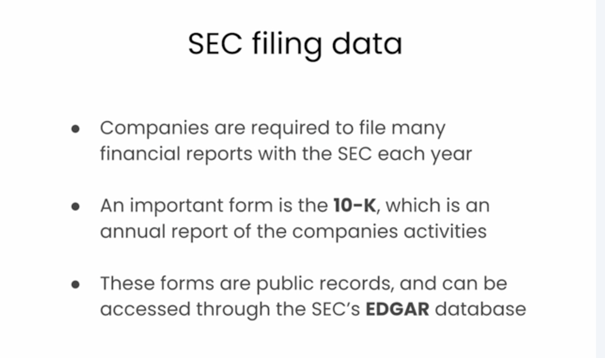
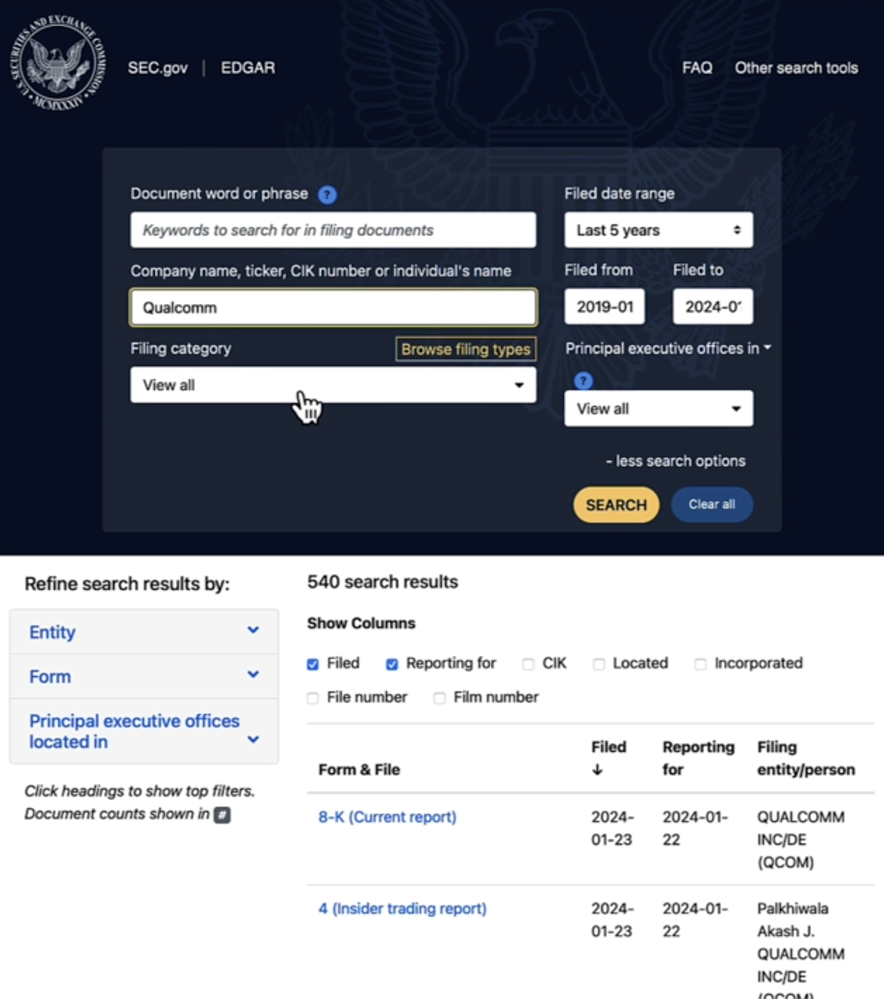
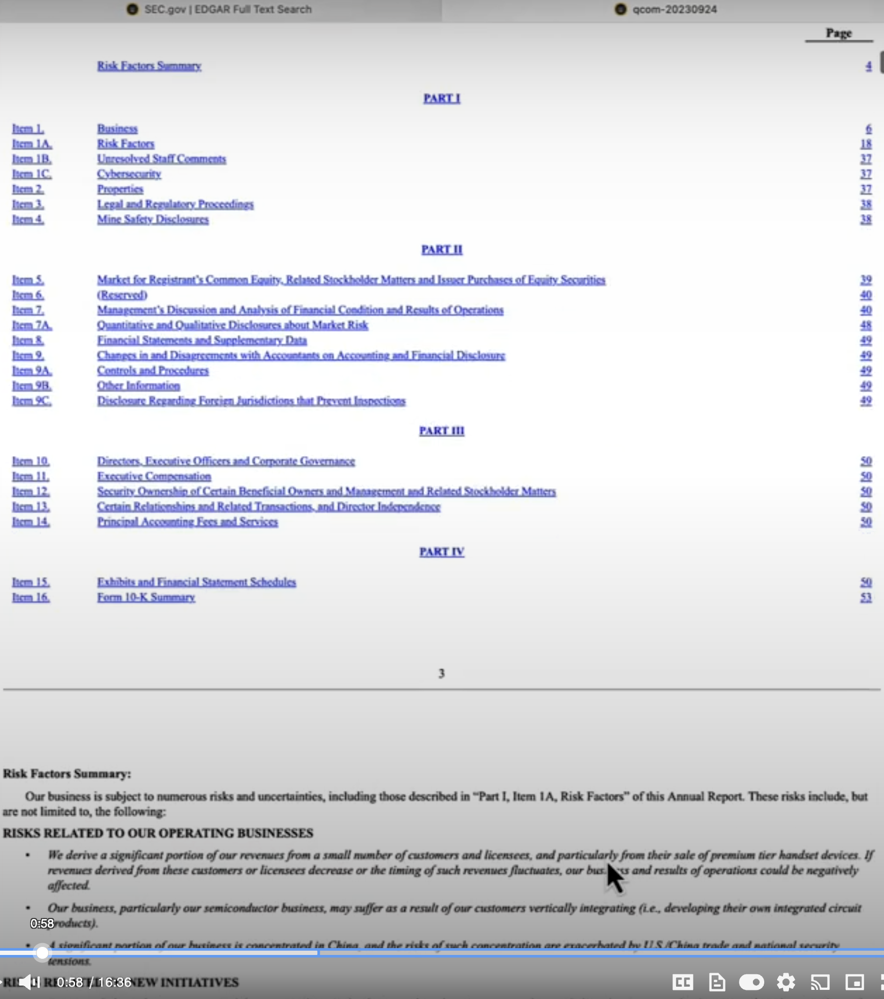
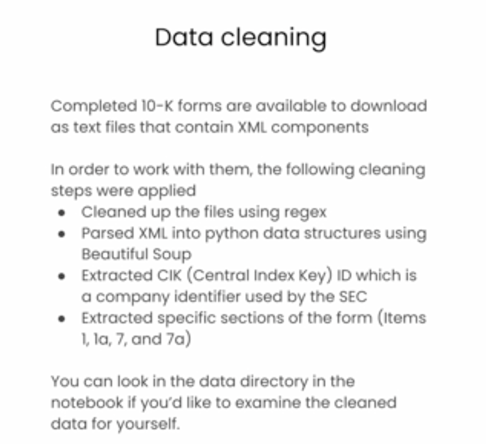
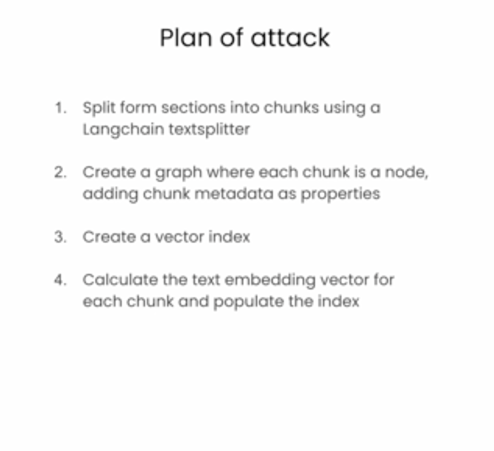

<!--
0:01 In this lesson, you'll use what you've learned so
0:04 far to start building a Knowledge Graph of some
0:15 Companies are required to file many financial reports with the SEC each year.
0:19 An important form is the Form 10-K,
0:21 which is an annual report of the company's activities.
0:26 These forms are public records and can be accessed through the SEC's EDGAR database.
0:30 Let's take a look at one.
0:33 So here, we are at sec.gov and the EDGAR database of all these financial forms.
0:50 And then, filter down for just their annual reports.
0:57 As you can see there's ton of sections to look at, lots and lots of text,
1:02 lots of interesting information in these forms.
1:05 Industry trends, a technology overview.
1:08 This is great. So, this is the kind of data that we'll pull into the Knowledge Graph
1:16 These forms are available for download. And when you've downloaded them,
1:19 they actually come as XML files.
1:21 And so, before you can really start doing import with that,
1:41 And from that, we then also extracted key things like an identifier called a CIK,
1:45 which is a central index key, which is how companies are identified within the SEC.
1:51 And for the big text chunks, we then looked at items 1, 1A, 7, and 7A.
1:56 Those are the large bodies of text that we're going to do chat with.
1:59 If you want to take a look in the data directory of this notebook,
2:02 you'll see some of the resulting files after doing all this cleanup.
2:05 After doing all this work,
2:06 we turn them into JSON so that it's easy to import
2:08 and start creating the Knowledge Graph from that.
2:11 Okay, we're almost ready to get back to the notebook, but before we do,
2:14 let's think about what our plan of attack is going to be.
2:17 We saw that each of the forms have different sections
2:19 of text that we're going to split up into chunks.
2:22 We're going to use langchain for that,
2:23 and then we've got all of those chunks set up,
2:25 each of those chunks will become a node in the graph.
2:28 The node will have that original text plus some metadata as properties.
2:32 Once that's in place, we'll create a vector index.
2:35 Then in that vector index,
2:36 we'll calculate text embeddings to populate the index for each of the chunk texts.
2:41 Finally, with all that done, we'll be able to do similarity search.
2:44 Let's head back over to the notebook and we can get started with the work.
2:48 So to start, we'll load some useful Python packages,
2:51 including some great stuff from Langchain.
2:54 We'll also load some global variables from the environment and set some constants
2:58 that we want to use later on during the knowledge graph creation part.
3:03 In this lesson, you'll be working with a single 10k document.
3:07 In practice you may have hundreds or thousands of documents.
3:11 The steps you'll take here would need to be repeated for all of your documents.
3:15 Let's start by setting the file name and then loading just the one JSON file.
-->
### Building a Knowledge Graph with Financial Reports

In this lesson, you'll use what you've learned so far to start building a Knowledge Graph of some.

### Understanding SEC Filings (Form 10-K)



Companies are required to file many financial reports with the SEC each year. An important form is the Form 10-K, which is an annual report of the company's activities. These forms are public records and can be accessed through the SEC's EDGAR database. Let's take a look at one. So here, we are at sec.gov and the EDGAR database of all these financial forms. And then, filter down for just their annual reports. As you can see there's ton of sections to look at, lots and lots of text, lots of interesting information in these forms. Industry trends, a technology overview. This is great. So, this is the kind of data that we'll pull into the Knowledge Graph.



### Processing 10-K Forms

These forms are available for download. And when you've downloaded them, they actually come as XML files. And so, before you can really start doing import with that, and from that, we then also extracted key things like an identifier called a CIK, which is a central index key, which is how companies are identified within the SEC. And for the big text chunks, we then looked at items 1, 1A, 7, and 7A. 



Those are the large bodies of text that we're going to do chat with. If you want to take a look in the data directory of this notebook, you'll see some of the resulting files after doing all this cleanup. After doing all this work, we turn them into JSON so that it's easy to import and start creating the Knowledge Graph from that.




Next let us look at plan of attach for creating a knowledge graph.

### Plan of Attack for Knowledge Graph Creation

Okay, we're almost ready to get back to the notebook, but before we do, let's think about what our plan of attack is going to be. We saw that each of the forms have different sections of text that we're going to split up into chunks. 



We're going to use Langchain for that, and then we've got all of those chunks set up, each of those chunks will become a node in the graph. The node will have that original text plus some metadata as properties. Once that's in place, we'll create a vector index. Then in that vector index, we'll calculate text embeddings to populate the index for each of the chunk texts. Finally, with all that done, we'll be able to do similarity search.

### Getting Started with the Notebook

Let's head back over to the notebook and we can get started with the work. So to start, we'll load some useful Python packages, including some great stuff from Langchain. We'll also load some global variables from the environment and set some constants that we want to use later on during the knowledge graph creation part. In this lesson, you'll be working with a single 10K document. In practice you may have hundreds or thousands of documents. The steps you'll take here would need to be repeated for all of your documents. Let's start by setting the file name and then loading just the one JSON file.

### Import packages and set up Neo4j


```python
from dotenv import load_dotenv
import os

# Common data processing
import json
import textwrap

# Langchain
from langchain_community.graphs import Neo4jGraph
from langchain_community.vectorstores import Neo4jVector
from langchain_openai import OpenAIEmbeddings
from langchain.text_splitter import RecursiveCharacterTextSplitter
from langchain.chains import RetrievalQAWithSourcesChain
from langchain_openai import ChatOpenAI


# Warning control
import warnings
warnings.filterwarnings("ignore")
```


```python
# Load from environment
load_dotenv('.env', override=True)
NEO4J_URI = os.getenv('NEO4J_URI')
NEO4J_USERNAME = os.getenv('NEO4J_USERNAME')
NEO4J_PASSWORD = os.getenv('NEO4J_PASSWORD')
NEO4J_DATABASE = os.getenv('NEO4J_DATABASE') or 'neo4j'
OPENAI_API_KEY = os.getenv('OPENAI_API_KEY')

# Note the code below is unique to this course environment, and not a 
# standard part of Neo4j's integration with OpenAI. Remove if running 
# in your own environment.
OPENAI_ENDPOINT = os.getenv('OPENAI_BASE_URL') + '/embeddings'

# Global constants
VECTOR_INDEX_NAME = 'form_10k_chunks'
VECTOR_NODE_LABEL = 'Chunk'
VECTOR_SOURCE_PROPERTY = 'text'
VECTOR_EMBEDDING_PROPERTY = 'textEmbedding'
```

<!--
3:31 And then, with first file name,
3:36 We can take a look at that to make sure that it looks like a proper dictionary.
3:42 Okay, the type is dictionary in Python. That's perfect.
3:43 Let's take a look at the keys that are available.
3:44 I'm just going to copy over a for loop that will go through the dictionary,
3:47 printing out the keys and the types of values in the object.
3:50 You can see these are the familiar fields from the Form 10-K,
3:53 the different sections called Item 1, Item 1A, and so on. And then,
4:08 Let's take a look at item one to see what the text is like.
4:14 Let's grab item one from the object.
4:15 And because I know there's a lot of text there,
4:16 we're just going to look at a little bit of it. So,
4:26 Because the text is so big, this is the whole purpose of doing chunking.
4:28 We're not going to take the entire text and store that in a single record.
4:29 We're going to use a text splitter from Langchain to actually break it down.
4:38 And this text splitter is set up with a chunk size of, you know, 2000 characters, 4:42 we're going to have an overlap of 200 characters.
4:53 And as before, we'll take a look at what the type of that is.
5:01 Okay, we can see that the list and it should be a list of strings.
5:04 Okay, let's also see how long that list is.
5:12 Okay, so there's 254 chunks from the original text.
5:16 Finally, let's actually take a look at one of
5:18 the chunks to see what the text is there.
5:22 And that looks a lot like what we saw before, which is perfect.
5:38 Okay, this is kind of a big function. So, let's walk through it one step at a time.
5:47 The first thing we'll do is that we'll go ahead and set aside a
5:50 list where we'll accumulate all of the chunks that we create.
5:53 And then, we'll go ahead and load the file,
6:10 For each of those items, we're going to pull out the item text from the object. So,
6:16 With the item text, we'll use the text splitter
6:18 that you just saw to go ahead and chunk that up.
6:31 And then, for the data record with the metadata,
6:36 First, there's the text itself pulled straight from the chunk.
6:39 There's the current item that we're working on.
6:41 There's the chunk sequence ID that we'll be looping. And then,
6:47 That form ID that we just created, the chunk ID that we'll also go ahead,
6:59 All that will go into one data record. And then,
7:22 Let's take a look at the first record in that list.
7:28 You can see the original text as we expected and there's all the metadata as well.
7:34 Perfect.
7:35 You will use a Cypher query to merge the chunks into the graph.
7:39 Let's take a look at the Cypher query itself.
7:41 This is a merge statement, so remember that a merge first does a match. And then,
7:59 The parameter itself is called chunk param, and it has names that match across, 8:02 right? So, names will be added to the chunk parameter names,
8:38 And for passing the parameters, we have an extra argument, which is called params,
-->
### Examining the Document Structure

And then, with the first file name, we can take a look at that to make sure that it looks like a proper dictionary. Okay, the type is dictionary in Python. That's perfect. Let's take a look at the keys that are available. I'm just going to copy over a for loop that will go through the dictionary, printing out the keys and the types of values in the object.


### Take a look at a Form 10-K json file

- Publicly traded companies are required to fill a form 10-K each year with the Securities and Exchange Commision (SEC)
- You can search these filings using the SEC's [EDGAR database](https://www.sec.gov/edgar/search/)
- For the next few lessons, you'll work with a single 10-K form for a company called [NetApp](https://www.netapp.com/)


```python
first_file_name = "./data/form10k/0000950170-23-027948.json"

```

```python
first_file_as_object = json.load(open(first_file_name))
```

```python
type(first_file_as_object)
```

    dict


```python
for k,v in first_file_as_object.items():
    print(k, type(v))
```

    item1 <class 'str'>
    item1a <class 'str'>
    item7 <class 'str'>
    item7a <class 'str'>
    cik <class 'str'>
    cusip6 <class 'str'>
    cusip <class 'list'>
    names <class 'list'>
    source <class 'str'>


 You can see these are the familiar fields from the Form 10-K, the different sections called Item 1, Item 1A, and so on.

### Inspecting Item One Content

Let's take a look at item one to see what the text is like. Let's grab item one from the object. 

```python
item1_text = first_file_as_object['item1']
```

```python
item1_text[0:1500]
```


    '>Item 1.  \nBusiness\n\n\nOverview\n\n\nNetApp, Inc. (NetApp, we, us or the Company) is a global cloud-led, data-centric software company. We were incorporated in 1992 and are headquartered in San Jose, California. Building on more than three decades of innovation, we give customers the freedom to manage applications and data across hybrid multicloud environments. Our portfolio of cloud services, and storage infrastructure, powered by intelligent data management software, enables applications to run faster, more reliably, and more securely, all at a lower cost.\n\n\nOur opportunity is defined by the durable megatrends of data-driven digital and cloud transformations. NetApp helps organizations meet the complexities created by rapid data and cloud growth, multi-cloud management, and the adoption of next-generation technologies, such as AI, Kubernetes, and modern databases. Our modern approach to hybrid, multicloud infrastructure and data management, which we term ‘evolved cloud’, provides customers the ability to leverage data across their entire estate with simplicity, security, and sustainability which increases our relevance and value to our customers.\n\n\nIn an evolved cloud state, the cloud is fully integrated into an organization’s architecture and operations. Data centers and clouds are seamlessly united and hybrid multicloud operations are simplified, with consistency and observability across environments. The key benefits NetApp brings to an organization’s hybrid multicloud envir'

And because I know there's a lot of text there, we're just going to look at a little bit of it.

### Text Chunking for Knowledge Graph Integration

Because the text is so big, this is the whole purpose of doing chunking. 


#### Split Form 10-K sections into chunks

- Set up text splitter using LangChain
- For now, split only the text from the "item 1" section 

We're not going to take the entire text and store that in a single record. We're going to use a text splitter from Langchain to actually break it down. And this text splitter is set up with a chunk size of, you know, 2000 characters, we're going to have an overlap of 200 characters.

```python
text_splitter = RecursiveCharacterTextSplitter(
    chunk_size = 2000,
    chunk_overlap  = 200,
    length_function = len,
    is_separator_regex = False,
)
```
The provided code snippet initializes a `RecursiveCharacterTextSplitter` object, likely from the `langchain` library. This type of text splitter is commonly used in Natural Language Processing (NLP) and Retrieval-Augmented Generation (RAG) systems to break down large documents into smaller, manageable pieces or "chunks."

Here's an explanation of each parameter:

* **`chunk_size = 2000`**: This parameter specifies the maximum size of each text chunk in terms of characters. In this case, each chunk will attempt to be no larger than 2000 characters.
* **`chunk_overlap = 200`**: This parameter defines the number of characters that will overlap between consecutive chunks. An overlap of 200 means that the last 200 characters of one chunk will also be the first 200 characters of the next chunk. This is crucial for maintaining context across chunks, as it helps ensure that important information is not split awkwardly between two chunks and can be fully understood when retrieved.
* **`length_function = len`**: This specifies the function used to calculate the length of the text. `len` is the standard Python built-in function for getting the length of a string, meaning the chunk size and overlap are measured in character count.
* **`is_separator_regex = False`**: This parameter indicates whether the separators used by the splitter are regular expressions. When `False`, the splitter uses default separators (like newline characters, spaces, etc.) in a predefined order to intelligently break down text, prioritizing meaningful breaks (e.g., paragraphs, sentences) before resorting to arbitrary character limits. If `True`, you would typically provide custom regex patterns for separators.

```python
item1_text_chunks = text_splitter.split_text(item1_text)
```
This line of code executes the text splitting process using the `text_splitter` object you previously initialized.

Here's a breakdown:

* **`item1_text_chunks`**: This is the variable that will store the output of the splitting operation. It will be a list of strings, where each string is a chunk of the original `item1_text`.
* **`text_splitter`**: This refers to the `RecursiveCharacterTextSplitter` object you created earlier, configured with a `chunk_size` of 2000 and a `chunk_overlap` of 200.
* **`.split_text(item1_text)`**: This is the method called on the `text_splitter` object. It takes `item1_text` (presumably a large string of text, like the content of "Item 1" from a 10-K form) as its input. The method then applies the configured chunking logic to `item1_text`, breaking it down into smaller pieces according to the `chunk_size` and `chunk_overlap` rules.


### Verifying Chunking Results

And as before, we'll take a look at what the type of that is. Okay, we can see that the list and it should be a list of strings. Okay, let's also see how long that list is. Okay, so there's 254 chunks from the original text. 

```python
type(item1_text_chunks)
```
Type of this is `list`.

Its length is 254 characters.
```python
len(item1_text_chunks)
```

    254


Finally, let's actually take a look at one of the chunks to see what the text is there. 

```python
item1_text_chunks[0]
```


    '>Item 1.  \nBusiness\n\n\nOverview\n\n\nNetApp, Inc. (NetApp, we, us or the Company) is a global cloud-led, data-centric software company. We were incorporated in 1992 and are headquartered in San Jose, California. Building on more than three decades of innovation, we give customers the freedom to manage applications and data across hybrid multicloud environments. Our portfolio of cloud services, and storage infrastructure, powered by intelligent data management software, enables applications to run faster, more reliably, and more securely, all at a lower cost.\n\n\nOur opportunity is defined by the durable megatrends of data-driven digital and cloud transformations. NetApp helps organizations meet the complexities created by rapid data and cloud growth, multi-cloud management, and the adoption of next-generation technologies, such as AI, Kubernetes, and modern databases. Our modern approach to hybrid, multicloud infrastructure and data management, which we term ‘evolved cloud’, provides customers the ability to leverage data across their entire estate with simplicity, security, and sustainability which increases our relevance and value to our customers.\n\n\nIn an evolved cloud state, the cloud is fully integrated into an organization’s architecture and operations. Data centers and clouds are seamlessly united and hybrid multicloud operations are simplified, with consistency and observability across environments. The key benefits NetApp brings to an organization’s hybrid multicloud environment are:\n\n\n•\nOperational simplicity: NetApp’s use of open source, open architectures and APIs, microservices, and common capabilities and data services facilitate the creation of applications that can run anywhere.\n\n\n•\nFlexibility and consistency: NetApp makes moving data and applications between environments seamless through a common storage foundation across on-premises and multicloud environments.'


And that looks a lot like what we saw before, which is perfect.

### Function for Processing and Chunking Documents

Let us write function to split the 10k form data from file.


```python
def split_form10k_data_from_file(file):
    chunks_with_metadata = [] # use this to accumlate chunk records
    file_as_object = json.load(open(file)) # open the json file
    for item in ['item1','item1a','item7','item7a']: # pull these keys from the json
        print(f'Processing {item} from {file}') 
        item_text = file_as_object[item] # grab the text of the item
        item_text_chunks = text_splitter.split_text(item_text) # split the text into chunks
        chunk_seq_id = 0
        for chunk in item_text_chunks[:20]: # only take the first 20 chunks
            form_id = file[file.rindex('/') + 1:file.rindex('.')] # extract form id from file name
            # finally, construct a record with metadata and the chunk text
            chunks_with_metadata.append({
                'text': chunk, 
                # metadata from looping...
                'f10kItem': item,
                'chunkSeqId': chunk_seq_id,
                # constructed metadata...
                'formId': f'{form_id}', # pulled from the filename
                'chunkId': f'{form_id}-{item}-chunk{chunk_seq_id:04d}',
                # metadata from file...
                'names': file_as_object['names'],
                'cik': file_as_object['cik'],
                'cusip6': file_as_object['cusip6'],
                'source': file_as_object['source'],
            })
            chunk_seq_id += 1
        print(f'\tSplit into {chunk_seq_id} chunks')
    return chunks_with_metadata
```

Okay, this is kind of a big function. So, let's walk through it one step at a time. The first thing we'll do is that we'll go ahead and set aside a list where we'll accumulate all of the chunks that we create. And then, we'll go ahead and load the file. For each of those items, we're going to pull out the item text from the object. With the item text, we'll use the text splitter that you just saw to go ahead and chunk that up. And then, for the data record with the metadata, first, there's the text itself pulled straight from the chunk. There's the current item that we're working on. There's the chunk sequence ID that we'll be looping. And then, that form ID that we just created, the chunk ID that we'll also go ahead. All that will go into one data record.

Detailed explaination

```python
def split_form10k_data_from_file(file):
    # Initializes an empty list to store all the processed chunks along with their metadata.
    # This list will be the primary output of the function.
    chunks_with_metadata = []

    # Opens the specified JSON file in read mode and loads its content into a Python dictionary.
    # The 'file' parameter is expected to be the path to a JSON file.
    file_as_object = json.load(open(file))

    # Iterates through a predefined list of "items" (sections) from the Form 10-K document.
    # These items ('item1', 'item1a', 'item7', 'item7a') are typically large text sections.
    for item in ['item1','item1a','item7','item7a']:
        # Prints a message to indicate which item is currently being processed,
        # providing feedback during execution.
        print(f'Processing {item} from {file}')

        # Retrieves the text content for the current 'item' from the loaded JSON object.
        item_text = file_as_object[item]

        # Uses the 'text_splitter' (a pre-configured RecursiveCharacterTextSplitter)
        # to break down the 'item_text' into smaller chunks based on its defined chunk_size and chunk_overlap.
        item_text_chunks = text_splitter.split_text(item_text)

        # Initializes a sequence ID for the chunks within the current item.
        # This will be used to give each chunk a unique identifier within its item.
        chunk_seq_id = 0

        # Loops through the first 20 chunks of the 'item_text_chunks'.
        # The `[:20]` slice means it will only process a maximum of 20 chunks per item,
        # even if the item's text generates more. This is likely for demonstration or testing purposes.
        for chunk in item_text_chunks[:20]:
            # Extracts the 'formId' from the filename.
            # It finds the last '/' and the last '.' to get the substring between them,
            # effectively extracting the file's base name without its extension or directory path.
            form_id = file[file.rindex('/') + 1:file.rindex('.')]

            # Appends a dictionary (representing a single chunk record) to the 'chunks_with_metadata' list.
            # This dictionary contains the chunk's text and various metadata.
            chunks_with_metadata.append({
                'text': chunk, # The actual text content of the current chunk.

                # Metadata derived from the loop:
                'f10kItem': item,        # The specific 10-K item (e.g., 'item1', 'item7a') this chunk belongs to.
                'chunkSeqId': chunk_seq_id, # The sequential ID of the chunk within its item (0, 1, 2, ...).

                # Constructed metadata:
                'formId': f'{form_id}',  # The extracted form ID from the filename.
                'chunkId': f'{form_id}-{item}-chunk{chunk_seq_id:04d}', # A unique ID for the chunk, formatted with leading zeros for the sequence ID.

                # Metadata directly from the original JSON file:
                'names': file_as_object['names'], # Company names.
                'cik': file_as_object['cik'],     # Central Index Key (unique identifier for the company).
                'cusip6': file_as_object['cusip6'], # CUSIP number (identifies securities).
                'source': file_as_object['source'], # Source of the document.
            })
            # Increments the chunk sequence ID for the next chunk.
            chunk_seq_id += 1
        # After processing all selected chunks for an item, prints how many chunks were generated for that item.
        print(f'\tSplit into {chunk_seq_id} chunks')
    # Returns the list containing all the chunks with their associated metadata.
    return chunks_with_metadata
```

### Reviewing the First Processed Record

Let's take a look at the first record in that list. 

```python
first_file_chunks = split_form10k_data_from_file(first_file_name)
```

    Processing item1 from ./data/form10k/0000950170-23-027948.json
    	Split into 20 chunks
    Processing item1a from ./data/form10k/0000950170-23-027948.json
    	Split into 1 chunks
    Processing item7 from ./data/form10k/0000950170-23-027948.json
    	Split into 1 chunks
    Processing item7a from ./data/form10k/0000950170-23-027948.json
    	Split into 1 chunks


```python
first_file_chunks[0]
```


    {'text': '>Item 1.  \nBusiness\n\n\nOverview\n\n\nNetApp, Inc. (NetApp, we, us or the Company) is a global cloud-led, data-centric software company. We were incorporated in 1992 and are headquartered in San Jose, California. Building on more than three decades of innovation, we give customers the freedom to manage applications and data across hybrid multicloud environments. Our portfolio of cloud services, and storage infrastructure, powered by intelligent data management software, enables applications to run faster, more reliably, and more securely, all at a lower cost.\n\n\nOur opportunity is defined by the durable megatrends of data-driven digital and cloud transformations. NetApp helps organizations meet the complexities created by rapid data and cloud growth, multi-cloud management, and the adoption of next-generation technologies, such as AI, Kubernetes, and modern databases. Our modern approach to hybrid, multicloud infrastructure and data management, which we term ‘evolved cloud’, provides customers the ability to leverage data across their entire estate with simplicity, security, and sustainability which increases our relevance and value to our customers.\n\n\nIn an evolved cloud state, the cloud is fully integrated into an organization’s architecture and operations. Data centers and clouds are seamlessly united and hybrid multicloud operations are simplified, with consistency and observability across environments. The key benefits NetApp brings to an organization’s hybrid multicloud environment are:\n\n\n•\nOperational simplicity: NetApp’s use of open source, open architectures and APIs, microservices, and common capabilities and data services facilitate the creation of applications that can run anywhere.\n\n\n•\nFlexibility and consistency: NetApp makes moving data and applications between environments seamless through a common storage foundation across on-premises and multicloud environments.',
     'f10kItem': 'item1',
     'chunkSeqId': 0,
     'formId': '0000950170-23-027948',
     'chunkId': '0000950170-23-027948-item1-chunk0000',
     'names': ['Netapp Inc', 'NETAPP INC'],
     'cik': '1002047',
     'cusip6': '64110D',
     'source': 'https://www.sec.gov/Archives/edgar/data/1002047/000095017023027948/0000950170-23-027948-index.htm'}
You can see the original text as we expected and there's all the metadata as well. Perfect.

### Merging Chunks into the Graph with Cypher

You will use a Cypher query to merge the chunks into the graph. Let's take a look at the Cypher query itself. This is a merge statement, so remember that a merge first does a match. And then, the parameter itself is called chunk param, and it has names that match across, right? 


```python
merge_chunk_node_query = """
MERGE(mergedChunk:Chunk {chunkId: $chunkParam.chunkId})
    ON CREATE SET 
        mergedChunk.names = $chunkParam.names,
        mergedChunk.formId = $chunkParam.formId, 
        mergedChunk.cik = $chunkParam.cik, 
        mergedChunk.cusip6 = $chunkParam.cusip6, 
        mergedChunk.source = $chunkParam.source, 
        mergedChunk.f10kItem = $chunkParam.f10kItem, 
        mergedChunk.chunkSeqId = $chunkParam.chunkSeqId, 
        mergedChunk.text = $chunkParam.text
RETURN mergedChunk
"""
```

- Set up connection to graph instance using LangChain


```python
kg = Neo4jGraph(
    url=NEO4J_URI, username=NEO4J_USERNAME, password=NEO4J_PASSWORD, database=NEO4J_DATABASE
)
```

- Create a single chunk node for now


```python
kg.query(merge_chunk_node_query, 
         params={'chunkParam':first_file_chunks[0]})
```


    [{'mergedChunk': {'formId': '0000950170-23-027948',
       'f10kItem': 'item1',
       'names': ['Netapp Inc', 'NETAPP INC'],
       'cik': '1002047',
       'cusip6': '64110D',
       'source': 'https://www.sec.gov/Archives/edgar/data/1002047/000095017023027948/0000950170-23-027948-index.htm',
       'text': '>Item 1.  \nBusiness\n\n\nOverview\n\n\nNetApp, Inc. (NetApp, we, us or the Company) is a global cloud-led, data-centric software company. We were incorporated in 1992 and are headquartered in San Jose, California. Building on more than three decades of innovation, we give customers the freedom to manage applications and data across hybrid multicloud environments. Our portfolio of cloud services, and storage infrastructure, powered by intelligent data management software, enables applications to run faster, more reliably, and more securely, all at a lower cost.\n\n\nOur opportunity is defined by the durable megatrends of data-driven digital and cloud transformations. NetApp helps organizations meet the complexities created by rapid data and cloud growth, multi-cloud management, and the adoption of next-generation technologies, such as AI, Kubernetes, and modern databases. Our modern approach to hybrid, multicloud infrastructure and data management, which we term ‘evolved cloud’, provides customers the ability to leverage data across their entire estate with simplicity, security, and sustainability which increases our relevance and value to our customers.\n\n\nIn an evolved cloud state, the cloud is fully integrated into an organization’s architecture and operations. Data centers and clouds are seamlessly united and hybrid multicloud operations are simplified, with consistency and observability across environments. The key benefits NetApp brings to an organization’s hybrid multicloud environment are:\n\n\n•\nOperational simplicity: NetApp’s use of open source, open architectures and APIs, microservices, and common capabilities and data services facilitate the creation of applications that can run anywhere.\n\n\n•\nFlexibility and consistency: NetApp makes moving data and applications between environments seamless through a common storage foundation across on-premises and multicloud environments.',
       'chunkId': '0000950170-23-027948-item1-chunk0000',
       'chunkSeqId': 0}}]


So, names will be added to the chunk parameter names. And for passing the parameters, we have an extra argument, which is called params.

<!-- 
8:42 which is a dictionary of keys and then values.
8:44 The key chunk param here will be available inside
8:47 of the query as this dollar sign chunk param.
8:50 We're going to give it the value of from that list of chunks,
8:52 we're going to grab the very first chunk.
8:54 The very first chunk record will become chunk param inside of the query.
9:00 So fantastic. You can see that the result of running
9:03 that query is that we've created a new node,
9:05 and here's the contents of that node.
9:06 It's the metadata that we set before and then
9:08 there's the text that we've always seen.
9:11 This is perfect.
9:13 Before calling the helper function to create a Knowledge Graph,
9:27 Its job is to ensure that a particular property is
9:30 unique for all nodes that share a common label.
9:48 Let's go ahead and run that.
9:56 We'll go ahead and show all the indexes.
9:59 And you can see that the named index unique chunk is there, that it's online.
10:15 Let's scroll down to see the end of this.
10:17 Okay, great.
10:19 It's created 23 nodes. Perfect.
10:20 Just to sanity check that we actually have 23 nodes,
10:23 we'll run another sanity check that we actually
10:25 have 23 nodes, we'll run another query.
10:35 Let's see.
10:37 Fantastic.
10:46 The index will be called form10kChunks and will store embeddings
10:49 for nodes labeled as chunk in a property called text embedding.
10:53 The embeddings will match the recommended configuration
10:55 for the OpenAI default embeddings model.
11:04 We can check that that index has been created by looking at all of the indexes.
11:10 Great, we can see that we've got this form 10k chunks available. It's online,
$11: 14$ which means it's ready to go.
11:16 It's a vector index and it's on the chunks for text embeddings, just as we asked.
11:24 You can now use a single query to match all chunks. And then,
11:33 This may take a minute to run depending on network traffic.
11:40 And this is now what the graph looks like.
11:42 We know that we've got chunks with text embeddings
$11: 44$ as a list and we don't yet have any relationships.
11:57 This is exactly like what we did in the previous lesson,
12:01 where we called Neo4j for actually doing the encoding,
12:03 which would call back out to OpenAI, and using that embedding,
12:07 we would actually store the value inside of the property
12:10 called text embedding inside of the node.
12:13 You may recall that the form we've turned into a
12:15 knowledge graph is from a company called NetApp.
-->

Which is a dictionary of keys and then values. The key chunk param here will be available inside of the query as this dollar sign chunk param. We're going to give it the value of from that list of chunks, we're going to grab the very first chunk. The very first chunk record will become chunk param inside of the query.

### Verifying Node Creation

So fantastic. You can see that the result of running that query is that we've created a new node, and here's the contents of that node. It's the metadata that we set before and then there's the text that we've always seen. This is perfect.

### Ensuring Unique Properties

#### Create a uniqueness constraint to avoid duplicate chunks


```
Before calling the helper function to create a Knowledge Graph, its job is to ensure that a particular property is unique for all nodes that share a common label. Let's go ahead and run that. 

```python
kg.query("""
CREATE CONSTRAINT unique_chunk IF NOT EXISTS 
    FOR (c:Chunk) REQUIRE c.chunkId IS UNIQUE
""")

```

    []


```python
kg.query("SHOW INDEXES")
```
We'll go ahead and show all the indexes. And you can see that the named index unique chunk is there, that it's online.

    [{'id': 1,
      'name': 'index_343aff4e',
      'state': 'ONLINE',
      'populationPercent': 100.0,
      'type': 'LOOKUP',
      'entityType': 'NODE',
      'labelsOrTypes': None,
      'properties': None,
      'indexProvider': 'token-lookup-1.0',
      'owningConstraint': None,
      'lastRead': None,
      'readCount': 0},
     {'id': 2,
      'name': 'index_f7700477',
      'state': 'ONLINE',
      'populationPercent': 100.0,
      'type': 'LOOKUP',
      'entityType': 'RELATIONSHIP',
      'labelsOrTypes': None,
      'properties': None,
      'indexProvider': 'token-lookup-1.0',
      'owningConstraint': None,
      'lastRead': None,
      'readCount': 0},
     {'id': 3,
     ...}
    ]

### Sanity Check on Node Count

Let's scroll down to see the end of this. Okay, great. It's created 23 nodes. Perfect. Just to sanity check that we actually have 23 nodes, we'll run another sanity check that we actually have 23 nodes, we'll run another query. 

- Loop through and create nodes for all chunks
- Should create 23 nodes because you set a limit of 20 chunks in the text splitting function above


```python
node_count = 0
for chunk in first_file_chunks:
    print(f"Creating `:Chunk` node for chunk ID {chunk['chunkId']}")
    kg.query(merge_chunk_node_query, 
            params={
                'chunkParam': chunk
            })
    node_count += 1
print(f"Created {node_count} nodes")
```

Let's see. 

    Creating `:Chunk` node for chunk ID 0000950170-23-027948-item1-chunk0000
    Creating `:Chunk` node for chunk ID 0000950170-23-027948-item1-chunk0001
    ..
    Creating `:Chunk` node for chunk ID 0000950170-23-027948-item7a-chunk0000
    Created 23 nodes


```python
kg.query("""
         MATCH (n)
         RETURN count(n) as nodeCount
         """)
```


    [{'nodeCount': 23}]

### Configuring the Vector Index

The index will be called `form10kChunks` and will store embeddings for nodes labeled as chunk in a property called text embedding. The embeddings will match the recommended configuration for the OpenAI default embeddings model. 


```python
kg.query("""
         CREATE VECTOR INDEX `form_10k_chunks` IF NOT EXISTS
          FOR (c:Chunk) ON (c.textEmbedding) 
          OPTIONS { indexConfig: {
            `vector.dimensions`: 1536,
            `vector.similarity_function`: 'cosine'    
         }}
""")
```


    []


```python
kg.query("SHOW INDEXES")
```

We can check that that index has been created by looking at all of the indexes. 

    {'id': 5,
      'name': 'form_10k_chunks',
      'state': 'ONLINE',
      'populationPercent': 100.0,
      'type': 'VECTOR',
      'entityType': 'NODE',
      'labelsOrTypes': ['Chunk'],
      'properties': ['textEmbedding'],
      'indexProvider': 'vector-1.0',
      'owningConstraint': None,
      'lastRead': None,
      'readCount': None
    }

We can see that we've got this form 10k chunks available. It's online, which means it's ready to go. It's a vector index and it's on the chunks for text embeddings, just as we asked.

### Populating Embeddings in the Graph

You can now use a single query to match all chunks. And then, this may take a minute to run depending on network traffic. 


And this is now what the graph looks like. 

#### Generating and Storing Embeddings

We're going to match movies that have the label movie, and where the `movie.tagline` is not null. In this next line, we're going to take the movie and also calculate an embedding for the tagline. We're going to do that by calling this function that's called `genai.vector.encode`. We're passing in the parameter which is the value we want to encode. Here that's movie.tagline. 


```python
kg.query("""
    MATCH (chunk:Chunk) WHERE chunk.textEmbedding IS NULL
    WITH chunk, genai.vector.encode(
      chunk.text, 
      "OpenAI", 
      {
        token: $openAiApiKey, 
        endpoint: $openAiEndpoint
      }) AS vector
    CALL db.create.setNodeVectorProperty(chunk, "textEmbedding", vector)
    """, 
    params={"openAiApiKey":OPENAI_API_KEY, "openAiEndpoint": OPENAI_ENDPOINT} )
```

    []


```python
kg.refresh_schema()
print(kg.schema)
```

We're going to specify what embedding model we want to use. That's OpenAI. And because OpenAI requires a key, we're also going to pass in a little bit of configuration here. It says here's the token for OpenAI. It's going to be this OpenAI API key. Now, this value here is what we call a query parameter.


    Node properties are the following:
        Chunk {textEmbedding: LIST, f10kItem: STRING, chunkSeqId: INTEGER, text: STRING, cik: STRING, cusip6: STRING, names: LIST, formId: STRING, source: STRING, chunkId: STRING}
        Relationship properties are the following:
        
        The relationships are the following:
    

We know that we've got chunks with text embeddings as a list and we don't yet have any relationships. 


This is exactly like what we did in the previous lesson, where we called Neo4j for actually doing the encoding, which would call back out to OpenAI, and using that embedding, we would actually store the value inside of the property called text embedding inside of the node. You may recall that the form we've turned into a knowledge graph is from a company called NetApp.
<!-- 
3:31 And then, with first file name,
3:36 We can take a look at that to make sure that it looks like a proper dictionary.
3:42 Okay, the type is dictionary in Python. That's perfect.
3:43 Let's take a look at the keys that are available.
3:44 I'm just going to copy over a for loop that will go through the dictionary,
3:47 printing out the keys and the types of values in the object.
3:50 You can see these are the familiar fields from the Form 10-K,
3:53 the different sections called Item 1, Item 1A, and so on. And then,
4:08 Let's take a look at item one to see what the text is like.
4:14 Let's grab item one from the object.
4:15 And because I know there's a lot of text there,
4:16 we're just going to look at a little bit of it. So,
4:26 Because the text is so big, this is the whole purpose of doing chunking.
4:28 We're not going to take the entire text and store that in a single record.
4:29 We're going to use a text splitter from Langchain to actually break it down.
4:38 And this text splitter is set up with a chunk size of, you know, 2000 characters, 4:42 we're going to have an overlap of 200 characters.
4:53 And as before, we'll take a look at what the type of that is.
5:01 Okay, we can see that the list and it should be a list of strings.
5:04 Okay, let's also see how long that list is.
5:12 Okay, so there's 254 chunks from the original text.
5:16 Finally, let's actually take a look at one of
5:18 the chunks to see what the text is there.
5:22 And that looks a lot like what we saw before, which is perfect.
5:38 Okay, this is kind of a big function. So, let's walk through it one step at a time.
5:47 The first thing we'll do is that we'll go ahead and set aside a
5:50 list where we'll accumulate all of the chunks that we create.
5:53 And then, we'll go ahead and load the file,
6:10 For each of those items, we're going to pull out the item text from the object. So,
6:16 With the item text, we'll use the text splitter
6:18 that you just saw to go ahead and chunk that up.
6:31 And then, for the data record with the metadata,
6:36 First, there's the text itself pulled straight from the chunk.
6:39 There's the current item that we're working on.
6:41 There's the chunk sequence ID that we'll be looping. And then,
6:47 That form ID that we just created, the chunk ID that we'll also go ahead,
6:59 All that will go into one data record. And then,
7:22 Let's take a look at the first record in that list.
7:28 You can see the original text as we expected and there's all the metadata as well.
7:34 Perfect.
7:35 You will use a Cypher query to merge the chunks into the graph.
7:39 Let's take a look at the Cypher query itself.
7:41 This is a merge statement, so remember that a merge first does a match. And then,
7:59 The parameter itself is called chunk param, and it has names that match across, 8:02 right? So, names will be added to the chunk parameter names,
8:38 And for passing the parameters, we have an extra argument, which is called params,

-->

```python
def neo4j_vector_search(question):
  """Search for similar nodes using the Neo4j vector index"""
  vector_search_query = """
    WITH genai.vector.encode(
      $question, 
      "OpenAI", 
      {
        token: $openAiApiKey,
        endpoint: $openAiEndpoint
      }) AS question_embedding
    CALL db.index.vector.queryNodes($index_name, $top_k, question_embedding) yield node, score
    RETURN score, node.text AS text
  """
  similar = kg.query(vector_search_query, 
                     params={
                      'question': question, 
                      'openAiApiKey':OPENAI_API_KEY,
                      'openAiEndpoint': OPENAI_ENDPOINT,
                      'index_name':VECTOR_INDEX_NAME, 
                      'top_k': 10})
  return similar
```

<!--
11:57 This is exactly like what we did in the previous lesson,
12:01 where we called Neo4j for actually doing the encoding,
12:03 which would call back out to OpenAI, and using that embedding,
12:07 we would actually store the value inside of the property
12:10 called text embedding inside of the node.
12:13 You may recall that the form we've turned into a
12:15 knowledge graph is from a company called NetApp.
12:18 We picked just one form. It happened to be this company NetApp.
12:21 You can try out our new vector search helper function
12:23 to ask about NetApp and see what we get.
12:31 The Neo4j VectorSearchHelper function returns a list of results.
12:50 Notice that we only performed vector search.
12:52 If we want to create a chatbot that provides actual answers to a question,
12:56 we can build a RAG system using Langchain.
12:59 Let's take a look at how you'll do that.
13:02 The easiest way to start using Neo4j with Langchain
13:05 is with the Neo4j vector interface.
13:07 This makes Ne04j look like a vector store.
13:10 Under the hood, it will use the cipher language
13:13 for performing vector similarity searches.
13:16 The configuration specifies a few important things.
13:19 These are using the global variables that we said at the top of this lesson.
$13: 28$ variables that we set at the top of this lesson.
13:29 We'll convert the vector store into a retriever using this easy call as a retriever.
13:33 The Langchain framework comes with lots of
13:35 different ways of having chat applications.
13:45 If you want to find more about the kinds of things that Langchain has available,
13:48 I totally encourage you to go out to their website and check it out.
13:50 It's pretty great. So, for this chain,
14:06 and it's going to be using the retriever that we
14:08 defined above which uses the Neo4j vector store.
14:15 I also have a nice helper function here called pretty chain,
14:18 which just accepts a question, it then calls the chain with that question,
14:22 and just pulls out the answer field itself and prints
14:24 that in a nice way formatted for the screen.
14:29 Okay, with all that work done,
14:30 we can finally get to the fun stuff and ask some questions.
14:34 Since we know we have ivetApp here, let's go ahead and ask,
14:37 what is NetApp's primary business?
14:42 We'll use pretty chain to pass that question

14:44 in and just immediately show the response.
14:47 Okay.
14:48 We can see that NetApp's primary business is enterprise storage and data management,
14:52 cloud storage and cloud operations.
14:55 You can see that we have an actual answer to the question rather
14:57 than just some raw text that might have that answer.
15:00 This is exactly what you want the LLM for.
15:03 Let's try another question to see what we get.
15:05 Let's see if it can tell where NetApp has headquarters.
15:09 Headquartered in San Jose, California. That is correct.
15:30 Let's see what we get. Okay, I guess that is technically a single sentence.
15:32 It is a bit rambly, but good job following our instructions.
15:37 We're going to ask about a different company that kind of sounds similar to NetApp.
15:42 There's Apple, the computer company, right?
15:53 Hmm.
15:54 The description of Apple seems a lot like the description of NetApp.
15:57 This is classic hallucination.
15:59 Let's try to fix this with a little bit more prompt engineering.
16:12 If you are unsure about the answer, say you don't know.
16:18 Okay, much better answer and much more honest from the LLM.
16:21 Perfect prompt engineering for the victory.
16:24 In this lesson, you've been using Neo4j as a vector store,
16:28 but not really as a knowledge graph.
16:31 Let's move on to the next lesson,
16:33 where you'll add relationships to the nodes to
16:35 add more graphy power to the chat application.
-->
### Integrating Embeddings with Neo4j

This process is exactly like what we did in the previous lesson, where we utilized Neo4j to perform the encoding. This encoding process involved making calls out to OpenAI, and subsequently, the generated embedding was stored as the value of the `text embedding` property within the respective node in the graph. 

```python
def neo4j_vector_search(question):
  """Search for similar nodes using the Neo4j vector index"""
  vector_search_query = """
    WITH genai.vector.encode(
      $question, 
      "OpenAI", 
      {
        token: $openAiApiKey,
        endpoint: $openAiEndpoint
      }) AS question_embedding
    CALL db.index.vector.queryNodes($index_name, $top_k, question_embedding) yield node, score
    RETURN score, node.text AS text
  """
  similar = kg.query(vector_search_query, 
                     params={
                      'question': question, 
                      'openAiApiKey':OPENAI_API_KEY,
                      'openAiEndpoint': OPENAI_ENDPOINT,
                      'index_name':VECTOR_INDEX_NAME, 
                      'top_k': 10})
  return similar
```
You may recall that the form we transformed into a knowledge graph originated from a company called NetApp. We specifically selected just one form, which happened to be associated with NetApp. You can now try out our new vector search helper function to query about NetApp and observe the results.

### Utilizing Neo4j Vector Search Helper

The Neo4j `VectorSearchHelper` function is designed to return a list of search results. It's important to note that at this stage, we have only performed a vector similarity search. If our objective is to create a chatbot that provides actual answers to questions, we can advance to building a Retrieval-Augmented Generation (RAG) system using the Langchain framework.


```python
search_results = neo4j_vector_search(
    'In a single sentence, tell me about Netapp.'
)
```


```python
search_results[0]
```


    {'score': 0.9357025623321533,
     'text': '>Item 1.  \nBusiness\n\n\nOverview\n\n\nNetApp, Inc. (NetApp, we, us or the Company) is a global cloud-led, data-centric software company. We were incorporated in 1992 and are headquartered in San Jose, California. Building on more than three decades of innovation, we give customers the freedom to manage applications and data across hybrid multicloud environments. Our portfolio of cloud services, and storage infrastructure, powered by intelligent data management software, enables applications to run faster, more reliably, and more securely, all at a lower cost.\n\n\nOur opportunity is defined by the durable megatrends of data-driven digital and cloud transformations. NetApp helps organizations meet the complexities created by rapid data and cloud growth, multi-cloud management, and the adoption of next-generation technologies, such as AI, Kubernetes, and modern databases. Our modern approach to hybrid, multicloud infrastructure and data management, which we term ‘evolved cloud’, provides customers the ability to leverage data across their entire estate with simplicity, security, and sustainability which increases our relevance and value to our customers.\n\n\nIn an evolved cloud state, the cloud is fully integrated into an organization’s architecture and operations. Data centers and clouds are seamlessly united and hybrid multicloud operations are simplified, with consistency and observability across environments. The key benefits NetApp brings to an organization’s hybrid multicloud environment are:\n\n\n•\nOperational simplicity: NetApp’s use of open source, open architectures and APIs, microservices, and common capabilities and data services facilitate the creation of applications that can run anywhere.\n\n\n•\nFlexibility and consistency: NetApp makes moving data and applications between environments seamless through a common storage foundation across on-premises and multicloud environments.'}


### Building a RAG System with Langchain and Neo4j

Let's explore how to implement this. The most straightforward approach to integrating Neo4j with Langchain involves using the Neo4j vector interface. This interface presents Neo4j as a conventional vector store to Langchain. Underneath this interface, it transparently employs the Cypher query language to execute vector similarity searches. The configuration for this setup specifies several important parameters, which are sourced from the global variables defined at the beginning of this lesson. We will then convert this vector store into a retriever by making a simple call using the `.as_retriever()` method. The Langchain framework offers a wide array of methods and tools for developing various types of chat applications. 


```python
neo4j_vector_store = Neo4jVector.from_existing_graph(
    embedding=OpenAIEmbeddings(),
    url=NEO4J_URI,
    username=NEO4J_USERNAME,
    password=NEO4J_PASSWORD,
    index_name=VECTOR_INDEX_NAME,
    node_label=VECTOR_NODE_LABEL,
    text_node_properties=[VECTOR_SOURCE_PROPERTY],
    embedding_node_property=VECTOR_EMBEDDING_PROPERTY,
)

```


```python
retriever = neo4j_vector_store.as_retriever()
```

If you are interested in exploring more of Langchain's capabilities, I highly recommend visiting their official website.
- You can check out the LangChain documentation for this chain [here](https://api.python.langchain.com/en/latest/chains/langchain.chains.qa_with_sources.retrieval.RetrievalQAWithSourcesChain.html)

### Configuring the Chat Chain

For this specific chain setup, it will utilize the retriever we defined earlier, which, in turn, is powered by the Neo4j vector store. Additionally, I've included a convenient helper function named `pretty_chain`. This function simply accepts a question, then passes that question to the main chain, extracts only the answer field from the chain's response, and finally prints that answer in a clearly formatted manner for display.

```python
chain = RetrievalQAWithSourcesChain.from_chain_type(
    ChatOpenAI(temperature=0), 
    chain_type="stuff", 
    retriever=retriever
)
```


```python
def prettychain(question: str) -> str:
    """Pretty print the chain's response to a question"""
    response = chain({"question": question},
        return_only_outputs=True,)
    print(textwrap.fill(response['answer'], 60))
```

- Ask a question!

### Asking Questions to the Knowledge Graph

With all the foundational work completed, we can now proceed to the exciting part: asking questions to our knowledge graph. Given that we know we have data pertaining to NetApp, let's begin by asking a relevant question, such as: "What is NetApp's primary business?" We will use the `pretty_chain` function to pass this question and receive the formatted answer.


```python
question = "What is Netapp's primary business?"
```


```python
prettychain(question)
```

    NetApp's primary business is enterprise storage and data
    management, cloud storage, and cloud operations.


```python
prettychain("Where is Netapp headquartered?")
```

    Netapp is headquartered in San Jose, California.


```python
prettychain("""
    Tell me about Netapp. 
    Limit your answer to a single sentence.
""")
```

    NetApp is a global cloud-led, data-centric software company
    that provides customers with the freedom to manage
    applications and data across hybrid multicloud environments.


```python
prettychain("""
    Tell me about Apple. 
    Limit your answer to a single sentence.
""")
```

    Apple is a global cloud-led, data-centric software company
    headquartered in San Jose, California, that provides
    customers with the freedom to manage applications and data
    across hybrid multicloud environments.


