### **Welcome to Module 1 of PyTorch Fundamentals**

Over the next few lessons, you're going to build your first models with PyTorch. You might be here because PyTorch powers cutting-edge AI research, your employers are asking for it, or you've heard it's the easiest way to build deep learning models.


Let me show you what really makes PyTorch special.

#### **The Simplicity of PyTorch**

Let's say I want to add two numbers. In PyTorch, here's the entire code:

```python
import torch

# Tensors are PyTorch's way of storing numbers
tensor_a = torch.tensor(5)
tensor_b = torch.tensor(10)

# Add them together
result = tensor_a + tensor_b

# It just looks and acts like regular Python
print(result)
# tensor(15)
```

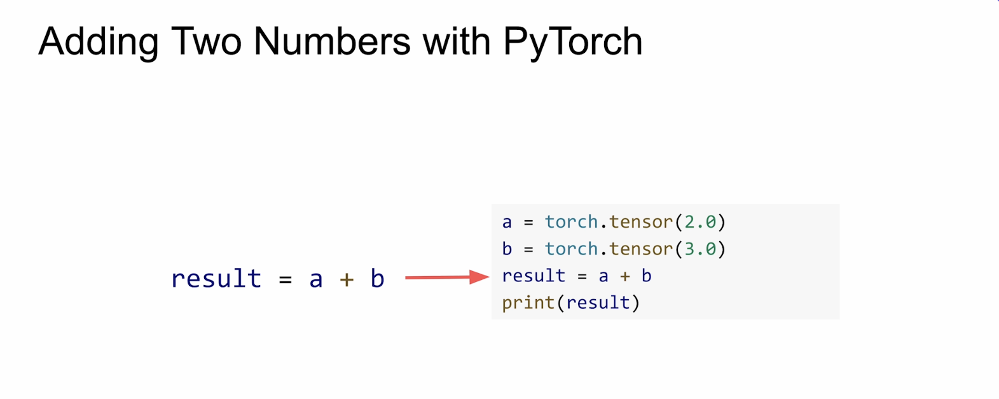

The key takeaway is its simplicity. When you print the result, you see the actual value. Today, deep learning can feel like writing regular Python, but it wasn't always like this.

-----

### **Traditional Programming vs. Machine Learning**

Machine learning works very differently from traditional programming.


  * **Traditional Programming:** You write explicit rules to transform inputs into outputs. For a recommendation system, you'd write: `If the customer buys a camera, then recommend lenses.` However, this approach requires thousands of rules to handle every exception (e.g., What if it was a gift? What if they already own lenses?).

  * **Machine Learning:** You give the system examples of inputs and outputs, and it **learns the rules for you**. Deep learning takes this further with neural networks. Give them customer histories, and they'll learn what people tend to buy. Show them cat photos, and they'll learn what makes a cat a cat.


-----

### **The Challenge of Early Deep Learning Frameworks**

Here's the catch: to learn from millions of examples, neural networks have to do a massive amount of math. Early frameworks were so focused on handling this computational load that even simple tasks became complex.

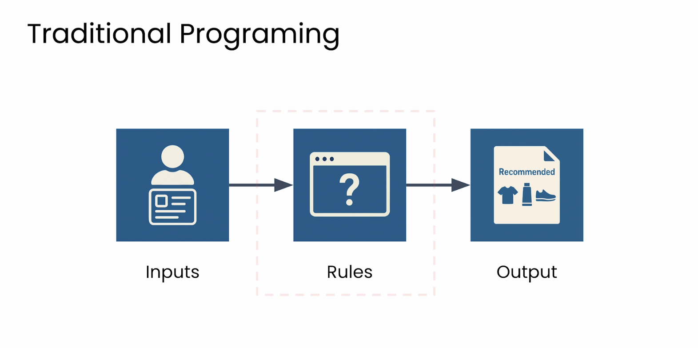

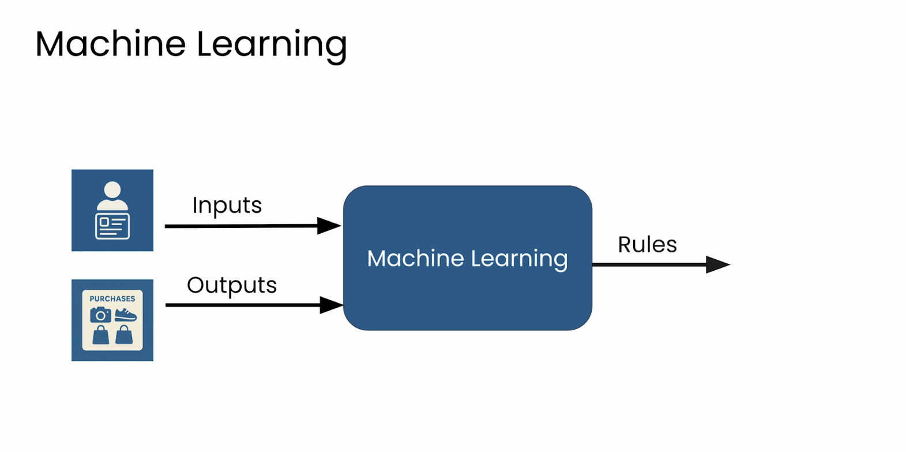

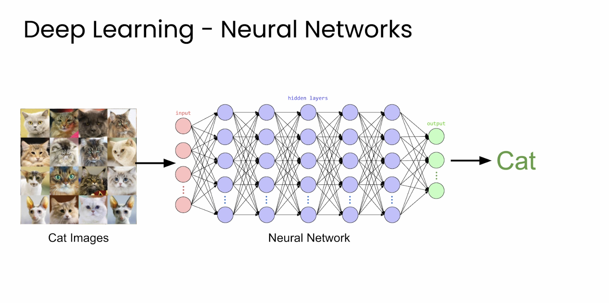


#### **The Static Computational Graph**

Early frameworks used a **static computational graph**, which is like a factory assembly line.


You had to define every step ahead of time, compile it, and then run data through it. This led to several major problems:


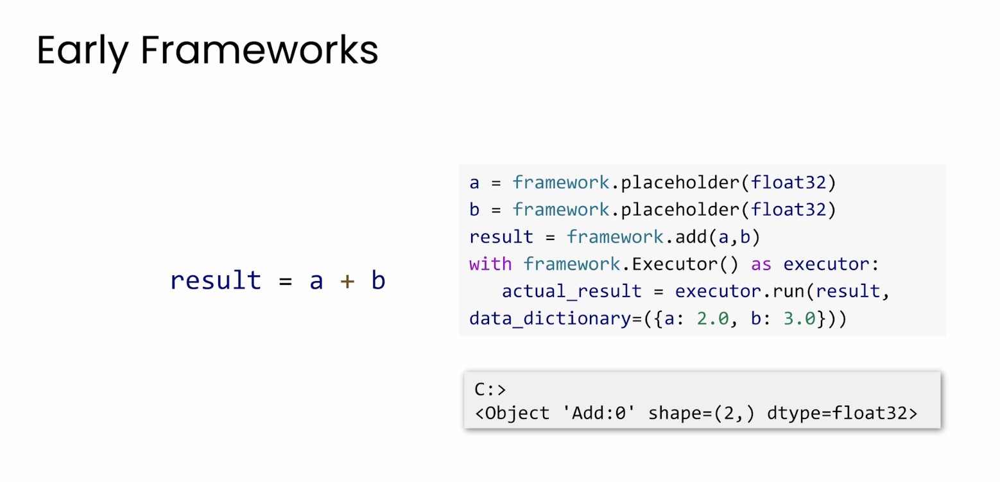


1.  **Inflexibility:** You couldn't experiment or insert a new operation without stopping, tearing down, and rebuilding the entire "assembly line" from scratch.


   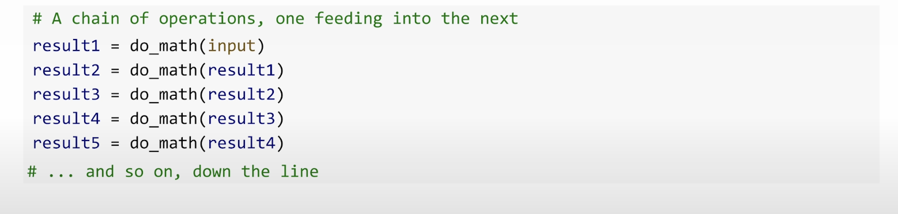
   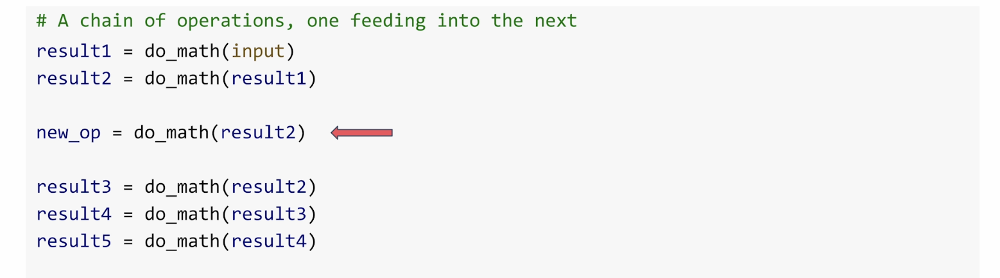

2.  **No Incremental Testing:** You had to build the entire system before you could run and test any part of it.
3.  **Unintuitive Control Flow:** You couldn't use normal Python `if` statements or `for` loops. You had to use special, complex operators.
4.  
   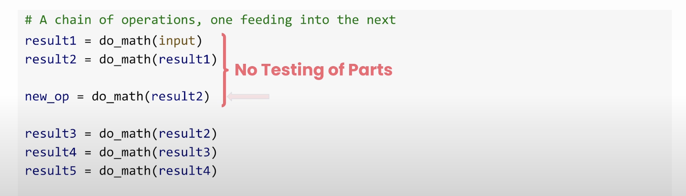
   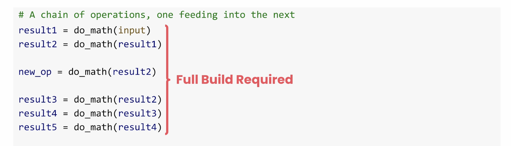

4.  **Fixed Input Sizes:** The system could only handle inputs of one fixed size, much like if a Python function only worked with lists of exactly three items.

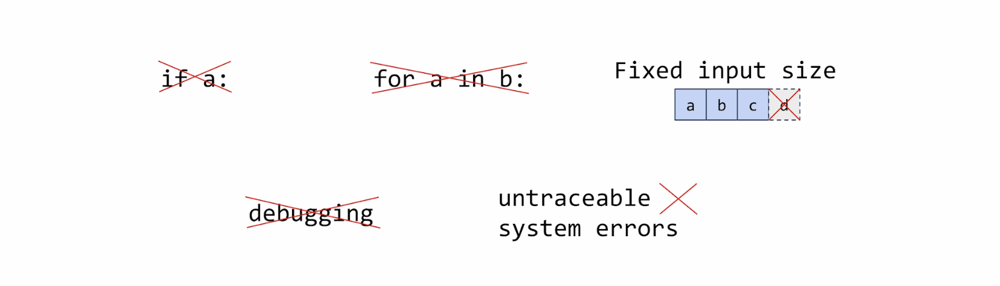
5.  **Difficult Debugging:** When something went wrong, error messages pointed to internal system code, not the line where you made the mistake.

Engineers spent more time fighting their tools than doing the actual work.


-----


### **The PyTorch Solution: Pythonic Deep Learning**


PyTorch emerged from this frustration with one core principle: **Deep learning should feel like normal Python.**

It introduced a new, dynamic way to handle computation. You just write clean, Pythonic code, and PyTorch takes care of the rest.


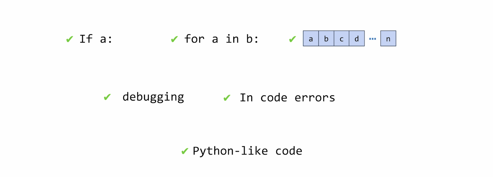


  * You can use your normal `for` loops and `if` statements.
  * You can change anything, anytime. It just works.
  * When something breaks, the error points directly to **your code**.
  * You can stop your program, inspect variables, and fix problems just like any other Python script.

### **More Than a Tool: A Thriving Community**

Today, PyTorch is backed by a massive community of researchers and developers. This ecosystem provides:

  * Shared, reusable code.
  * Solutions to common problems.
  * Constant improvements to the framework.

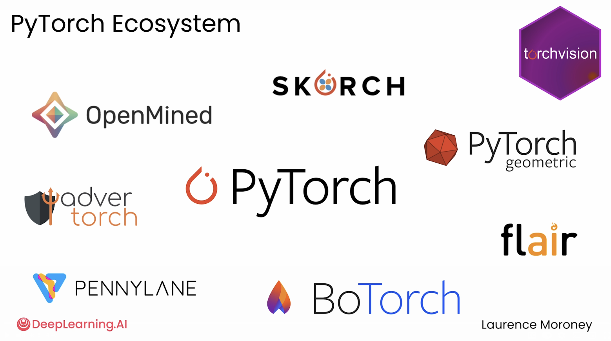

This combination of simplicity, powerful tools, and a thriving community is why PyTorch has become the go-to choice for everyone from students to researchers at the cutting-edge of AI.

Now, you’re ready to join them. Let's get started.