### **What Are You Actually Building?**

You've seen *why* PyTorch exists, but now it's time to understand *what* you're building.

Let's ground this with a problem: You work for a 30-minute bike delivery company. Last month, you were late three times. One more, and your job is at risk.

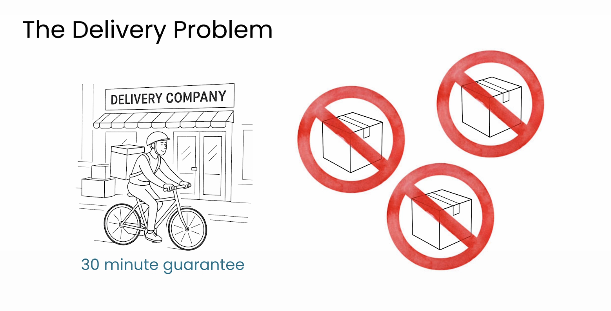

A new order comes in: **7 miles away.**

Can you get there in under 30 minutes? Neural networks are great at solving problems like this, if they have the data.

---

### **The Simplest Network: One Neuron**

You're going to tackle this using the simplest neural network possible: **just one neuron**. Since complex networks are just many neurons doing the same basic operation, understanding one gives you the foundation for all of them.

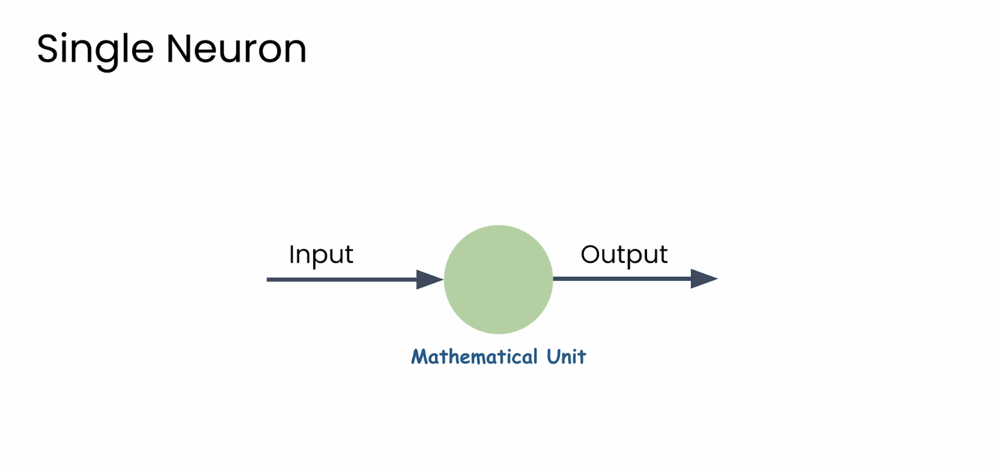
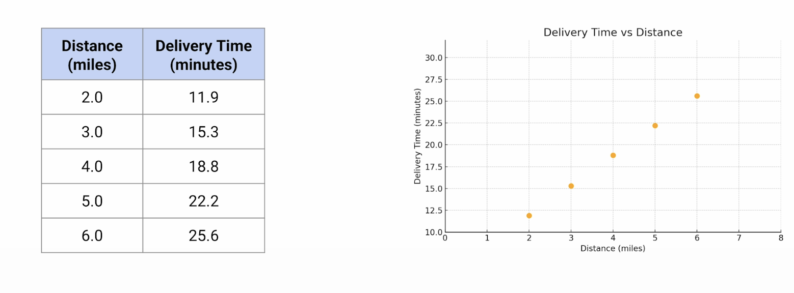
In this context, neurons are just mathematical units—tools with adjustable parameters that shift to match patterns in your data.

Here's some historical delivery data:
* 5 miles took 22.2 minutes.
* 6 miles took 25.6 minutes.

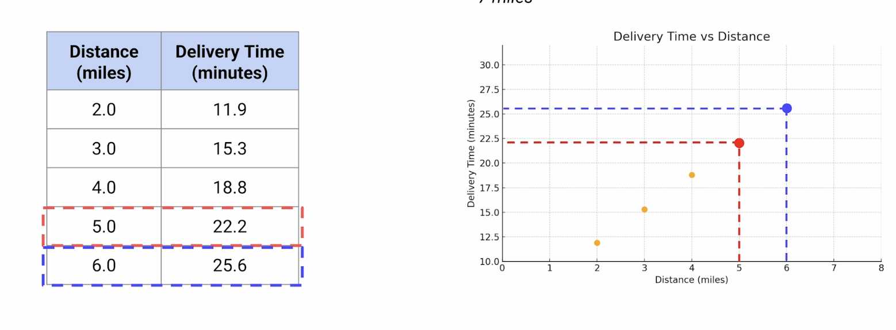

Let's plot the data. Notice how the points follow a straight line. A good predictive model for this data would be a line.

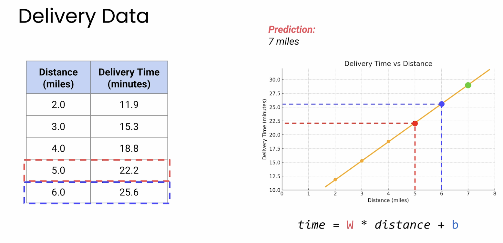
---

### **A Neuron is Just a Linear Equation**

Here's the key insight: **A single neuron is just a linear equation** with two parameters: the **weight (W)** and the **bias (B)**.

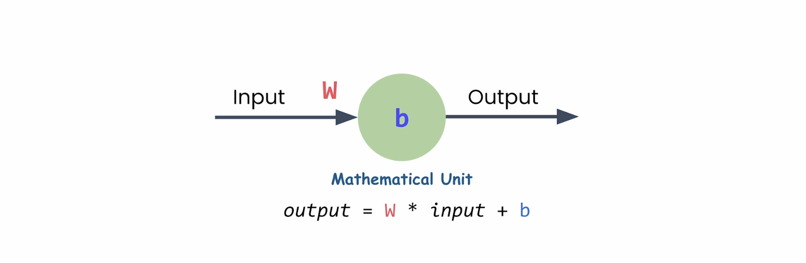

The math will look like this:
`prediction = W * input + B`

That's just the equation for a straight line ($y = mx + b$).

All the neuron needs to do is find the right values for `W` and `B` to create the best-fitting line through your data. That search for the best values is the **learning** in machine learning.

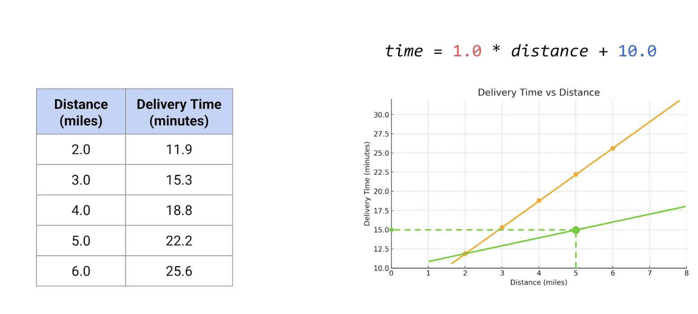
---

### **How Does a Neuron Learn?**

How does it figure out which line is best? It's a process of guessing, checking, and adjusting.

**Guess 1:**
* Weight (W) = 1
* Bias (B) = 10
* Prediction for 5 miles: `(1 * 5) + 10 = 15 minutes`
* Actual time: 22.2 minutes
* **Error:** Off by more than 7 minutes. The slope is too shallow.

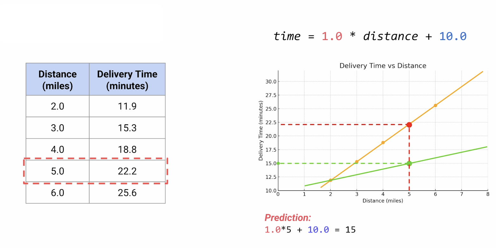

**Guess 2:**
* Weight (W) = 3.4
* Bias (B) = 5
* Prediction for 5 miles: `(3.4 * 5) + 5 = 22 minutes`
* Actual time: 22.2 minutes
* **Error:** Only 0.2 minutes off. A much better fit!

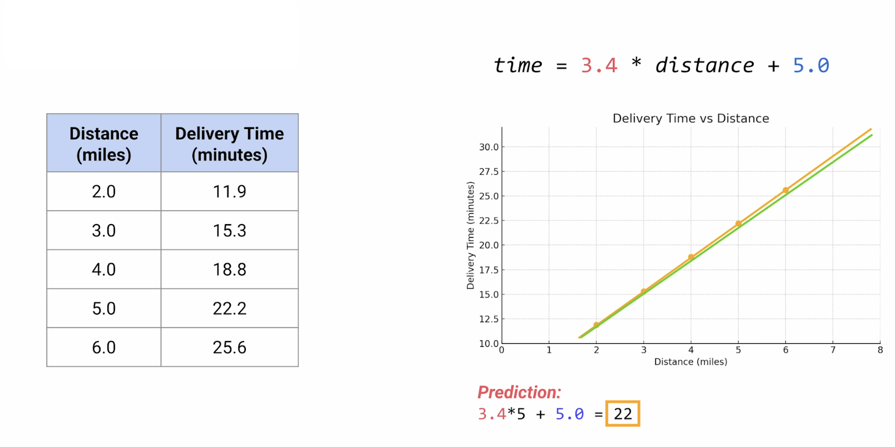

A neural network does this same process, but using math:

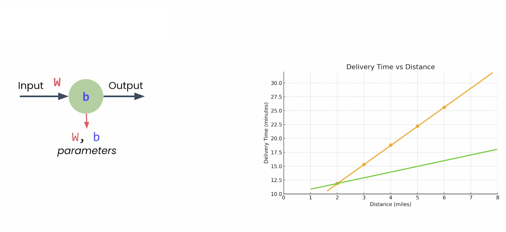

1.  **Initialize:** It starts with random values for the weight and bias (called **parameters** in PyTorch).
2.  **Calculate Error:** It looks at how far off each prediction is from the actual data.
3.  **Adjust:** It uses calculus to figure out which direction to adjust `W` and `B` to reduce the total error. (Essentially asking, "If I increase the weight a little, does the error go up or down?").
4.  **Repeat:** It takes a small step in the right direction, measures the error again, adjusts, and repeats this hundreds or thousands of times until it finds the best possible values.

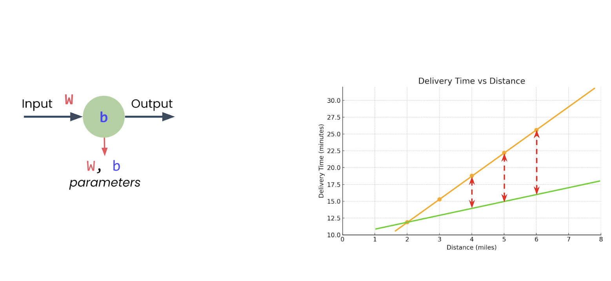

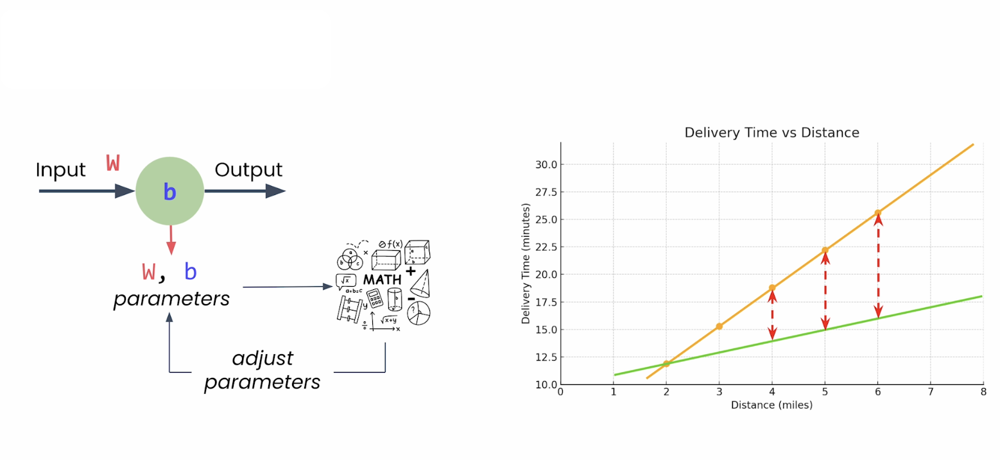

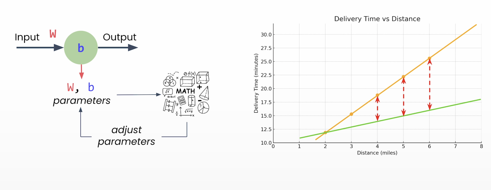

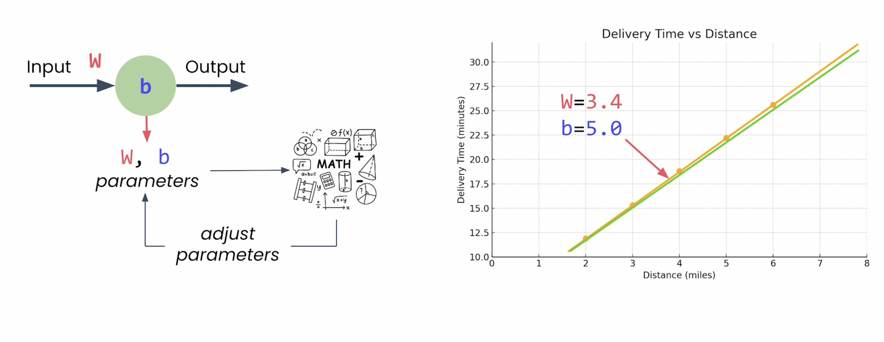
---

### **From One Neuron to a Network**

What happens when you connect thousands of these neurons together?

#### **Handling Multiple Inputs**
Our first neuron had one input (distance). What if you wanted to consider distance, time of day, and weather?

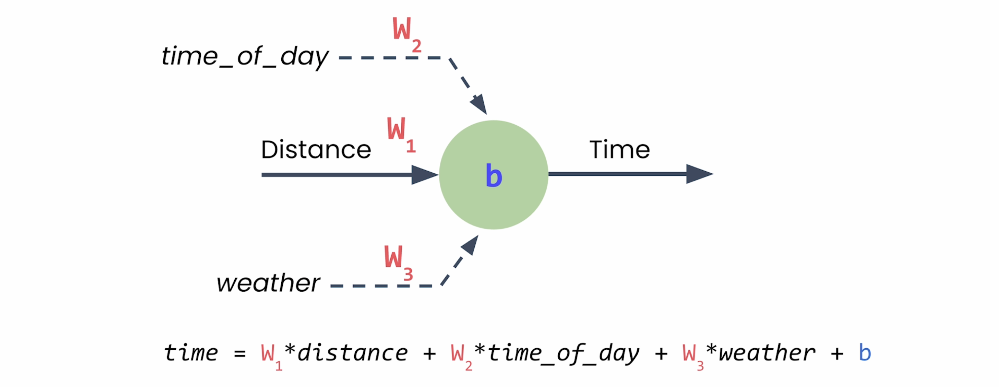

A neuron with three inputs just extends the same pattern. It's still a linear equation, just with more terms:

`prediction = (W1 * distance) + (W2 * time_of_day) + (W3 * weather) + B`

Each input gets its own unique weight, and they all add up with a single bias value.

#### **Stacking Layers**

A **layer** is simply a group of neurons that all take the same inputs. When you connect one layer's outputs to the next layer's inputs, you've built a network.

* **Input Layer:** Takes in your raw data (distance, time, weather).
* **Hidden Layers:** The layers in between. You never directly set or see their values.
* **Output Layer:** Gives your final prediction (delivery time).

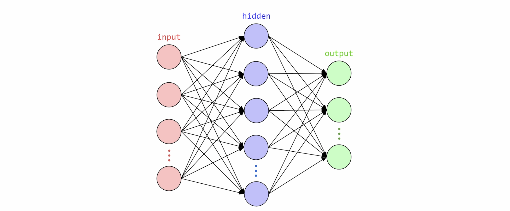

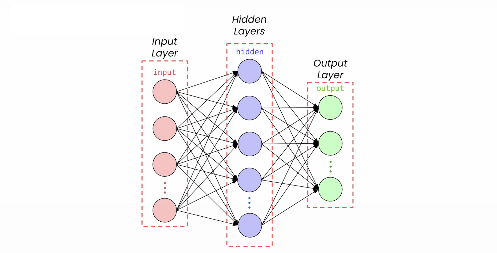

---

### **Next Steps**

In the next section, you'll see the complete pipeline, from raw data to a deployed model. After that, you'll build your first neural network and train it on this exact delivery problem using just a few lines of PyTorch code. 