# **The 5 Stages of a PyTorch Project**

In the upcoming lab, you'll train a model on delivery data and use it to make predictions on new, unseen customer locations. This process is called **inference**.

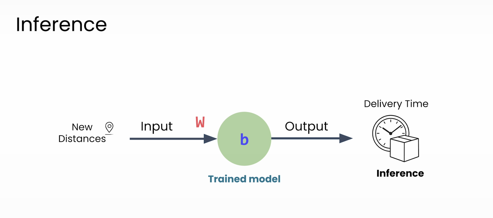

Before writing code, it's essential to have a systematic approach. The framework used in this course follows five core stages (with a sixth, Deployment, saved for later).

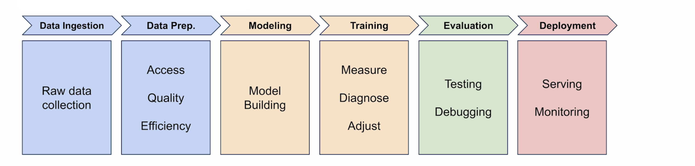
---

## 1. Data Ingestion

It all starts with data. Before training, you must gather your raw information and organize it so PyTorch can work with it.

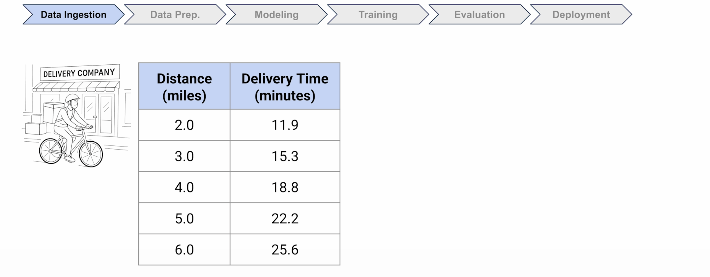

* **Example:** Using the company's delivery records.
* **Real-world Challenges:** Data is almost always "messy." You will encounter:
    * Inconsistent formats (e.g., "22 minutes" vs. `22.0`).
    * Missing values.
    * Impossible data (e.g., negative delivery times or 200 mph bike speeds).

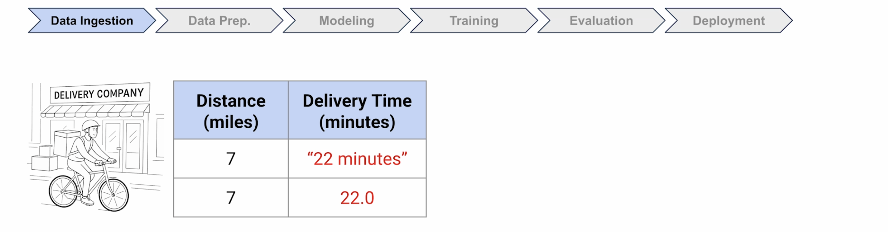
---
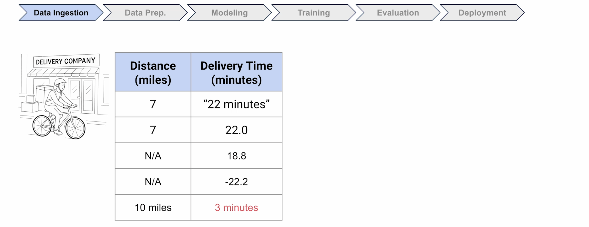

## 2. Data Preparation

This stage involves cleaning, transforming, and organizing the raw data into a format your model can learn from. This is often the most time-consuming part of a real project.

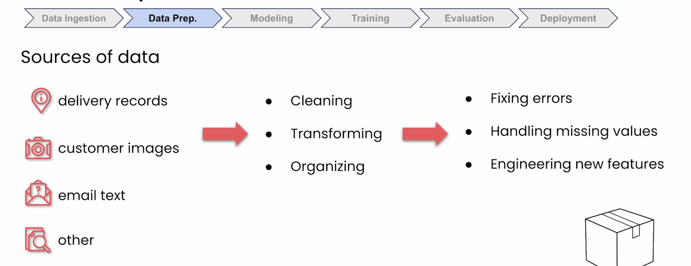

* **Key Tasks:**
    * **Cleaning:** Fixing errors, removing duplicate entries, or discarding impossible data.
    * **Handling Missing Values:** Deciding how to fill in gaps (e.g., when timestamps weren't recorded).
    * **Feature Engineering:** Creating new, useful data from existing data. For example, converting an address like "123 Oak Street" into a usable distance like "8.2 miles."

> **Key takeaway:** Most models don't fail because the math was wrong; they fail because the data was messy.

---

## 3. Model Building

Now that your data is clean, it's time to design the model that will learn from it. This involves choosing the right **architecture** (structure) for your problem.

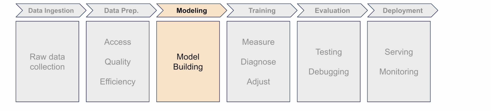

* **Architecture Questions:**
    * How many neurons will you use?
    * How are they connected?
    * What types of layers does the model need?

* **Example:** For the delivery predictor, the architecture is simple: **one neuron** to learn the relationship between distance and time. In PyTorch, this takes just a single line of code.

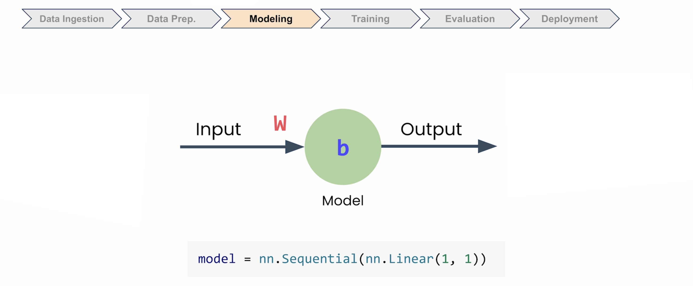

---

## 4. Training

This is where your model starts learning. You feed it examples from your prepared data (e.g., "8.2 miles took 22 minutes"), and the model gradually figures out the underlying pattern.

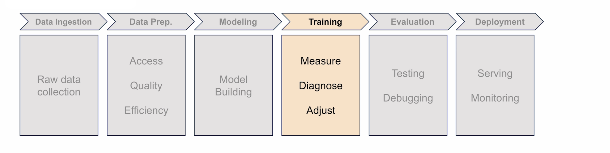

* **Process:** You'll run a **training loop** where PyTorch does the heavy lifting.
* **Key Settings:** You will need to configure:
    * How to measure prediction errors.
    * How to guide the model to improve.
    * How fast the model learns.

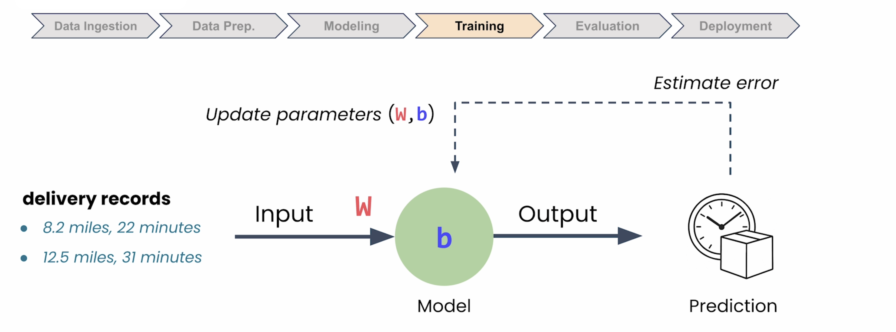

---

Training loop should have a feedback mechanism to help model to improve.

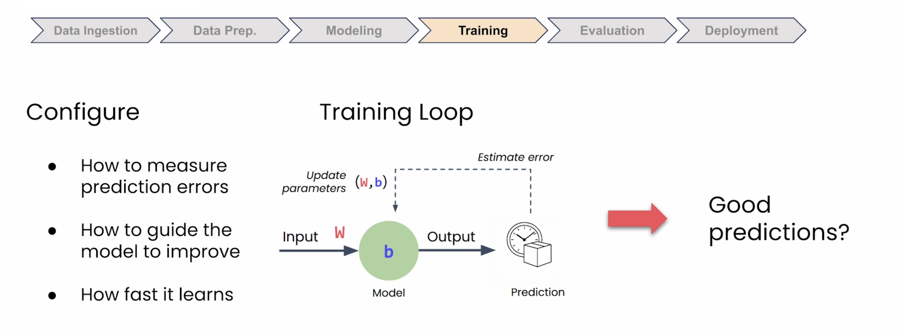

## 5. Evaluation and Debugging

Once training is finished, you must test your model. The real test is: can it make good predictions on new data it has never seen before?

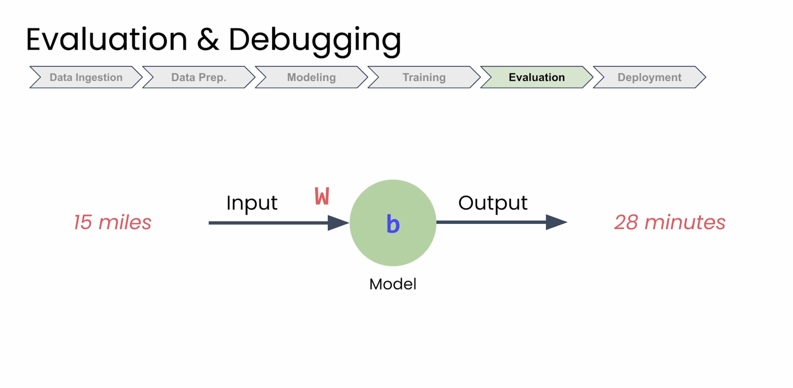

* **Method:** You use a **test set**—a portion of your data that you held back and did *not* use during training.
* **Goal:** To find out how often your model is close and how often it's way off. 
  
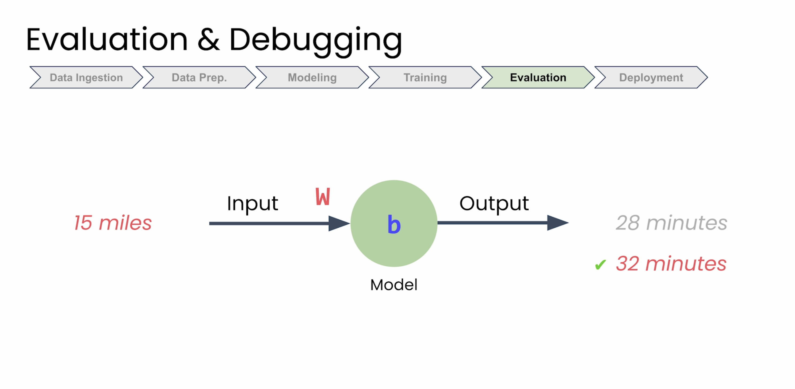

---

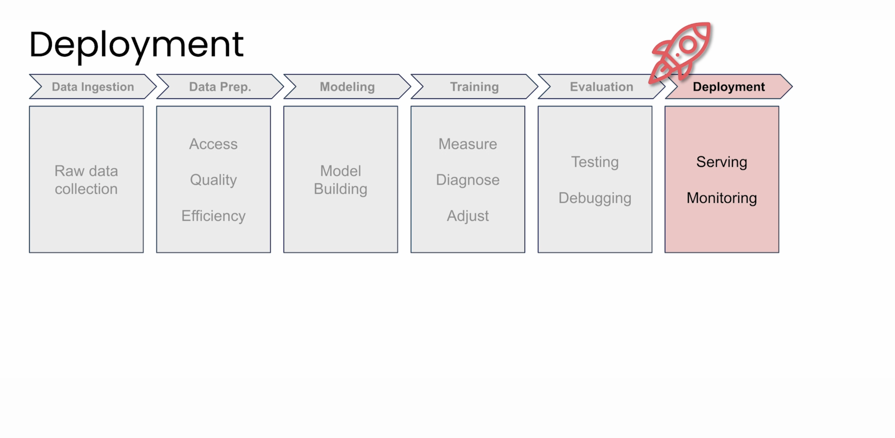

* This helps you decide if the model works well enough to be trusted.

---

## Next Steps

In the next section, you'll see how this 5-stage pipeline is implemented in PyTorch code. Then, in the lab, you'll run it yourself to solve the delivery problem.