# Mapping the ML Pipeline to PyTorch Code

Let's see how the concepts of a machine learning pipeline and neural network training map to actual PyTorch code.

-----

### 1\. Imports

First, we import the necessary PyTorch modules:

```python
import torch
import torch.nn as nn
import torch.optim as optim
```

  * `torch`: The core PyTorch library.
  * `torch.nn`: Components for building neural networks (like layers, e.g., `nn.Linear`).
  * `torch.optim`: Tools for training (optimization) (e.g., `optim.SGD`).


-----

### 2\. Data Ingestion & Preparation (Tensors)

In a real project, this is a separate, complex step. For this lab, the data is provided clean and ready. We create **tensors**—containers optimized for the math neural networks need.


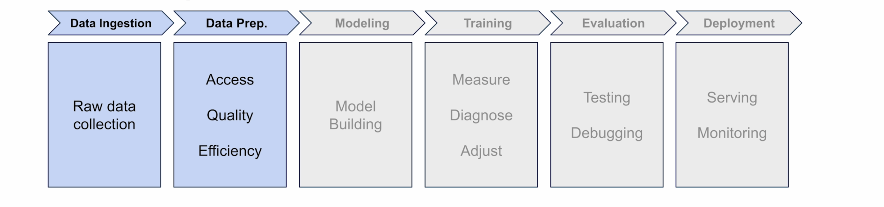

Think of them as containers that organize data for the model.

```python
# Example Data
inputs = torch.tensor([[5.0], [6.0], [8.0], [10.0]], dtype=torch.float32)
times = torch.tensor([[22.2], [25.6], [31.0], [38.5]], dtype=torch.float32)
```

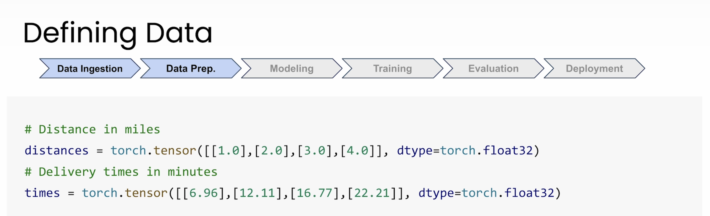


**Understanding the Brackets (Batches & Samples):**

  * **Outer Brackets `[...]`**: This represents the entire collection of data, known as a **batch**.

    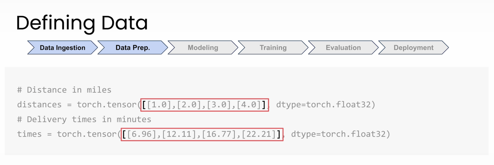

  * **Inner Brackets `[5.0]`**: This is one **sample** (one data point) in the batch.

     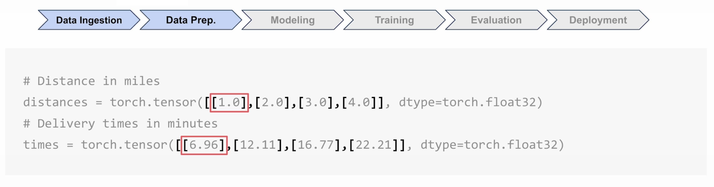

  * **Multiple Features**: If we had multiple inputs (distance, time of day, weather), a sample might look like `[8.0, 14.0, 1.0]`. The brackets tell PyTorch where one sample ends and the next begins.

     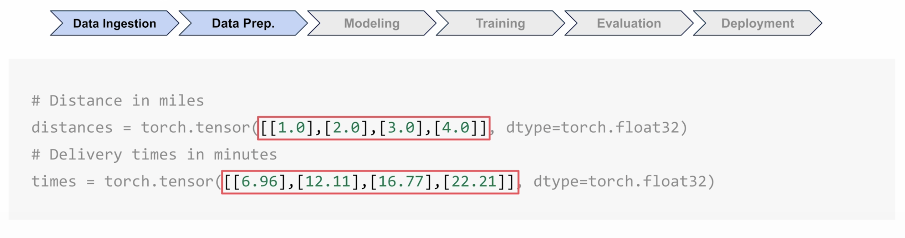

     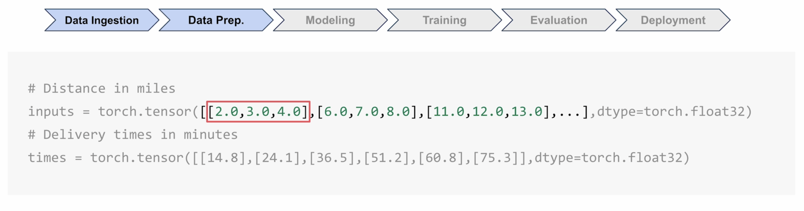

  * **`dtype=torch.float32`**: This tells PyTorch to store the numbers as 32-bit floating-point numbers, which is perfect for decimal values.

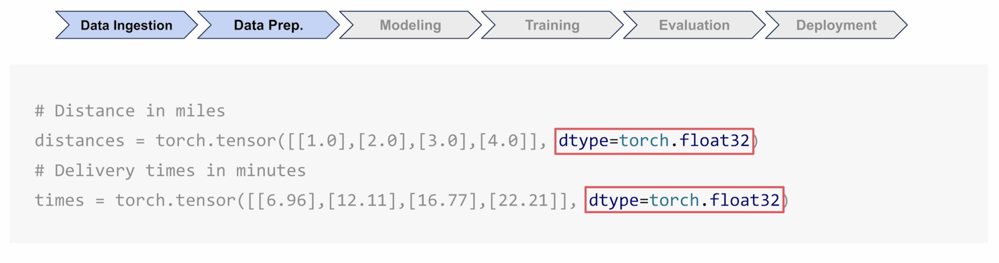


-----

### 3\. Model Building (The Neuron)

We'll use `nn.Sequential` as a container to hold our layers in order. Here, we're only using one layer.

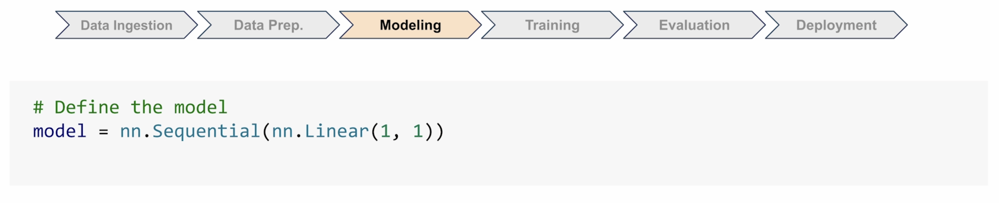


```python
model = nn.Sequential(
    nn.Linear(1, 1)
)
```

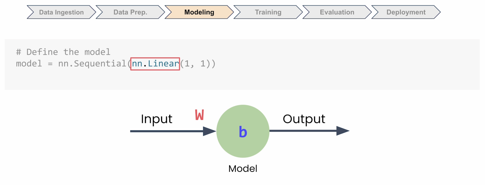


  * `nn.Sequential`: A container that passes data through layers sequentially.
  * `nn.Linear(1, 1)`: This is our single neuron.
      * The first `1`: It takes **one input feature** (distance).
      * The second `1`: It produces **one output value** (predicted time).


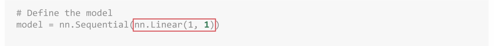

This layer will learn the best **weight** and **bias** to map distances to times, just like finding the best-fitting line.


-----

### 4\. Training Setup (Loss & Optimizer)

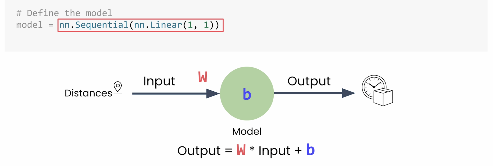


Our model needs two tools to learn:

**1. Loss Function (`nn.MSELoss`)**

```python
loss_function = nn.MSELoss()
```

  * This is the **Mean Squared Error** loss.
  * It measures *how wrong* the model's predictions are by comparing the prediction to the actual time. A bigger error (predicting 45 mins when it was 60) is penalized more heavily.

**2. Optimizer (`optim.SGD`)**

```python
optimizer = optim.SGD(model.parameters(), lr=0.01)
```

  * This is the **Stochastic Gradient Descent** algorithm.
  * It's the tool that figures out *which direction* to adjust the model's weight and bias to reduce the error (loss).
  * `model.parameters()`: Tells the optimizer which values (the neuron's weight and bias) it's allowed to adjust.
  * `lr`: The **Learning Rate**. This controls *how large* the adjustments are.

-----

### 5\. The Training Loop (The "Learning")

This is where the actual learning happens. We'll loop through our data 500 times. Each full pass is called an **epoch**.

```python
# Train for 500 epochs
for epoch in range(500):
    
    # 1. Clear previous adjustments
    optimizer.zero_grad()
    
    # 2. Make a prediction (Forward pass)
    outputs = model(inputs)
    
    # 3. Calculate the error (loss)
    loss = loss_function(outputs, times)
    
    # 4. Figure out how to adjust (Backpropagation)
    loss.backward()
    
    # 5. Make the adjustment
    optimizer.step()
```

**What each line is doing:**

1.  `optimizer.zero_grad()`: Clears adjustments from the *previous* round. Without this, PyTorch would incorrectly add up adjustments from all rounds.
2.  `outputs = model(inputs)`: Feeds the `inputs` (distances) to the model to get its `outputs` (predicted times).
3.  `loss = loss_function(...)`: Compares the model's `outputs` to the real `times` to see how wrong they are.
4.  `loss.backward()`: The "magic" step (called **backpropagation**). PyTorch uses calculus to figure out exactly how much the weight and bias contributed to the error and how to change them to *reduce* the error.
5.  `optimizer.step()`: The optimizer uses the information from `loss.backward()` to make the actual adjustments to the model's weight and bias.

-----

### 6\. Inference (Making a Prediction)

Now that the model is trained, we can use it to make a new prediction.

```python
# Tell PyTorch we are not training, just inferring
with torch.no_grad():
    # Predict the time for a 7-mile delivery
    prediction = model(torch.tensor([7.0])) 
```

  * `torch.no_grad()`: This tells PyTorch we're just doing inference, not training. This saves memory and computation by skipping all the "under the hood" work needed for training.

