### The Problem: When Straight Lines Fail

In the previous lab, you saw that a simple **linear model** works for bike deliveries, where the relationship between distance and time is a straight line.

However, when you added car data, the model failed. Why? Because the real world isn't always linear.

  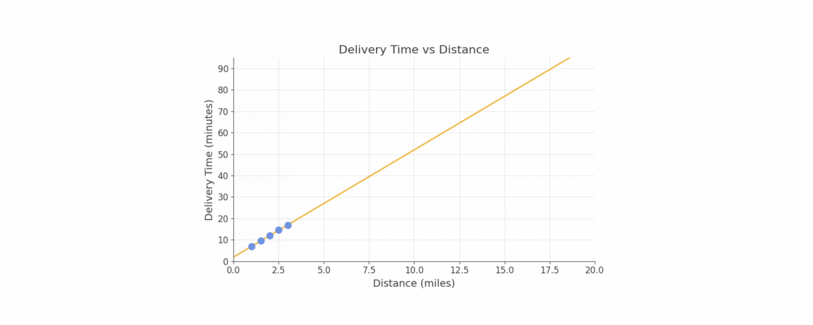

  * **Short distances (city):** Dense traffic makes these miles slow.
  * **Long distances (highway):** Cars move much faster.

The relationship isn't a line; it's a **curve**.

  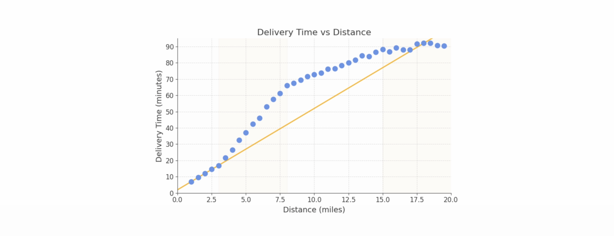

### The Failed Solution: Stacking More Linear Neurons

You might think, "If one neuron isn't enough, let's add more\!" You could build a model like this:

  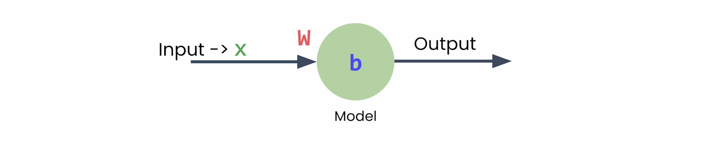

1.  **Input Layer:** 1 feature (distance)
2.  **Hidden Layer:** 2 neurons
3.  **Output Layer:** 1 neuron (to combine the hidden layer's outputs)

  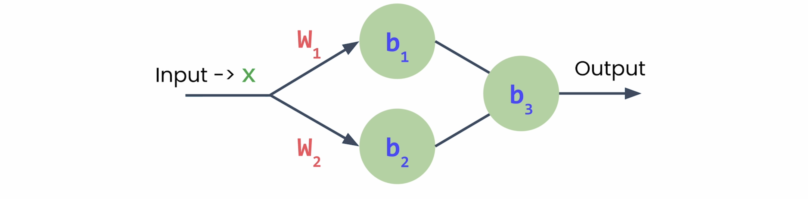

  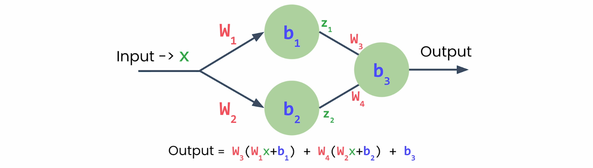

  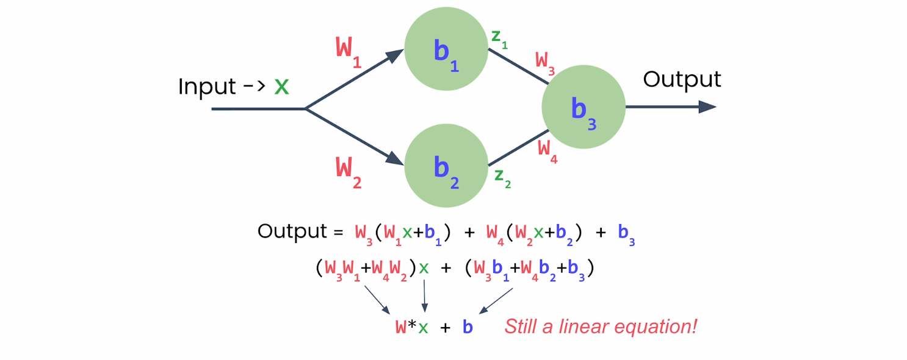

**This will not work.**

A linear combination of linear functions is *still* just a linear function. No matter how many linear layers or neurons you stack, you will always end up with a straight line.

### The Real Solution: Non-Linear Activation Functions

To learn curves, your model needs a new ingredient: a **non-linear activation function**.


This is a simple function that transforms the output of a neuron. The flow for a single neuron changes from:

  * **Linear:** `output = (W * x) + b`
  * **Non-Linear:** `z = (W * x) + b` $\rightarrow$ `output = activation_function(z)`

This small change is what allows a model to learn complex, non-linear patterns.

  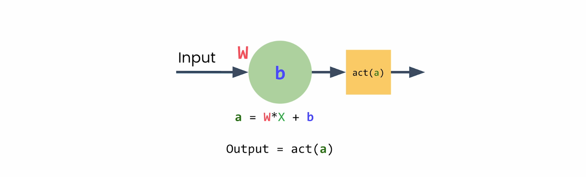

-----

### Meet ReLU: The Most Important Activation Function

The most common and powerful activation function is **ReLU (Rectified Linear Unit)**. Its rule is incredibly simple:

>   * If the input is negative, the output is **zero**.
>   * If the input is positive, the output is the **input (unchanged)**.

  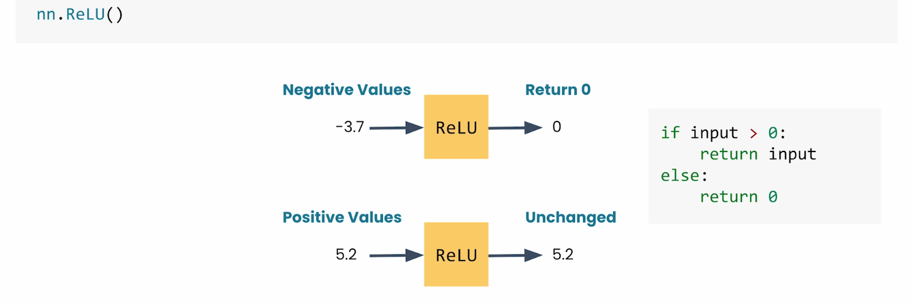

### How ReLU Creates a "Bend"

Let's see what happens when we apply ReLU to our single neuron:

1.  The neuron calculates its linear output: `z = (W * distance) + b`
2.  ReLU is applied to `z`.

<!-- end list -->

  * If `(W * distance) + b` is negative, the output is `0` (a flat line).
  * If `(W * distance) + b` is positive, the output is `(W * distance) + b` (a sloped line).

The result is no longer a single straight line\! You now have a **bend** or a "corner" where the model's behavior changes.

By learning the `W` (weight) and `B` (bias) values, the neuron learns *where to place this bend*. The bend occurs where `(W * x) + b = 0`.

  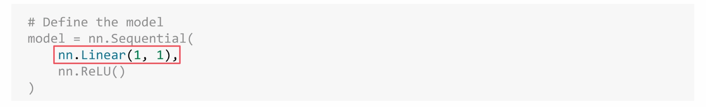

 

-----

### From One Bend to a Complex Curve

Your delivery data doesn't just have one bend; it has a complex curve. So, if one neuron with ReLU gives you *one bend*, what do multiple neurons give you?

  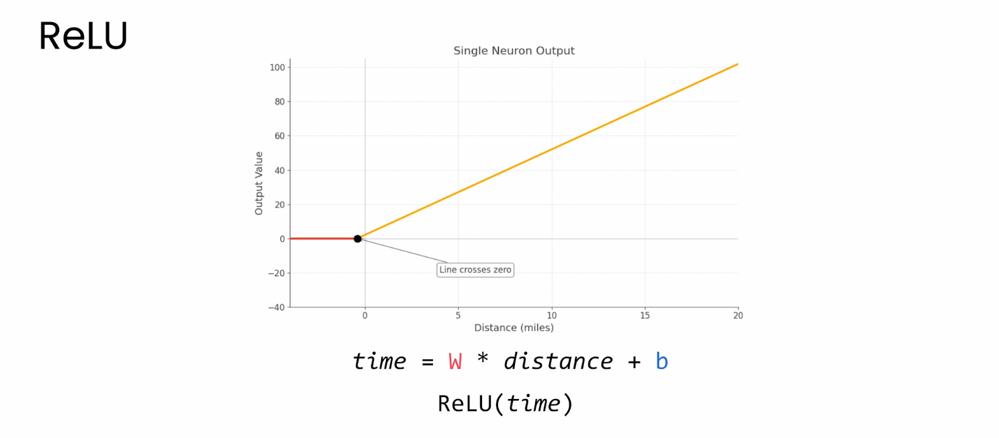

  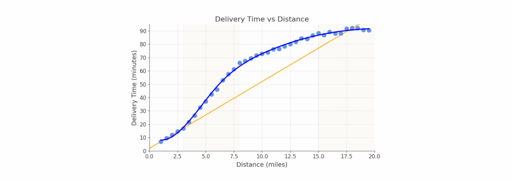

**Multiple bends\!**

You can build a hidden layer with several neurons (e.g., three). Each neuron:

  * Receives the same `distance` input.
  * Has its *own* unique `W` and `B`.
  * Learns to place its "bend" at a different location.

 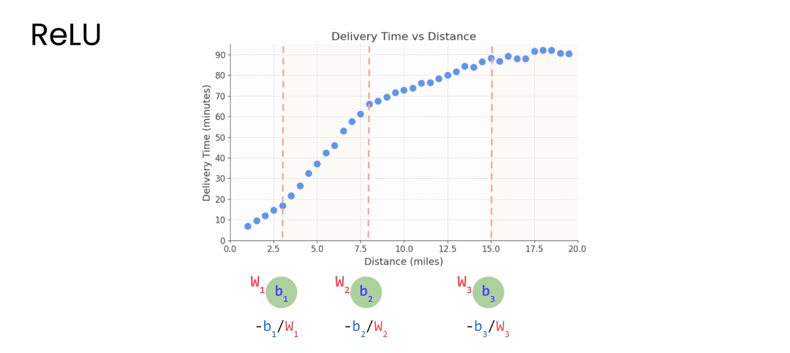

For example:

  * **Neuron 1** activates at 3 miles (where city traffic starts).
  * **Neuron 2** activates at 8 miles (where the highway begins).
  * **Neuron 3** activates at 15 miles (full highway speed).

When the output layer adds these three "bent lines" together, their combined shape can approximate your complex delivery curve.

 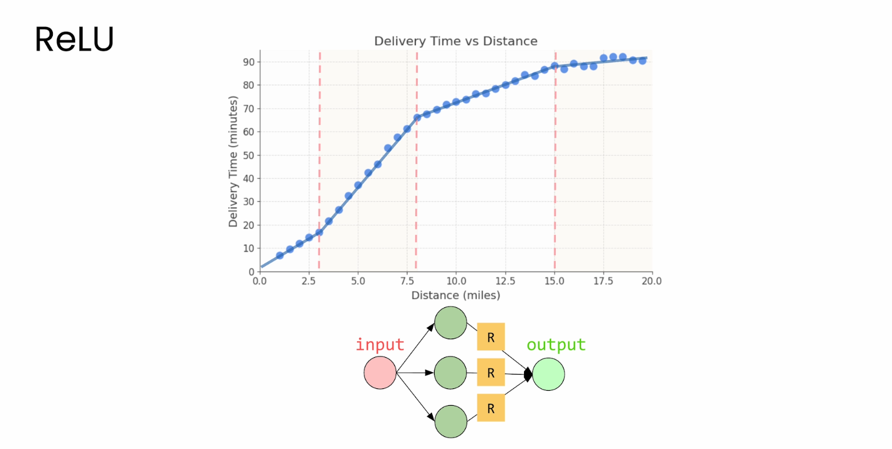

### The PyTorch Code

This entire model is simple to build in PyTorch:

```python
model = nn.Sequential(
    # 1. Hidden Layer
    nn.Linear(in_features=1, out_features=3),
    nn.ReLU(),
    
    # 2. Output Layer
    nn.Linear(in_features=3, out_features=1)
)
```

1.  `nn.Linear(1, 3)`: The hidden layer. It takes **1** input (distance) and has **3** neurons.
    

2.  `nn.ReLU()`: Applies the ReLU function to the outputs of all three neurons.

    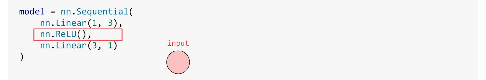

    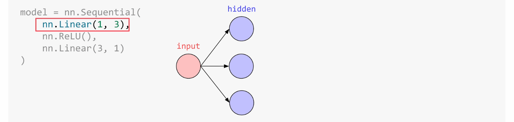

    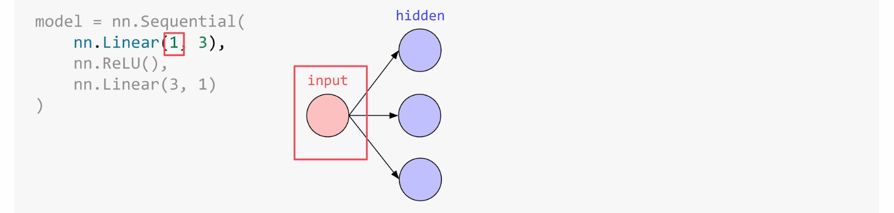

    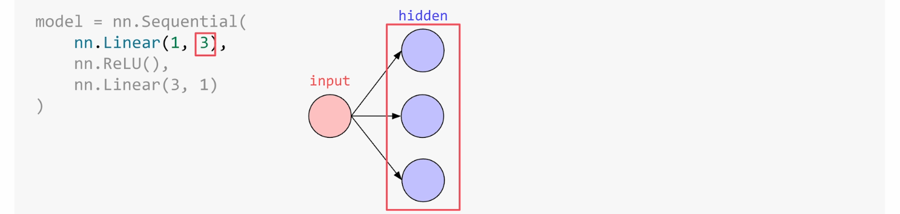

    

3.  `nn.Linear(3, 1)`: The output layer. It takes the **3** transformed values from the ReLU layer and combines them into **1** final prediction (delivery time).

    
     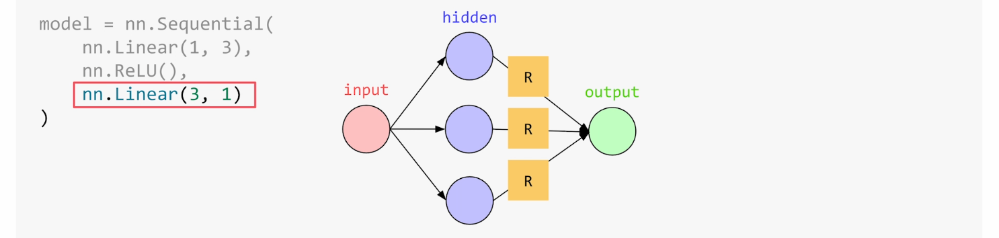

If you want an even smoother, more accurate curve, you just increase the number of neurons (e.g., `nn.Linear(1, 10)`).


### Other Activation Functions

While ReLU is the workhorse of modern deep learning, others exist:

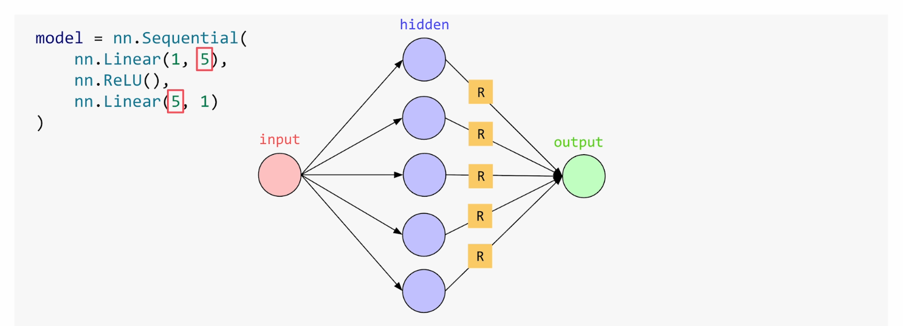

  * **Sigmoid:** Squashes values into a range between 0 and 1. Great for probabilities.
  * **Tanh (Hyperbolic Tangent):** Squashes values into a range between -1 and 1.

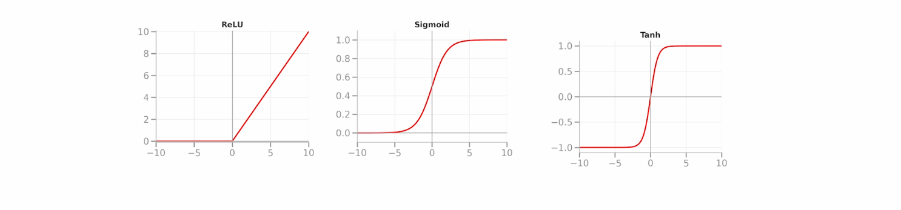

For most problems, however, **ReLU is all you need.** 

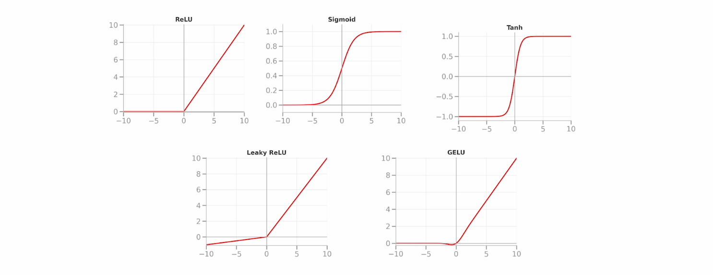

Now you're ready to go back to the lab and conquer that curved data which we will cover in the next section.

