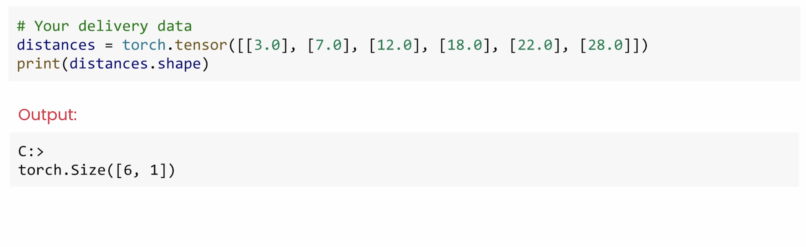
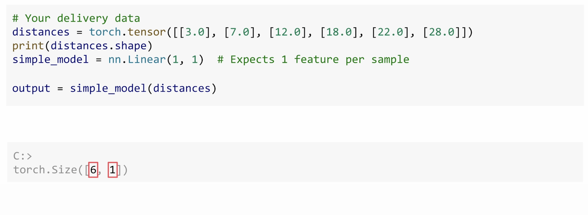
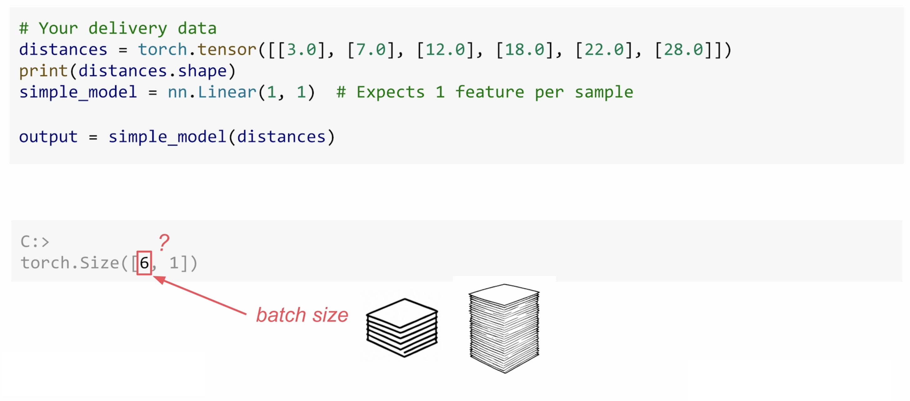
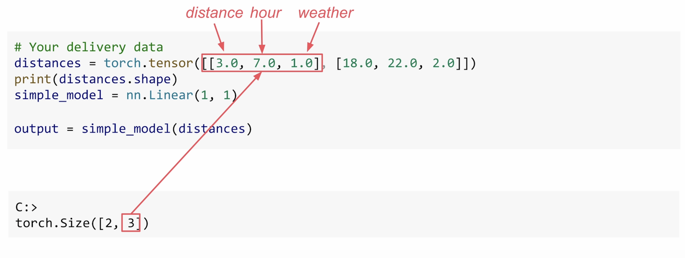
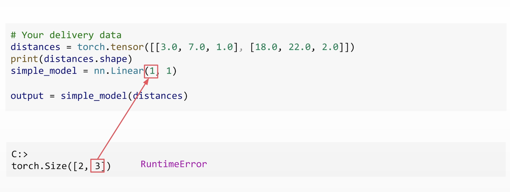
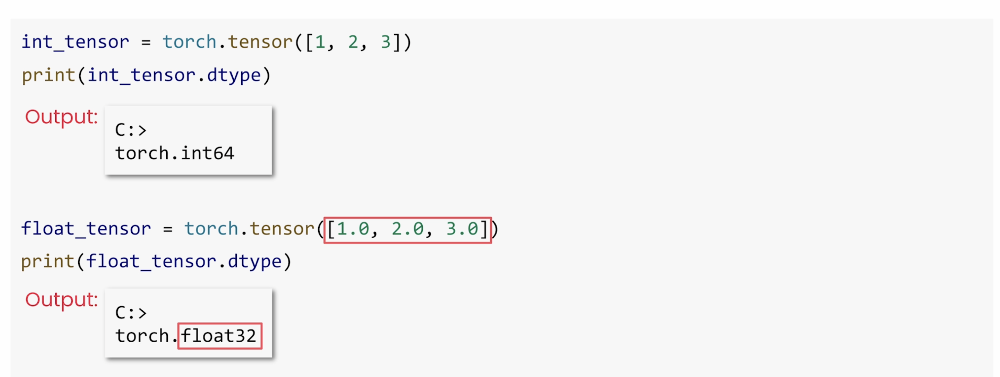
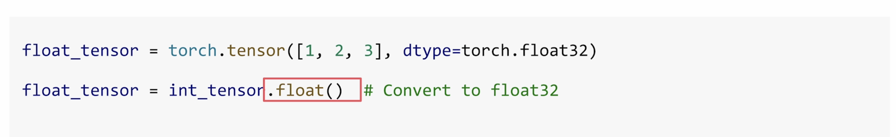
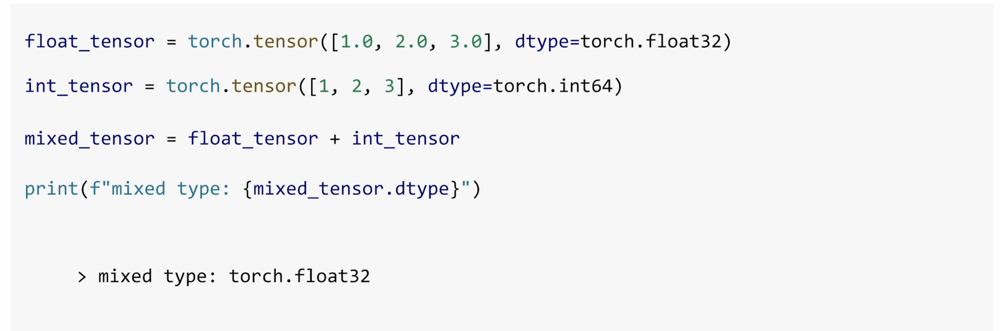
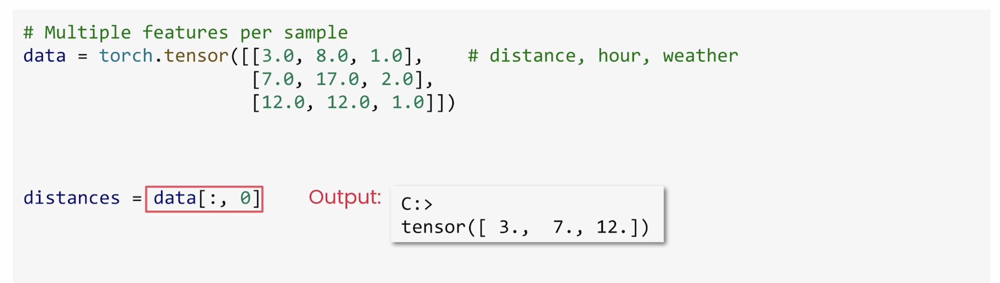

Here is the transcript formatted in Markdown.

---

# 🧠 Mastering PyTorch Tensors

In the last lab, you trained a model to predict delivery times. And along the way, you've been using **tensors**, maybe without thinking too much about them. And that's fine... until it isn't. Many PyTorch errors come from tensor issues. So let's build up your tensor skills now before those errors might derail your projects.

In this section, you'll learn how to:
* Read and understand tensor shapes
* Handle data types in PyTorch
* Create tensors in different ways
* Reshape and slice them to fit your models
* ...and then pull out what you need.

So let's start with the most important tool in your tensor toolkit: **checking shapes**.

---

### 1. Understanding Tensor Shapes

When you print `distances.shape`, you'll get something like `torch.Size([6, 1])`. And that will tell you exactly how your data is organized.



* There are **six samples**. That's your batch size.
* And there's **one feature** per sample. That's the distance of each delivery.

Shape mismatches are one of the most common PyTorch errors, right alongside device and `dtype` issues. So let's take a look at a shape that *does* work. We'll be using the same single-neuron model that you trained earlier.



Now, pass in the `distances`, and it just works. Well, why? Because each sample has one feature, just as the model expects.



But what about that `6`? Why doesn't the batch size cause a problem?
Well, that's because the model expects the first dimension to be the **batch size**. And that's the number of samples it will take at once.

> Think of it a little bit like a stack of papers. The model reads each page the same way, whether there are six pages or 600 in the stack. The first dimension is *how many*, and the rest describe *what each sample looks like*.



So now try passing in multiple features, like distance, hour, and weather. It fails. The model was only built for one input feature.



So when you hit a shape mismatch, PyTorch will tell you what's wrong, but not how to fix it. Once you see both shapes, usually the fix will be obvious.


---

### 2. Handling Data Types (dtype)

Now you understand shapes, let's talk about data types.


When you create a tensor, PyTorch can use defaults:
* You wanna enter integers? You'll get `int64`.
* Include a decimal point? Then you'll get `float32`.





And if you want to be explicit, you can use the `dtype` argument. It guarantees `float32` even if you forget the decimal point. Alternatively, you can use `.float()` to convert any tensor to `float32`.

But what happens if you mix types? It used to be the case that PyTorch would throw an error when you try to mix `dtype`s. That's no longer true. Now PyTorch will automatically handle mixed types through **type promotion**. For an example, if you add an `int` tensor and a `float` tensor, PyTorch will automatically convert the `int` to `float` and then return a `float` result, just like regular Python.



There are other types too, like `float64` for extra precision or `int8` for memory savings. But for neural networks, **`float32` is the sweet spot**. It's fast, accurate, and standard on modern hardware.

---

### 3. Creating Tensors

Now that you understand types, let's look at a different way to create tensors.
* **From Python lists:** The simplest way.
    ```python
    my_distances = [[3.0], [7.0], [12.0], [18.0]]
    tensor_from_list = torch.tensor(my_distances)
    ```
* **From NumPy:** If you're coming from NumPy, PyTorch tensors behave almost exactly the same way. You can convert a NumPy array like this. 
    ```python
    import numpy as np
    numpy_array = np.array([1.0, 2.0, 3.0])
    tensor_from_numpy = torch.from_numpy(numpy_array)
    ```
*  **shares memory**. If you change one, then the other changes too.
* **Built-in patterns:** If you need quick test data, try these built-in patterns for `zeros`, `ones`, or `random`.

    ```python
    zeros = torch.zeros(3, 3) # 3x3 tensor of zeros
    ones = torch.ones(2, 4) # 2x4 tensor of ones
    random = torch.rand(5, 5) # 5x5 tensor with random values
    ```
---

### 4. Reshaping Tensors

Once you have tensors, you'll often need to reshape them to match what your model expects. Remember, PyTorch models expect input with a **batch dimension**, like `[6, 1]` that we saw earlier. That first number `6` tells the model how many samples it's getting.

One of the most common shape errors, of course, is forgetting that batch dimension.

Let's say you want to predict the delivery time for a single order, for example, 25 miles. This is a scalar. But your model expects a shape of `[batch_size, features]`, which at a minimum is `[1, 1]`.

You can use `unsqueeze()` to add dimensions. So now it's ready for the model. So always check the shape before you use `unsqueeze()`.


And if you're going the other way, try just using `squeeze()`. `squeeze()` removes all dimensions of size one, and it's great for cleaning up after batching.

> **Tip:** Always print `tensor.shape` when you're debugging. These tools are your first defense against shape errors.

---

### 5. Indexing and Slicing (Getting Values)

Now, sometimes you need specific values from your tensors, like checking predictions or grabbing a few samples. Indexing and slicing can be used for this, and they work just like Python lists.

```python
# Your predictions from the delivery model
predictions = torch.tensor([[14.9], [24.1], [35.6], [45.2]])
```

* This gives the first prediction: `predictions[0]`
  ```
  tensor([14.9])
  ```
* And this gives the first three: `predictions[0:3]`

  ```
  tensor([[14.9000],
        [24.1000],
        [35.6000]])
  ```

But even a single index value is **still a tensor**. So if you want the actual Python value, use `.item()` to convert it into a float.

```python
# Use .item() to get a Python number
value = predictions[0].item()
```

```
14.899999618530273
<class 'float'>
```
---
Would you like me to perform any calculations or identify a programming concept related to this floating-point number?
But be careful: **`.item()` only works on tensors with exactly one element**. Call it on a bigger tensor, and you'll get an error.

So far, we've looked at one feature per sample. With multiple features, you can index across both dimensions like so: `data[sample_index, feature_index]`.


---

### Summary and Next Steps

You've now seen shapes, types, reshaping, and indexing. It's a lot, but don't worry, you don't need to memorize everything. These patterns will become second nature with practice, and even the pros check the docs.

In the next video, you'll learn how PyTorch handles element-wise operations and **broadcasting**. These are powerful tools for building models and transforming data.

In the upcoming lab, you'll debug real tensor errors using the tools that you've just learned. I'll see you there.