# Computing with PyTorch Tensors

In the previous video, you learned how to create, reshape, and debug tensors. Now, let's look at how PyTorch actually computes with them.

## Element-wise Operations

Let's start with a computation from your single neuron model: `Weight times distance plus bias`.

```python
distances = [[3.0], [7.0], [12.0]]
weight = 2.3
bias = 8.0
weight * distances + bias
[[2.3*3.0 + 8.0], [2.3*7.0 + 8.0], [2.3*12.0 + 8.0]]
```

When you have multiple distances to process, PyTorch's tensor math works **element-wise**, meaning each element is operated on independently. Your computation applies the same weight to each distance, and then adds the same bias to each result.


The syntax looks just like regular Python math, but PyTorch runs these operations efficiently on all elements at once. This works for scalars (single values) as well as tensors that have the same shape.

**Scalars**
```python
2.3 *[[3.0],[7.0],[12.0]]=[[2.3 * 3.0],[2.3 * 7.0],[2.3 * 12.0]]
```
**Tensors with same shape**
```python
[[1.0],[2.0],[3.0]] *[[3.0],[7.0],[12.0]]=[[1.0 * 3.0],[2.0 * 7.0],[3.0 * 12.0]]
```


## The Challenge of Complex Data

But what if you have more complex data?

Imagine three deliveries where each has three features: distance, hour, and weather. Now you want to apply adjustment factors—perhaps 1.1x for distance, no change for time, and a 5x penalty for bad weather.

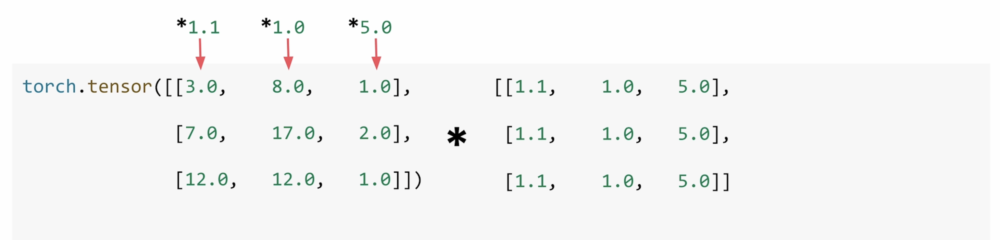

Creating a tensor with repeated rows of `1.1, 1.0, 5.0` works because the tensors have the same shape, but it is redundant data entry. Wouldn't it be nice if you could just specify those adjustment values once?

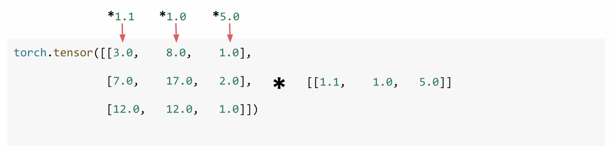

That's where **broadcasting** comes in.

## Understanding Broadcasting

You already know that tensors with the same shape work element by element. You also know that adding a scalar to a tensor updates every value in that tensor.

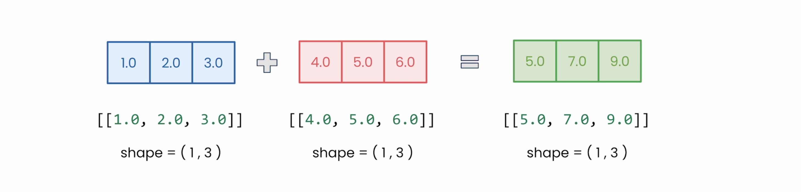

When you add a scalar to a tensor, PyTorch automatically expands that single value to match every element. That's how weight and bias could apply to all of your distances at once. This automatic expansion is **broadcasting** in action.

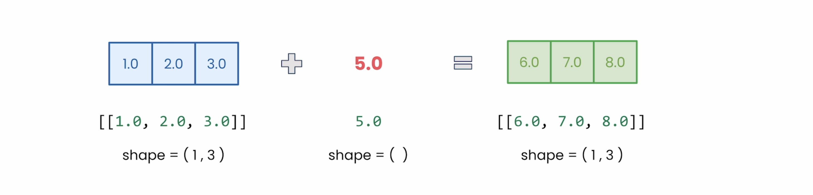

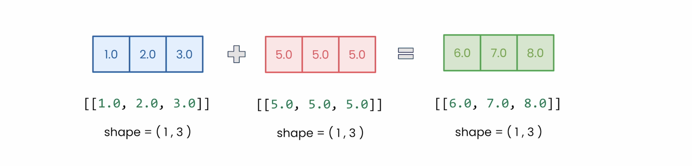

### Broadcasting Rules: Matching Dimensions

What if we have something like 5—a tensor with shape `[1, 1]`—and we try to work with our shape `[1, 3]` tensor?

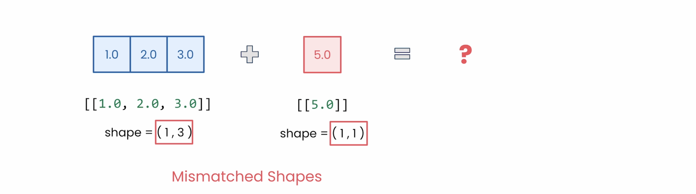

* Tensor A shape: `[1, 3]` (1 row, 3 values)
* Tensor B shape: `[1, 1]` (1 row, 1 value)

Normally, PyTorch requires exact dimension matches for operations; different shapes would cause an error. But here's the magic of broadcasting:


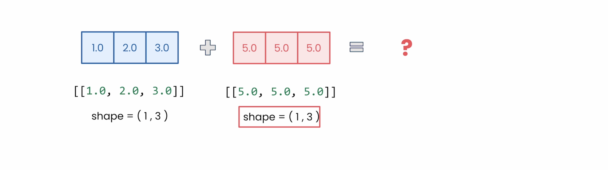

**Rule:** When one dimension is 1 and the other is larger, PyTorch will automatically expand the smaller dimension by repeating values.

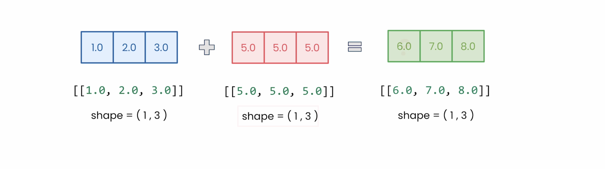

So, our size `[1, 1]` tensor becomes `[5, 5, 5]`, matching the `[1, 3]` shape, and they can now be added together.

### A Complex Broadcasting Example

Let's look at an example that shows broadcasting's real power. What happens when you combine a `[1, 3]` tensor with a `[3, 1]` tensor?

PyTorch looks at each dimension independently:

1.  **First dimension:** 1 versus 3. The 1 expands to 3.
2.  **Second dimension:** 3 versus 1. The 1 expands to 3.

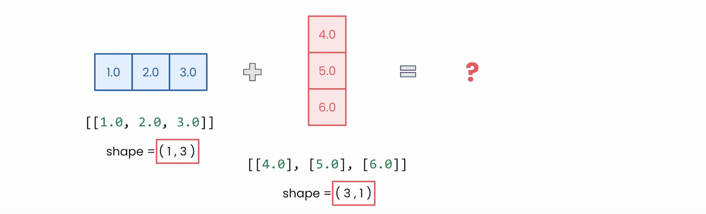

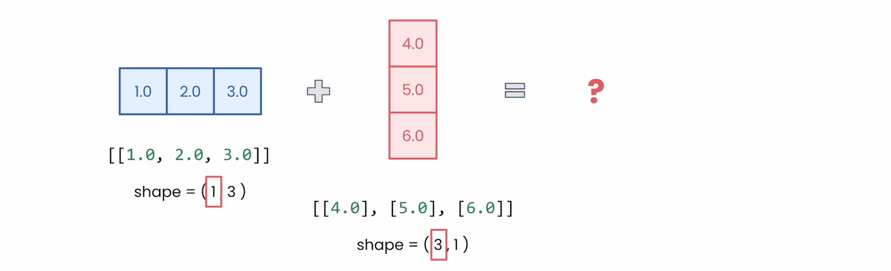

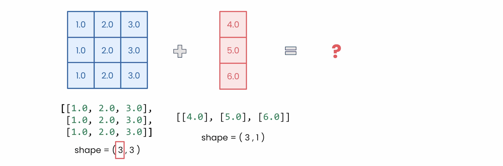


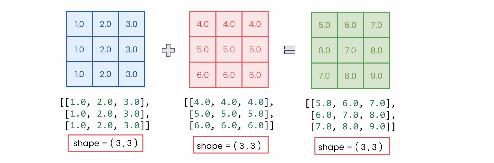

Therefore, both tensors become shape `[3, 3]`.

### Applying Broadcasting in Practice

Remember those delivery adjustments? Instead of manually repeating `1.1, 1.0, 5.0` three times, you can just write it once. No loops, no manual repetition. PyTorch handles it all through broadcasting.

```python
torch.tensor([[3.0, 8.0, 1.0],
    [7.0, 17.0, 2.0], * [[1.1, 1.0, 5.0]]
    [12.0, 12.0, 1.0]])
```

This pattern appears everywhere in deep learning: adjusting multiple features across batches, combining different dimensions of data, and applying transformations efficiently. Once you know to look for it, you will see broadcasting opportunities everywhere.

## Module 1 Conclusion

You have covered essential tensor operations over the last two videos. The provided lab has additional examples that you can explore because, like any tool, tensors will become intuitive through practice.


We started by exploring what makes PyTorch special, and now you have learned the fundamentals:
* You've worked through the machine learning pipeline.
* You've trained your first neural network.
* You've mastered tensor operations.
* You've built the foundation.

Up next is the tensor lab where you will practice these concepts, followed by a graded assignment to test your skills. Then, in Module 2, you are going to tackle classification problems and dive deeper into how neural networks really learn.
