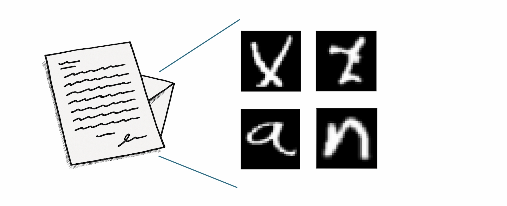
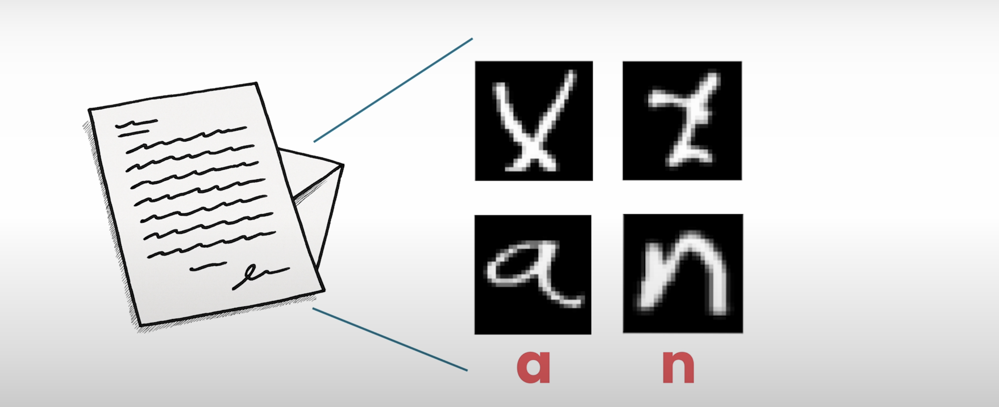
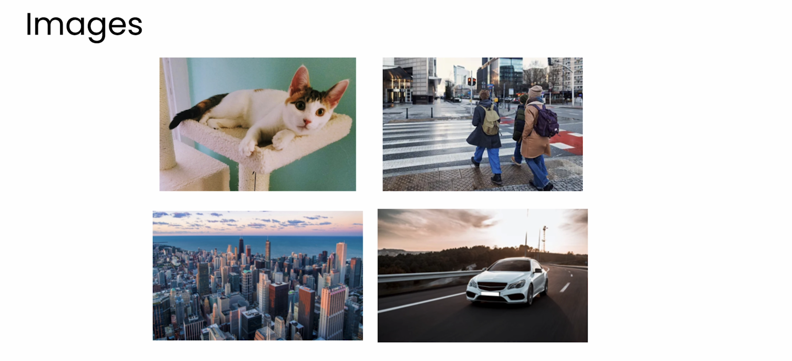
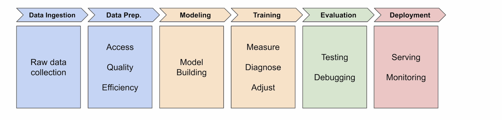
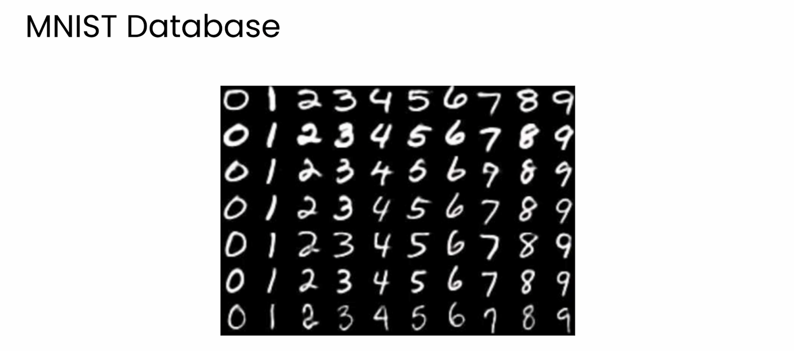
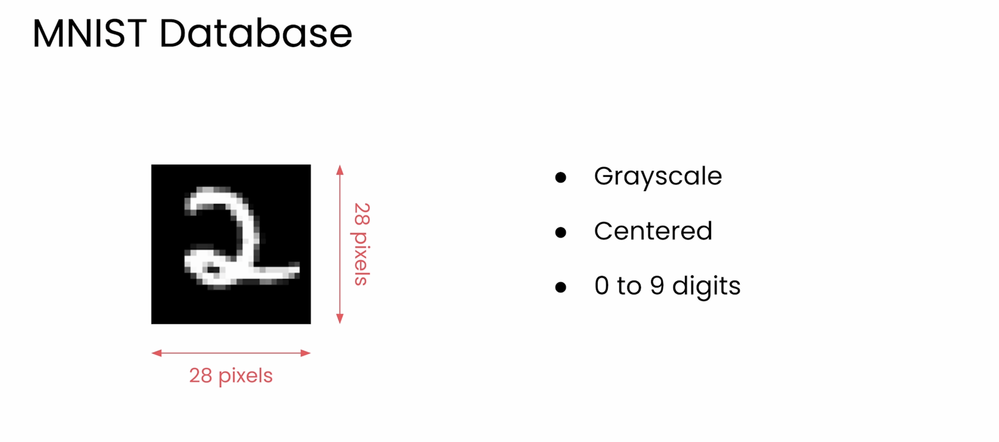
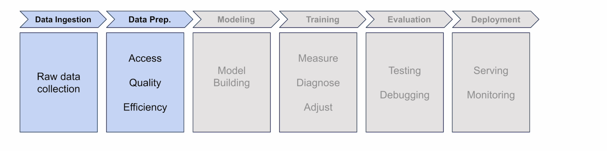
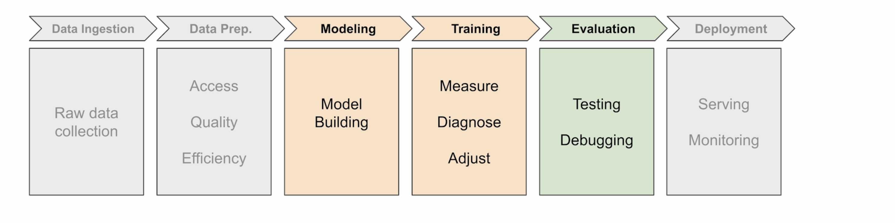

# Pytorch Workflow

### Introduction

Welcome back. In Module 1, you built your first models with PyTorch and you got comfortable with the fundamentals. And if you're new to this, that's a solid foundation. And if you're more experienced, you probably picked up some interesting PyTorch-specific patterns along the way. But now, let's tackle something more interesting. But first, I need your help with the problem. 

### The Challenge: Andrew's Letter

My friend Andrew sent me this letter and his handwriting is just as bad as mine. I can't read a single word. 

It's, well, it's unique. So I had an idea. What if I could train a neural network to read this for me? 

I took the letter and I segmented it into individual images like this. And then I tried to build a model to classify each character. 

You know that this squiggle is an A and that one's an N and so on. Once I could classify each letter, I should be able to reconstruct the whole message. 

### The Failed Attempt

But when I ran my model, this is what I got. Not quite right. 

So I'm going to need your help translating this letter. 

### The Solution: Learning from Images

But you're going to need some new tools because you're going to be working with images. And this means a lot more data than you saw in Module 1. Each image here contains hundreds, maybe even thousands of pixel values. 

In fact, for the rest of this course, we're going to focus on images. And we'll give you the time to really master the machine learning pipeline before we move on to more advanced topics. 

And you'll explore loss functions and optimizers in a lot more detail. And you'll pick up some PyTorch-specific techniques like how to manage devices such as GPUs. By the end of this module, you'll have built a multi-layer neural network that can hopefully decode Andrew's letter. But before you tackle this handwriting, you're going to start by practicing on something a little bit more simple. 

### Introducing MNIST

These are handwritten digits and you can see there's a lot of variation in different handwriting styles. Numbers might be written neatly, messily, slanted and a whole lot more. And while you can probably decipher these numbers easily, how would you get a neural network to do the same? As you might recognize, these examples come from a dataset called MNIST. And yes, you might be rolling your eyes a little bit and this does get used a lot. I get it. 

But hear me out. There's a good reason for starting here, especially when you're just beginning your PyTorch journey. MNIST is a really good starting point because it's simple and it's structured in a way that makes it easy to train a neural network. All of the images are 28 by 28 pixels and they're grayscale, neatly centered and labeled with one of 10 digits from 0 to 9. Plus, with MNIST, you can train a working model in minutes, not hours. And this will help you learn the core ideas before you move on to more complex challenges.

### Course Roadmap

So in the next two sections, you're going to take a fresh look at the ML pipeline and learn the PyTorch way of doing things with images. The first section focuses on data. Real world datasets are large and messy and you'll need better tools to load and manage them effectively. 

Then after that, in the next section, you're going to move beyond sequential and build models with more flexibility while also taking a closer look at how training actually works. 

These sections are going to lay the groundwork for building your first image classifier using MNIST as a stepping stone towards building something called a convolutional neural network. So let's dive in and see what's new.
