# ML Pipeline with PyTorch - Part 1: Data

Let's revisit the machine learning pipeline and see how PyTorch handles data. You already know about these steps from Module 1.

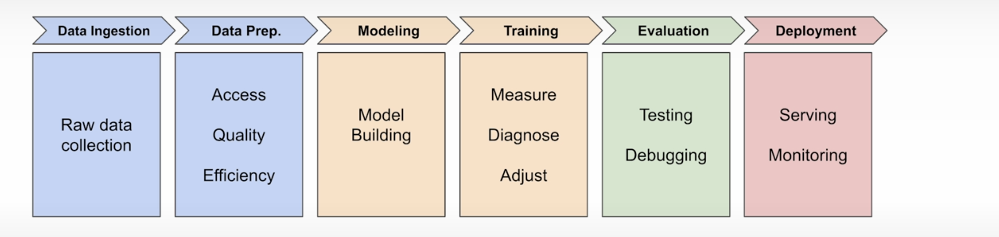

But now, if you're going to decode Andrew's letter, you're also going to need to understand PyTorch's data handling tools.

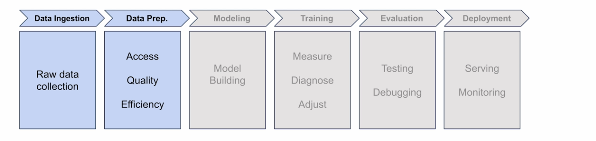

Before you get into the complexities of image data, let's start with something more familiar—that delivery data that we looked at in Module 1. The same tools that can handle millions of delivery records can also handle millions of images. Once you see the pattern with simple data, images are going to make a lot more sense.

## The Challenge of Large Datasets

So let's imagine your delivery company from Module 1 has grown. Instead of 10 deliveries, you now have 100,000 records to analyze. That's a lot.

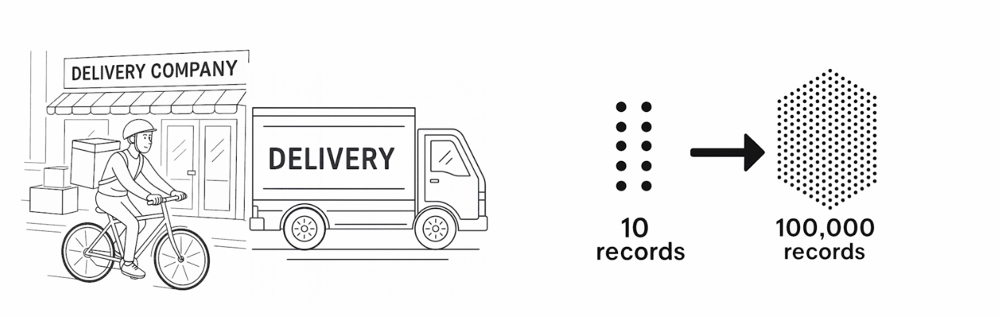

Now imagine you wanted to try and load all 100,000 records at once. You might use code like this:

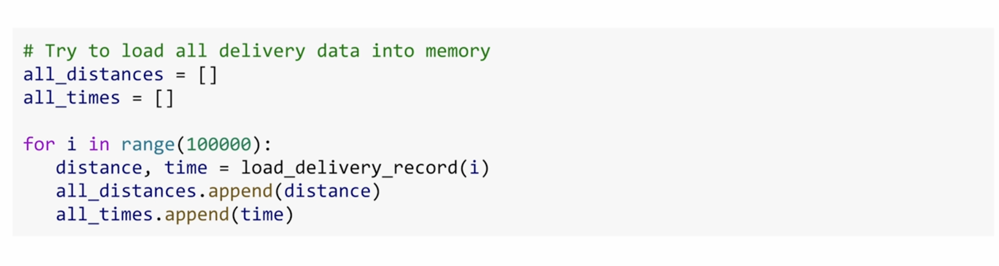

As you load this data, every piece needs to live in your computer's RAM.

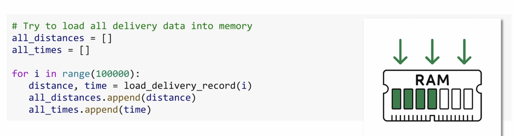

With 100,000 records, you might be okay. But what if you had millions of records? Or if you added weather data, traffic patterns, driver info, and all of that kind of stuff? At that scale, your computer can run out of memory and crash in no time.

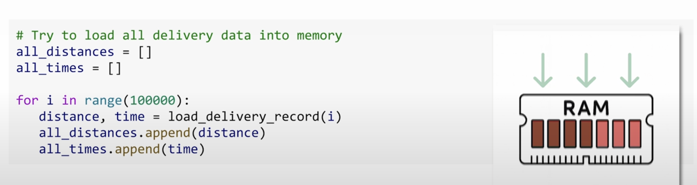

And that's why you need to load your data piece by piece. The practical solution is to work with your data in **batches**—smaller, manageable chunks of the full dataset.

## PyTorch's Core Data Utilities

But batching is just one part of the picture. Before your data is ready for training, you need to process it, format it, and serve it in a way that your model understands. And that's where three of PyTorch's core data utilities come in:

- **Transforms**
- **Dataset**
- **DataLoader**

They each handle a key part of the process, and they're designed to work well together.

### Transforms

Let's take a look at how transforms work. To apply transforms to data, you usually write something like this:

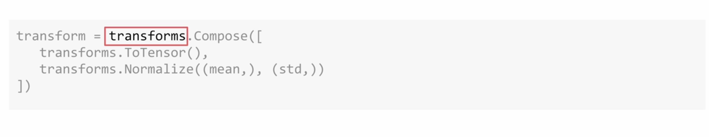

Transforms are operations that run on each data point as it's loaded, preparing your data for the model. `Compose` just means to do the following things in order:

Then you have the two most common transforms: `ToTensor` and `Normalize`.

Neural networks are surprisingly picky. They train much better when all inputs are small numbers, ideally centered around 0. And that's exactly what these two transforms do:

**ToTensor** converts your data into PyTorch tensors and scales them to fall between the values of 0 and 1.

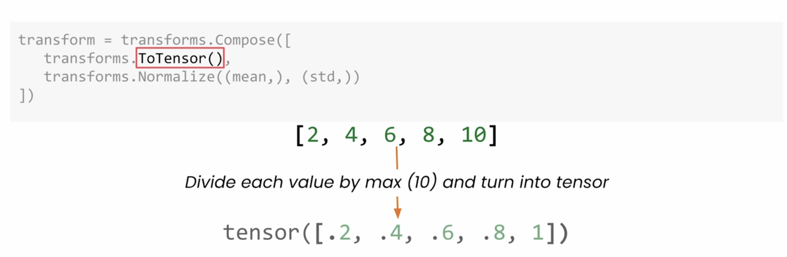

**Normalize** adjusts these values even further, centering them around 0 and then scaling using standard deviation.

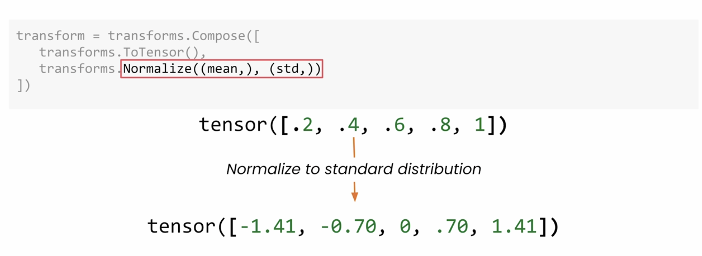

For now, just know that these will help your model train much more effectively, and you'll learn more about them and other transform techniques in the next module.

### Dataset

Next up, you're going to wrap your data in a `Dataset` object, which fetches each sample from disk when it's asked to. It doesn't preload everything in one shot, and that's one of the secrets to handling massive datasets.

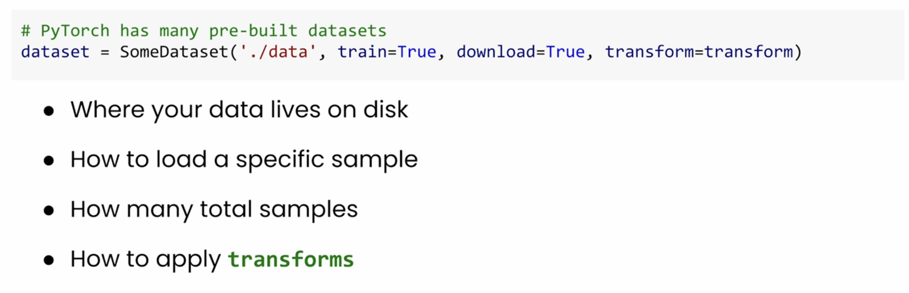

It handles things like:
- Where your data lives on disk
- How to load a specific sample
- How many total samples there are
- How to apply the transforms to each sample as it's being loaded

Key parameters:

**root** - This indicates where you store the data on your computer.

**train=True** - This lets you choose between training and test sets of data. If this is new for you, you'll see a lot more about that when I discuss evaluation.

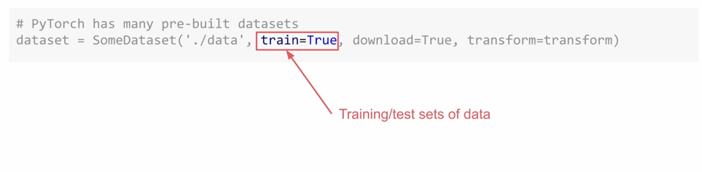

**download=True** - Downloads the data if it's not already there.

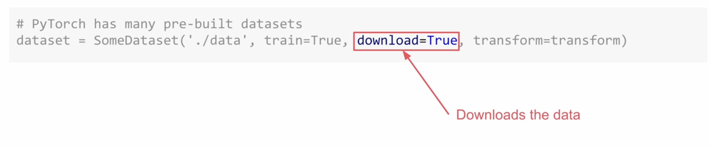

You can retrieve a sample from your dataset simply by indexing it:

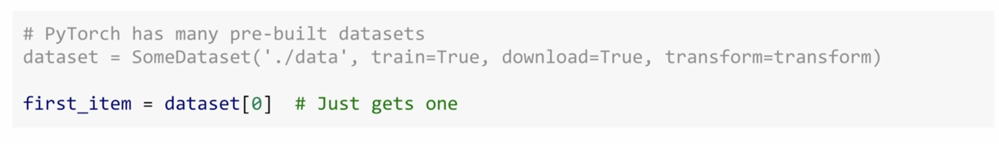

In Module 3, you'll learn how to use the `Dataset` class to build custom datasets. But for now, we'll stick to the pre-built ones that are available in PyTorch.

### DataLoader

Once you've defined your dataset, you're going to use a `DataLoader` to serve the data in batches. It's part of the pipeline that makes training on large datasets possible, by requesting one batch at a time from your dataset.

**batch_size** tells the loader how many samples to serve at a time:

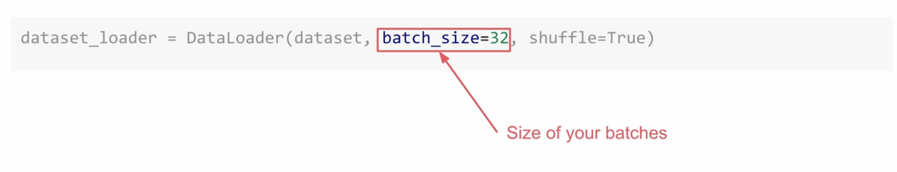

**shuffle** - You can also shuffle the data, which helps the model learn even more effectively during training:

## The Complete Data Pipeline

Now let's see the complete data pipeline in action. And you're ready to train.

This pattern efficiently handles datasets that would otherwise overwhelm your computer's memory. And whether you're working with thousands of delivery records or millions of images, the principle stays the same: **load only what you need, when you need it**.

## What's Next

But getting data into your model is just the beginning. In the next video, you'll tackle the rest of the ML pipeline, and then you'll look at how loss functions and optimizers update your model.
