# ML Pipeline with PyTorch - Part 2: Model

In the last video, you saw how PyTorch helps you manage your data. With tools like Dataset, Transforms, and DataLoader, you can load, prepare, and serve data efficiently, no matter the size of your dataset.

Now, let's move on to the rest of the machine learning pipeline: model building, training, and evaluation.

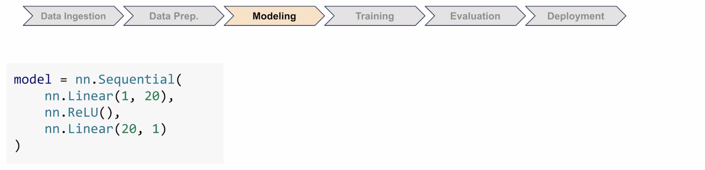

## Building Models with nn.Module

In Module 1, you saw `Sequential` in action. And of course, this works great, but there's another pattern that you'll see a lot in PyTorch—creating your model using `nn.Module`.

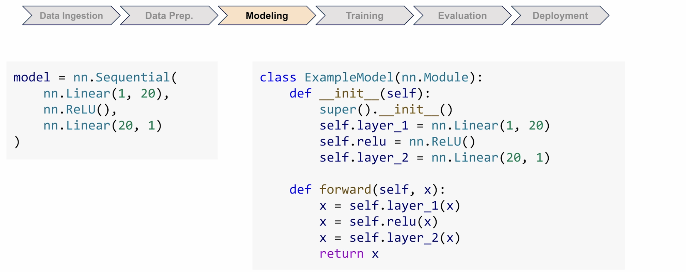

This code does exactly the same thing as the Sequential version, just with more control. So let's take a closer look at the structure.

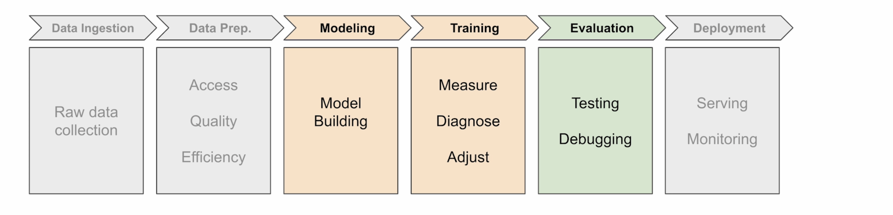

### The Two Parts of Every PyTorch Module

Every PyTorch module class has two parts:

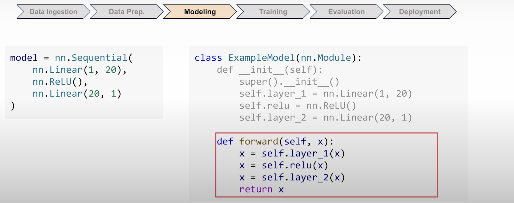

- **`__init__`** defines your layers
- **`forward`** describes how data flows through them

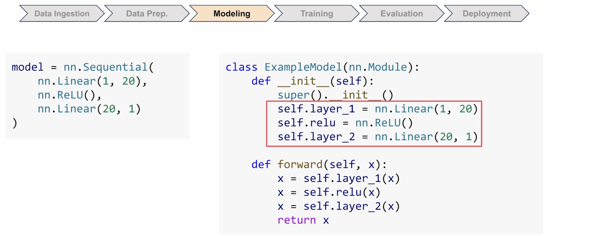

In `__init__`, you're just defining what layers exist. It's a little bit like gathering your tools. The actual order comes in `forward`, and that's where you describe the path that data is going to take through your model.

Now, this is similar to how Sequential orders the flow, but written in a different style. You're going to see this pattern everywhere in PyTorch code.

### Running Your Model

But wait, you've defined this `forward` method. How do you actually run it? You might think `model.forward()`. But what if I told you that `Sequential` is a subclass of `Module`, and it too has a `forward` method? And how did you run that model? You never actually called `forward` directly.

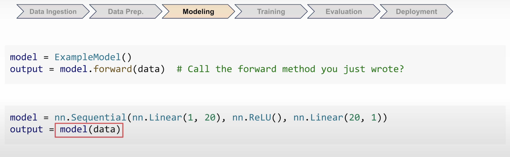

It's the same for your custom model. When you call the model method and pass the data, PyTorch does more than just run your forward method. It also makes some internal checks, tracks the necessary math, and sets things up for updating the model later.

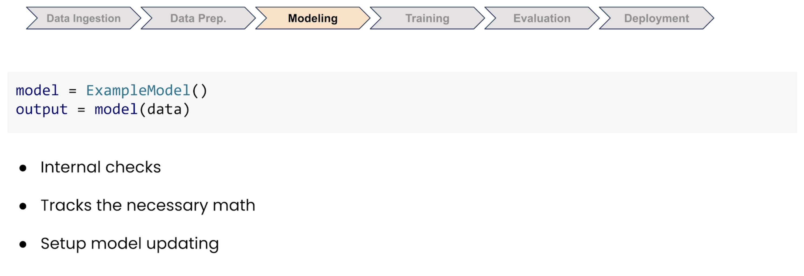

And that's why you always call `model(input)` and not `model.forward(input)`. PyTorch will handle that forward call for you, and it's all wrapped up in the essential bookkeeping.

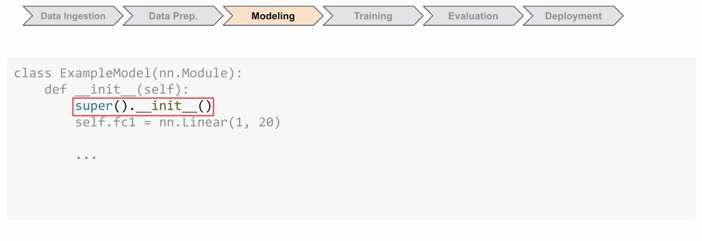

### Why super().__init__() Matters

So what about this line, `super().__init__()`? Is it really necessary? You might think it's just Python boilerplate, and maybe nothing bad happens if you skip it.

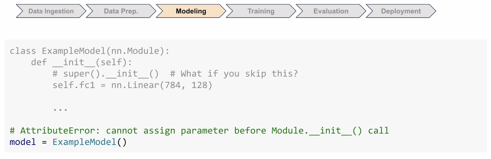

But when you try to create your model, PyTorch needs to set up a system to track all of its learnable parameters. And these are the weights and biases that you're going to update during training. So when you call `super().__init__()`, it actually creates that tracking system for you. Without it, PyTorch has nowhere to register your layers.

## Training Your Model

So now let's take a look at training. You've seen this training loop already in Module 1. This standard sequence is the core of most PyTorch training loops:

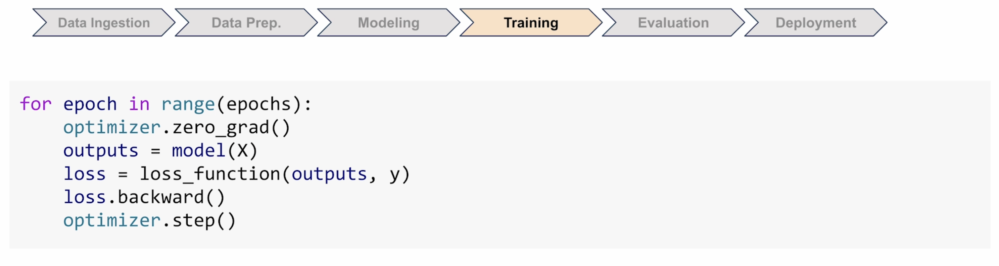

- **`zero_grad()`** clears out all the old calculations
- **`backward()`** figures out the improvements
- **`step()`** updates your model

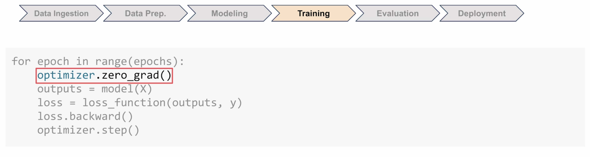

### Order Matters

But here's the thing. If you don't follow this standard order, your training might fail silently. PyTorch won't throw an error, but your model won't learn properly.

For example:

- **What would happen if you swapped `backward` and `step`?** Your code runs fine, but the model updates itself based on the previous batch's calculations and not the current ones.

- **What if you put `zero_grad()` after `backward`?** Well, then you just threw away all of that work that backward did.

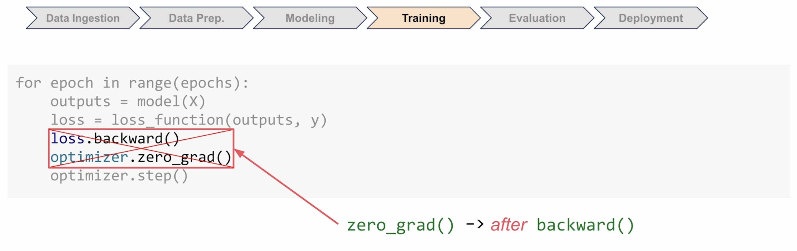

- **What if you put `zero_grad()` outside the loop?** Well, those calculations just pile up. Each batch will add to the previous one and your model starts making huge adjustments when it should just make tiny ones.

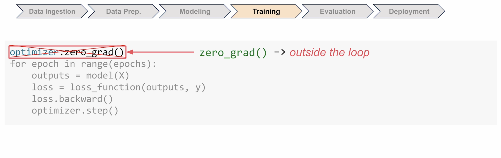

The next two videos will take a deeper dive into these topics. For now, just remember that this pattern is important. You almost always want the same order every time.

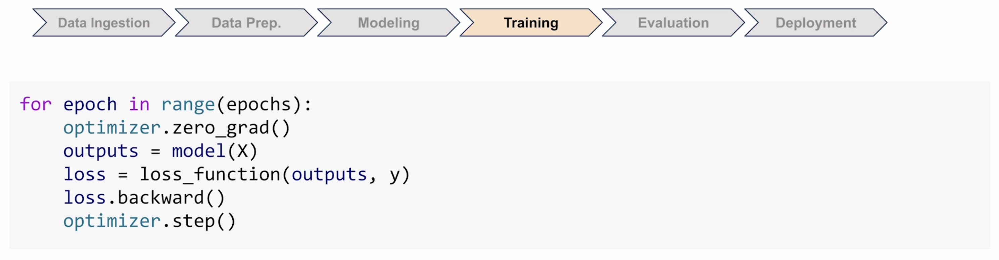

## Evaluating Your Model

You've been training your model, but how do you know it's actually learning? That's what evaluation is for—testing your model on new data that it hasn't previously seen and wasn't trained on.

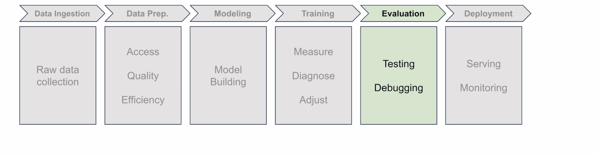

### Two Critical Things

**`model.eval()`** - Be careful. This is not a method that evaluates your model as some people mistakenly think. It just sets the model into evaluation mode. You need this because it's both more efficient computationally and some layers in your model will behave in different ways during training and evaluation.

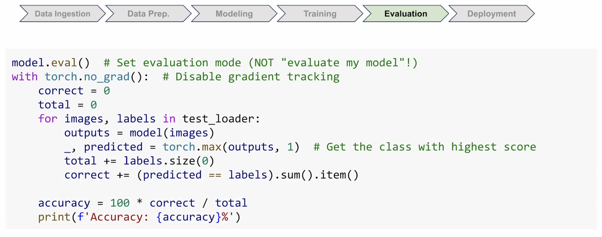

**`torch.no_grad()`** - This will disable that extra tracking that PyTorch does during training. If you don't turn it off, PyTorch will keep storing lots of details even when they're not needed and this wastes memory and might even crash your program during validation.

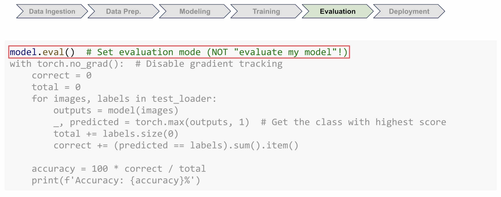

### Why Use Separate Test Data?

Now, the most important part of evaluation is to see how well your model has performed on new data that it hasn't seen before. Testing on the training set would be like giving the student the same test twice. The student might just memorize the answers, but you want to see if they can apply what they've already learned.

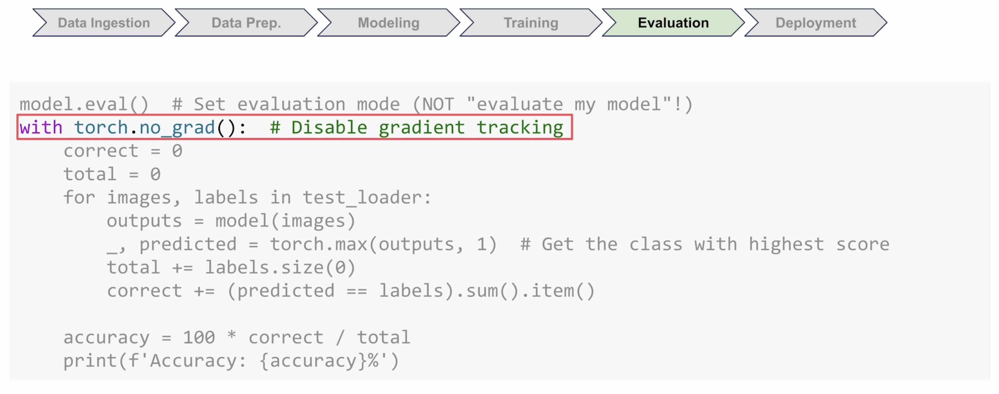

### Measuring Accuracy

Since you're exploring image classification in this module, you can easily measure performance using accuracy. The accuracy calculation is straightforward: count how many times the model gets the classification right and divide that by the total attempts. If your model predicts 9,500 digits correctly out of 10,000, that's 95% accuracy.

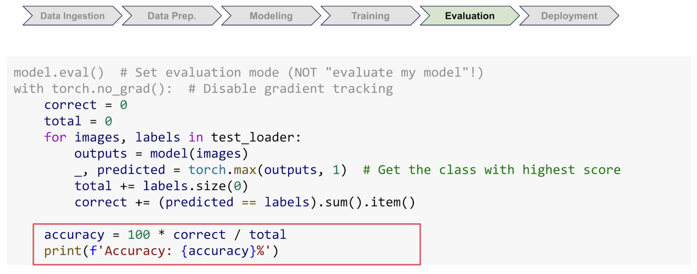

And don't forget to switch back to training mode if you are returning the model to training.

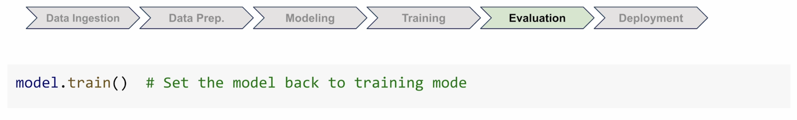

## What's Next

You've now revisited the full pipeline—data loading, model building, training, and evaluation—but you've only scratched the surface of training. In the next two videos, we're going to take a closer look at what's happening with loss functions and optimizers.
