# ML Pipeline with PyTorch - Part 3: Loss Functions

As you move through this course , you'll see these three lines come up again and again and again during training. They're simple to write, but a lot happens behind the scenes. PyTorch will take care of the complex math for you, but in this video, you'll take a quick look under the hood to understand what each line really does and why the order matters.

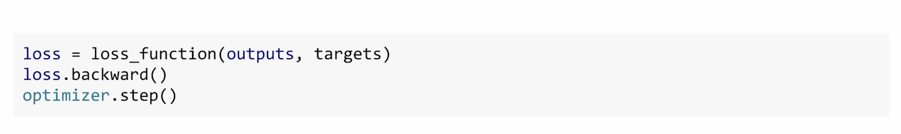

## Measure, Diagnose, Update

These three lines will work together in this sequence: Measure, Diagnose, Update.

First, you'll measure how wrong your predictions are, and that's your loss. This one number that sums up all of your mistakes. And then, backward diagnoses the problem. It examines how each weight in your model contributed to the error, which weights made things worse, and by how much. Finally, optimizer.step updates the weights. It uses those diagnostic scores to adjust each parameter. The weights with the bigger problems will get bigger corrections.

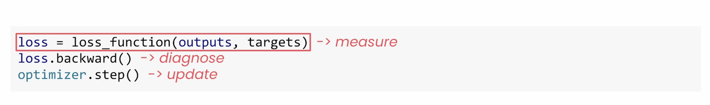

In this video, you're going to focus on the first step, and that's measuring loss.

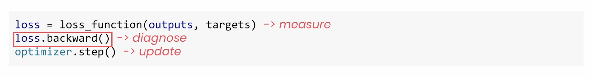

## Loss Functions Overview

You've already seen one kind of loss function called mean squared error, which works really well for tasks like we had when we were predicting delivery time. You'll also meet a new loss function, cross-entropy loss, and this is used for classification problems. I'll break down how these loss functions work and how to choose the correct one for your task.

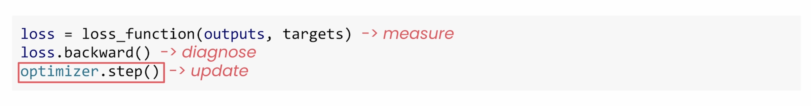

Every loss function does the same basic job. It compares your model's predictions to the true answers and then gives you a number. The higher the number, the more wrong you are.

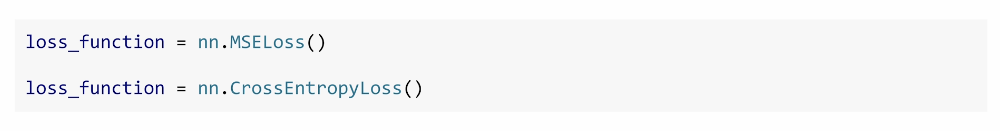

## Mean Squared Error (MSE)

Back in the delivery company example, you used the model to predict delivery time based on distance. Now, let's say your model makes two predictions. The first prediction, the model predicted six minutes, but the actual time was four. For the second prediction, say it predicted three minutes, but the actual time was five.

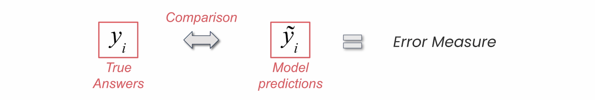

To figure out how far off you were, you subtract the target from the prediction, and that gives you the error. It's like measuring the distance between your guess and reality.

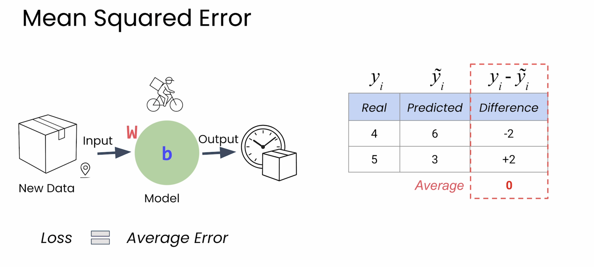

### Why Average Error Doesn't Work

So how wrong was your model overall? Well, loss here is the average error across all of those predictions. Think of it like a report card for your model. The lower the score, the closer your predictions are to reality on average.

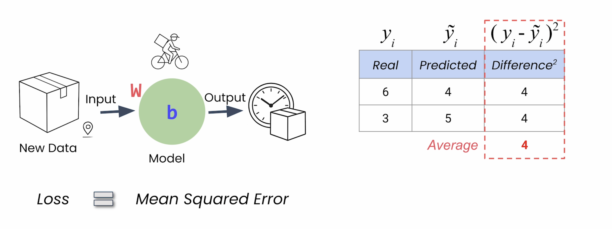

But if you average out the raw errors, in this case it was plus two and minus two, and you divide that by two because there's two of them, you get zero. It looks like perfect performance, even though both predictions were actually wrong.

### Why We Square the Differences

And this is why you use mean squared error and you square the differences. It gets rid of the minus signs. So now both mistakes count and they don't cancel each other out. And that's where that name comes from, mean squared error.

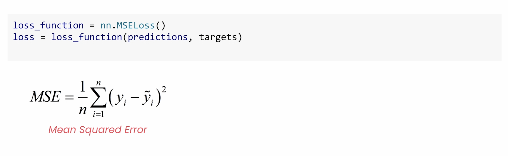

And there's one more benefit. Squaring makes bigger mistakes matter more. Being off by 10 minutes is much worse than being off by one.

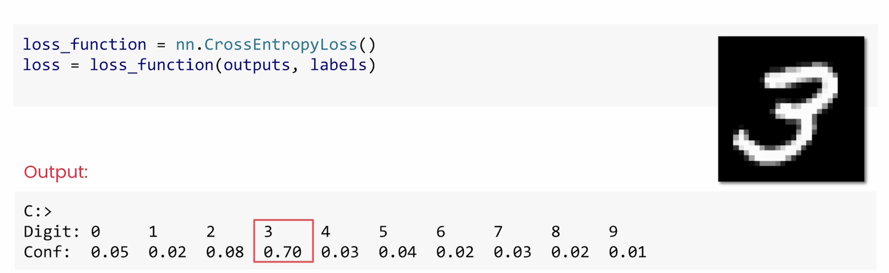

So MSE loss, mean squared error loss, helps in these two ways:

1. It makes sure that all mistakes count.
2. It punishes bigger errors more than it punishes smaller ones.

Mean squared error is perfect when you're predicting continuous values, things like distances, temperatures or prices.

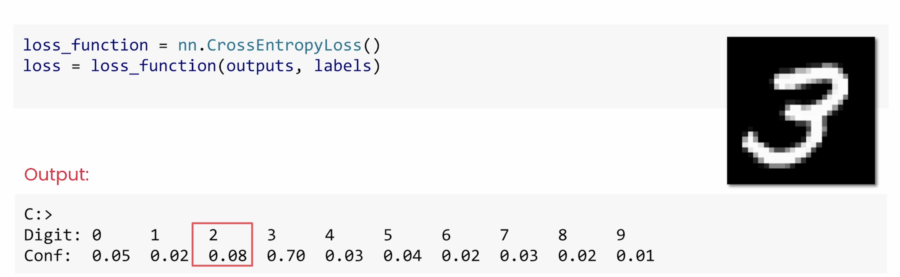

## Cross-Entropy Loss

But in this module, you're tackling classification. What digit is this? And here you're going to need a different loss function. We'll use one called cross-entropy loss.

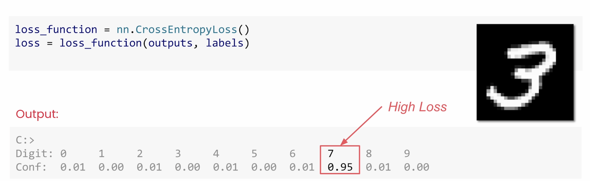

### How Cross-Entropy Works

With cross-entropy loss, your model isn't just picking an answer, it outputs a confidence score for all possible answers or classes. Take MNIST, your model must choose between digits zero through nine. So for each image, it outputs 10 numbers, a probability for each digit.

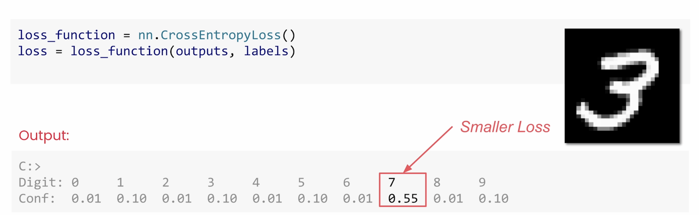

This means I'm 70% sure it's a three, maybe 8% sure it's a two, but it could be a zero. And all of those scores should add up to 100%.

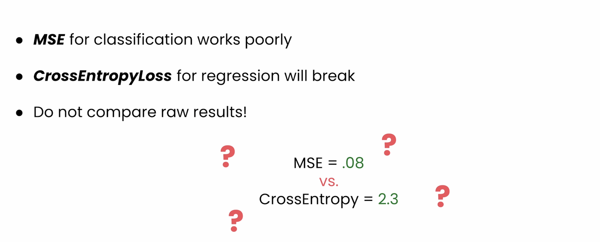

### Punishing Overconfident Wrong Answers

Now here's the key idea. Cross-entropy loss punishes overconfident wrong answers. If your model says it's 95% sure that this is a seven, but it's actually a three, that's a big mistake and the loss will be very high. But if it's only 55% sure it's a seven, it's still wrong, but not as confident, so the loss will be smaller.

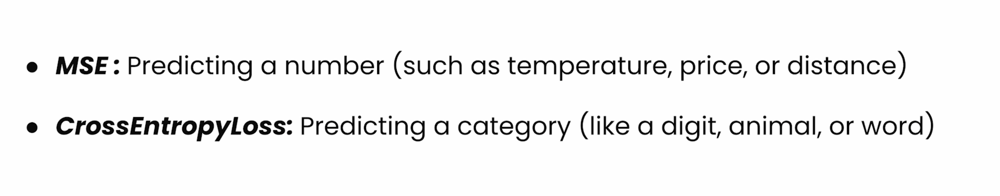

You want your model to be confident about the right answers and unsure about the wrong ones. Cross-entropy loss helps shape that behavior.

## Important Warnings

Now here's one important warning. Do not mix up your loss functions.

- **Using MSE loss for classification** might work, but poorly. Training will be slow and potentially unstable.
- **Using cross-entropy loss for regression?** It'll probably break because it expects probability distributions and not continuous values.

And also don't compare their raw numbers. My MSE is 0.08, but cross-entropy gives 2.3, which is better? Well, that's just like comparing two completely different things. Same idea, different scale. Just make sure that the number goes down during training. The goal is to minimize loss.

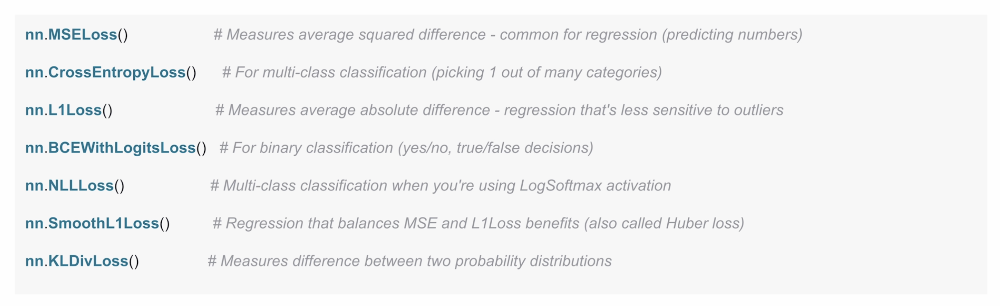

## When to Use Which Loss Function

So when would you use which loss function?

- **If you're predicting a number** such as temperature, price, or distance, use **MSE**.
- **If you're predicting a category**, like a digit, animal, or word, use **cross-entropy loss**.

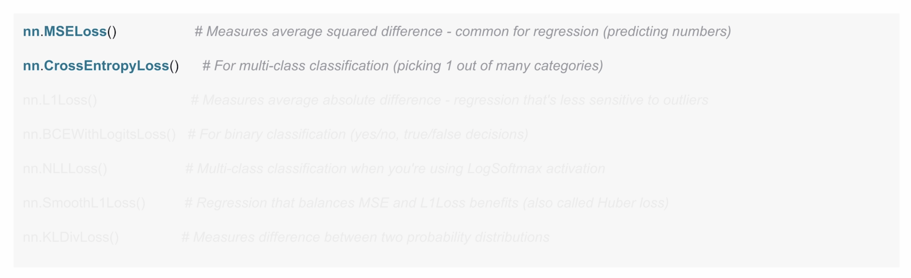

There are lots of other loss functions out there, of course, and each are suited to specific situations. If you're curious, check out the resources below to explore them further. But for now, the great news is that MSE and cross-entropy loss cover a lot of territory in deep learning tasks.

## What's Next

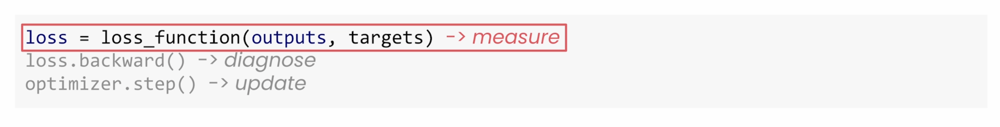

So that's the measure part of our sequence. In the next video, you're going to explore how PyTorch diagnoses the problems and makes those updates.
