# Optimizers and Gradients

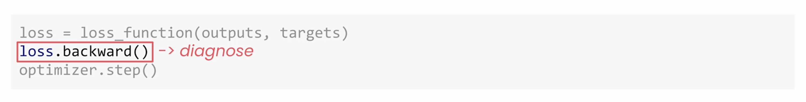

In the last video you saw how loss functions measure how right or how wrong your predictions are and this is the first critical step in every training loop. Now let's take a look at the next two. In this video you'll discover how Backward figures out which weights caused any problems and how optimizers can use that information to improve your model. By the end, hopefully you won't just know how to use these tools, you'll also understand why they work.

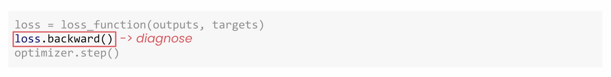

## What Does Backward Do?

After measuring how wrong your predictions are with the loss function, the next step is to figure out what caused that loss and that's what Backward does.

Think back to how neural networks work. Each neuron takes inputs, multiplies each by a weight, adds them up with a bias, and then passes that through an activation function. Even in a small neural network you're dealing potentially with thousands of weights and biases.

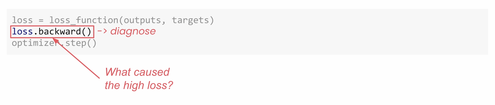

### A Simple Example

If we look at a simple example, this network has 784 inputs, 128 hidden neurons, and 10 output classes. And it has:

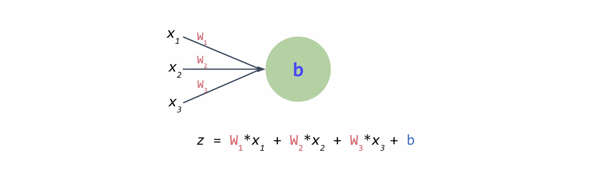

- Over 100,000 weights between inputs and the hidden layers
- 128 biases for the hidden layer
- 1,280 weights between the hidden layer and the output
- 10 biases for the final output layer

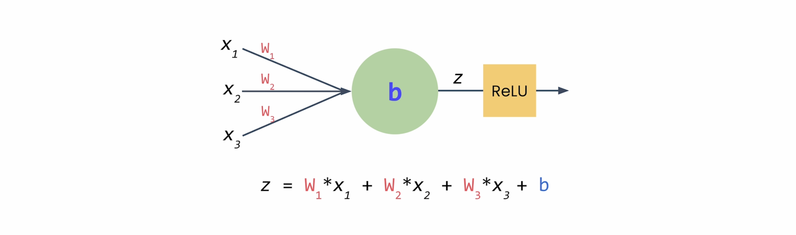

That's a total of **101,770 trainable parameters**.

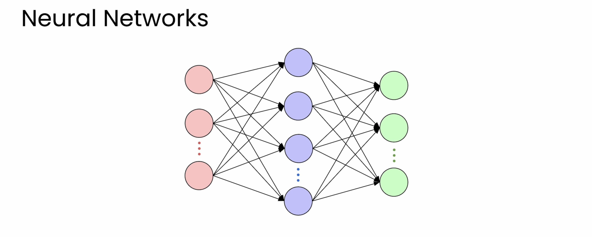

## Gradients: The Diagnostic Scores

Backward acts a little bit like a detective. It looks at every single weight and bias and asks, "how much did you contribute to the loss?" These diagnostic scores are called **gradients**. They tell you not just who contributed to the error, but how much and in what direction.

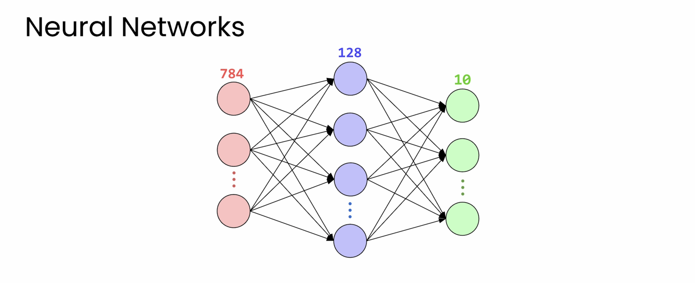

- **Positive values** mean that increasing this weight will make the loss worse
- **Negative values** mean that increasing this weight would have helped
- **Large values** have a big influence
- **Small values** barely mattered

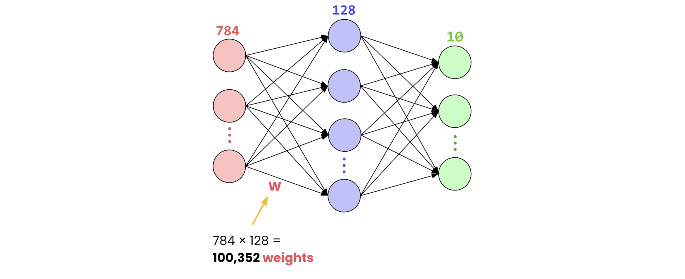

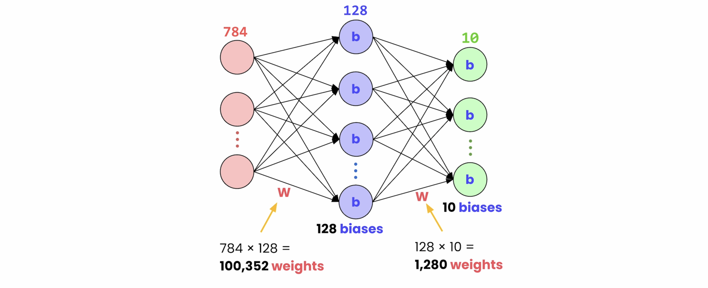

### Common Misconception

But here's a common misconception. People often think that Backward updates these weights. It doesn't. Backward only calculates gradients. It figures out how much each weight contributed to the overall loss. The actual updates will happen later when you call `optimizer.step()`.

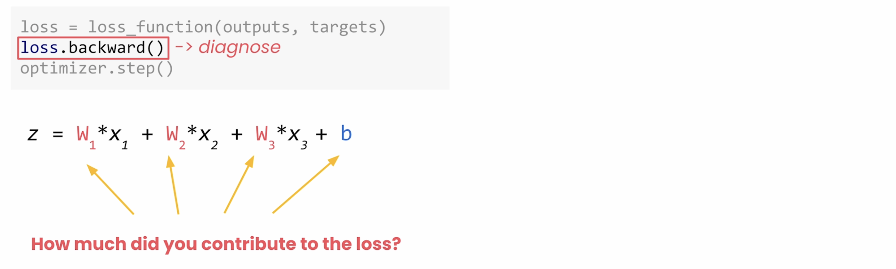

You can find course resources if you want to learn more, but this course is focused on PyTorch and not Calculus. And the beauty of PyTorch is that it handles all of that complexity for you.

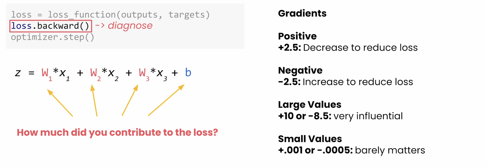

## Gradient Descent

But what's really happening here? Your goal is to try to minimize loss. Think of it as like standing on a hillside trying to reach the bottom of a valley. The gradient tells you the slope at your position, which way is uphill or which way is downhill. So to get to the bottom, you go in the downhill direction and that's going towards lower loss. And that's why we call it **gradient descent**.

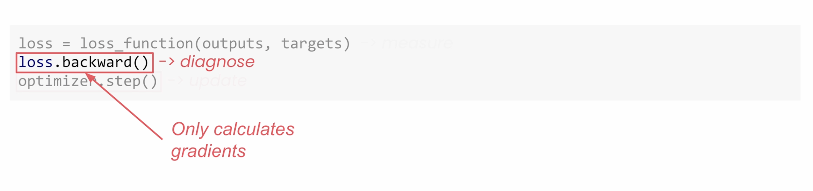

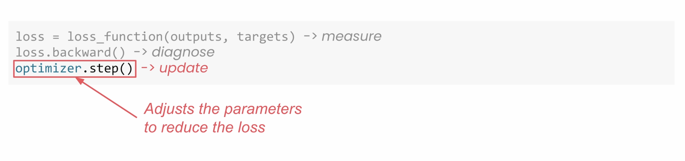

## Stochastic Gradient Descent (SGD)

The simplest approach is what we've been using, stochastic gradient descent. SGD's strategy is straightforward:

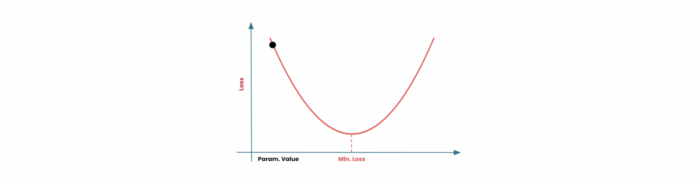

- If your weight has a **negative gradient**, then let's increase it
- If your weight has a **positive gradient**, then we can just decrease it by going in the opposite direction
- If it has a **big gradient**, we'll make a big change
- If it has a **small gradient**, we'll make a small change

But it doesn't just subtract the gradient directly, it scales it first using the **learning rate**. So if your gradient for example is 0.5 and the learning rate is 0.01, the learning rate will scale down any updates.

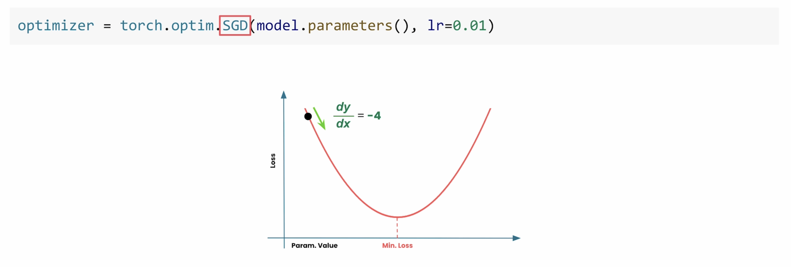

### Why Learning Rate Matters

And here's why this matters:

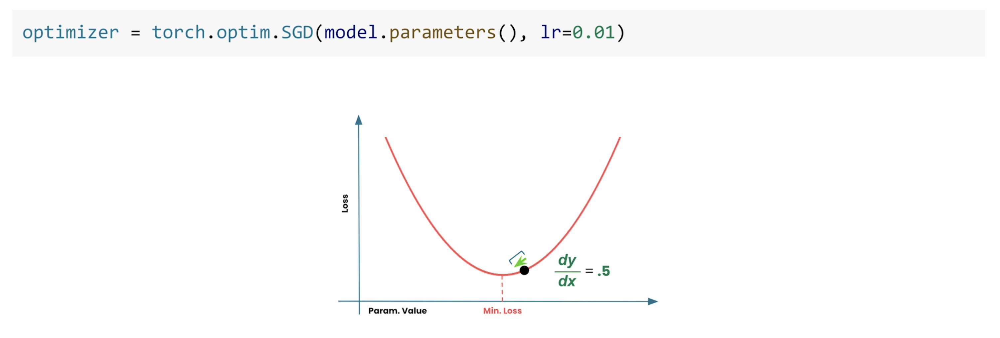

- **A tiny learning rate** has tiny steps. It will take forever to reach the bottom.
- **A good learning rate** has steady progress all the way to the bottom.
- **A huge learning rate** has these giant leaps that can bounce back and forth, overshooting the minima.

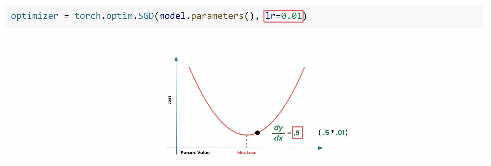

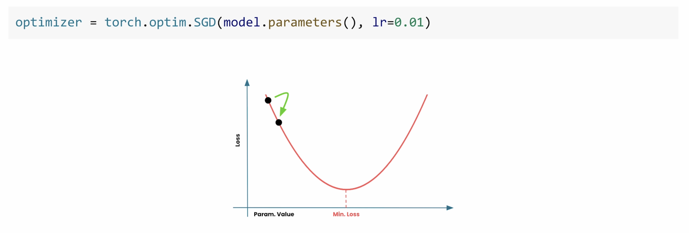

## Adam Optimizer

So SGD can work great, but there are smarter optimizers that can adapt to each weight individually. And one of those is **Adam**. It's kind of like having an assistant that knows which weights need big adjustments and which ones need fine-tuning.

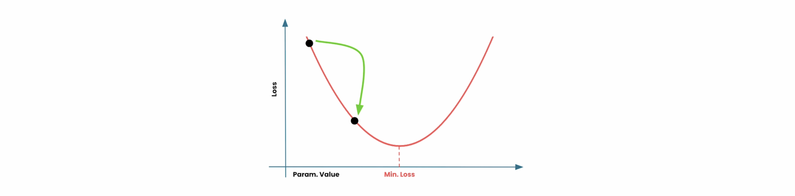

Adam has become a popular first choice optimizer because it's reliable, flexible, and often faster than the alternatives.

**A word of caution:** don't copy the learning rate from SGD when using Adam because your loss might explode. It's tuned completely differently.

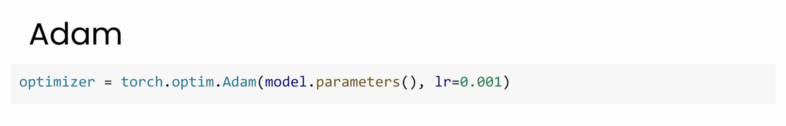

### Other Optimizers

There are other optimizers in PyTorch like RMSprop, AdaGrad, and a whole lot more. And if you're curious, check out the resources. But for most projects, SGD and Adam have you covered.

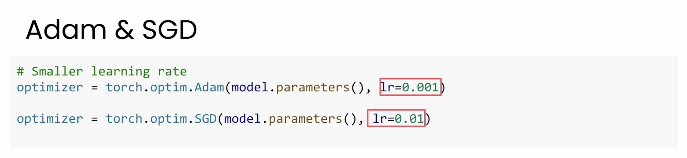

## Why zero_grad() Matters

Now that you understand gradients as diagnostic scores for each parameter, `zero_grad` begins to make a lot more sense.

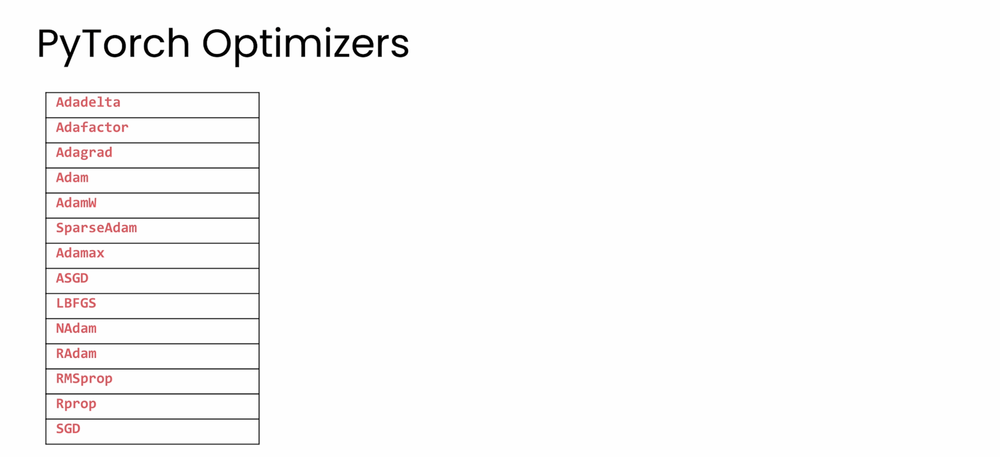

Every time you call backward, PyTorch adds new gradients to whatever is already there. So if you don't call `zero_grad`, you're not just diagnosing parameters for this batch, you're actually accumulating the diagnoses from every batch. And the gradients will keep accumulating incorrectly until your training breaks.

So that's why you call `optimizer.zero_grad()` at the start of every training loop.

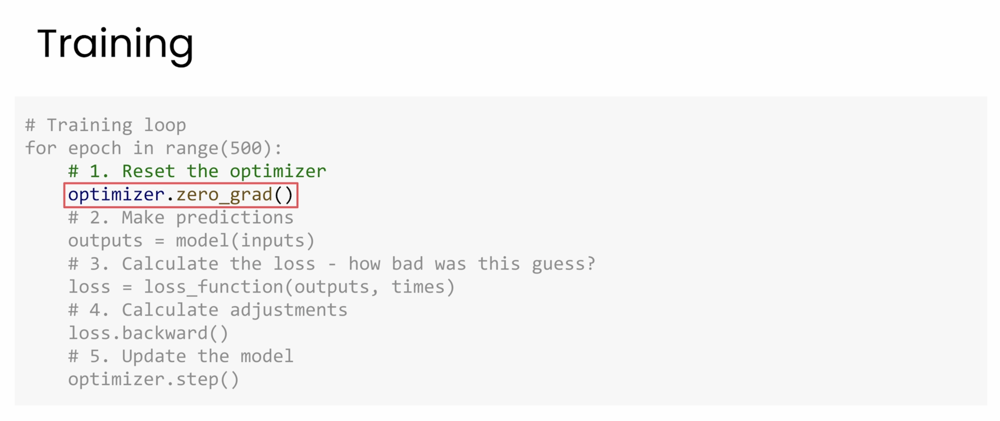

### Why Does PyTorch Accumulate Gradients?

Now you might wonder, well why does PyTorch accumulate the gradients in the first place? It turns out that this behavior is really useful for advanced use cases like gradient accumulation or certain custom training schedules. But for most projects, including everything you'll do in this course, you're going to want to clear those gradients every time.

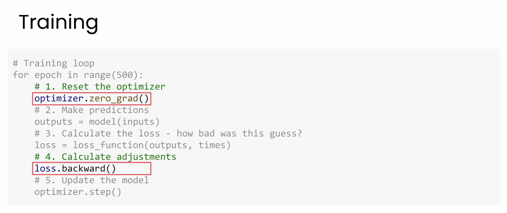

## The Complete Training Loop

You can now understand the complete training loop:

1. **Loss functions** measure how wrong or how right the model is
2. **Backward** diagnoses how each parameter contributes to the errors
3. **Optimizers** then use those diagnostic scores to update the weights

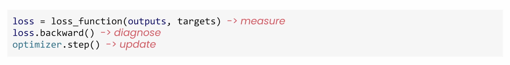

## What's Next

Now before you start building your first classifier, I have one final PyTorch-specific topic to discuss, and that's device management. And that means making your code run on GPUs for faster training.
