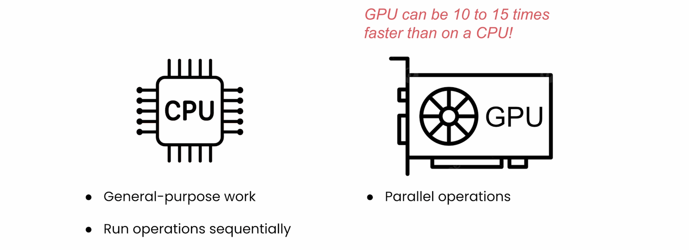
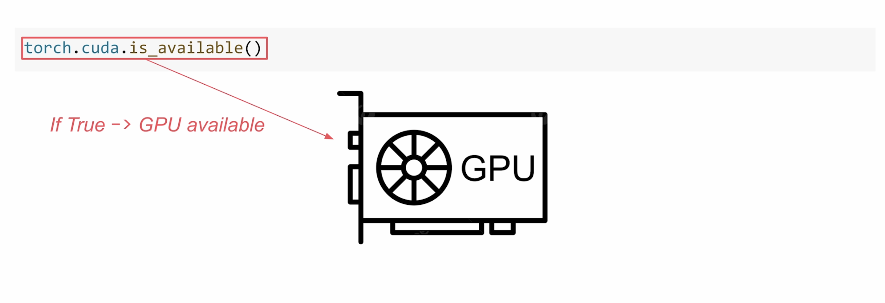
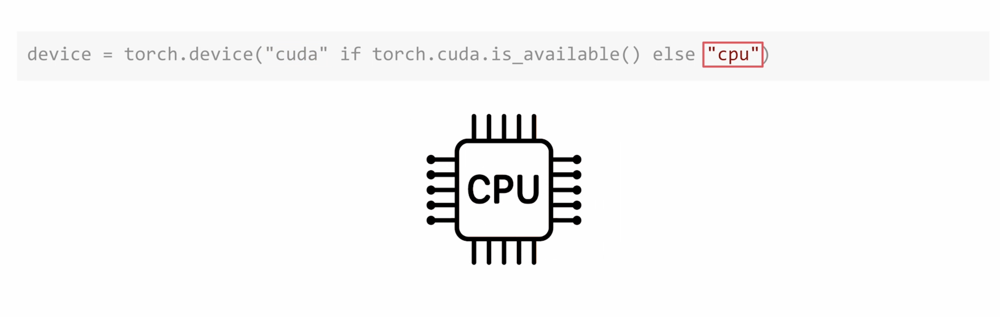
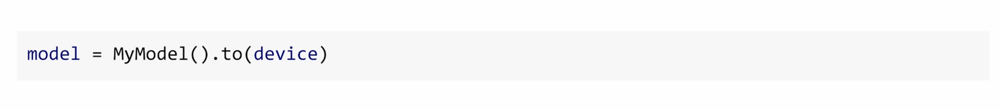
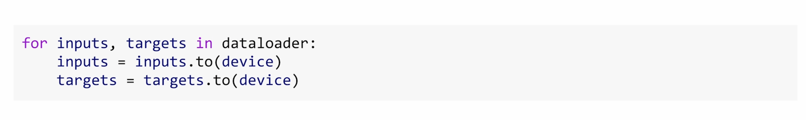
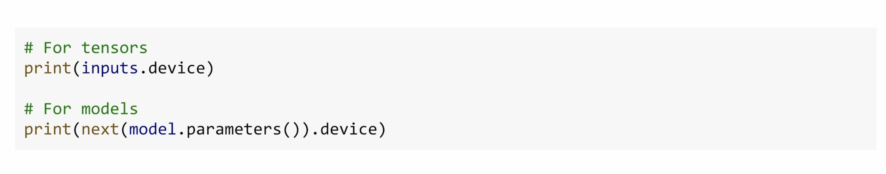
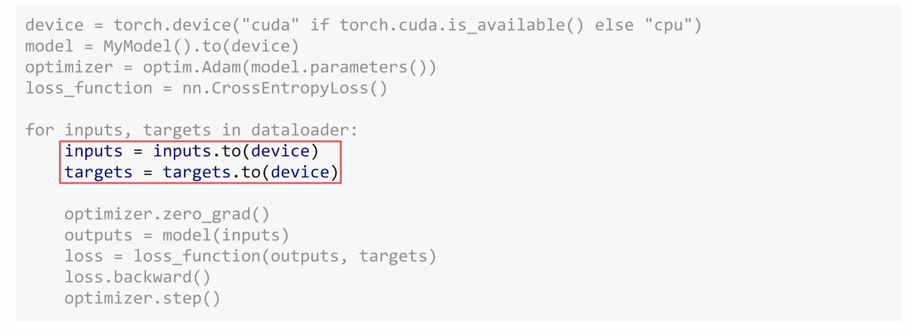
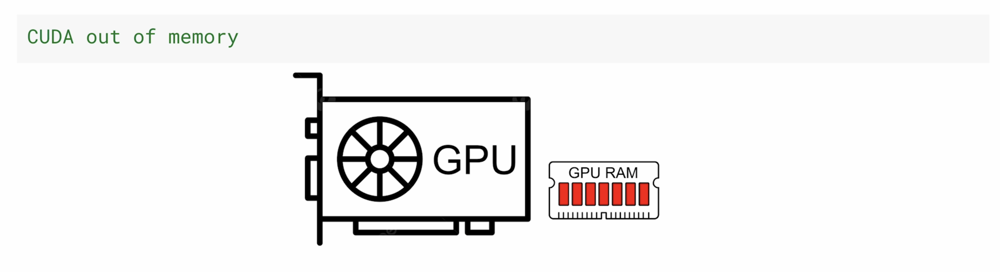

## Introduction

Welcome back. As you start working more with tensors and models in PyTorch, there's something important that you need to understand early on. Every tensor and every model lives on a device. Now that could be your CPU, or a GPU, or other accelerator if one is available. And here's the key. PyTorch will not move things around for you automatically. And if your tensors and models aren't all on the same device, your code may not run. It could crash with an error like this.

In this video, you'll learn how to control where your data and computations live, and how to avoid one of the most common errors people run into when they get started with PyTorch.

## CPU vs GPU

Every computer has a CPU, and that's the default device PyTorch uses unless you tell it otherwise. CPUs are built for general purpose work and run operations sequentially. But some systems also have an accelerator like a GPU, a graphics processing unit, which can run tensor operations much faster, especially during training. In fact, training on an accelerator like a GPU can be 10 to 15 times faster than on a CPU alone. So if your system has one of these, you'll almost always want to use it. But you do need to ensure that your model and data are both on the same device, and you'll do this manually.

## Checking for an Accelerator

So let's start with checking whether your system has an accelerator. PyTorch gives you a simple way to do it using the following code. If this returns true, then PyTorch can use a GPU to accelerate your computations.

A common pattern for choosing a device looks like this. This sets the device to CUDA if a GPU is available and CPU otherwise. It is a safe default and one you'll often see in PyTorch code. The CUDA keyword refers to NVIDIA GPUs that have a toolkit called CUDA. Now while there are other options like MPS for Apple Silicon, CUDA is the most commonly used one and it's what the labs in this course will be using also.

## Moving Models and Data to a Device

Once you've defined your device, the next step is to move your model and your data onto it. First you can move your model when you create it like this. This puts the model's parameters onto the selected device.

Then within your training loop, move each batch of data like this.

Now if you're not sure where something lives, you can always check. For tensors it's pretty straightforward. For models it's a bit different. Models themselves aren't on the devices but their parameters are. So you can check one parameter to see where they all are. If you're getting device errors, you should also double check that your targets and the output of your model are also on the same device too.

## Common Mistake with `.to()`

Now there's one common mistake to watch out for when you use `.to()`. It doesn't change the tensor in place, it actually creates a new one. So if you want to actually move the tensor, you need to reassign it. Anytime you use `.to()`, make sure you're assigning the results to a variable that you will actually use.

## Complete Training Loop with Device Management

Now here's what a complete training loop looks like with proper device management. The key steps are choose your device up front, move the model once, and then move the data in every batch. This pattern is the foundation of every training script that you'll write in PyTorch.

## GPU Memory Considerations

Even when everything's on the right device, there's one more thing to watch out for. The GPU memory. Because it is limited. If your model and batch size take up more memory than the GPU has available, you'll see an error like this.

And that's why batch size matters. Small batches make training slow, large batches too large, and you might exceed your GPU's memory and cause a crash. For many systems, a batch size between 32 and 64 is a good starting point, but it does depend on your hardware and on your model architecture. If you see a memory error, first try lowering your batch size. It is the most common fix.

## Summary

Get device management right early, and you'll avoid one of the most frustrating classes of errors in PyTorch. And when something does go wrong, you'll know exactly what to check.

You've now seen how to manage devices, and with everything you've learned so far, you're ready to put it all together. In the next video, you'll see how to train your first image classifier in PyTorch, bringing that full pipeline to life. I'll see you there.