## Introduction

Hi and welcome back. So far you've seen how to load data, manage devices, measure loss, and update weights. Now let's bring it all together and build your first image classifier with PyTorch. You're working with MNIST, those handwritten digits that you saw earlier. This data set has 60,000 training images and 10,000 test images. Each of these are 28 by 28 pixels in grayscale. It's the perfect warm-up before tackling Andrew's letter in the assignment.

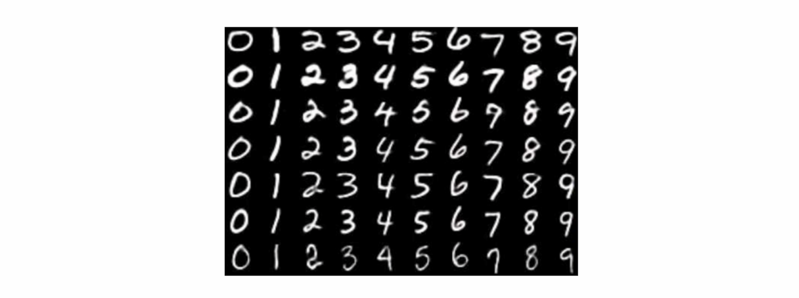

## The Data Pipeline

So let's jump into the code and build a model. We'll start with the data pipeline. First you need to import TorchVision, and this is PyTorch's computer vision library. It comes built in with popular data sets like MNIST, as well as tools for image processing.

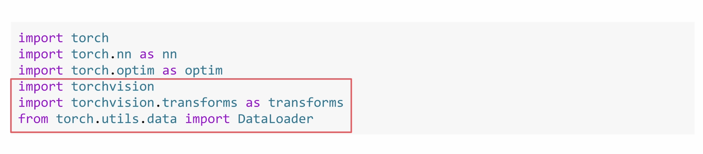

### Transforms

Remember transforms? Well here you're applying them to MNIST. ToTensor converts the images to tensors and then scales the pixels from 0 to 255 down to a range of 0 to 1. Normalize then shifts and scales those values so they're centered around 0.

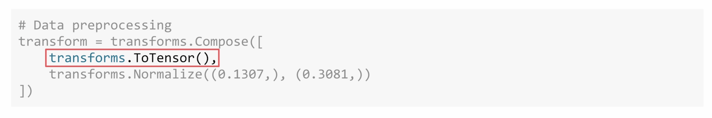

Now what are these numbers 0.1307 and 0.3081? Well they are the mean and standard deviation of the entire training set. By normalizing every image with the same values you make the data more consistent, and that helps the model learn faster. We'll see more on that in the next module.

### Loading the Datasets

Now let's load in the data sets. For the training data set, `root='./data'` says just simply where to store the files on your computer.

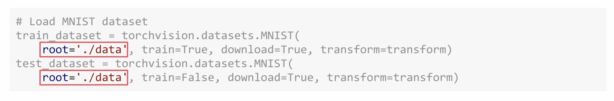

`train=True` tells it that you want the 60,000 training images.

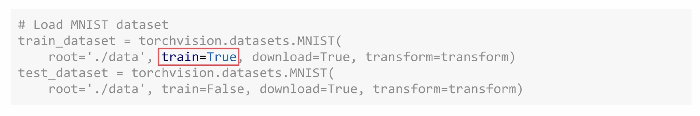

`download=True` means that if MNIST isn't already there, go ahead and download it.

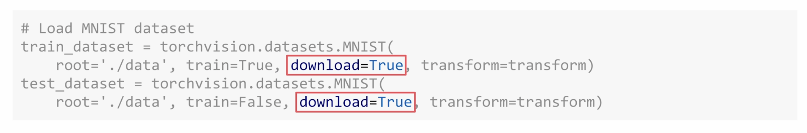

And `transform` applies those pre-processing steps that you just defined to every image automatically.

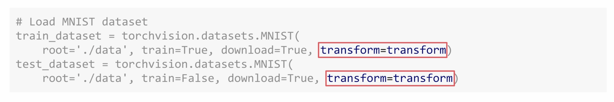

The test data set is almost identical. Just use `train=False` to get the 10,000 test images instead of the training ones. Got to use the same transforms, the same storage location, and all of that. TorchVision will handle all of the downloading and organizing for you.

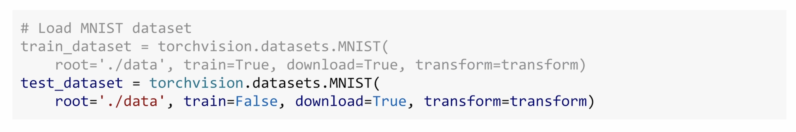

### Data Loaders

Now onto data loaders.

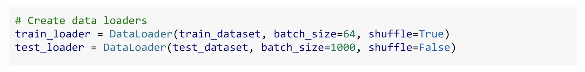

For training you're setting the batch size to be 64. That means it's 64 images in each batch.

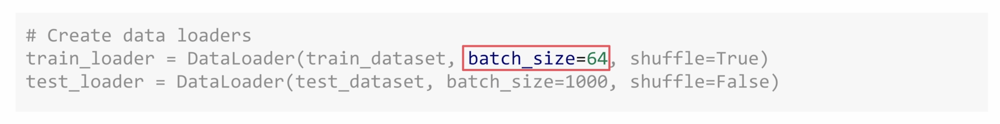

With `shuffle=True`, for every epoch the model will see the images in a different random order.

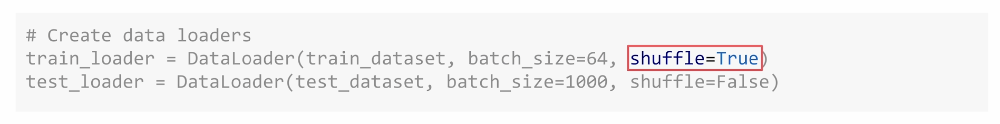

The test loader uses `batch_size=1000`. These are much larger batches because we don't need to calculate gradients, we're only testing.

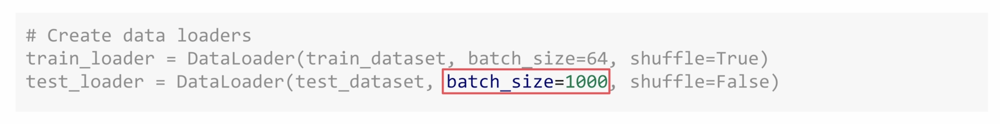

But notice something interesting. The training data is shuffled, but the test data isn't. Take a moment to think about why that might be.

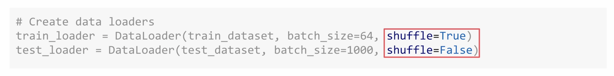

Well, data sets often come organized by class. If you don't shuffle, your model might see 6,000 zeros in a row before seeing any ones. It could learn unintended patterns like early batches are zeros, late batches are nines, instead of actually learning what makes a zero look like a zero. Shuffling will mix everything up so that each batch has variety in it. The model learns the actual features of each digit and not just their position in the data set. But for testing, well, the model's done learning. You're just checking if it can recognize digits correctly. Order doesn't matter then.

## Building the Neural Network

So now it's time to create your neural network. You're going to go beyond sequential and we'll build a custom architecture. Let's walk through this. You're creating a class that inherits from `nn.Module`. This gives you all of PyTorch's neural network functionality. In its `__init__`, you're going to define your layers.

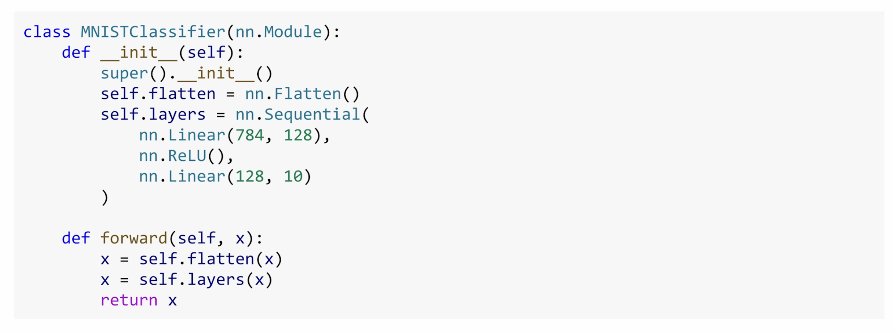

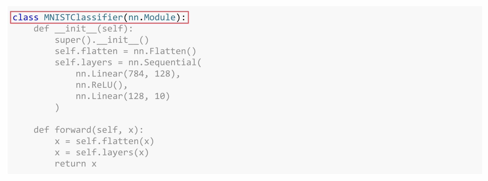

### The Flatten Layer

First comes flatten. This is new. Here's why you need it.

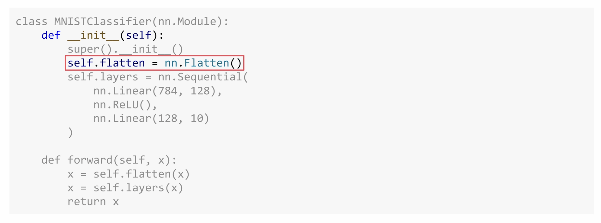

MNIST images arrive as tensors with a specific shape. When PyTorch loads a single MNIST image, it gives you a (1, 28, 28)-dimensional tensor. And that's the channels, the height, and the width. The one channel means that its grayscale is just a single brightness value from 0 to 255 for each pixel. 28 by 28 pixels are the size and those are the other two dimensions.

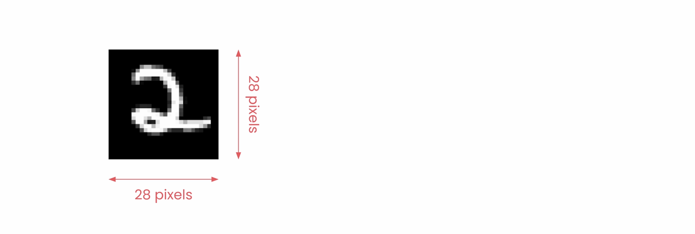

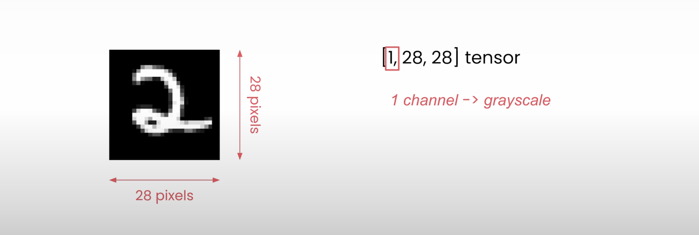

But when you're training on batches, PyTorch will actually add another dimension. So with `batch_size=64`, your data arrives as (64, 1, 28, 28). So that's 64 images, each one channel, and each is 28 by 28 pixels.

Here's the issue. Linear layers expect flat vectors, and that's one long row of numbers per image, not two-dimensional grids.

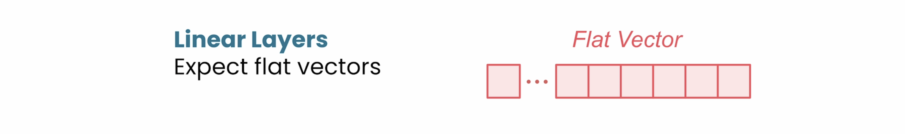

And that's what flatten does. It takes each of your 28 by 28 images and reshapes them into 784 values in a row. Why 784? Because 28 × 28 = 784. So now your batch, instead of being dimension (64, 1, 28, 28), just simply becomes (64, 784). Without flatten, you get a shape mismatch error when your image data hits the linear layer.

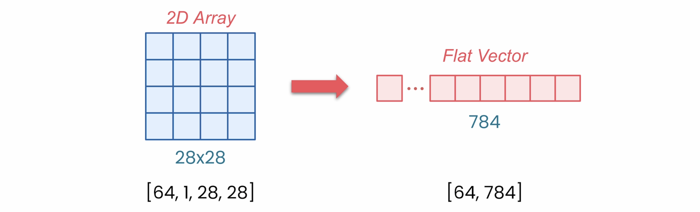

### Stacking the Layers

So now you can stack your layers with sequential. `Linear(784, 128)` takes those 784 pixel values and transforms them to 128 hidden features.

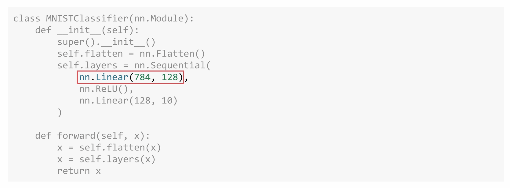

ReLU is our activation function that keeps our positive values and zeros out the negatives.

Then `Linear(128, 10)` takes the 128 features and turns them into 10 outputs. 10 outputs being one for each digit class. We've 10 digits from 0 through 9.

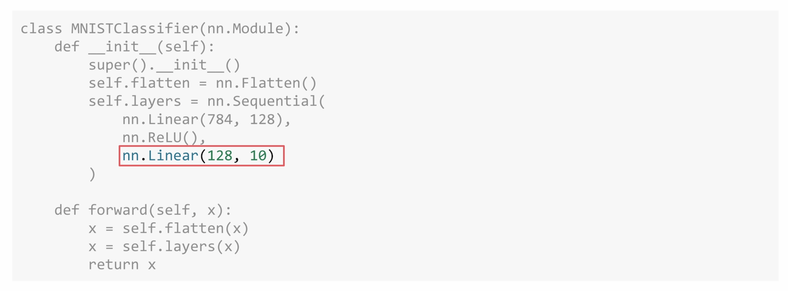

### The Forward Method

Now you're going to define the flow of the data in that forward method. Take the input, flatten it, pass it through your layers, return the output.

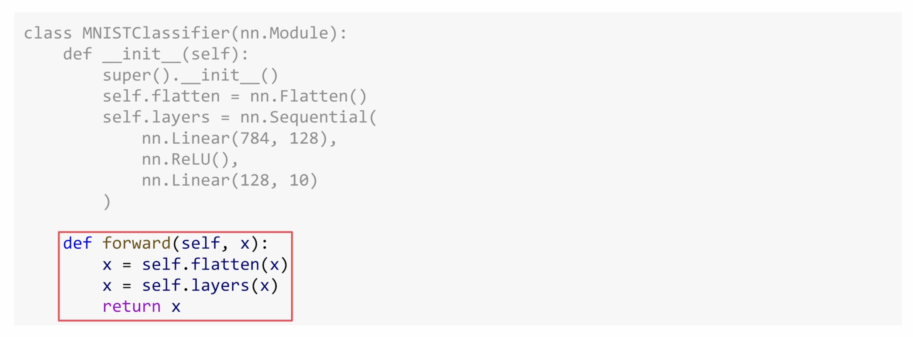

## Summary

So now you have everything ready. A data pipeline that loads and pre-processes MNIST images, and a neural network that can process those images. But right now this model doesn't know a zero from a nine.

In the next video, you're going to see how to bring this model to life with training. You'll see how to set up the optimizer, define the training loop, and watch as your model learns to recognize digits with increasing accuracy. Let's keep going!
