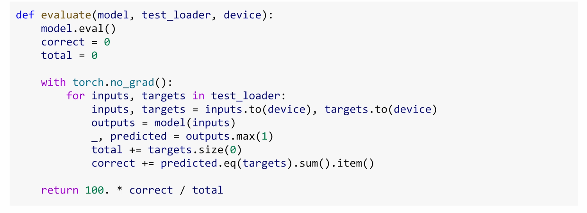
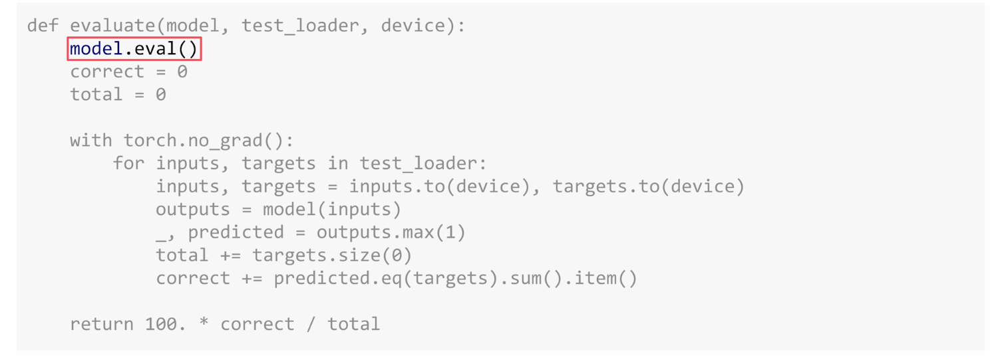
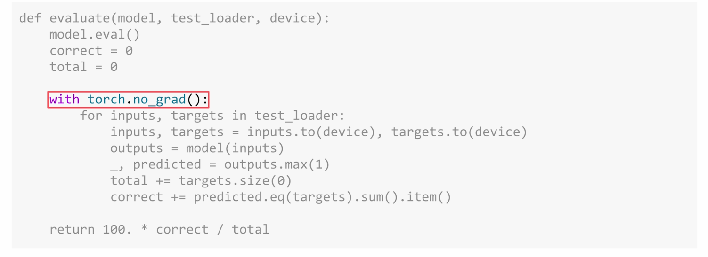
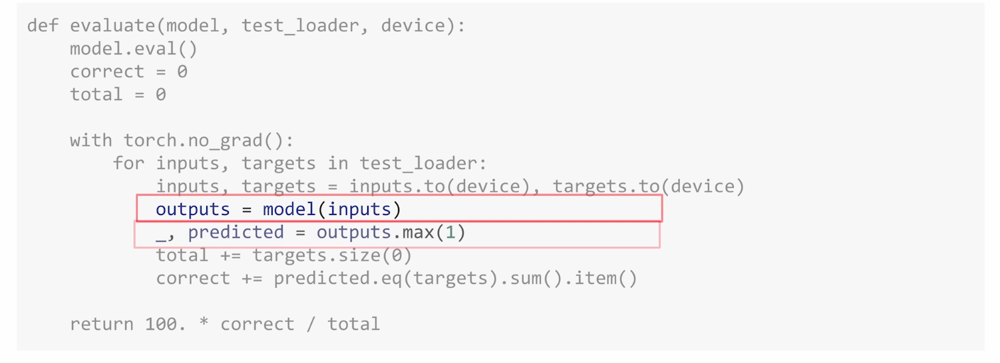
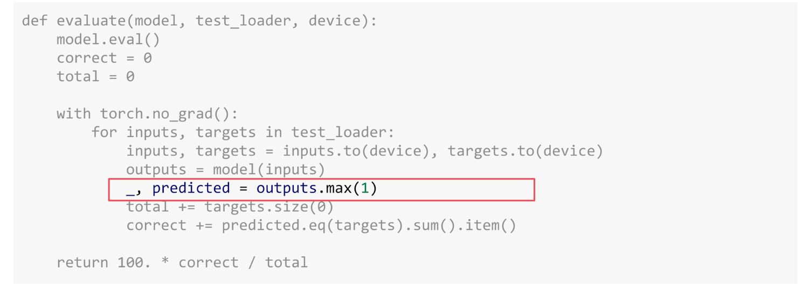
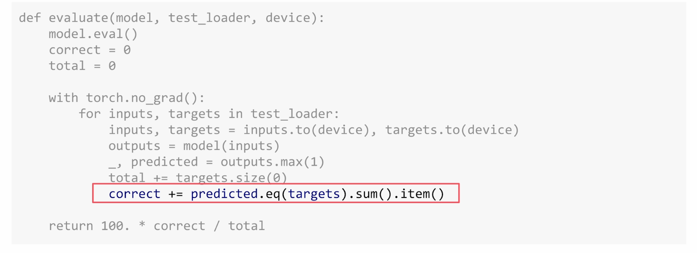
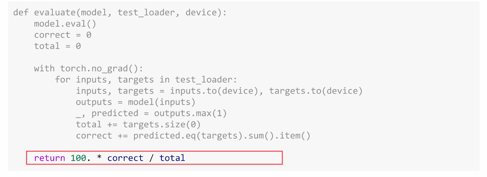
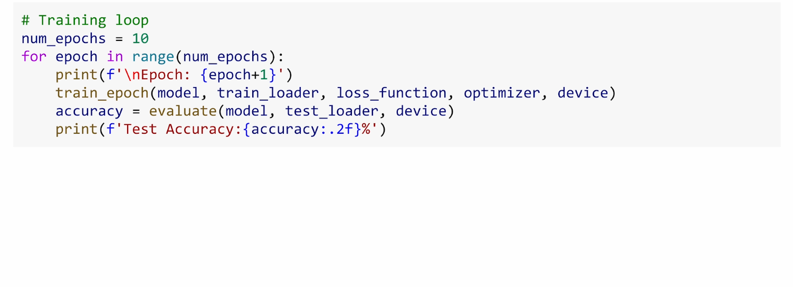
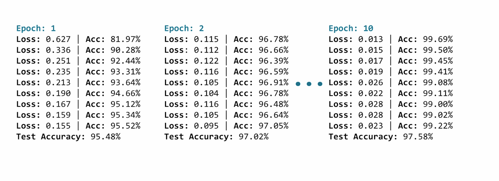

## Training the Model

Welcome back. In the last video, you saw how to build the two key components: a data pipeline that loads MNIST images, and a neural network architecture that can process them. But if you run the model right now, you'll just be guessing. In this video, you're going to walk through the code that actually trains that model step by step.

### Setting Up for Training

Let's start by setting up everything that you need for training.

First, device selection. If CUDA is available, you'll use the GPU. Otherwise, PyTorch is going to fall back to the CPU.

Then, let's create the model and move it to the device using `.to(device)`. Remember, both your model and your data need to be on the same device. Otherwise, you'll get an error during training.

You're going to be using cross-entropy loss as your loss function. And as you saw earlier, it's designed for classification tasks, where the model will pick one class out of many. And that's perfect for choosing a digit from 0 through 9.

And you're using the Adam optimizer with a learning rate of 0.001. You've already seen how Adam adapts its learning rate as it trains by making larger adjustments early when gradients are noisy, and then smaller corrections later as your training stabilizes.

### The Training Function

So now, let's create a function to train our model for one epoch.

The function takes in five inputs: your model, the data loader, the loss function, the optimizer, and the device that everything should run on.

You'll start with `model.train()`, and this puts the model into training mode.

You'll set up three tracking variables:
- `running_loss` accumulates the loss values
- `correct` counts predictions that match the true labels
- `total` counts all of the samples that you've seen so far

### The Training Loop

Next, we're going to loop over all of the batches. And in each batch, we're going to:

1. Move the data and the target to the right device
2. Clear any leftover gradients with `optimizer.zero_grad()`
3. Run a forward pass by calling the model and passing it the data to get output
4. Compute the loss by calling the loss function
5. Back propagate with `loss.backward()`
6. Update the weights with `optimizer.step()`

### Tracking Progress

And then you track your progress. `loss.item()` gives us the loss value, and `output.max` tells us which digit class got the highest score and lets you compare that to that label value.

Every 100 batches, you're going to print out the current loss and accuracy.

With 60,000 training images and batch size 64, that's about 938 batches per epoch. So you're going to see around nine updates.

Notice what's happening here. Look at the loss number. It's dropping from 0.64 to about 0.17, while your accuracy climbs from about 81 percent to about 95 percent. And that's just in a single pass through the training set. And look how little code it took to make all of that happen.

### Evaluation

But training is only half of the story. You need to test your model on new unseen data.

There are two key differences from training:

1. First, `model.eval()` will switch you into evaluation mode

2. Second, you're going to wrap everything in a `with torch.no_grad()` block

During evaluation, you're not training, so you don't need gradients. This will save memory and speed everything up.

The evaluation itself is pretty straightforward. You're going to run each batch through the model, find which class got the highest score with `output.max`, count how many predictions match the true labels.

And then return the accuracy percentage. No optimizer, no loss tracking, no weight updates—just how many did you get right.

### Putting It All Together

Now you have your training function and your evaluation function. Let's put them all together. You'll train the model for 10 epochs. That's 10 full passes through the entire training data set.

But it's not just repetition. With each pass, the model refines its understanding of what makes a 2 different from a 7. After each training epoch, you're going to evaluate on the test set to see how well it performs on unseen data. This tells you if the model is actually learning generalizable patterns or if it's just memorizing the training data.

And here's what you'll see. By epoch 10, you'll notice something really satisfying. The loss is tiny and the accuracy is high. When your accuracy stops improving, it's often a sign that your model is done learning for now, so you may not even need all 10 epochs.

And that's it. You're ready to train your first image classifier in PyTorch. Head over to the lab and give it a try!
