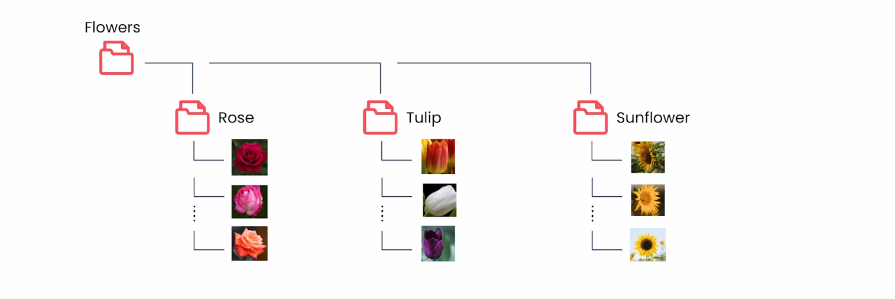
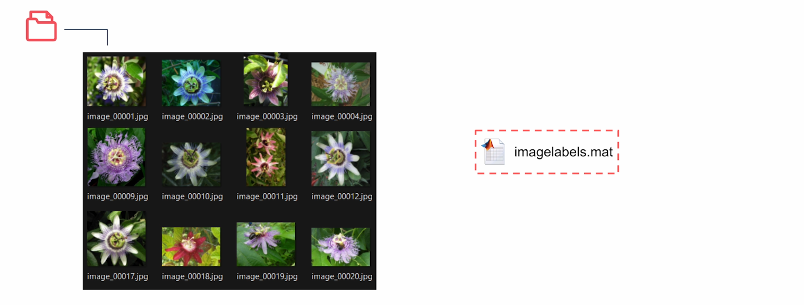
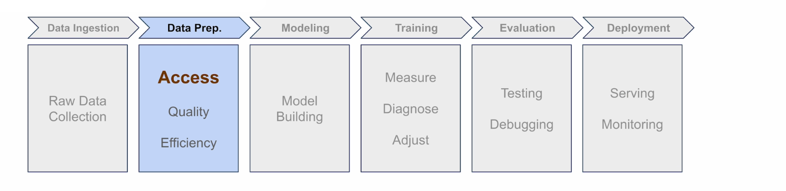
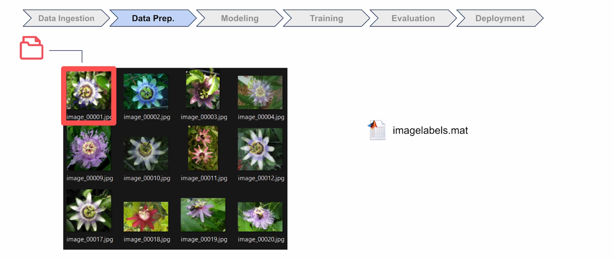
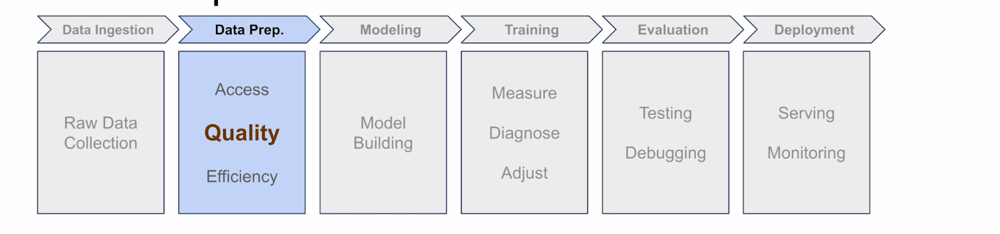
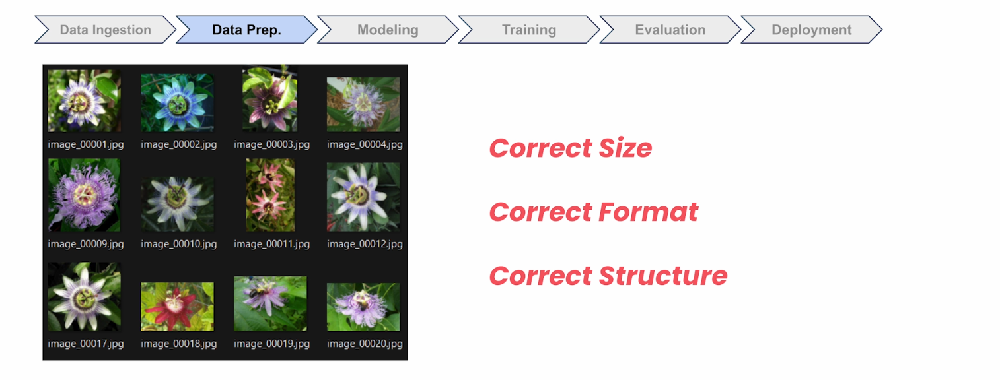
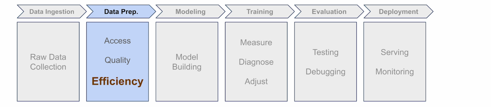
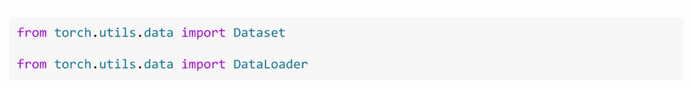

## Introduction to Data Pipelines

Welcome to Module 3. In the last two modules, you've gone from PyTorch fundamentals to building your first image classifier. You can load data, build neural networks, train them, and get real predictions. That foundation is exactly what everything else builds on.

But now things get more interesting. So far you've worked with clean, well-organized datasets like MNIST, but we're going to be diving deeper into the data side of the pipeline now. Because in practice, datasets are often much messier and more challenging.

### The Botanical Garden Challenge

And that's exactly the kind of problem you're about to take on. A botanical garden wants to build a flower identification app for its visitors, and you've been brought in to help.

Three different teams have already tried. They all used exactly the same neural network architecture, identical layers, the same parameters, but they got wildly different results. Why? Because the real challenge isn't just the model, it's also the data.

It doesn't matter how sophisticated your model is, if you can't properly access and prepare your data, you're doomed from the start. Bad data handling means bad results, and that's exactly what sank those teams.

Now you're taking on the project, and I want to make sure that you don't make the same mistakes. Because even the best model in the world can't save you from a broken data pipeline.

### The Oxford 102 Flowers Dataset

So let's see what you're going to be working with. The botanical garden provided the **Oxford 102 Flowers dataset** for training. And here's what you get when you download and unzip it:

- A folder full of images
- When you open the folder, they're generically named JPEG files like `image_0001`
- When you open a file, you can see the images inside it are flowers

In many datasets, images are neatly sorted into folders named after their categories, but that's not the case here.

Instead, labels are stored separately in a `.mat` file, which is a compressed binary format from MATLAB. And you'll need to figure out how to extract your labels from this potentially unfamiliar file type.

So that's a first glimpse at your data. And remember, the only difference between those failed attempts was how each team handled this dataset. It made all the difference between a successful app and a frustrating failure.

### The Data Pipeline Progression

So what does handling the data actually mean? Well, when you're working with any dataset, there's a natural progression and potential problems at every step.

**1. Access**: First, you need to access the files and match the images to their labels. With Oxford Flowers, that's already tricky. The images have generic names and the labels are tucked away in `.mat` files. That's not the most beginner-friendly approach.

**2. Transform (Quality)**: Next, you need to get the images into the right format—correct size, data type, and structure—so your model can actually learn from them.

**3. Load (Efficiency)**: And then finally, you need to load everything efficiently in batches. Not one image at a time or your training could grind to a really slow halt.

### Three Categories of Problems

Problems can crop up at any of these steps and they're not always obvious. So in this module, we'll group these issues into three categories:

- **Access problems**
- **Quality problems**  
- **Efficiency problems**

And when things went wrong for those earlier teams, it could have been any one of those.

### What You'll Learn

In this module, we're going to work through each of these problem areas systematically using that Oxford Flowers dataset. Your main tools will be PyTorch's `Dataset` and `DataLoader` classes.

You've seen them before, but now we're going to dive deeper into what they can really do for you.

By the end of this module, you'll have the data pipeline skills to build the botanical garden app and tackle any project that comes your way.
