## Data Access

In the last video, we saw how the Botanical Garden's earlier attempts at this flower identification app failed because of poor data handling. So now it's time to tackle the first major issue: **data access**. If you can't reliably load your data, well, nothing else matters.

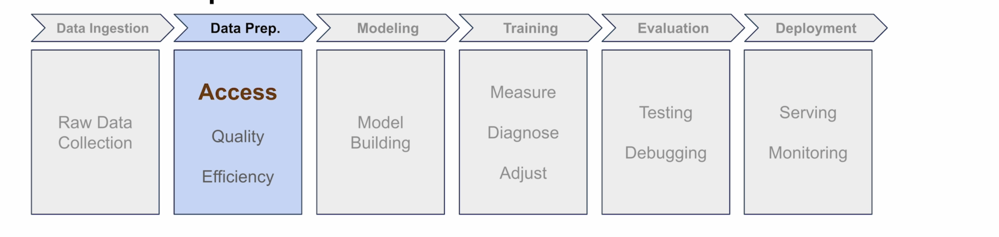

I'll show you what goes wrong with messy datasets like Oxford Flowers and how to fix it using PyTorch's `Dataset` class.

### The Oxford 102 Flowers Dataset

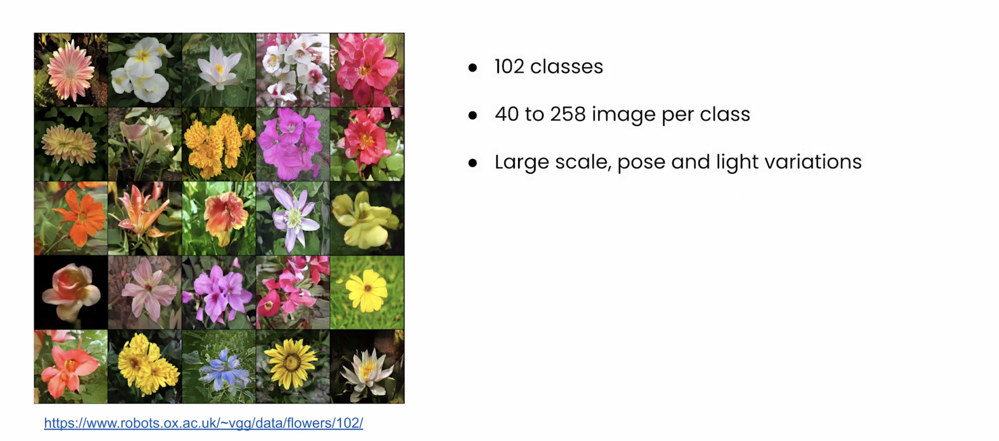

The dataset contains:
- **102 classes** of flowers
- **40 to 258 images per class**
- Large scale, pose, and light variations

### Downloading and Exploring the Dataset

So let's start by downloading the dataset and seeing what we're working with. I've provided the download function for you. You'll explore the details in the lab, but in short, it fetches both the image files and the labels.

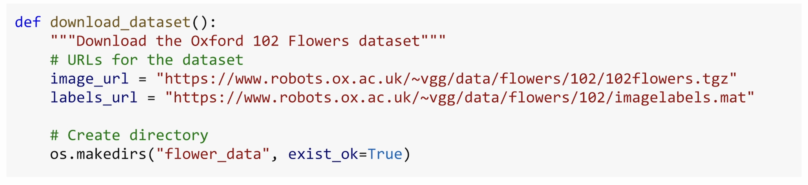

So now let's take a look at what we downloaded:

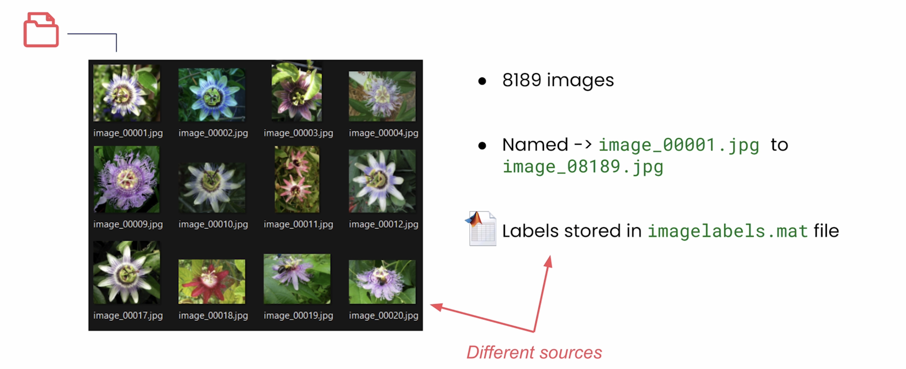

- We've got over **8,189 images**, all with generic names like `image_00001.jpg` to `image_08189.jpg`
- There's no organization by flower type, just a flat list of numbered files
- The labels are stored separately in this `imagelabels.mat` file, a binary format used by MATLAB
- It maps each image to a flower category

So we've got images in one place and labels in another place and another format entirely. We need a way to connect them cleanly and systematically.

### Why Build a Custom Dataset?

In previous modules, you loaded data with pre-built datasets like MNIST. It already knew how to find images and match them to the right labels. Oxford Flowers isn't pre-packaged like that, so you need to show PyTorch how to work with it by building a `Dataset` class.

### The Three Essential Methods

A PyTorch Dataset class (a custom one) needs to answer three questions:

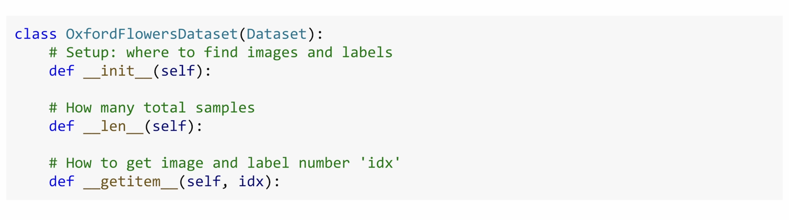

| Method | Question |
|--------|----------|
| `__init__` | How do I set it up and where's the data? |
| `__len__` | How many samples are there? |
| `__getitem__` | When asked for a sample like image 42, what should I return? |

These three methods are all PyTorch needs to work with any data format.

### Implementing `__init__`

Let's implement them with Oxford Flowers. I'll start with `__init__`—this is the setup method. Here's where we'll tell our custom Dataset where to find everything and load any info that we need later.

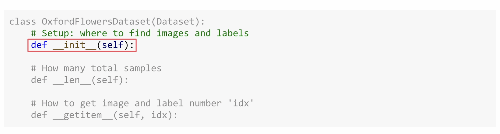

The Dataset does need some setup:
- We're going to handle the file paths
- We're going to read the MATLAB file using SciPy
- We'll even fix the label indexing


And that's what makes it realistic. You can explore the details in the lab, but here's the key takeaway: **we now have access to all of the image paths and their corresponding labels**.

### Examining the Labels

So what's in that labels array? Let's take a look:

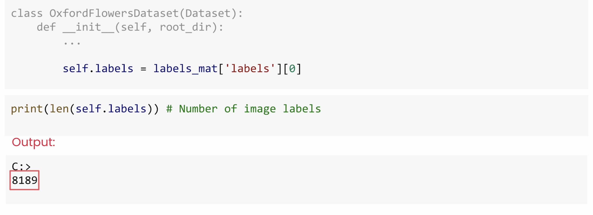

- We have **8,189 labels**—one per image
- Each of these is a number from 1 to 102, representing a flower type
- It does look like the first 10 images are all labeled as type 1, so the dataset does seem to be organized by category

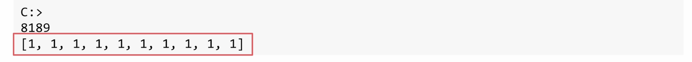

But wait, the labels start at 1? Let's double check that.

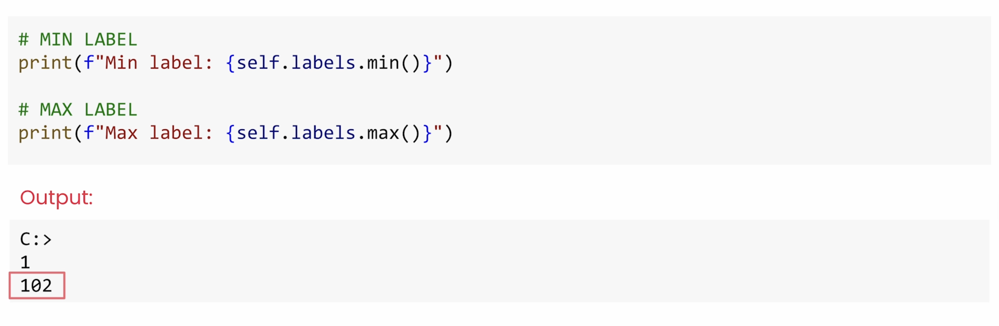

### Fixing Zero-Indexing

Yeah, that's a problem. We have 102 flower types, but **PyTorch expects zero-indexed labels**. So instead of 1 through 102, we need to change this to 0 through 101.

It's the kind of detail that could quietly break your training. So we fix it by subtracting 1 from every label.


Here's the updated `__init__` with the fix applied:

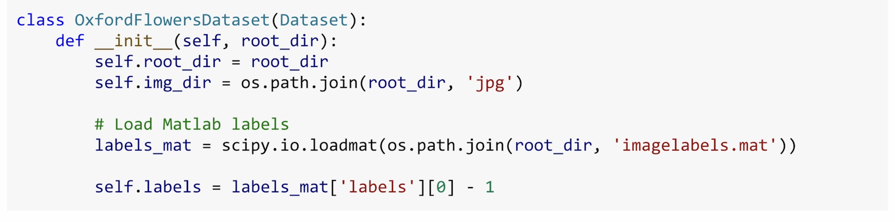

### Lazy Loading

Also, notice what we're **not** doing in `__init__`. We're not loading any images—we're just setting up the info that we'll need to find them later.

This is called **lazy loading**, and it's critical. Loading all 8,189 images at once would use up gigabytes of memory. Instead, we'll just store the paths and the labels. The actual image loading will happen later in `__getitem__`.

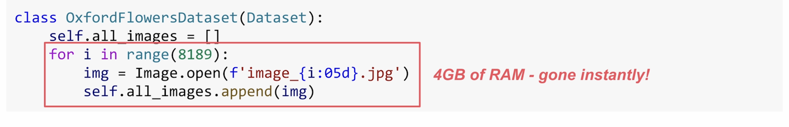

Here's the key takeaway from our `__init__` implementation—we now have access to all image paths and their corresponding labels:


### Implementing `__len__`

Next up is `__len__`. This one's simple. You return the total number of samples in the dataset.


```python
def __len__(self):
    return len(self.labels)
```

Since you have one label per image, the length of the labels array tells PyTorch exactly how many samples to expect. It uses this to properly iterate through your data during training.

### Implementing `__getitem__`

Now for the most important method: `__getitem__`.


Here's the idea: PyTorch gives you an index, and your job is to return the data for that index. That's it.

For this dataset, that might mean something like:
- PyTorch says, "give me sample number 42"
- You return the 42nd flower image and its label (the flower type that it represents)

```python
def __getitem__(self, idx):
    # Pad index with zeros to match file names (image00042.jpg)
    img_path = os.path.join(self.img_dir, f"image_{idx:05d}.jpg")
    image = Image.open(img_path)
    label = self.labels[idx]
    return image, label
```


Here, the `:05d` pads the index with zeros to match the file names (like `image_00042.jpg`). We use PIL (Pillow, Python's Imaging Library) via `Image.open` to load the image. Then we grab the corresponding label from the labels array.

So when PyTorch asks for index 42, it gets image 42 and its label. That's the contract. You define what each sample looks like, and PyTorch will handle how, when, and how often to call this method.

### Debugging: The Off-by-One Error

Now let's make sure our dataset actually works. Oh, we got an error!

Well, let's check the folder. It looks like the images are named `image_00001`, `image_00002`, `image_00003`, etc. And that numbering **starts at 1 and not 0**.

So when we ask for index 0, we're trying to load `image_00000.jpg`, but that file doesn't exist.

So let's fix that in our `__getitem__` method:

```python
def __getitem__(self, idx):
    # Add 1 to idx because files start at image_00001.jpg
    img_path = os.path.join(self.img_dir, f"image_{idx + 1:05d}.jpg")
    image = Image.open(img_path)
    label = self.labels[idx]
    return image, label
```


And now let's try again. Great!

**This is exactly why you always test your dataset early.** A simple off-by-one error like this could have broken everything later. If things are working now, your dataset is successfully connecting images to labels.

### The Universal Pattern

But a quick note: **this pattern will work for any type of data**. The structure is always the same:
- Light setup in `__init__`
- Lazy loading
- Return samples on demand in `__getitem__`


### Summary

You've now built a custom dataset that can systematically access over 8,000 images and labels without crashing memory.

But accessing that data is just the first step. In the next video, you'll tackle **quality problems**—like what to do when your images come in all different shapes, sizes, and formats. I'll show you how to build a transformation pipeline that will then prepare your data for training.
