## Transform Pipelines

In the last video, you built a dataset class that systematically loads all of the images and labels from the Oxford Flowers dataset. But accessing the data is just the first step. In this video, you'll tackle quality problems—the issues that keep raw images from working with PyTorch models.

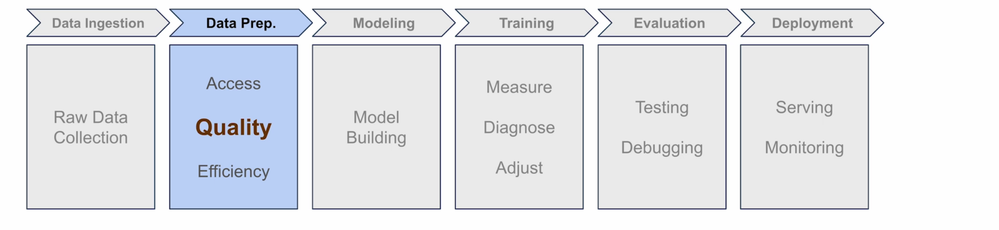

### The Problem: Mixed Sizes and Wrong Format

Raw flowers are PIL images of varying sizes. DataLoader batching fails if dimensions differ. PyTorch models also expect tensors, not PIL.

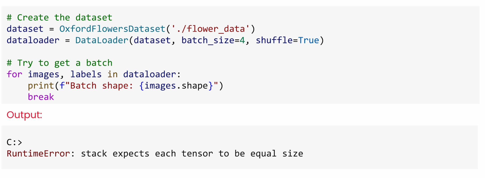


You've got two different problems:

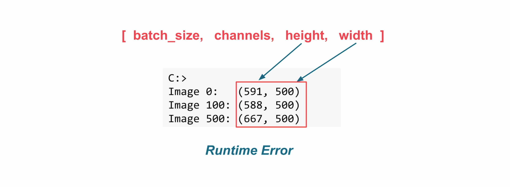

1. **Different sizes** – images vary in dimensions
   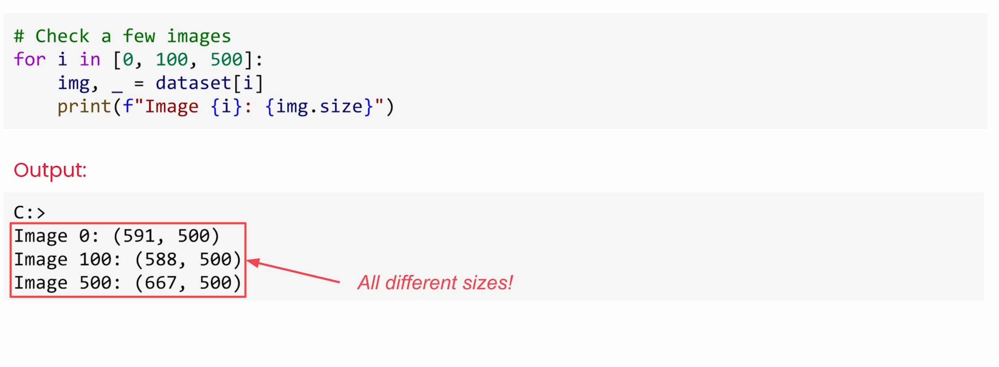
2. **Wrong format** – PIL images instead of tensors

   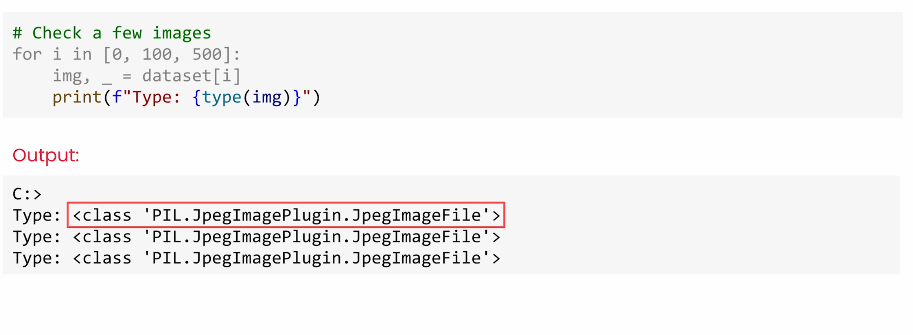

Batch format must be `[batch, channels, height, width]`; mismatched shapes throw errors.

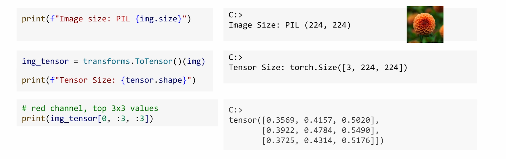

### Building the Transform Pipeline

PyTorch provides transforms that you can chain together to fix these issues:

**Recommended pipeline:**

1) **Resize(224)** – scales the shorter edge to 224, keeps aspect ratio; avoids squashing rectangles.  
2) **CenterCrop(224)** – extracts a square crop from the middle.  
3) **ToTensor()** – converts PIL→tensor, reorders to `C×H×W`, scales pixels 0–255 → 0–1.  
4) **Normalize(mean, std)** – spreads values using predetermined stats (e.g., ImageNet) for stable training.

```python
import torchvision.transforms as T

transform = T.Compose([
    T.Resize(224),          # short edge to 224, keep aspect
    T.CenterCrop(224),      # square crop
    T.ToTensor(),           # PIL -> tensor, 0-255 -> 0-1, CxHxW
    T.Normalize(            # tensor-only
        mean=[0.485, 0.456, 0.406],
        std=[0.229, 0.224, 0.225]
    ),
])
```

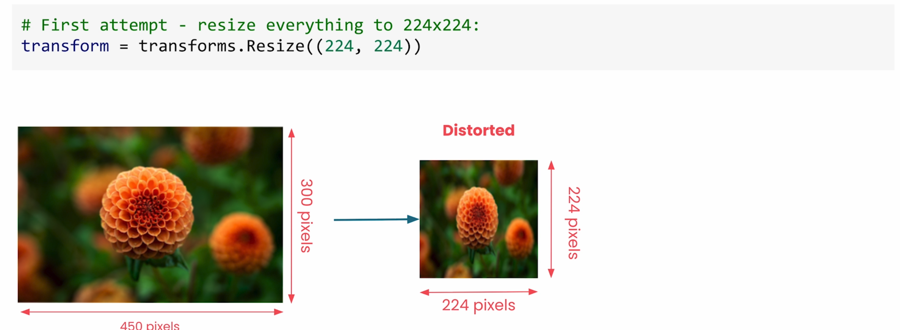

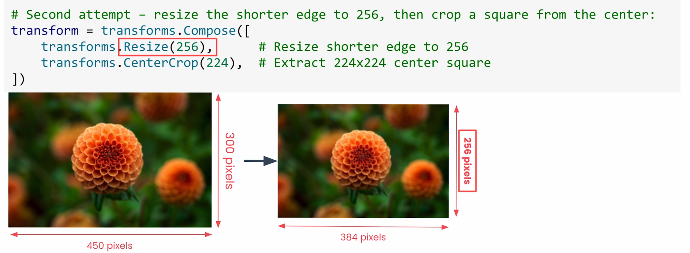

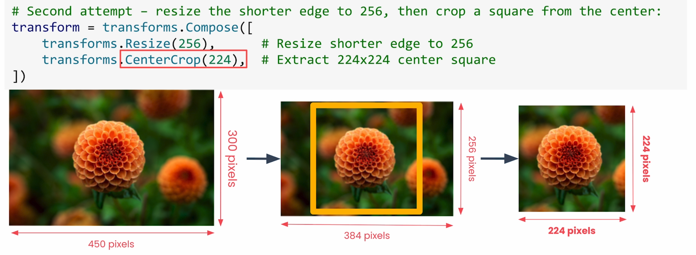

### Understanding ToTensor()

When you call `ToTensor()` on a 224×224 PIL image:

- Converts to tensor format
- Rearranges dimensions by adding channels layer (RGB)
- Scales pixel values: divides by 255, so values fall between 0 and 1

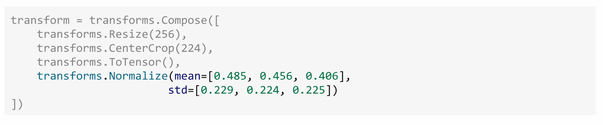

This scaling helps networks learn. By scaling everything into a 0 to 1 range, a 10% change is always a 10% change, no matter the units. Plus, big numbers like 255 can easily explode during multiplication.

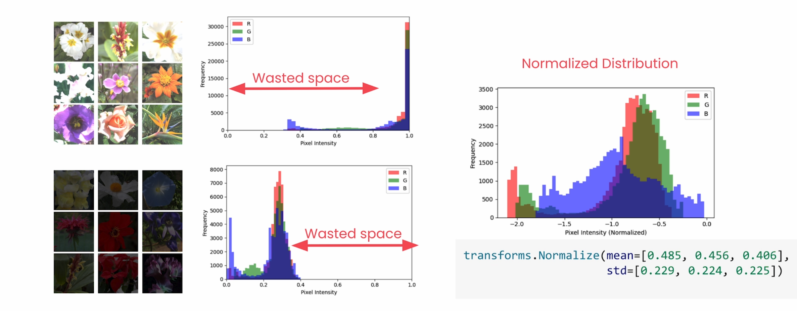

### The ToTensor "Bridge"

Before you run `ToTensor`, you're working with a regular PIL image. `ToTensor` acts like a bridge—once you cross it, you're in tensor land. Some transforms only work on one side:

- **Image transforms**: `Resize`, `CenterCrop` (now work on both sides)
- **Tensor-only**: `Normalize` (will error on PIL images)

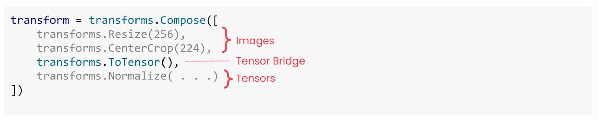

### Debugging Tips

- **Test each step individually** – inspect shapes and value ranges after every transform.
- **Mind the name** – avoid calling your pipeline `transforms` (would shadow the module).
- **Remember the bridge** – `Normalize` only works on tensors; ensure it runs after `ToTensor`.

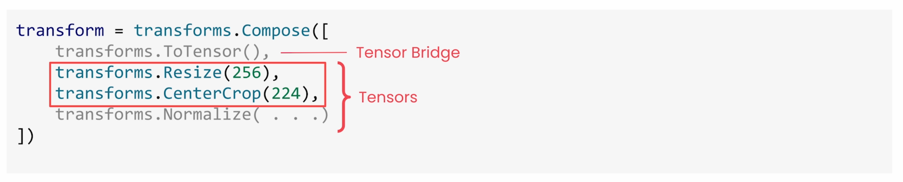

### Sanity Checks

- Pull one item, run the pipeline, and visualize to confirm it looks right.  
- Create a small batch and verify shape `[B, 3, 224, 224]` with reasonable normalized values.  
- If aspect ratios vary a lot, consider `RandomResizedCrop` during training.

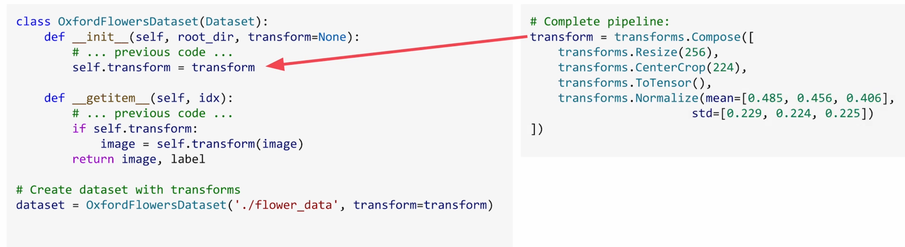

### The Moment of Truth

Now let's update our dataset with the full transform pipeline. Can we finally create that batch that crashed earlier? Perfect! We now have four images in our batch, each has three color channels, and all exactly 224 by 224. The values are properly normalized, and your Oxford flowers dataset is ready for training.

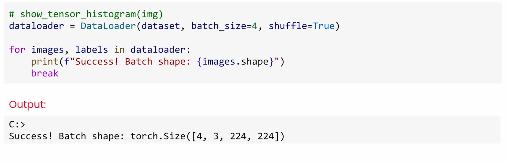

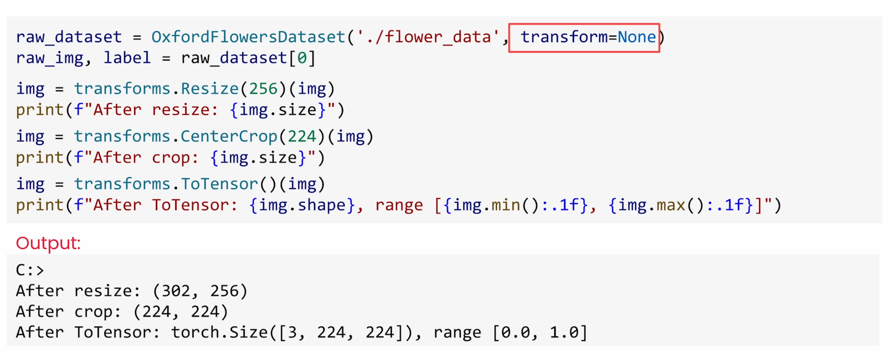

Reference: [Transform Pipelines lesson video](https://learn.deeplearning.ai/specializations/pytorch-for-deep-learning-professional-certificate/lesson/5332u5/transform-pipelines)
