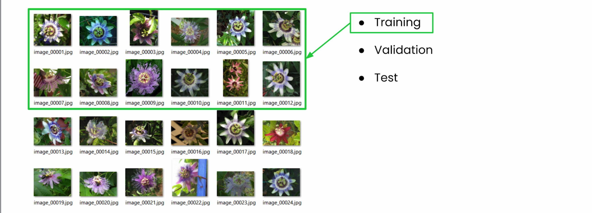
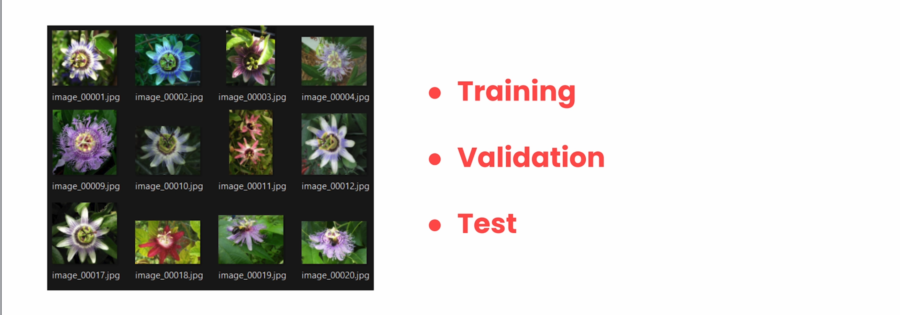
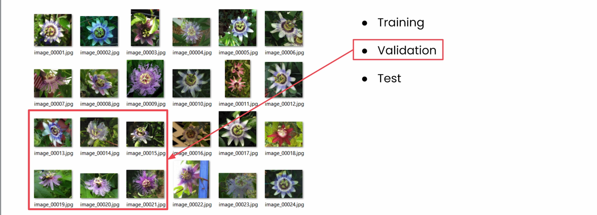
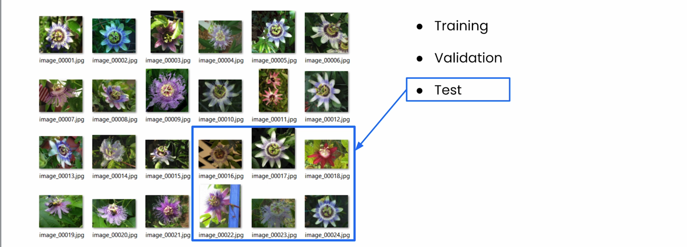
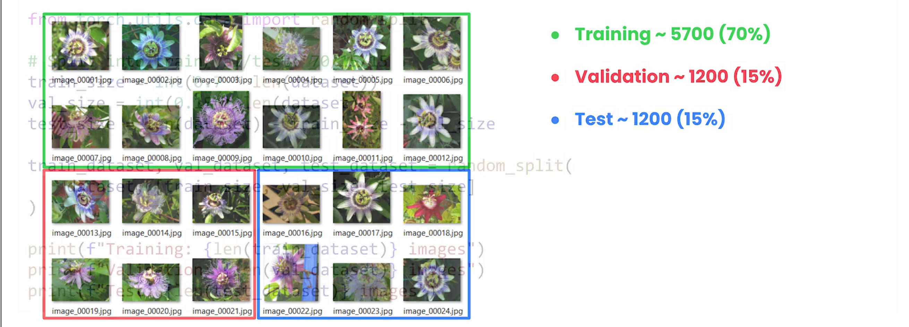
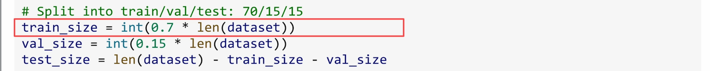
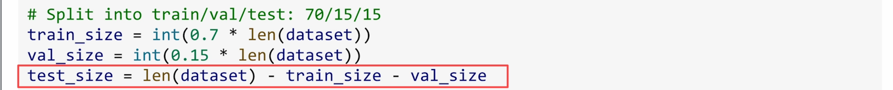
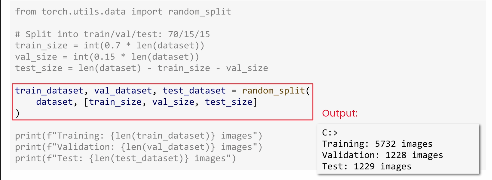
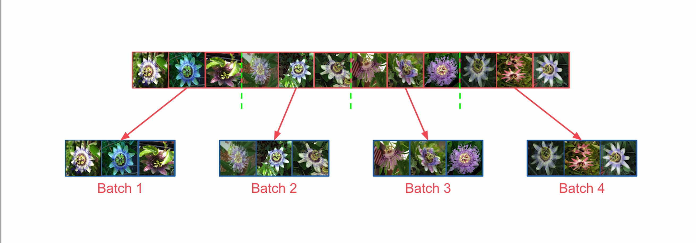

## DataLoader

In the last video, you cleaned up your data with transforms—resizing images, converting them to tensors, and normalizing the values. Now it's time to tackle two more essentials: splitting your data into training, validation, and test sets, and using DataLoader to batch and serve that data efficiently.

### Why Split Your Dataset?

If more data is a good thing, why don't we just train our model on the full set of flower images? Here's the catch: **how would you know if your model works on new photos?**

Typically, you split datasets into three parts:

1. **Training set** – what your model learns from; it sees these images over and over during training
2. **Validation set** – helps you check performance during training while you're still tuning things  
3. **Test set** – your final check, used only once after training's complete



For Oxford Flowers with 8,189 images, you might split roughly like this:

- 5,700 for training (70%)
- 1,200 for validation (15%)  
- 1,289 for testing (15%)





### Splitting in PyTorch

```python
from torch.utils.data import random_split

# Calculate split sizes
train_size = int(0.70 * len(dataset))
val_size = int(0.15 * len(dataset))
test_size = len(dataset) - train_size - val_size  # remainder

# Split dataset
train_data, val_data, test_data = random_split(
    dataset, 
    [train_size, val_size, test_size]
)
```



The key is `random_split`. It randomly assigns images to each set, so you don't end up with all daisies in one and all roses in the other. This gives every split a good mix of the 102 flower types.



**Important:** Your original dataset is not modified. You're not slicing it up—you're just creating three separate views of the same data.







### Using DataLoader for Efficient Batching

Next, you'll use DataLoader to efficiently load batches from each set. This is especially important during training for performance.

```python
from torch.utils.data import DataLoader

train_loader = DataLoader(train_data, batch_size=32, shuffle=True)
val_loader = DataLoader(val_data, batch_size=32, shuffle=False)
test_loader = DataLoader(test_data, batch_size=32, shuffle=False)
```

Remember that `batch_size=32` means you'll get 32 samples at a time instead of just one. Looping through a DataLoader gives you one batch per iteration:

```python
# Inspect first batch
for images, labels in train_loader:
    print(f"Images shape: {images.shape}")  # [32, 3, 224, 224]
    print(f"Labels shape: {labels.shape}")  # [32]
    break
```

Each batch gives you two things:

- **Batch of images** – 32 images, each with 3 color channels, size 224×224
- **Batch of labels** – one label for each image in that batch

You can also use this pattern for quick debugging without starting a loop:

```python
images, labels = next(iter(train_loader))
```

### Why Shuffle?

We set `shuffle=True` for training data for two key reasons:

1. **Avoid position bias** – If your dataset is ordered (daisies first, then roses, then sunflowers), your model might learn to associate position with flower type instead of learning the actual features.

2. **Prevent catastrophic forgetting** – If the model sees only daisies for many batches and then only roses, it can actually forget what it learned about daisies. Shuffling mixes flower types in each batch, helping the model retain everything.

**Why `shuffle=False` for validation and test?** Simple: your model is not learning from these sets. It's just being evaluated, so shuffling isn't needed.

**Important clarification:** Shuffle only affects how DataLoader serves up the batches. Your original dataset remains unchanged.



### Understanding Batches and Epochs

Let's clear up a common source of confusion. Here's the math for 5,732 training images with `batch_size=32`:

- 5,732 ÷ 32 = 179.125
- You can't have 0.125 of a batch
- Result: **179 full batches** of 32 images + **1 partial batch** with 4 images = **180 batches total**

**One epoch** means going through all 180 batches once, seeing every image in your dataset exactly one time.

```python
# Verify batch sizes
for i, (images, labels) in enumerate(train_loader):
    if i >= len(train_loader) - 3:  # Last 3 batches
        print(f"Batch {i+1}: {len(images)} images")

# Output:
# Batch 178: 32 images
# Batch 179: 32 images  
# Batch 180: 4 images  ← partial batch (normal!)
```

When you train for 10 epochs, you're going through all 180 batches 10 times. Your model sees each image 10 times in total, but in a different random order each epoch, thanks to `shuffle=True`.

### Common Pitfalls to Avoid

**Pitfall 1: Loading data in `__getitem__`**

```python
# ❌ BAD: Loads CSV 5,732 times per epoch
def __getitem__(self, idx):
    df = pd.read_csv('data.csv')  # Reloads entire file!
    return df.iloc[idx]

# ✅ GOOD: Load once in __init__
def __init__(self, csv_path):
    self.data = pd.read_csv(csv_path)  # Load once
    
def __getitem__(self, idx):
    return self.data.iloc[idx]
```

If you load the CSV in `__getitem__`, that's 5,732 times per epoch. For 10 epochs, that's over 57,000 full loads of the same file—a massive and unnecessary slowdown.

#### Pitfall 2: CUDA out of memory

If you get CUDA out of memory errors, the first thing to do is reduce your batch size. Start with 32 or even 16, and then work your way up to fit available memory.

### Putting It All Together

```python
# Complete pipeline
train_loader = DataLoader(train_data, batch_size=32, shuffle=True)
val_loader = DataLoader(val_data, batch_size=32, shuffle=False)
test_loader = DataLoader(test_data, batch_size=32, shuffle=False)

# Verify everything works
for images, labels in train_loader:
    print(f"Batch shape: {images.shape}")  # [32, 3, 224, 224]
    print(f"Labels shape: {labels.shape}")  # [32]
    break
```

You now have a complete data pipeline for the Botanical Garden app—from those messy `.mat` files all the way to efficient batch loading. In the next video, we'll look at ways to bug-proof that pipeline.
