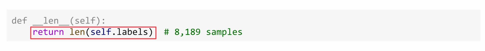
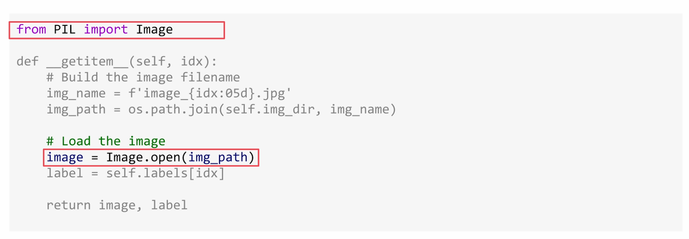
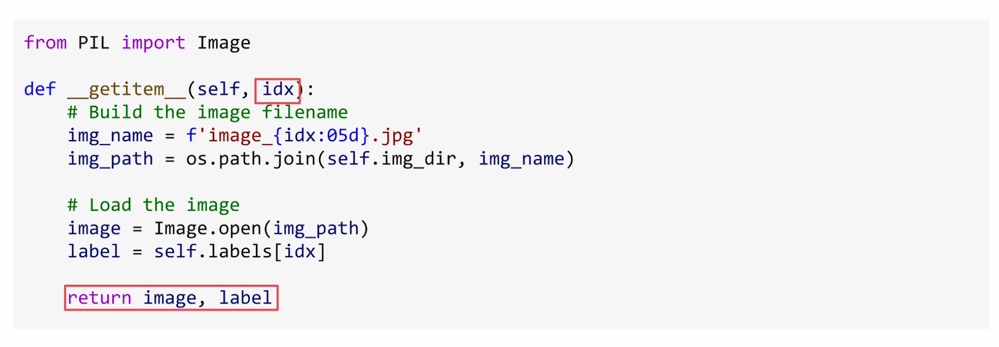
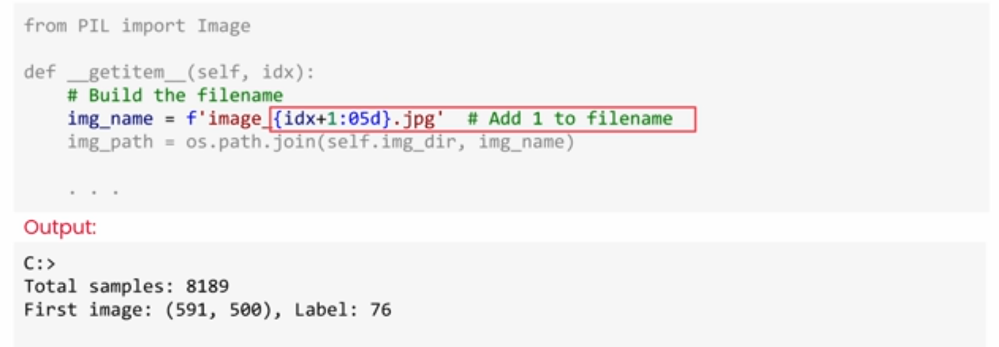
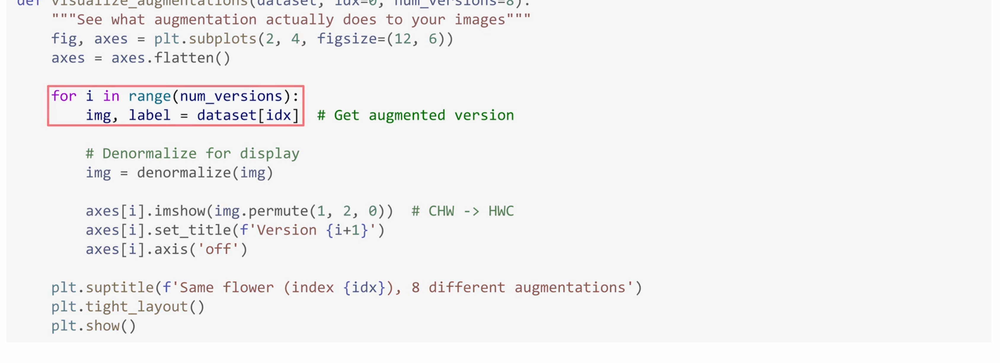
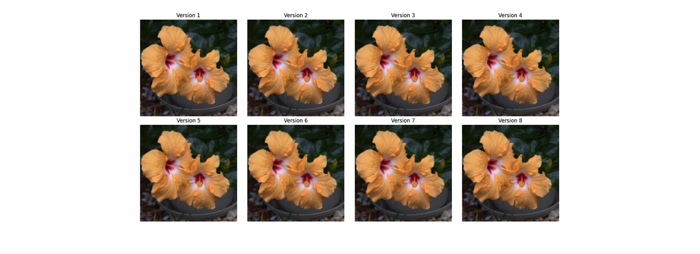
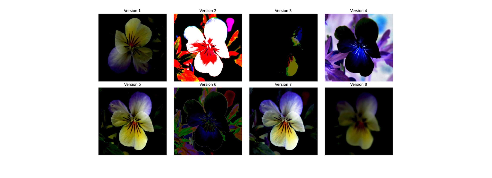
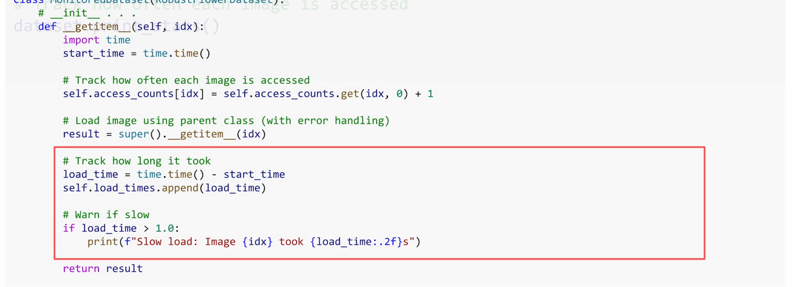

## Bugproof Pipelines

### Overview

Learn techniques to make your pipeline more reliable and your model more robust through:
- Data augmentation to handle real-world variations
- Single batch testing to catch errors early
- Error handling to prevent crashes from corrupted data
- Pipeline monitoring and tracking

### Data Augmentation

#### Why Data Augmentation?

Your model has only seen original images taken in similar conditions. Data augmentation helps it recognize patterns in more varied situations by:
- Generating new versions of images with transformations
- Teaching the model to focus on essential features (shape, color) rather than superficial details
- Handling variations like different angles, lighting, and positioning

#### On-the-Fly Augmentation

Instead of saving transformed copies as new files, PyTorch applies random transformations every time an image is loaded:

**Benefits:**
- Endless variation of training data
- No extra storage required
- Different transformations in each epoch

**Example:** Flower image #42 might be:
- Epoch 1: Flipped horizontally
- Epoch 2: Rotated slightly and darkened


*Figure 1: Same flower in Epoch 1 with horizontal flip augmentation*


*Figure 2: Same flower in Epoch 2 with rotation and darkening*


*Figure 3: Eight different augmented versions of the same rose image*

#### Separate Transforms for Training and Validation

**Training Transforms** (with augmentation):

```python
train_transform = transforms.Compose([
    transforms.RandomHorizontalFlip(),
    transforms.RandomRotation(degrees=15),
    transforms.ColorJitter(brightness=0.2, contrast=0.2, saturation=0.2),
    transforms.ToTensor(),
    transforms.Normalize(mean=[0.485, 0.456, 0.406], std=[0.229, 0.224, 0.225])
])
```

**Validation Transforms** (no augmentation):
```python
val_transform = transforms.Compose([
    transforms.ToTensor(),
    transforms.Normalize(mean=[0.485, 0.456, 0.406], std=[0.229, 0.224, 0.225])
])
```

**Why skip augmentation for validation?**
- Need to evaluate on consistent data
- Ensures performance changes are due to model improvements, not random input variations

### Dataset Structure Review

Before diving into error handling, let's review the core Dataset structure that we'll be enhancing:

#### Core Dataset Methods

A PyTorch Dataset requires three key methods:


*Figure 8: Basic Dataset class structure with \_\_init\_\_, \_\_len\_\_, and \_\_getitem\_\_ methods*

**The \_\_len\_\_ method:**


*Figure 9: \_\_len\_\_ returns total number of samples (8,189 in this example)*

**The \_\_getitem\_\_ method:**


*Figure 10: \_\_getitem\_\_ loads and returns an image using PIL's Image.open()*


*Figure 11: Returns both the image and its corresponding label*

**Important Index Handling:**


*Figure 12: The idx parameter determines which image to load*


*Figure 13: Adding 1 to idx when building filename to match dataset numbering scheme*

### Error Handling

#### Common Issues
- Corrupted images (partially downloaded files)
- Invalid files
- Images that are too small for transforms
- Grayscale images in RGB pipelines

#### Building a Resilient Dataset

**1. Track Errors**

```python
self.errors = []
```

**2. Add Safety Checks in `__getitem__`**
```python
def __getitem__(self, idx):
    try:
        # Verify file is not corrupted
        img = Image.open(img_path)
        img.verify()
        # Size check - skip tiny images
        if img.size[0] < 32 or img.size[1] < 32:
            raise ValueError("Image too small")
        # Convert RGB - fixes grayscale images
        img = img.convert('RGB')
        # Apply transforms
        img = self.transform(img)
        return img, label
    except Exception as e:
        # Log the error
        self.errors.append({
            'idx': idx,
            'path': img_path,
            'error': str(e)
        })
        # Print warning
        print(f"Warning: Error loading image {img_path}: {e}")
        # Gracefully skip to next image (recursive call)
        return self.__getitem__((idx + 1) % len(self.data))
```

**3. Review Issues After Training**
```python
def get_errors(self):
    return self.errors
```

**Benefits:**
- Pipeline doesn't crash on bad data
- Clear record of what went wrong
- Can inspect and fix issues later

### Validating Augmentation

#### The Problem
Overly aggressive augmentation can make images unrecognizable, preventing the model from learning proper features.

#### Visualization Tool

```python
def visualize_augmentation(dataset, idx, num_samples=8):
    fig, axes = plt.subplots(2, 4, figsize=(12, 6))
    for i, ax in enumerate(axes.flat):
        # Get augmented version
        img, label = dataset[idx]
        # Reverse normalization for display
        img = img * torch.tensor([0.229, 0.224, 0.225]).view(3, 1, 1)
        img = img + torch.tensor([0.485, 0.456, 0.406]).view(3, 1, 1)
        img = torch.clamp(img, 0, 1)
        # Display
        ax.imshow(img.permute(1, 2, 0))
        ax.axis('off')
    plt.show()
```


*Figure 4: Code showing how to visualize augmentations by repeatedly calling dataset[idx]*

#### What to Look For

✅ **Good:** Flower is clearly recognizable in each version


*Figure 5: Good augmentation - flower is clearly recognizable in all versions*

❌ **Too weak:** All images look identical (augmentation not working)

❌ **Too aggressive:** Images look like abstract art


*Figure 6: Too aggressive augmentation - some versions are unrecognizable with wild colors and distortions*

❌ **Normalization issue:** All black or wild colors

### Pipeline Monitoring

#### Why Monitor?

Without tracking, you might have:
- Images never accessed due to shuffling bugs
- Some images loaded far more often than others
- Performance bottlenecks from slow load times

#### Lightweight Tracking

```python
class MonitoredDataset(Dataset):
    def __init__(self, ...):
        # ... existing code ...
        self.access_counts = {}
        self.load_times = {}
    
    def __getitem__(self, idx):
        start_time = time.time()
        # Track access
        self.access_counts[idx] = self.access_counts.get(idx, 0) + 1
        # ... load image ...
        # Track load time
        load_time = time.time() - start_time
        if idx not in self.load_times:
            self.load_times[idx] = []
        self.load_times[idx].append(load_time)
        return img, label
    
    def get_stats(self):
        return {
            'access_counts': self.access_counts,
            'avg_load_times': {
                idx: sum(times) / len(times) 
                for idx, times in self.load_times.items()
            }
        }
```


*Figure 7: MonitoredDataset class showing tracking of load times and warnings for slow loads*

#### What to Check

**After each training epoch:**
- Which images are being loaded
- How often each image is accessed
- How long each load takes

**Issues to catch:**
- Shuffling bugs (images never accessed)
- Data imbalance (certain images accessed too often)
- Performance issues (slow load times)

### Summary

You've transformed your data pipeline from basic to production-ready:

1. **Data Augmentation:** Makes model robust to real-world variations
2. **Error Handling:** Prevents crashes from corrupted data
3. **Augmentation Validation:** Ensures transformations are reasonable
4. **Pipeline Monitoring:** Catches bugs and performance issues early

**Best Practice:** Catch problems early before days of training investment.

### Key Takeaways

- Use on-the-fly augmentation for infinite training variations
- Skip augmentation for validation to ensure consistent evaluation
- Add error handling to gracefully skip corrupted images
- Visualize augmentations to verify they're reasonable
- Monitor pipeline activity to catch bugs before training
- Test everything before committing to long training runs


