## Introduction to AWS Labs

### Lab environment

For the lab, it is better to use a laptop or desktop computer instead of a tablet.
The lab uses Amazon Web Services (AWS) which take some time to spin up. You may need to wait a few minutes for the lab to open.

1. Click on  button  (upper right of the screen) to begin the lab. Note: On the first start of the lab, the lab environment should load in a few seconds, but subsequent attempts may take up to 20 minutes.

2. Click on   (top left of the screen), which will open AWS Management Console in a new tab. Then you can return to this tab to find the remaining instructions.
Note: If you see the window like in the following printscreen, click on logout link, close the window and click on   again.

    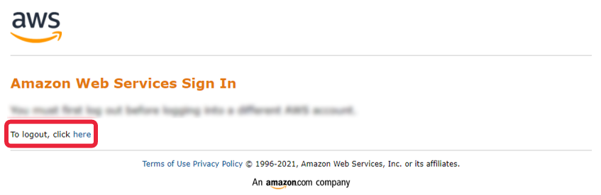

3. Go to Amazon SageMaker.

    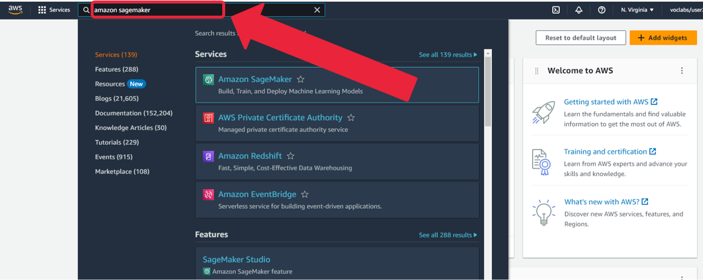

4. Click on Studio and then Open Studio.

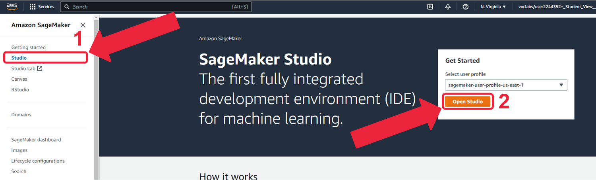

5. Click on Launch -> Studio. You may need to wait for a few moments and then hit a refresh button to see the Launch button.

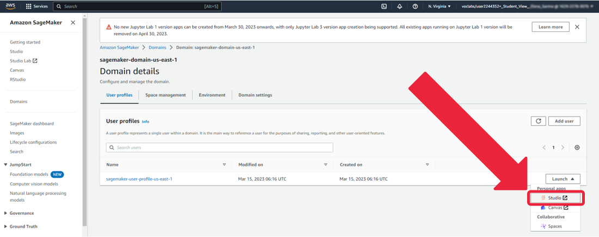

6. Wait a few moments...

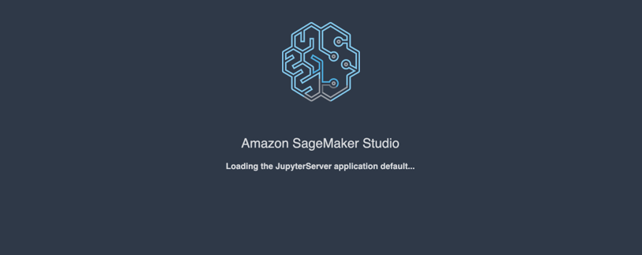

...welcome to SageMaker Studio. Click on Open Launcher.

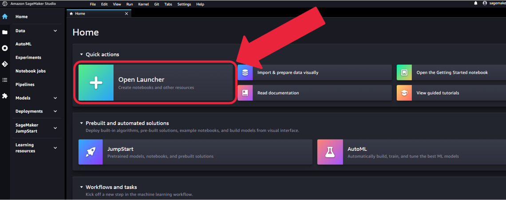

Note: If you do not see the SageMaker Studio screen shown above, you may need to disable pop up blockers and/or VPN.

7. Open System terminal.

    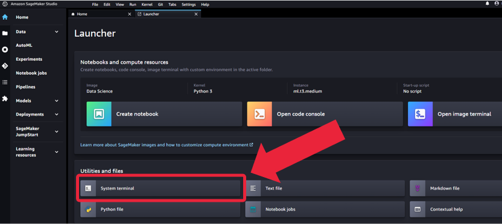

8. Use the following command (you can copy and paste it) in the System terminal to download the lab:

`aws s3 cp --recursive s3://dlai-generative-ai/labs/w1-549876/ ./`

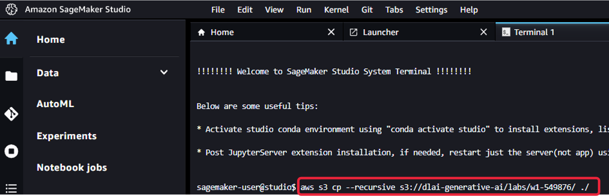

9. Click on the folder icon on the left to find the downloaded notebook:

    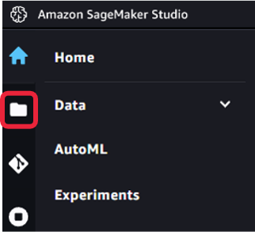

    Note: You might need to update the environment to see the downloaded notebook.

    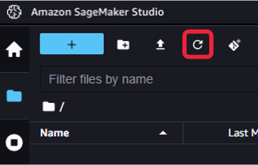

10. Open **Lab_1_summarize_dialogue.ipynb** notebook (if you need to set the kernel, please choose "Python 3 (Data Science 3.0)").

    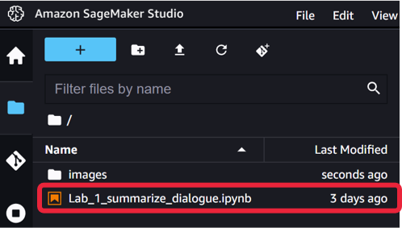

Lab content: Summarize Dialogue.

11. Follow the lab instructions in the **Lab_1_summarize_dialogue.ipynb** notebook.

**Finish the lab**

12. If you wish to download the notebook, right-click on the notebook file in the File Browser, then select Download. Or in the main menu, choose File, then Download.

13. Close all the windows of the AWS Management Console.

14. Click on  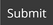 button to complete the lab. If you want to verify whether the lab is successfully completed, click on  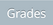.

Note: The AWS account, which was created for the lab, expires within 2 hours. During this period you can close all of the console windows and come back to your work later. After the expiration the current AWS account will go through a cleanup procedure (which will take up to 25 minutes), then the access to the new account will take longer (up to 20 minutes) and your previous work will not be saved. To save the notebook locally before the expiration you can download the notebook from the Amazon SageMaker Studio (right click on the notebook -> “Download” command).