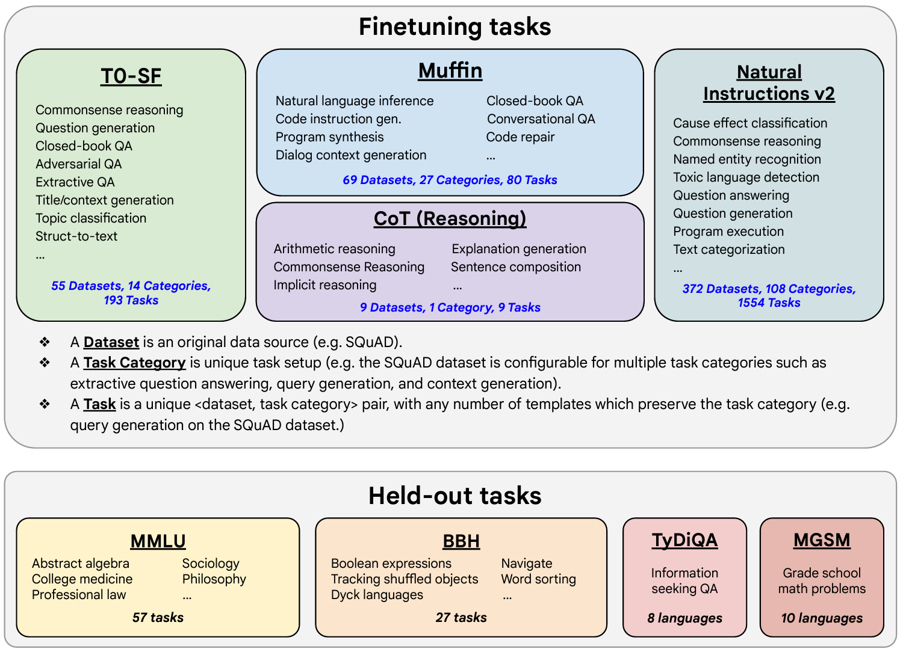

## Scaling instruct models
[This paper](https://arxiv.org/abs/2210.11416) introduces FLAN (Fine-tuned LAnguage Net), an instruction finetuning method, and presents the results of its application. The study demonstrates that by fine-tuning the 540B PaLM model on 1836 tasks while incorporating Chain-of-Thought Reasoning data, FLAN achieves improvements in generalization, human usability, and zero-shot reasoning over the base model. The paper also provides detailed information on how each these aspects was evaluated.

Here is the image from the lecture slides that illustrates the fine-tuning tasks and datasets employed in training FLAN. The task selection expands on previous works by incorporating dialogue and program synthesis tasks from Muffin and integrating them with new Chain of Thought Reasoning tasks. It also includes subsets of other task collections, such as T0 and Natural Instructions v2. Some tasks were held-out during training, and they were later used to evaluate the model's performance on unseen tasks.

  