<!--
https://academy.langchain.com/courses/take/intro-to-langgraph/lessons/57712261-lesson-1-motivation
-->

# Introduction to Lang Graph

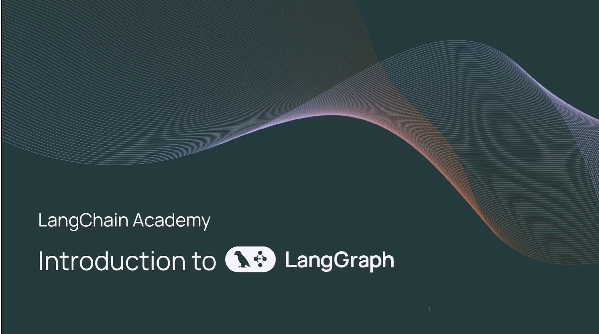

Let us look at the motivation before doing a deep dive.

## Solitare Model

Model alone is limited in functionality as it doesn't have access to tools and external services.

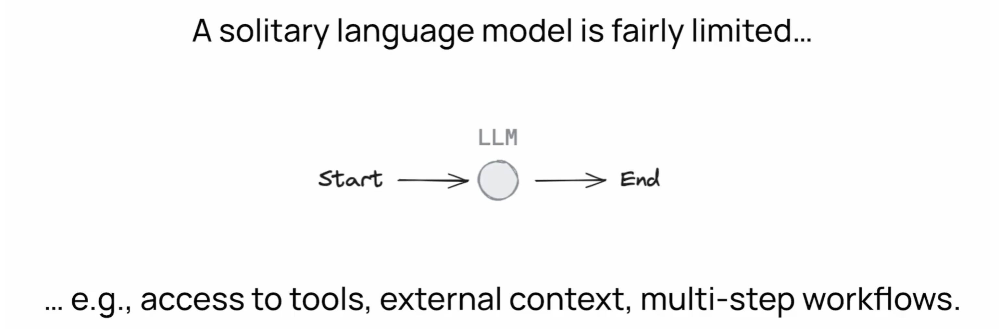

It cannot perform multi-step workflows

## Control Flow

LLM applications use control flow called , it could pre or post LLM call

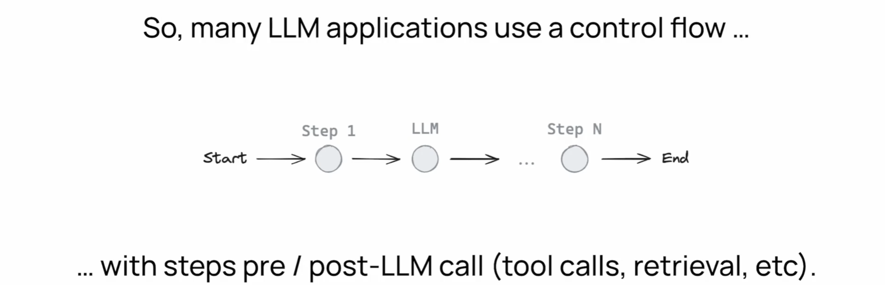

### Chain

Most common pattern is a chain

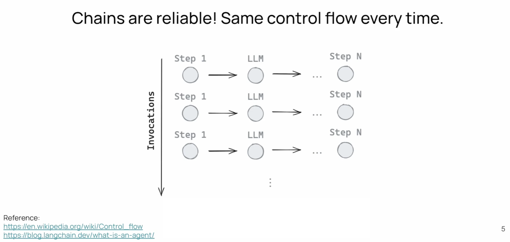

Chains are reliable, it follows the same path but we want LLM to be able to pickup its own flow.

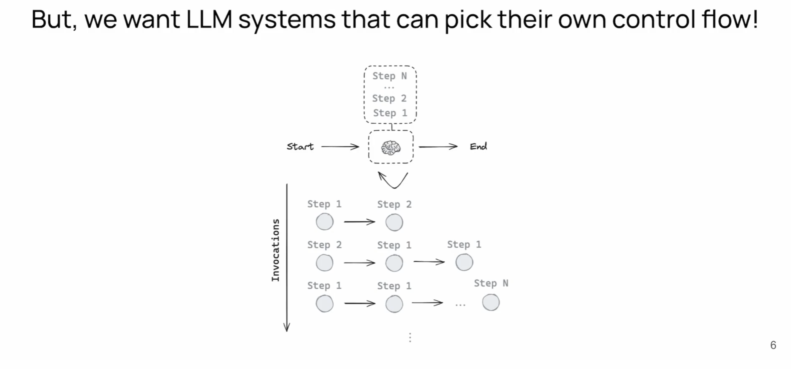

## Definition

This is a very simple definition of an Agent --> LLM which defines its own control flow

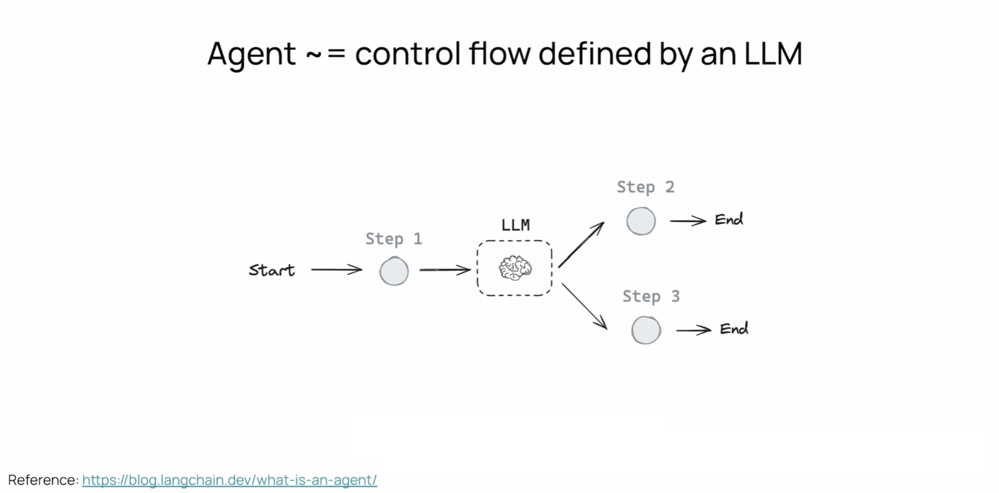

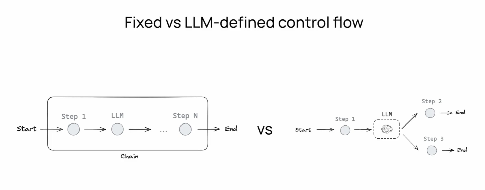

## Different Kinds of Agents

There are different kinds of agents, from less control to the agent (more deterministic to more control and less flexibility)

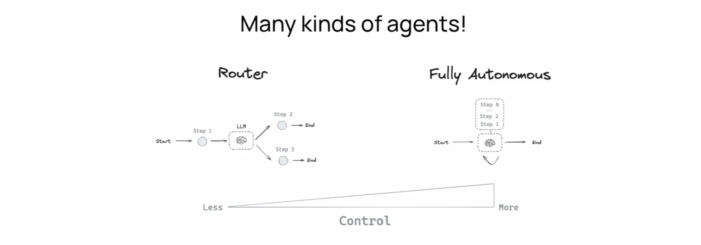

## Challenges in building these agents

There are practical challenges. We can think of application reliability on y-axis and level of control on x-axis.

As you increase level of control to the LLM the reliability drops

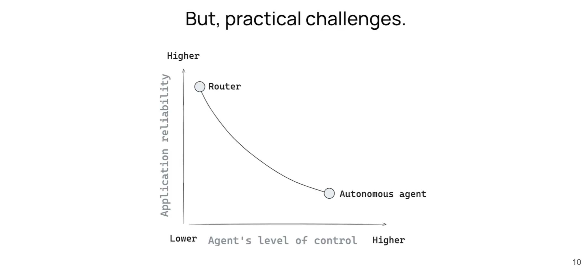

### LangGraph and Reliability

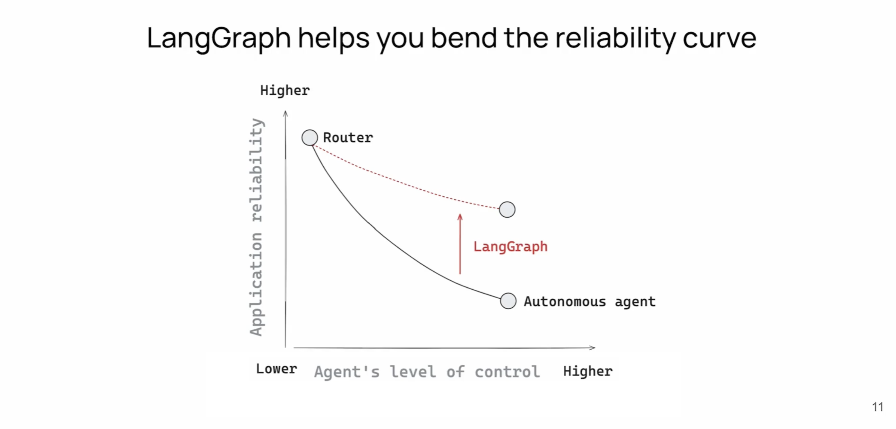

Langgraph is built to help you bend this reliability upwards

## Intuition of LangGraph

We want to combine developer intuition with LLM Control.

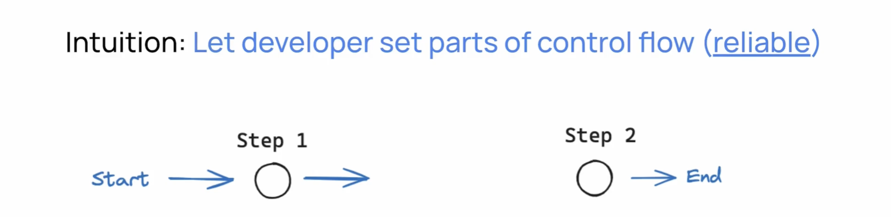

--- 

So you start your flow, you go to step one, you end with step two every time, but you also can interject LLMs at arbitrary points, turning.

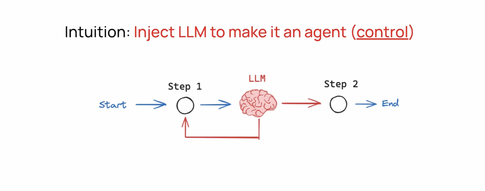

They contain nodes, which nodes you can think about as the connectivity between nodes and there's a lot of flexibility.

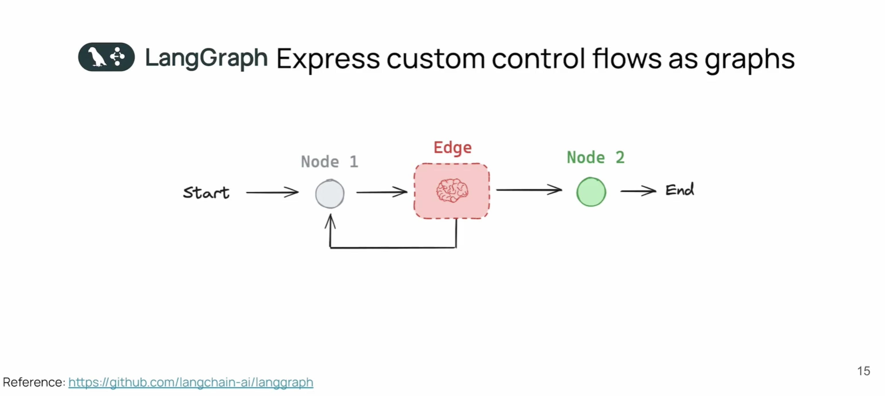

## Pillars

There's a few specific pillars for LangGraph that help you achieve the functionality. 

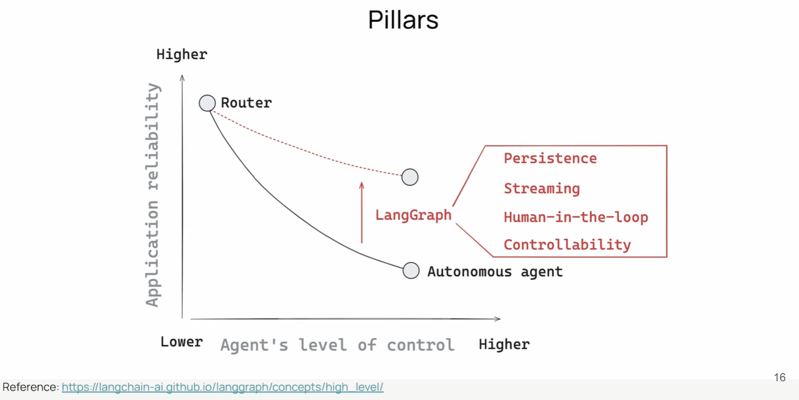

It has

* Persistence
* Streaming
* Human in the loop

These pillars are going to be cornerstones of the course.

## IDE

Langgraph also comes with an IDE called Langgraph Studio. 
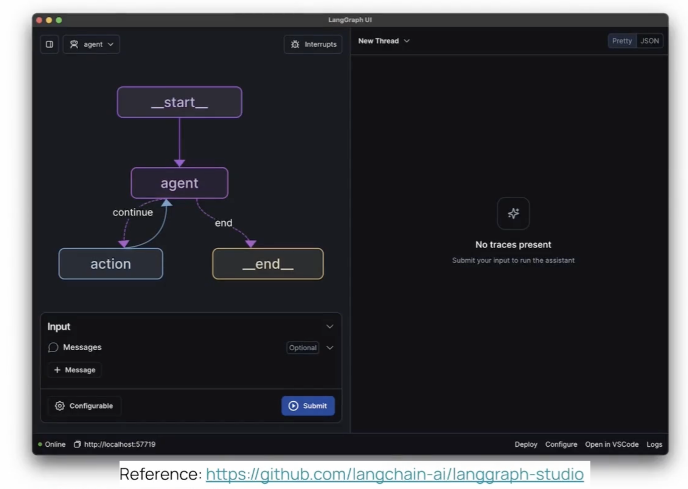

We will be using it for debugging and observability.

## Langchain and LangGraph

LangGraph and Langchain work seamlessly together.

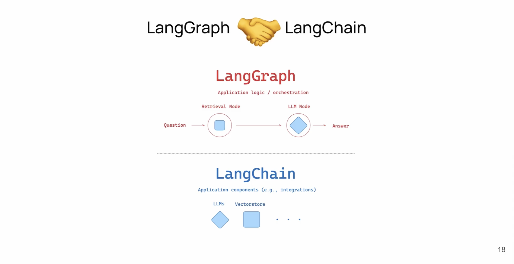

Langchain components are used within LangGraph. For example for RAG we have a retrieval step and then question answering step, which takes a question and provides an answer.

Retriever could be a langchain vectorstore. Likewise LLM node could use langchain.

If you dont want you need not, but it does provide some nice LLM interoperability features.

## Module 1,2,3 Topics

### Module 1
We are going to cover basics, We will use LangGraph IDE and cover two types of agents

.png)
* Router Agent
* General tool calling agent.

### Module 2

Next we will cover chatbot with memory to sustain long running conversations and persistence

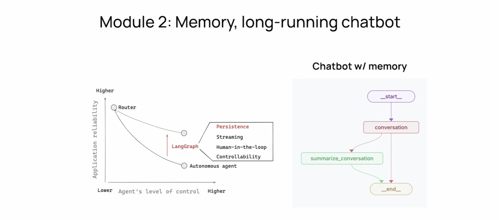

### Module 3

In module 3 we will cover streaming and human in the loop use case

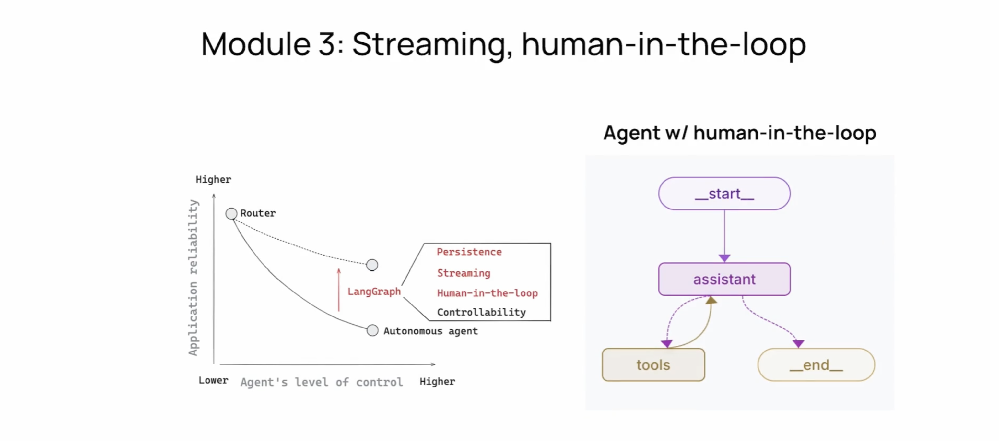

Human in the loop will be called before tool calling. We will also cover streaming

### Module 4

We will bring everything together in module 4 by building a research assistant.

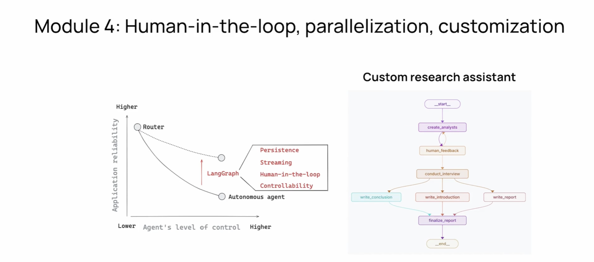
It will have human in the loop, map reduce, streaming, memory and persistence.

## Summary

We will cover basic architecture in first three modules and wrap it up with a more complex agent in module 4.