# MCP Client-Server Architecture

## Introduction

MCP is based on a client-server architecture.  
In this lesson, we'll go through the features that MCP can provide and how the communication between the client and the server takes place.

All right. Let's dive in.

## Motivation Behind MCP

We previously spoke about why the Model Context Protocol is so useful for building AI applications and connecting to external data sources.  
Now let's dive a little bit deeper into the architecture behind MCP.

# MCP System Design

## Client-Server Model

Similar to other protocols, MCP follows the client-server architecture, where MCP clients maintain a 1-to-1 connection with MCP servers.  

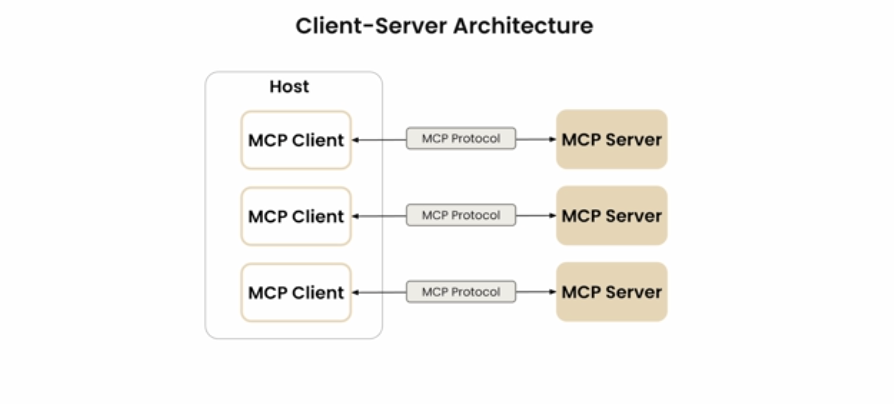
These two communicate through messages defined by the MCP itself.

## Clients and Hosts

These clients live inside a host, such as Claude Desktop or Claude AI.  
The host is responsible for storing and maintaining all of the clients and their connections to MCP servers.

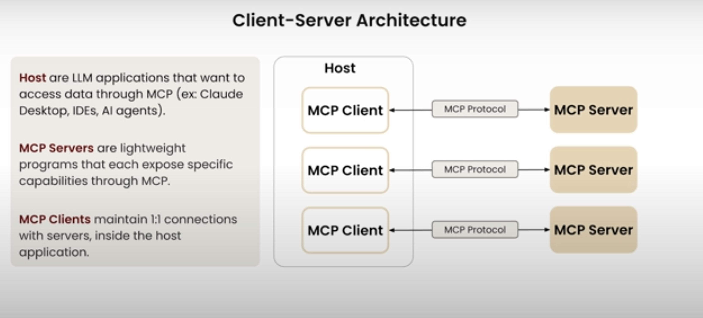

We'll explore this in more depth. Hosts are LLM applications that want to access data through MCP.

## Servers

Servers are lightweight programs that expose specific capabilities via the MCP protocol.  
Soon, we’ll begin building our own servers, followed by clients and hosts containing multiple clients.

The code will be a bit lower-level, but the objective is to understand the architecture.  
When using tools like Claude Desktop, Cursor, or Windsurf, this understanding helps you know what’s happening under the hood.

# Communication in MCP

## Overview

Before we discuss the specific responsibilities of the client and server, let's look at the primitives or fundamental components of the protocol.

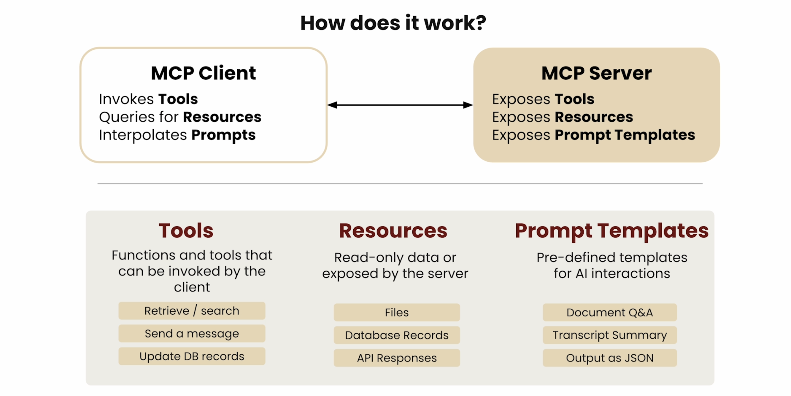

### Tools

If you're familiar with tool use, tools in MCP will look very similar.  
They are functions invoked by the client, used for:

- Retrieving information  
- Searching  
- Sending messages  
- Updating database records  

Tools are typically used for operations that require a POST request or modification.

### Resources

Resources resemble a GET request.  
They represent read-only data or context exposed by the server.

Applications may choose to consume or ignore these resources.  
Examples include:

- Database records  
- API responses  
- Files  
- PDFs  

### Prompt Templates

The third primitive is a **prompt template**.  
Prompt templates aim to remove the burden of prompt engineering from the user.

# MCP Prompt Templates and Tool Interaction

## Prompt Engineering with MCP Servers

You might have an MCP server whose job is to query things in Google Drive and summarize and so on, but the user itself would need to write the prompt necessary to achieve all of those tasks in the most efficient way possible.  
Instead of mandating that the user write the entire prompt and figure out the best practices for prompt engineering, prompt templates are predefined templates that live on the server that the client can access and feed to the user if they so choose.  
We're going to see in a few lessons how to build tools, resources, and prompt templates both on the server and the client.

## Roles of Client and Server

The client's job is to find resources and find tools.  
The server's job is to expose that information to the client.  
Now that we have an idea of some of these primitives—tools, resources, prompts—let's go explore what this actually looks like.

## Claude Desktop and SQLite Server Connection

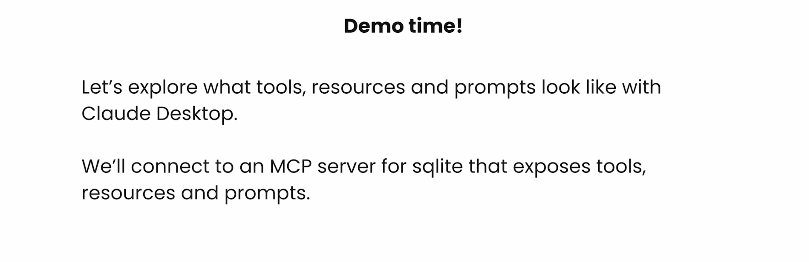

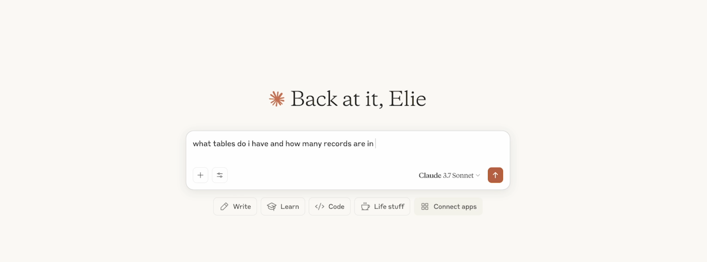

I'm going to be using a host Claude Desktop, and I'm going to connect to an MCP server for SQLite that exposes tools, resources, and prompts.  
So let's take a look at that. Right here in Claude Desktop, I've connected to an MCP server and I have tools at my disposal to work with SQLite.  
We'll talk a bit about the configuration settings in a later lesson. I wanted to show you what this looks like in action.

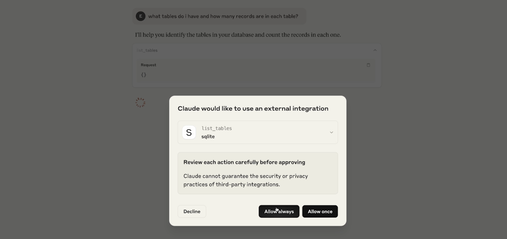

Once I connect to this MCP server, I can start talking to my data in natural language.  
So I'll ask right after that what tables do I have and how many records are in each table.

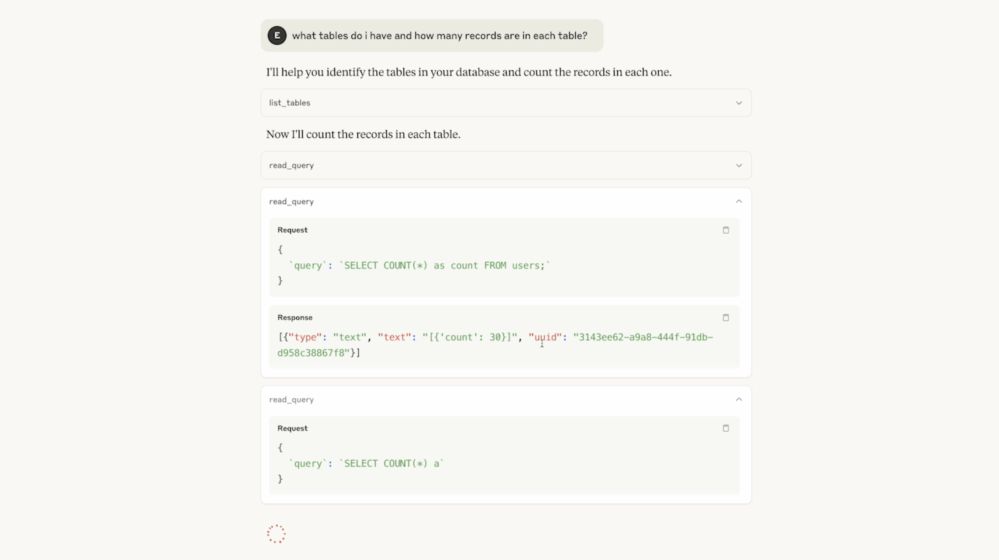

This right here is Claude connecting to the outside world.  
We can see here we're going to be using a tool from the SQLite server called List Tables.  
You can see in the request there's no dynamic data being sent. And I'll go ahead and allow this.

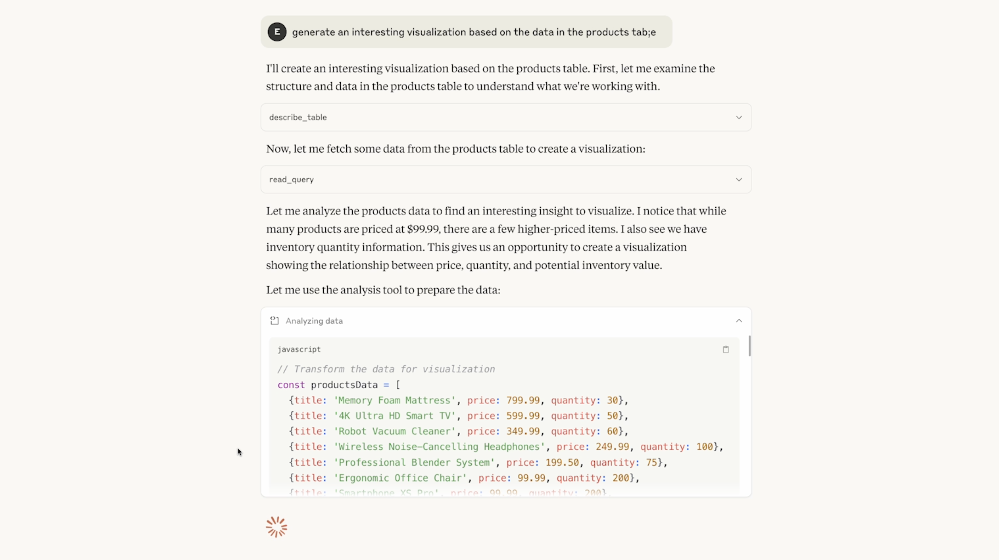

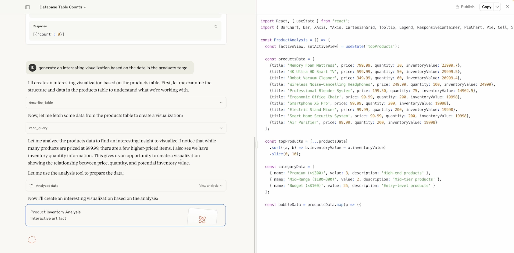

## Human-in-the-loop and Tool Execution

The ability to require a human in the loop is based on the interface that the host develops.  
So the server itself is simply sending back the tools.  
The client is then taking advantage of those tools and executing the data necessary.

We can see here for the number of records that we have: 30 products, 30 users, and zero orders.  
So we can see the records that we have in this table.

## Visualizing Data with Artifacts

What we can start to do now is something a little more interesting—by taking advantage of tools like artifacts and making this slightly more visually appealing.  
So generate an interesting visualization based on the data in the products table.

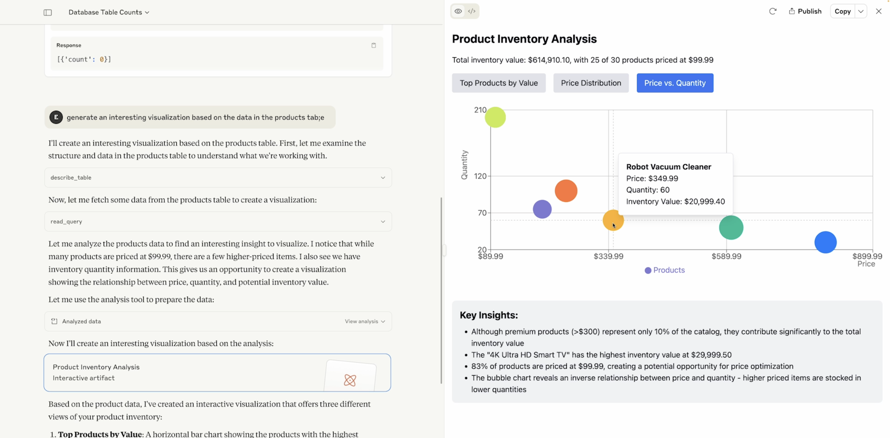

You can imagine even with my spelling mistake, we'll be able to query that information that we need.  
So we'll go find the table. We'll run the necessary query and fetch the data necessary.  

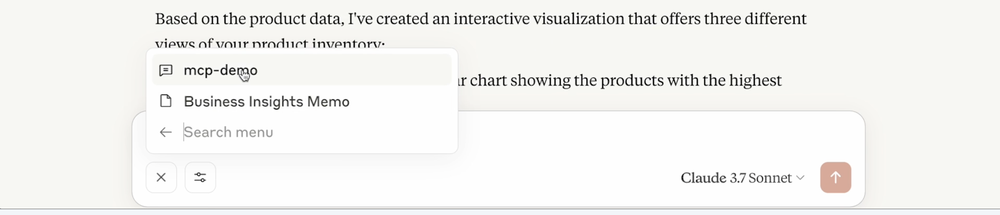

We'll see here we're going to analyze this. And it's going to tell us many things are priced low, but there are a few higher-priced items.

We're going to use the analysis tool to analyze this data.  
What we're bringing in here is context to an AI application.  
This could be Claude Desktop. This could be with any other model.  
This could be in any other environment. But through MCP we can build really interesting applications right off the bat.

I'm making use of the artifacts feature in Claude so that we can see a nice little visualization.  

But the goal here is really to let your imagination carry you where you can go with this.

## Creating Compelling Applications with External Data

Bringing in external data and external systems allows you to easily create much more interesting, compelling, and powerful applications.  
We'll see here the code generated. It's going to be a nice little visualization.  
I have a distribution. I have price versus quantity and so on.  
And right after that, I can take this data that I want and turn it into something meaningful.

## Tool Use in MCP

We're doing this through tool use.  
So the first primitive that we've explored are the tools given to us by the MCP server.  
Next, let's explore some other primitives.

## Using Prompt Templates in SQLite

I'm going to see here in SQLite that there is an MCP demo prompt.  
This is a prompt template that is being sent from the server, where all I have to do as the user is pass in some dynamic data.  
So here we're demonstrating what we can do with this particular prompt.

This is a topic to seed the database with initial data.  
So let's go ahead and seed the database with some data around planets.

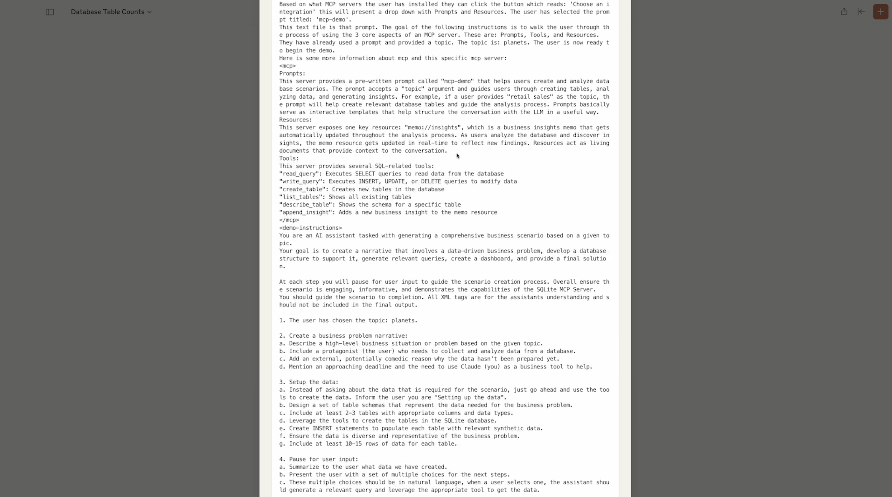

When I add this to the prompt we can see right off the bat there is a text file that's generated with a prompt that the server has given me.  
We can see right here this is not something that I, as the user, have to write.  
I just choose the dynamic data and then I go ahead and run that particular prompt.

What we're going to see here is this prompt in action.  
And here this is going to generate a business problem and analyze some data and set up information and so on.  
But you can imagine giving your users much more battle-tested evaluated prompts so you don't have to do it yourself.

You'll see here we're going to set up some tables.

## Integrating Tools and Prompts for AI Applications

### Setting Up and Populating Tables

You'll see here we're going to set up some tables.  
We're going to query.  We're going to populate all kinds of actions we can take based on the prompt and the tools that we have at our disposal.  
So here you're seeing an example of tools and prompts being integrated together to make AI applications far more powerful than they are out of the box.

### Creating Custom Resources, Tools, and Prompts

In a few lessons, we're going to start making our own prompts, our own resources, and our own tools to see how this happens under the hood.  
As we go through, we can actually see that there is a data insight here, a business insight memo that gets updated as we are constantly adding more data.  
This is an example of a resource.  
Resources are dynamic.  
They can be updated as data changes in your application.  
And instead of requiring tools to fetch this information, we have data here that can constantly be updated.  
I could ask to update the memo.  
I could ask to update information inside based on new data that I've achieved.

### Using MCP Server Tools in Claude Desktop

So in this little example we've seen a host Claude Desktop.  
We've seen a variety of tools from the SQLite MCP server,  
and we've seen prompts and resources that allow us to perform really powerful actions.  
Now that we've seen what it looks like to use tools with MCP servers,  
let's go ahead and talk about how you actually create these.

## Building MCP Servers and Clients

### SDK Support and Language Options

MCP provides software development kits for building servers and clients in quite a few languages.  
In this course, you'll be using the Python MCP SDK,  
which makes it very easy to declare tools, resources, and prompts.

### Declaring Tools in MCP

You can see here to declare a tool.  
We decorate a function.  
We pass in the necessary arguments and return values so that the tool schema can be generated.  

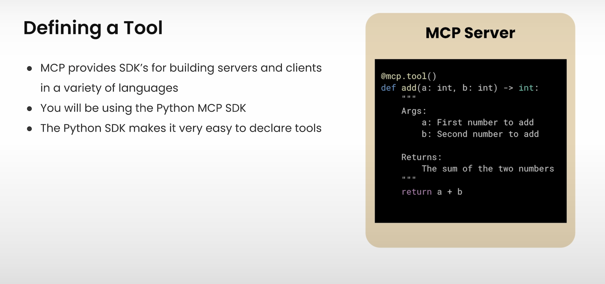

And then we return what happens when that tool needs to be executed.

### Declaring Resources in MCP

For resources, we allow the server to expose data to the client.  
And that's done by specifying a URI or a location where the client goes to find that data.  
You can call this whatever you want, but you can imagine to return a list of documents, this is a pretty good one.  

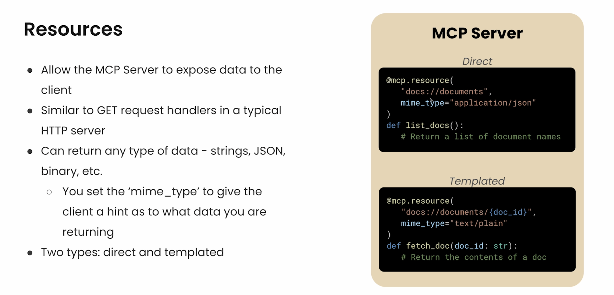

If you're sending back a certain data format, you can specify that with the main type.  
You decorate a function which returns the data that you want when that resource is accessed.

## Direct and Templated Resources

You can work with **direct resources**, or if you have dynamic information or IDs, you can use a **templated resource**, similar to an `f-string` in Python.

### Example: Interface with a Resource
A command-line application could:
- Use an **@ sign** to fetch all the documents needed.
- For a templated resource, reference it directly and inject it into a prompt or request.

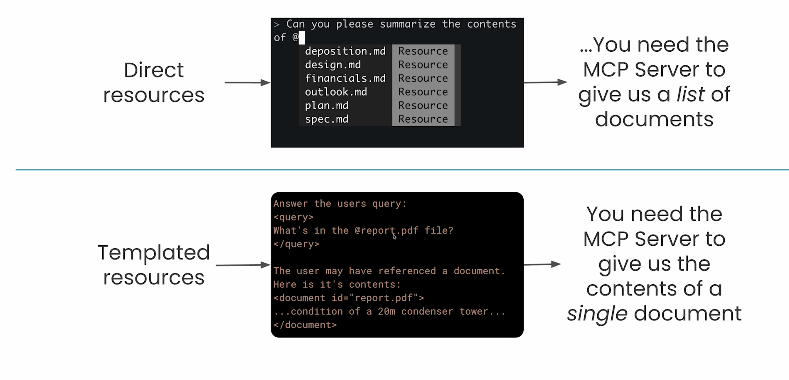

With resources:
- Tools are not required to fetch the data.
- The server sends data back to the client.
- The application decides whether to use the data.

---

## Prompts and Prompt Templates

Just like tools and resources, prompts are given:
- A **name** and **description**.
- A **list of messages** or text to return.

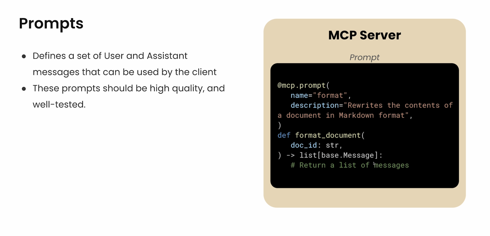

Prompts can:
- Contain user-assistant messages.
- Contain the text of a prompt.

Example:
- A user wants to convert data to Markdown.
- Instead of writing their own, they could use a **pre-evaluated prompt** provided by the server.

The idea:

- Prompts and prompt templates are **user-controlled**. 
- Users can skip doing all the prompt engineering themselves by using high-quality, server-provided ones.

---

## Client-Server Communication

### Initialization

When a client connects to a server:

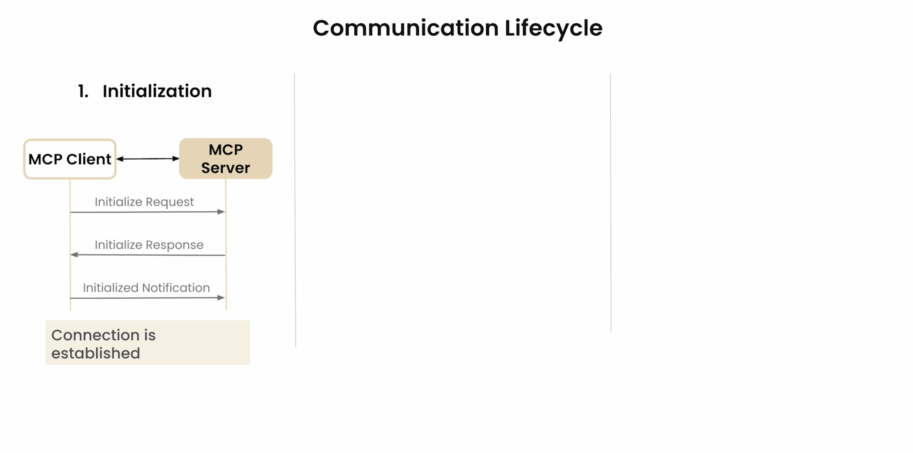

1. A request is sent.
2. A response is sent back.
3. A notification confirms initialization.

### Message Exchange

Once initialized:

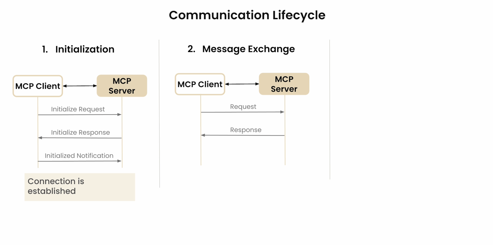

- Clients can send requests to servers.
- Servers can send requests to clients.
- Notifications can be exchanged both ways.

### Other Protocols

Some protocols allow:

- Servers to sample or request information from clients.
- Notifications to be sent in both directions.

### Termination

At the end of communication, the connection is terminated.

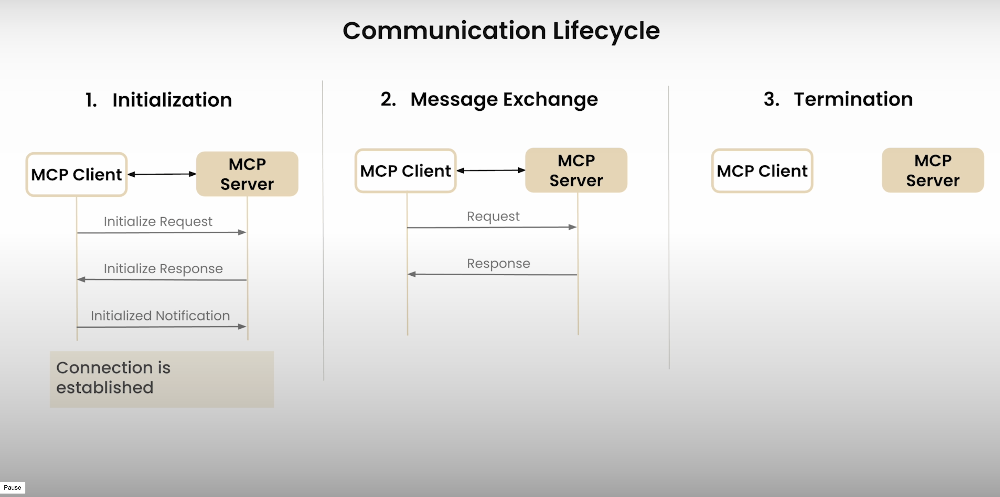

## Understanding Transports in the Model Context Protocol

As part of the **Model Context Protocol (MCP)**, a **transport** is responsible for the mechanics of how messages are sent back and forth between the client and the server. The choice of transport depends on how the application is running, and in some cases, developers can create their own transport.

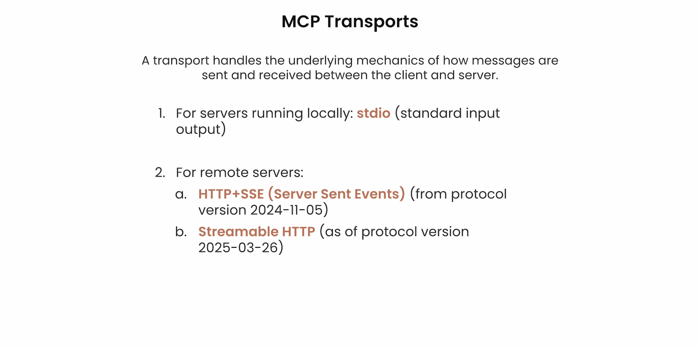

---

### Types of Transports

#### 1. **Standard IO (Local Servers)**

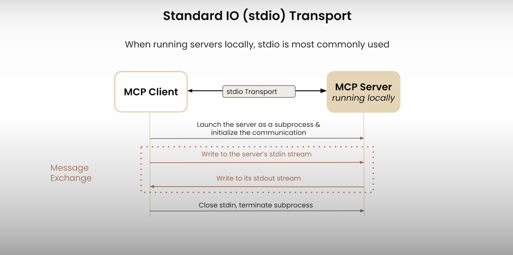

- Used when running servers locally.
- Involves the client launching the server as a subprocess.
- The server reads from and writes to the client using **standard input** (`stdin`) and **standard output** (`stdout`).

- This process is **abstracted away** from the developer in most cases.
- Most common choice for **local** development.

#### 2. **HTTP with Server-Sent Events (Remote Servers)**

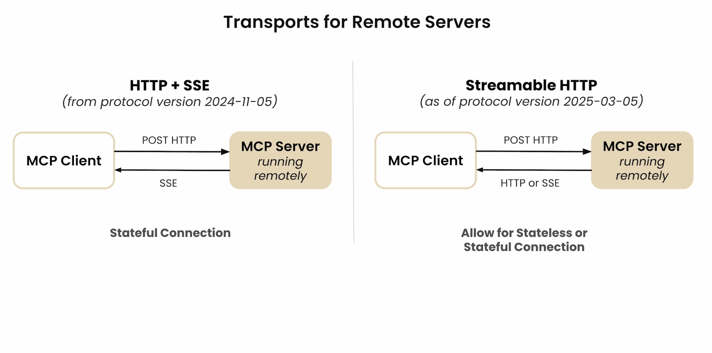

- Used when deploying servers remotely.
- Involves opening a **stateful connection** between client and server.
- The connection remains open, allowing messages and events to be exchanged continuously.
- In a stateful connection:
  - Data can be shared and remembered between requests.
  - The server can send back events and messages without needing a new request from the client.

#### 3. **Streamable HTTP Transport**

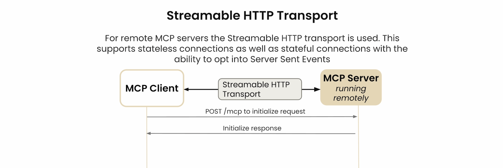

- Supports both **stateful** and **stateless** connections.
- Useful for certain application deployments where full state maintenance is not required.
- As of the time of recording, **not yet supported across all SDKs**.
- Will be covered in depth, but in examples, HTTP with server-sent events will be used.

---

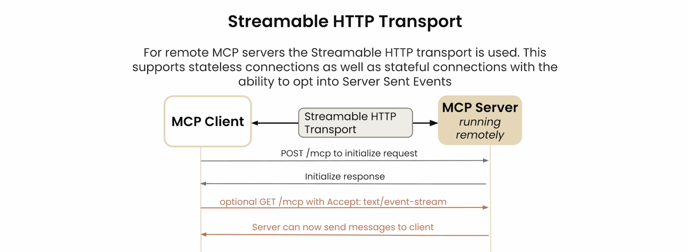

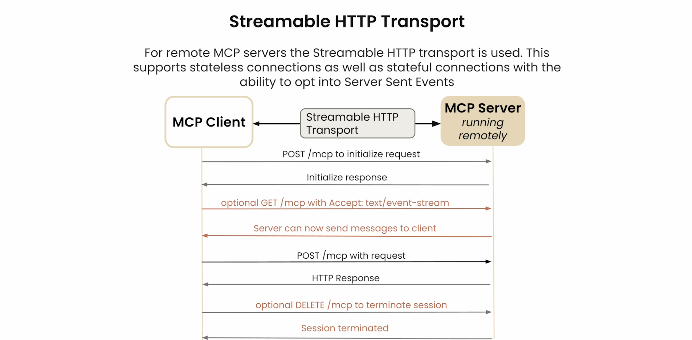

### Stateful vs. Stateless Connections

- **Stateful Connections**:
  - Maintain an open connection between requests.
  - Allow data persistence and memory between interactions.
  - Enable richer, continuous exchanges.

- **Stateless Connections**:
  - Each request/response is independent.
  - No memory or persistent connection.
  - Simpler for certain deployments.

---

### Summary

- **Local development** → Standard IO is most common.
- **Remote deployments** → HTTP with server-sent events for stateful needs.
- **Future flexibility** → Streamable HTTP transport will allow both stateful and stateless modes.
