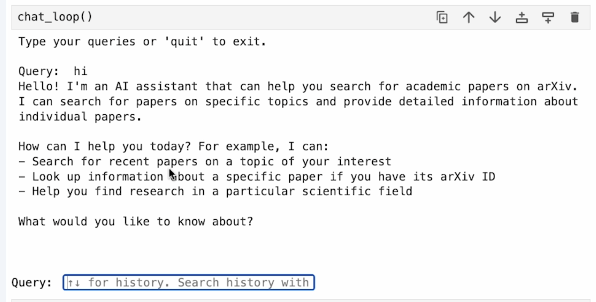
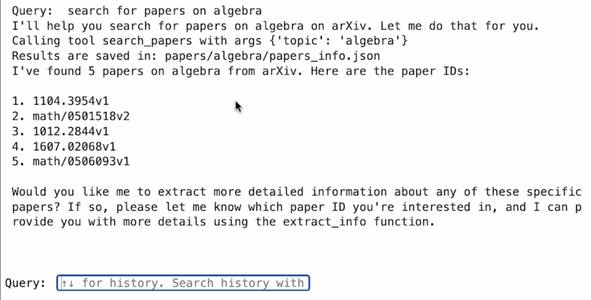
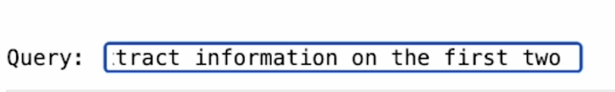
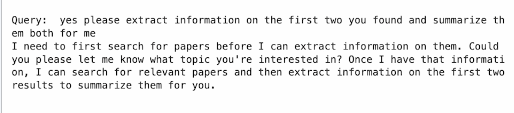
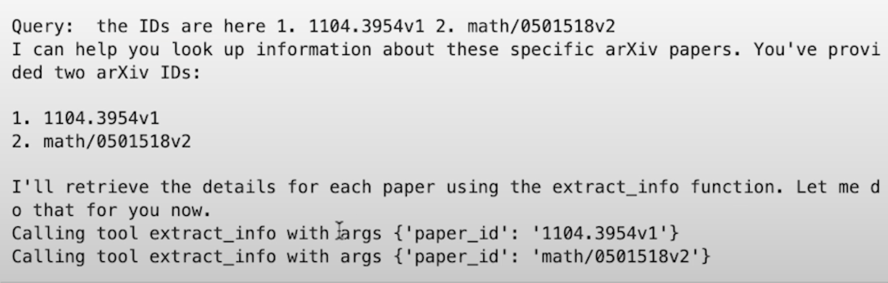
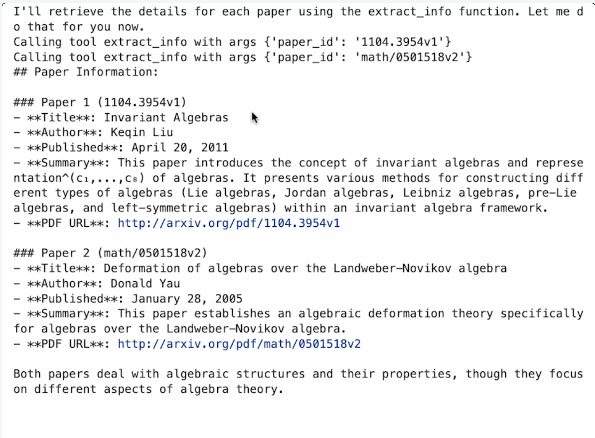
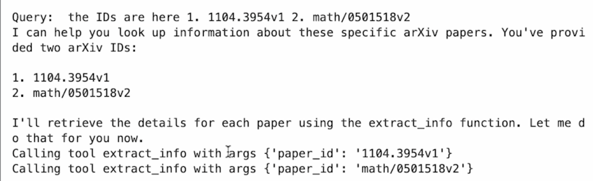

# Lesson 3: Chatbot Example

In this lesson, you will familiarize yourself with the chatbot example you will work on during this course. The example includes the tool definitions and execution, as well as the chatbot code. Make sure to interact with the chatbot at the end of this notebook.

## Import Libraries

We start by bringing in some necessary libraries: the arxiv SDK for searching papers, the JSON module for formatting, the OS module for handling environment variables, the typing module to add type hints to the code, and the Anthropic SDK for large language model integration.  

```python
import arxiv
import json
import os
from typing import List
from dotenv import load_dotenv
import anthropic
```

## Tool Functions

### Defining Constants

Next, we define a constant called `paper_directory` with the value `"papers"`. This will be used for saving information to the file system.  

---


```python
PAPER_DIR = "papers"
```

### Implementing `search_papers` Function

The first tool searches for relevant arXiv papers based on a topic and stores the papers' info in a JSON file (title, authors, summary, paper url and the publication date). The JSON files are organized by topics in the `papers` directory. The tool does not download the papers.  

#### About arXiv

arXiv is an open-source repository of published papers across many domains, including mathematics, science, and other disciplines. 

The first function, `search_papers`, accepts a topic and an optional number of results (defaulting to five). Its purpose is to search for papers on arXiv.

 

```python
def search_papers(topic: str, max_results: int = 5) -> List[str]:
    """
    Search for papers on arXiv based on a topic and store their information.
    
    Args:
        topic: The topic to search for
        max_results: Maximum number of results to retrieve (default: 5)
        
    Returns:
        List of paper IDs found in the search
    """
    
    # Use arxiv to find the papers 
    client = arxiv.Client()

    # Search for the most relevant articles matching the queried topic
    search = arxiv.Search(
        query = topic,
        max_results = max_results,
        sort_by = arxiv.SortCriterion.Relevance
    )

    papers = client.results(search)
    
    # Create directory for this topic
    path = os.path.join(PAPER_DIR, topic.lower().replace(" ", "_"))
    os.makedirs(path, exist_ok=True)
    
    file_path = os.path.join(path, "papers_info.json")

    # Try to load existing papers info
    try:
        with open(file_path, "r") as json_file:
            papers_info = json.load(json_file)
    except (FileNotFoundError, json.JSONDecodeError):
        papers_info = {}

    # Process each paper and add to papers_info  
    paper_ids = []
    for paper in papers:
        paper_ids.append(paper.get_short_id())
        paper_info = {
            'title': paper.title,
            'authors': [author.name for author in paper.authors],
            'summary': paper.summary,
            'pdf_url': paper.pdf_url,
            'published': str(paper.published.date())
        }
        papers_info[paper.get_short_id()] = paper_info
    
    # Save updated papers_info to json file
    with open(file_path, "w") as json_file:
        json.dump(papers_info, json_file, indent=2)
    
    print(f"Results are saved in: {file_path}")
    
    return paper_ids
```

### Searching and Returning Paper IDs

The function searches for papers and returns a list of paper IDs. These IDs will then be used in another function to get more detailed information and summaries.  


### Initializing the Client and Saving Results

We initialize the client and search for relevant articles. The script creates the `papers` directory if it doesn’t already exist, and then saves the information to a file named `papers_info.json`.  

### Processing Paper Data

Each paper is processed into a dictionary, and the resulting data is written to the file. When this is complete, the function returns the list of paper IDs.  


## Example Run

For example, we can search for papers on the topic of “computers,” and the results will be saved locally to a file.  

```python
search_papers("computers")
```

    Results are saved in: papers/computers/papers_info.json


    ['1310.7911v2',
     'math/9711204v1',
     '2208.00733v1',
     '2504.07020v1',
     '2403.03925v1']


## Extract Information from Paper ID

The second tool looks for information about a specific paper across all topic directories inside the `papers` directory.

This function takes a paper ID, looks it up in the papers_info.json file, and returns details about the paper. If no information is found for the given ID, it returns the message “There’s no saved information for that paper.” Running this function on one of the IDs from our earlier search produces details such as the paper’s title, PDF URL, and a summary of its contents.

```python
def extract_info(paper_id: str) -> str:
    """
    Search for information about a specific paper across all topic directories.
    
    Args:
        paper_id: The ID of the paper to look for
        
    Returns:
        JSON string with paper information if found, error message if not found
    """
 
    for item in os.listdir(PAPER_DIR):
        item_path = os.path.join(PAPER_DIR, item)
        if os.path.isdir(item_path):
            file_path = os.path.join(item_path, "papers_info.json")
            if os.path.isfile(file_path):
                try:
                    with open(file_path, "r") as json_file:
                        papers_info = json.load(json_file)
                        if paper_id in papers_info:
                            return json.dumps(papers_info[paper_id], indent=2)
                except (FileNotFoundError, json.JSONDecodeError) as e:
                    print(f"Error reading {file_path}: {str(e)}")
                    continue
    
    return f"There's no saved information related to paper {paper_id}."
```

Lets try it on this paperid : `1310.7911v2`

```python
extract_info('1310.7911v2')
```


Response is given below

```json
    '{\n  "title": "Compact manifolds with computable boundaries",\n  "authors": [\n    "Zvonko Iljazovic"\n  ],\n  "summary": "We investigate conditions under which a co-computably enumerable closed set\\nin a computable metric space is computable and prove that in each locally\\ncomputable computable metric space each co-computably enumerable compact\\nmanifold with computable boundary is computable. In fact, we examine the notion\\nof a semi-computable compact set and we prove a more general result: in any\\ncomputable metric space each semi-computable compact manifold with computable\\nboundary is computable. In particular, each semi-computable compact\\n(boundaryless) manifold is computable.",\n  "pdf_url": "http://arxiv.org/pdf/1310.7911v2",\n  "published": "2013-10-29"\n}'
```
With both `search_papers` and `extract_info` in place, we can now integrate them into a chatbot powered by Anthropic’s Claude model. We define a list of tools that the model can call as needed. This allows the chatbot to dynamically decide when to search for papers, when to extract additional details, and to return the relevant data to the user in real time. This architecture forms the core of a flexible, tool-augmented chatbot that can easily be expanded with additional capabilities.

## Tool Schema

Here are the schema of each tool which you will provide to the LLM.

If you are familiar with tool use, this should be nothing terribly new,
but every single tool that you make is always
going to have a name and a description
and then some kind of schema that it needs to follow.
So in this case, we have a tool for search papers and a tool for extract info.
Remember that the model itself is not going to call these functions.

```python
tools = [
    {
        "name": "search_papers",
        "description": "Search for papers on arXiv based on a topic and store their information.",
        "input_schema": {
            "type": "object",
            "properties": {
                "topic": {
                    "type": "string",
                    "description": "The topic to search for"
                }, 
                "max_results": {
                    "type": "integer",
                    "description": "Maximum number of results to retrieve",
                    "default": 5
                }
            },
            "required": ["topic"]
        }
    },
    {
        "name": "extract_info",
        "description": "Search for information about a specific paper across all topic directories.",
        "input_schema": {
            "type": "object",
            "properties": {
                "paper_id": {
                    "type": "string",
                    "description": "The ID of the paper to look for"
                }
            },
            "required": ["paper_id"]
        }
    }
]
```

## Tool Mapping

We actually need to write the code
to call those functions and pass the data back to the model.
But these tools are going to allow the model to extend its functionality.
So instead of saying I don't know or hallucinate,
we're going to get back the answer that we want here.
So let's go ahead and start writing some of our logic
for working with our large language model and executing these tools.
Let's bring in a little bit of mapping for our tool.
And right here we've got a function that is going to map the tools
that we have to calling that underlying function.


```python
mapping_tool_function = {
    "search_papers": search_papers,
    "extract_info": extract_info
}

def execute_tool(tool_name, tool_args):
    
    result = mapping_tool_function[tool_name](**tool_args)

    if result is None:
        result = "The operation completed but didn't return any results."
        
    elif isinstance(result, list):
        result = ', '.join(result)
        
    elif isinstance(result, dict):
        # Convert dictionaries to formatted JSON strings
        result = json.dumps(result, indent=2)
    
    else:
        # For any other type, convert using str()
        result = str(result)
    return result
```
What you can see here is we have a dictionary for each of our tool names.
These refer to the functions that we have below.
And then a handy helper function to then go ahead and call that particular function
and return the result to us in a variety of data types that come in.
Let's go ahead and start building in our chatbot right now.

## Chatbot Code

The chatbot handles the user's queries one by one, but it does not persist memory across the queries.

That's going to start by bringing in any environment variables that we have
API keys, and then creating an instance of our Anthropic client.
We're going to need this so that we can go ahead and make calls to our model and get back some data.
.

```python
load_dotenv() 
client = anthropic.Anthropic()
```
Let's go ahead and bring in our boilerplate function
to go ahead and start working with the model.
If you've worked with Anthropic before or many other models, this is going to look very familiar
### Query Processing

We're going to start with a list of messages.We're going to go ahead and pass in the query that the user puts in. I'm going to talk to Claude 3.7 Sonnet right now.
We're going to go ahead and start a loop for the chat.
And if there is text data put that into the message.
If the data that's coming in is tool use, if the model detects
that a tool needs to be used,


```python
def process_query(query):
    
    messages = [{'role': 'user', 'content': query}]
    
    response = client.messages.create(max_tokens = 2024,
                                  model = 'claude-3-7-sonnet-20250219', 
                                  tools = tools,
                                  messages = messages)
    
    process_query = True
    while process_query:
        assistant_content = []

        for content in response.content:
            if content.type == 'text':
                
                print(content.text)
                assistant_content.append(content)
                
                if len(response.content) == 1:
                    process_query = False
            
            elif content.type == 'tool_use':
                
                assistant_content.append(content)
                messages.append({'role': 'assistant', 'content': assistant_content})
                
                tool_id = content.id
                tool_args = content.input
                tool_name = content.name
                print(f"Calling tool {tool_name} with args {tool_args}")
                
                result = execute_tool(tool_name, tool_args)
                messages.append({"role": "user", 
                                  "content": [
                                      {
                                          "type": "tool_result",
                                          "tool_use_id": tool_id,
                                          "content": result
                                      }
                                  ]
                                })
                response = client.messages.create(max_tokens = 2024,
                                  model = 'claude-3-7-sonnet-20250219', 
                                  tools = tools,
                                  messages = messages) 
                
                if len(response.content) == 1 and response.content[0].type == "text":
                    print(response.content[0].text)
                    process_query = False
```

we're going to go ahead and bring in our helper function for executing the tool
and then appending that tool result to the list of messages.

### Chat Loop


Let's go ahead and see this in action. Bring in our chat loop.
We've got all the functionality
we need to start working with tool use talking to our model.
Now let's start with a very simple example
for what it's going to look like to actually use this function.
We're going to run an infinite loop until we pass in the string quit.
So let's go ahead and start talking to our large language model.
Call our chat loop function : `chat_loop()`

```python
def chat_loop():
    print("Type your queries or 'quit' to exit.")
    while True:
        try:
            query = input("\nQuery: ").strip()
            if query.lower() == 'quit':
                break
    
            process_query(query)
            print("\n")
        except Exception as e:
            print(f"\nError: {str(e)}")
```

Feel free to interact with the chatbot. Here's an example query: 

- Search for 2 papers on "LLM interpretability"

To access the `papers` folder: 1) click on the `File` option on the top menu of the notebook and 2) click on `Open` and then 3) click on `L3`.

Right now we can start putting in a query to start talking to our model. So let’s start with something very simple, like just saying hi and make sure this works as expected. We can see the model here is going to let us know not only that it’s an AI assistant, but also some of the tools that it has available. This is excellent. So let’s go ahead and start making use of these tools.


```python
chat_loop()
```

    Type your queries or 'quit' to exit.



Let’s search for recent papers on a topic of interest. So why don’t we go and search for papers on algebra. And this should make use of the tool that we have to go ahead and search for papers. We can see that topic is being passed in and the results are saved here. This is great. It’s even following up with “Would you like me to extract more detailed information?” So I’ll go ahead and say, “Yes, please extract information on the first two you found and summarize them both for me.”


#### Response of the query



So what we’re going to do is make use of that tool result that we got before. And we’re going to pass that in and it’s going to tell us which IDs it’s interested in. So I’m going to make sure that I pass in those particular IDs so I can get that correctly done. The IDs are here. So we’re going to see it’s going to extract the info with these particular IDs. And we’re going to go ahead and get the result as well as a summarization here. So we got some information about in variant algebras and deformation of algebras. Honestly, I cannot tell you what this is. But hopefully I can read the paper and get up to speed on what this information has.

#### Second query



#### Second Response



Something to remember is that there is no persistent memory here, so as you go ahead and search for queries and get IDs, nothing is going to be stored permanently. So just make sure as you keep querying, you’re passing in those IDs and think of each conversation as brand new each time. 

#### Giving Ids of papers



#### Response to Ids







If you ever want to get out of this chat, remember we can always type in “quit.” So make sure you run that and we’ll see that we’re all done here.

So what we’ve seen in this lesson is a review of large language models, tool use, and making use of the archive SDK. What we’re going to see shortly is how we can refactor this code to turn those tools into MCP tools to allow for a server to pass that information to us. We’re then going to test that server and see what the results look like. I’ll see you in the next lesson.


In the next lessons, you will take out the tool definitions to wrap them in an MCP server. Then you will create an MCP client inside the chatbot to make the chatbot MCP compatible.  

## Resources

[Guide on how to implement tool use](https://docs.anthropic.com/en/docs/build-with-claude/tool-use/overview#how-to-implement-tool-use)


</div>
