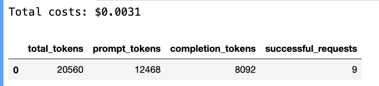
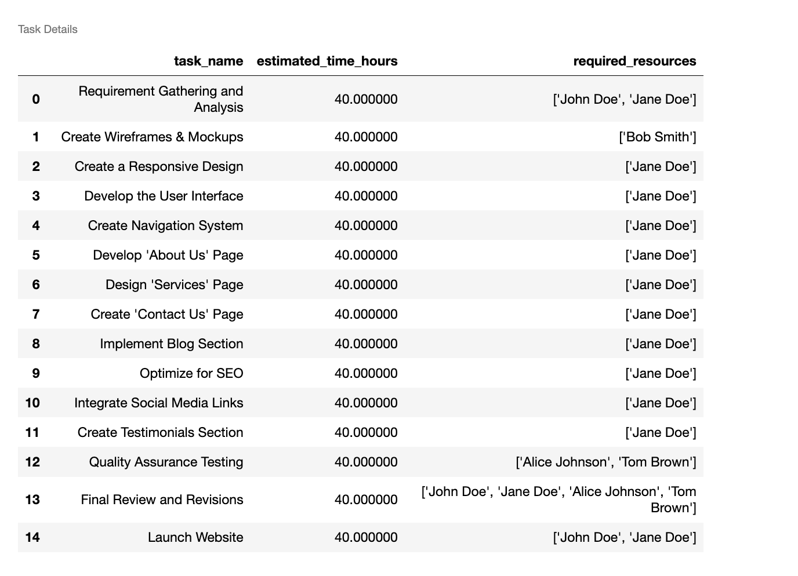
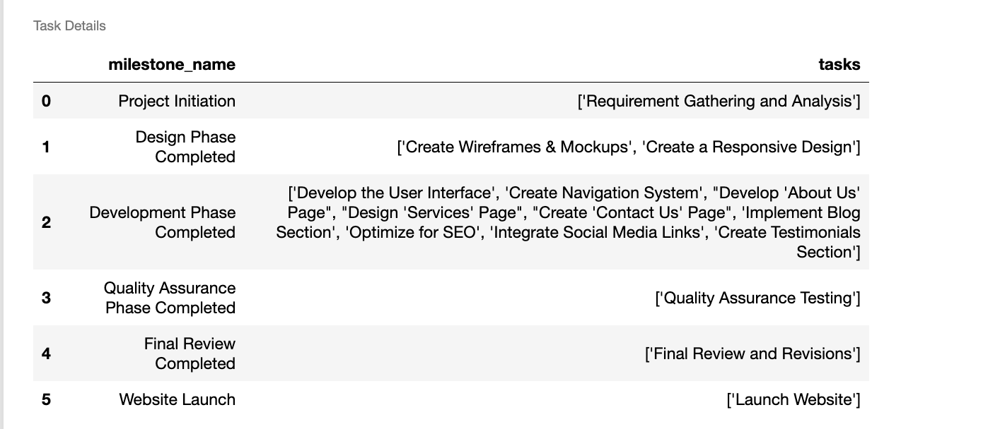

# L1: Automated Project: Planning, Estimation, and Allocation
Let's dive into an automated project planning.
The goal here is to use a crew to help us break a project into tasks, estimate them and do some allocation.
This is a common use case for consultancies out there and web agencies, hey're trying to put out as many offers as they can.
So as people reached out them to build projects, they can pretty quickly estimate this project and plan around it. For this crew, we're going to be working with three agents. We're going to be using a project planner, an estimation analyst, and an allocation strategist.
And for each of the agents, we're going to have one task.
We're going to have the task breakdown, the time estimation and their resource allocation.
This is a fairly simple crew setup where we only have three agents and three tasks, and every agent's doing one single task.
The idea here is that giving initial inputs around what we're trying to achieve, what is this project?
What is the acceptance criteria for the project?
And who are the people that we have available to work on this?
Ve can very quickly create a project plan.
and this project plan should have tasks and their allocations and also major milestones of how we're going to track the progress of this project.
The idea here is that we use these agents to output a structured format where we're going to have a json
hat we can push into whatever our project tool might be.
So if we're using Jira or Trello or whatever it could be, we would be able to push these tasks and their allocations into them.
et's look at a code.
All right, so the first
hing we will do is actually do our initial imports.

<!--1:48-->

<p style="background-color:#fff6e4; padding:15px; border-width:3px; border-color:#f5ecda; border-style:solid; border-radius:6px"> ⏳ <b>Note <code>(placeholder)</code>:</b> some text</p>

## Initial Imports

We're going to make sure that we unload the environment variables.
And now all libraries we will need.
In this case, we're going to use the OS library the Yaml library for loading our agents and tasks Yaml files.
And then from CrewAl we're bringing our three main classes: the agent class, the task class, and the crew class.
And that should be all that we need to start this crew.
Now let's go ahead and set up what is the model that we are going to be using for this. CrewAl by default uses OpenAl models.
But remember you can use any models of your choosing.


```python
# Warning control
import warnings
warnings.filterwarnings('ignore')

# Load environment variables
from helper import load_env
load_env()

import os
import yaml
from crewai import Agent, Task, Crew
```

<p style="background-color:#fff6ff; padding:15px; border-width:3px; border-color:#efe6ef; border-style:solid; border-radius:6px"> 💻 &nbsp; <b>Access <code>requirements.txt</code> and <code>helper.py</code> files:</b> 1) click on the <em>"File"</em> option on the top menu of the notebook and then 2) click on <em>"Open"</em>. For more help, please see the <em>"Appendix - Tips and Help"</em> Lesson.</p>

## Set OpenAI Model

You can use any of the providers out there including HuggingFace, Azure, Anthropic, and anything in between.
For this case, we're going to be actually setting up the OpenAI model to be GPT-40mini.
In that way, we can keep our costs low and have a good execution.
So now let's load our agents and tasks Yaml file.
This should be pretty straightforward, but let's take a look at this code real quick.
You can see here that this code snippet is basically loading both our agents Yaml and tasks Yaml, and then dynamically loading that file and assigning that to two variables: the agents config and tasks config. Before we keep going, let's take a brief look on one of these agents and tasks files look like.

```python
os.environ['OPENAI_MODEL_NAME'] = 'gpt-4o-mini'
```

## Loading Tasks and Agents YAML files

So on the <a src="./3.1_L_1_agents_task_yaml.html"/>agents Yaml file</a>, you can see that we have three agents: the project planning agent, the estimation agent, and a resource allocation agent. If we look through this, you're going to see that every agent has a role, a goal, and a backstory
and a few extra configurations.
In this case, we're not allowing our agents to delegate
a work to each other to make sure that we keep the execution as streamlined as possible, and we also have enable the verbose mode to be true, meaning that we are going to be able to see how these agents behave, what tools to use in everything, on how they go about performing their task. You can spend some time and playing around with the role the go into backstory if you want to, but the interesting piece is that you can see there are some variables are being interpolated here in our agent's descriptions.
So you can see that we are interpolating a project type, a project objectives and industry throughout the entire definition of the agents.

<!-- 4:31-->

Now let's take a look at our task Yaml definition.
On our tasks Yaml, you can see that we have three tasks: 
  * task breakdown, 
  * time resource allocation
  * research allocation tasks.
  * 
Again you're going to find the same variables be interpolated here in the tasks where you can also see project type.  
But a new variable like project requirements and team members.
Feel free to play around with this tasks and agents descriptions once that you executed a Jupyter notebook, just in case you want to see what different results might look like.  
Now let's go back into our code.  
Now that we have our agents config and task config loaded. What we can do is create a pydantic model for our structured output.

.


```python
# Define file paths for YAML configurations
files = {
    'agents': 'config/agents.yaml',
    'tasks': 'config/tasks.yaml'
}

# Load configurations from YAML files
configs = {}
for config_type, file_path in files.items():
    with open(file_path, 'r') as file:
        configs[config_type] = yaml.safe_load(file)

# Assign loaded configurations to specific variables
agents_config = configs['agents']
tasks_config = configs['tasks']
```

## Create Pydantic Models for Structured Output
Keep in mind that in this case, what we're trying to do
is have a full project planning by the end of this crew execution And that means that we want to be able
to push this into an external systems if necessary. We need a structured output

So in here, you can see that we are creating three classes:
a task estimate, a milestone and a project plan.
The project plan is going to basically have
a list of tasks and milestones.
And the milestone will have a name in a list of tasks.
This task estimate is the simplest model that we have.
It has a task name.


<!-- 7:01 -->
```python
from typing import List
from pydantic import BaseModel, Field

class TaskEstimate(BaseModel):
    task_name: str = Field(..., description="Name of the task")
    estimated_time_hours: float = Field(..., description="Estimated time to complete the task in hours")
    required_resources: List[str] = Field(..., description="List of resources required to complete the task")

class Milestone(BaseModel):
    milestone_name: str = Field(..., description="Name of the milestone")
    tasks: List[str] = Field(..., description="List of task IDs associated with this milestone")

class ProjectPlan(BaseModel):
    tasks: List[TaskEstimate] = Field(..., description="List of tasks with their estimates")
    milestones: List[Milestone] = Field(..., description="List of project milestones")
```
The estimated a required hours to do it, and a required resources that will include a name of the people that are going to be required to do this task.

## Create Crew, Agents and Tasks

By the end of our crew, we should have this project plan object ready for us so we can turn this into json if you want to, or into a dictionary and you can push this into external systems or do whatever you want to do with it. It's a very reasonable and nice way to have an output  
pushed into any external systems that you might have.
Now, in order for us to create our crew agent and tasks, we're going to need to refer back to those Yaml config files.
Let's check that out.


```python
# Creating Agents
project_planning_agent = Agent(
  config=agents_config['project_planning_agent']
)

estimation_agent = Agent(
  config=agents_config['estimation_agent']
)

resource_allocation_agent = Agent(
  config=agents_config['resource_allocation_agent']
)

# Creating Tasks
task_breakdown = Task(
  config=tasks_config['task_breakdown'],
  agent=project_planning_agent
)

time_resource_estimation = Task(
  config=tasks_config['time_resource_estimation'],
  agent=estimation_agent
)

resource_allocation = Task(
  config=tasks_config['resource_allocation'],
  agent=resource_allocation_agent,
  output_pydantic=ProjectPlan # This is the structured output we want
)

# Creating Crew
crew = Crew(
  agents=[
    project_planning_agent,
    estimation_agent,
    resource_allocation_agent
  ],
  tasks=[
    task_breakdown,
    time_resource_estimation,
    resource_allocation
  ],
  verbose=True
)
```
And here you can see that as we create each of our agents, we're actually referring back to the agent's config variable from the Yaml file.  
And we are saying what is the key in the Yaml file that provides the configuration for this agent.  
So this is very straightforward.  
For the tasks you can see that we're actually loading the tasks config file that comes with all those Yami settings.
And we're again passing what is the Yaml key  
<!-- 724-->
In this final resource allocation task, you can see that we have an output pydantic attribute.
What that means is that whatever the output of this final task is, we want it to be a pydantic object.
And this is the object that we created earlier, the project plan.
And this is the structured output that we want to do something with it.
To push it into an external system if necessary, or even an internal one in the future.

And for wrapping things up, you can see that we're starting a crew, and this crew has our three agents in our three tasks.
This is a very straightforward setup.  
Now let's talk about the inputs that we sent to this crew.
And how that information gets in there.  
Remember that we had a set of variables  that we interpolate in our agents and tasks.  
If you look at them in here, we are setting up every single
of those variables here.  

## Crew's Inputs


```python
from IPython.display import display, Markdown

project = 'Website'
industry = 'Technology'
project_objectives = 'Create a website for a small business'
team_members = """
- John Doe (Project Manager)
- Jane Doe (Software Engineer)
- Bob Smith (Designer)
- Alice Johnson (QA Engineer)
- Tom Brown (QA Engineer)
"""
project_requirements = """
- Create a responsive design that works well on desktop and mobile devices
- Implement a modern, visually appealing user interface with a clean look
- Develop a user-friendly navigation system with intuitive menu structure
- Include an "About Us" page highlighting the company's history and values
- Design a "Services" page showcasing the business's offerings with descriptions
- Create a "Contact Us" page with a form and integrated map for communication
- Implement a blog section for sharing industry news and company updates
- Ensure fast loading times and optimize for search engines (SEO)
- Integrate social media links and sharing capabilities
- Include a testimonials section to showcase customer feedback and build trust
"""

# Format the dictionary as Markdown for a better display in Jupyter Lab
formatted_output = f"""
**Project Type:** {project}

**Project Objectives:** {project_objectives}

**Industry:** {industry}

**Team Members:**
{team_members}
**Project Requirements:**
{project_requirements}
"""
# Display the formatted output as Markdown
display(Markdown(formatted_output))
```

So you can see a project. You can see the industry.
You can see the project objectives, the team members and the project requirements.  
So let's dive into them.  
This is a website project for a company that works in the technology sector.  

And the objective is pretty simple, is create a website for a small business.
We're going to have five people that are going to be working in this, including a project manager, a software engineer, a designer,
and a couple of QA engineers.  
And then we have a series of project requirements.

<!-- 850 -->

<!--925 -->

### Project Requirements

The project requirements are pretty straightforward.
We want to make sure this is a responsive design.
We want to make sure this is modern and visually appealing.
We also want to make sure that it's user friendly.
It must have a few pages like an about us, services, and contact us.
It should have a blog section and ensure that it's super fast.
Social media links and also testimonials.
So these are the inputs that we're going to be sending to our crew.
If you remember, our agents and tasks
Yamls had all these variables to be interpolated on it.
And this is the information that will be interpolated
throughout those agents and tasks in order for them to get their work done.  
And you could easily, dynamically get this information
2 in order to kick off this crew if you want to you.
So now let's run this crew and see what that's going to look like.
It's going to be pretty fun.


## Kicking off the crew

Now for us to kick off this crew, we basically create a dictionary with all our inputs in it. And we can pass this dictionary as inputs
for our crew dot kickoff function.
If we call this, we're going to see our agents start to do their work.  

Let's tag along for a second.
You can see here,
our project planner agent is starting by analyzing
the project requirements for the website project.
And here you can already see one of the interpolations happening.
This is what is the project type. In here you can see all the difference requirements.  
And below you can see all the different team members.
So let's see how this agent does that work.  
You can see that the agent's final insert includes a whole project breakdown and a set of tasks list.  
And this goes pretty deeply on what is the description of the task and what is the timeline, any dependencies, deliverables, and who will be assigned to this.  
So, this was pretty fast.
You can also see that during this crew execution, we also got a Gantt chart, where you can see all the different tasks, their durations and dependencies, and even a conclusion detailing out the breakdown of the tasks.  

Now this agent is done and we have our new agent takes in.
And this is the expert estimation analyst. This agent is going to estimate every single one of those tasks.
Let's see what is going to be the final output.

<!-- 1155 -->

```python
# The given Python dictionary
inputs = {
  'project_type': project,
  'project_objectives': project_objectives,
  'industry': industry,
  'team_members': team_members,
  'project_requirements': project_requirements
}

# Run the crew
result = crew.kickoff(
  inputs=inputs
)
```
Output can be seen at the link below

[output](./3.2_L_1_output1.html)

## Usage Metrics and Costs

<!--11:55-->
Before we dig into the final output, an element of running these cases in production is knowing how much it costs. If you want their renders at scale to generate, project estimate and planning, how much would that actually cost you?
So let's start by looking into this.
Because we're using GPT-40-mini, we knew that this costs $\$ 0.15$ per million tokens.
And crew already gives you usage metrics, including prompt tokens and awesome completion tokens.
So let's do some simple math to understand how much would this actually cos You can see this is pretty cheap. It's around 0.001 cents to actually run it.
And use around 7000 tokens.
Now, let's see what was the actual result.
First, let's see the raw output of this crew.
If we print this, we can see that we got a dictionary back.


<!--14:30-->

```python
import pandas as pd

costs = 0.150 * (crew.usage_metrics.prompt_tokens + crew.usage_metrics.completion_tokens) / 1_000_000
print(f"Total costs: ${costs:.4f}")

```



So it is a structured output as we wanted.
Where you have a list of tasks, and every task has a name and estimated in a required resource list.
But you also got a milestone.
And every milestone has a milestone name in the list of tasks on it. Now, let's inspect this a little further.

```python
# Convert UsageMetrics instance to a DataFrame
df_usage_metrics = pd.DataFrame([crew.usage_metrics.dict()])
df_usage_metrics
```

Let's start by first looking into the tasks.
And in here l'm going to plot it as a pandas dataframe.
Just so it's easy for us to visualize.
You can see that every task has a name now, and an estimated number of hours, and also the required resources.
So we have a clear understanding of who's going to be doing what, from creating a design all the way to creating each one of those pages, to actually testing the whole thing and making sure that it works.
Now for the milestones,
I'm going to be plotting it as a pandas data frame as well.
And here you can see the three different milestones. And each milestones is a list of tasks that needs to be concluded in order for us to check it off.
So this is pretty good.
This is a very fictional example, but it highlights the power of how you can automate a few processes that could take a lot of hours to be done in a few minutes, and you don't have to think about it.
It just works.
This is actually a use case that we are seeing being deployed out there and can definitely benefit you or your company.


## Result


```python
result.pydantic.dict()
```

```
{'tasks': [{'task_name': 'Requirement Gathering and Analysis',
   'estimated_time_hours': 40.0,
   'required_resources': ['John Doe', 'Jane Doe']},
  {'task_name': 'Create Wireframes & Mockups',
   'estimated_time_hours': 40.0,
   'required_resources': ['Bob Smith']},
  {'task_name': 'Create a Responsive Design',
   'estimated_time_hours': 40.0,
   'required_resources': ['Jane Doe']},
  {'task_name': 'Develop the User Interface',
   'estimated_time_hours': 40.0,
   'required_resources': ['Jane Doe']},
  {'task_name': 'Create Navigation System',
   'estimated_time_hours': 40.0,
   'required_resources': ['Jane Doe']},
  {'task_name': "Develop 'About Us' Page",
   'estimated_time_hours': 40.0,
   'required_resources': ['Jane Doe']},
  {'task_name': "Design 'Services' Page",
   'estimated_time_hours': 40.0,
   'required_resources': ['Jane Doe']},
  {'task_name': "Create 'Contact Us' Page",
   'estimated_time_hours': 40.0,
   'required_resources': ['Jane Doe']},
  {'task_name': 'Implement Blog Section',
   'estimated_time_hours': 40.0,
   'required_resources': ['Jane Doe']},
  {'task_name': 'Optimize for SEO',
   'estimated_time_hours': 40.0,
   'required_resources': ['Jane Doe']},
  {'task_name': 'Integrate Social Media Links',
   'estimated_time_hours': 40.0,
   'required_resources': ['Jane Doe']},
  {'task_name': 'Create Testimonials Section',
   'estimated_time_hours': 40.0,
   'required_resources': ['Jane Doe']},
  {'task_name': 'Quality Assurance Testing',
   'estimated_time_hours': 40.0,
   'required_resources': ['Alice Johnson', 'Tom Brown']},
  {'task_name': 'Final Review and Revisions',
   'estimated_time_hours': 40.0,
   'required_resources': ['John Doe',
    'Jane Doe',
    'Alice Johnson',
    'Tom Brown']},
  {'task_name': 'Launch Website',
   'estimated_time_hours': 40.0,
   'required_resources': ['John Doe', 'Jane Doe']}],
 'milestones': [{'milestone_name': 'Project Initiation',
   'tasks': ['Requirement Gathering and Analysis']},
  {'milestone_name': 'Design Phase Completed',
   'tasks': ['Create Wireframes & Mockups', 'Create a Responsive Design']},
  {'milestone_name': 'Development Phase Completed',
   'tasks': ['Develop the User Interface',
    'Create Navigation System',
    "Develop 'About Us' Page",
    "Design 'Services' Page",
    "Create 'Contact Us' Page",
    'Implement Blog Section',
    'Optimize for SEO',
    'Integrate Social Media Links',
    'Create Testimonials Section']},
  {'milestone_name': 'Quality Assurance Phase Completed',
   'tasks': ['Quality Assurance Testing']},
  {'milestone_name': 'Final Review Completed',
   'tasks': ['Final Review and Revisions']},
  {'milestone_name': 'Website Launch', 'tasks': ['Launch Website']}]}
```

## Inspect further


```python
tasks = result.pydantic.dict()['tasks']
df_tasks = pd.DataFrame(tasks)

# Display the DataFrame as an HTML table
df_tasks.style.set_table_attributes('border="1"').set_caption("Task Details").set_table_styles(
    [{'selector': 'th, td', 'props': [('font-size', '120%')]}]
)
```


### Inspecting Milestones


```python
milestones = result.pydantic.dict()['milestones']
df_milestones = pd.DataFrame(milestones)

# Display the DataFrame as an HTML table
df_milestones.style.set_table_attributes('border="1"').set_caption("Task Details").set_table_styles(
    [{'selector': 'th, td', 'props': [('font-size', '120%')]}]
)
```

This is just the beginning.
There's so much more that we're going to be able to build. As we go through the next lessons, we're going to learn a lot. All the different ways that you c  an build the crews together, and how you can put them together.
Let’s see how much it would cost each time if this crew runs at scale.