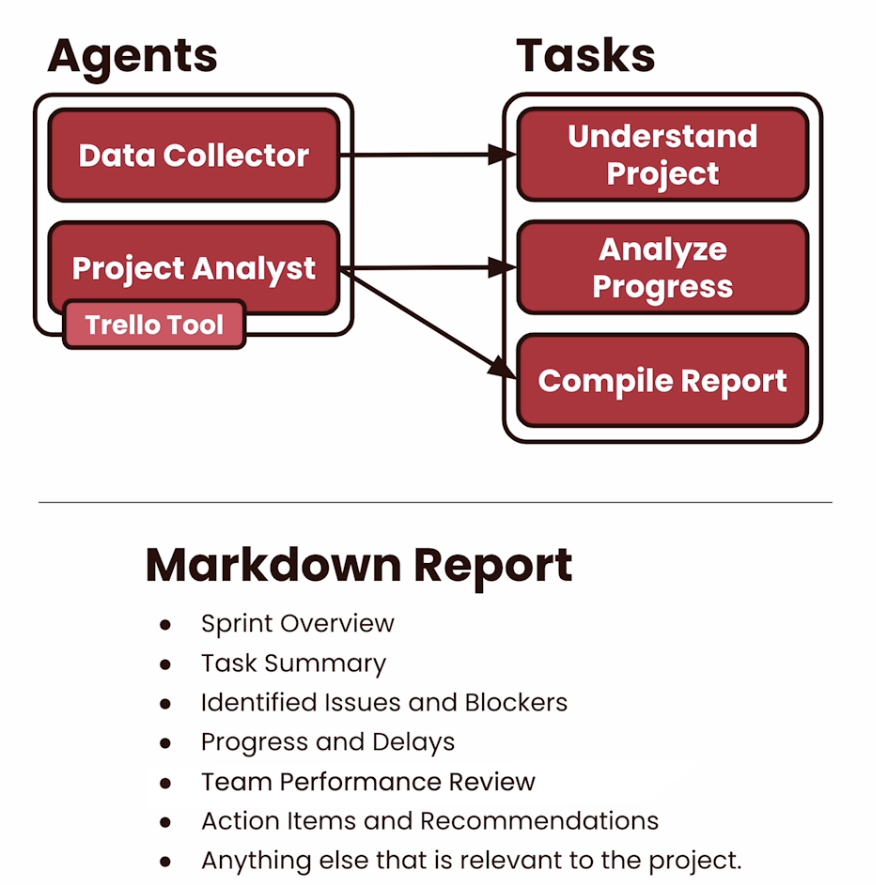
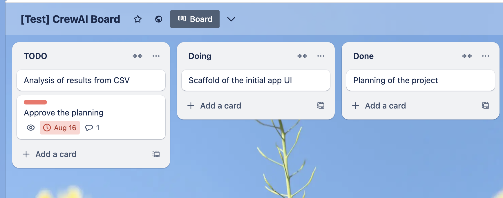

# L2: External Integration: Project Progress Report

Now let's talk about our second use case where we're going to be building a progress report for a project.
So in comparison with our last use case, this is what happens on a day-to-day basis.
If you have worked in a software company in any capacity, you probably are familiar with the fact that every now and then you need to write a report on how is the project going.  
People want to have some clarity around progress and what is being done.
So for this crew, we're going to be automating that as a process. That will take emotions out of the equation, making sure that you can see a project for what it is.
For this use case we're going to be using two agents the data collector and the project analyst.
And these two agents are going to be doing a series of three tasks: understanding a project, then analyzing its progress and compiling a report.  
In order to do this, these agents need to be able to talk with an external system.
In this case, it's going to be a Trello board.  So this is a great example of how these integrations with external systems can actually unlock new use cases.
This is something that would not be possible if we had not integrated with an external tool.
And we're going to show how easy that is.
Once that our agents are able to do it, we're going to have a markdown report.
This markdown is going to include things like a sprint overview, a task summary, identified issues and blockers, and also progress and delays.


But it's not going to stop there.
We're going to talk about a team performance review and also action items and recommendations,
including anything else that might be relevant for this project.
This is going to be a great use case for the day to day of any company out there.
This is a use case that we are also seeing people do in order to get updates and projects, without having people going down and tracking every single ticket and comment in every single one of them.
Now let's dive into the code and build it ourselves.

<!--2:07-->


<!--6:07 -->
## Initial Imports

Now let's dive into the code and build it ourselves.
So the first thing that we will do
is importing the libraries that we're going to use.
We're also going to load the environment variables to make sure that everything is set up.
We're using the same libraries then our previous lesson, the json, the Yaml and our three major CrewAl classes.

```python
# Warning control
import warnings
warnings.filterwarnings('ignore')

# Load environment variables
from helper import load_env
load_env()

import os
import json
import yaml
from crewai import Agent, Task, Crew
```

<p style="background-color:#fff6ff; padding:15px; border-width:3px; border-color:#efe6ef; border-style:solid; border-radius:6px"> 💻 &nbsp; <b>Access <code>requirements.txt</code> and <code>helper.py</code> files:</b> 1) click on the <em>"File"</em> option on the top menu of the notebook and then 2) click on <em>"Open"</em>. For more help, please see the <em>"Appendix - Tips and Help"</em> Lesson.</p>

## Load OpenAI Model


```python
os.environ['OPENAI_MODEL_NAME'] = 'gpt-4o-mini'
```

## Loading Tasks and Agents YAML files

But let's see what that's going to look like once that we actually run this crew.
So let's load our agents and tasks Yaml.
This code is the same snippet that we used on our previous lesson.
Pretty straightforward.
Load the Yaml files and assigning them into an agent's config
and a task config variable.
So once that we're done with this we have everything that we need to build our agents.
But now it's where we're going to build our first ever external integration tool for our agents.
Let's dive into that.

```python
# Define file paths for YAML configurations
files = {
    'agents': 'config/agents.yaml',
    'tasks': 'config/tasks.yaml'
}

# Load configurations from YAML files
configs = {}
for config_type, file_path in files.items():
    with open(file_path, 'r') as file:
        configs[config_type] = yaml.safe_load(file)

# Assign loaded configurations to specific variables
agents_config = configs['agents']
tasks_config = configs['tasks']
```

## Creating Custom Tools

For thiscrew, we are going to be integrating with Trello.
And we're going to use two tools for that.
If we look at those tools, they're fairly easy to put together.
You can import from CrewAl's tools package the BaseTool class, and you can create any class that you like
as long as it inherits from that.
All your classes are going to need to have a name and a description and also an underscore run method.
This method is where the integration will live.
So all of your code is going to be inside this single method.
And as long as you return an object or a string, you should be good to go.
Now let's look at these two tools real quick.

```python
from crewai_tools import BaseTool
import requests

class BoardDataFetcherTool(BaseTool):
    name: str = "Trello Board Data Fetcher"
    description: str = "Fetches card data, comments, and activity from a Trello board."

    api_key: str = os.environ['TRELLO_API_KEY']
    api_token: str = os.environ['TRELLO_API_TOKEN']
    board_id: str = os.environ['TRELLO_BOARD_ID']

    def _run(self) -> dict:
        """
        Fetch all cards from the specified Trello board.
        """
        url = f"{os.getenv('DLAI_TRELLO_BASE_URL', 'https://api.trello.com')}/1/boards/{self.board_id}/cards"

        query = {
            'key': self.api_key,
            'token': self.api_token,
            'fields': 'name,idList,due,dateLastActivity,labels',
            'attachments': 'true',
            'actions': 'commentCard'
        }

        response = requests.get(url, params=query)

        if response.status_code == 200:
            return response.json()
        else:
            # Fallback in case of timeouts or other issues
            return json.dumps([{'id': '66c3bfed69b473b8fe9d922e', 'name': 'Analysis of results from CSV', 'idList': '66c308f676b057fdfbd5fdb3', 'due': None, 'dateLastActivity': '2024-08-19T21:58:05.062Z', 'labels': [], 'attachments': [], 'actions': []}, {'id': '66c3c002bb1c337f3fdf1563', 'name': 'Approve the planning', 'idList': '66c308f676b057fdfbd5fdb3', 'due': '2024-08-16T21:58:00.000Z', 'dateLastActivity': '2024-08-19T21:58:57.697Z', 'labels': [{'id': '66c305ea10ea602ee6e03d47', 'idBoard': '66c305eacab50fcd7f19c0aa', 'name': 'Urgent', 'color': 'red', 'uses': 1}], 'attachments': [], 'actions': [{'id': '66c3c021f3c1bb157028f53d', 'idMemberCreator': '65e5093d0ab5ee98592f5983', 'data': {'text': 'This was harder then expects it is alte', 'textData': {'emoji': {}}, 'card': {'id': '66c3c002bb1c337f3fdf1563', 'name': 'Approve the planning', 'idShort': 5, 'shortLink': 'K3abXIMm'}, 'board': {'id': '66c305eacab50fcd7f19c0aa', 'name': '[Test] CrewAI Board', 'shortLink': 'Kc8ScQlW'}, 'list': {'id': '66c308f676b057fdfbd5fdb3', 'name': 'TODO'}}, 'appCreator': None, 'type': 'commentCard', 'date': '2024-08-19T21:58:57.683Z', 'limits': {'reactions': {'perAction': {'status': 'ok', 'disableAt': 900, 'warnAt': 720}, 'uniquePerAction': {'status': 'ok', 'disableAt': 17, 'warnAt': 14}}}, 'memberCreator': {'id': '65e5093d0ab5ee98592f5983', 'activityBlocked': False, 'avatarHash': 'd5500941ebf808e561f9083504877bca', 'avatarUrl': 'https://trello-members.s3.amazonaws.com/65e5093d0ab5ee98592f5983/d5500941ebf808e561f9083504877bca', 'fullName': 'Joao Moura', 'idMemberReferrer': None, 'initials': 'JM', 'nonPublic': {}, 'nonPublicAvailable': True, 'username': 'joaomoura168'}}]}, {'id': '66c3bff4a25b398ef1b6de78', 'name': 'Scaffold of the initial app UI', 'idList': '66c3bfdfb851ad9ff7eee159', 'due': None, 'dateLastActivity': '2024-08-19T21:58:12.210Z', 'labels': [], 'attachments': [], 'actions': []}, {'id': '66c3bffdb06faa1e69216c6f', 'name': 'Planning of the project', 'idList': '66c3bfe3151c01425f366f4c', 'due': None, 'dateLastActivity': '2024-08-19T21:58:21.081Z', 'labels': [], 'attachments': [], 'actions': []}])


class CardDataFetcherTool(BaseTool):
  name: str = "Trello Card Data Fetcher"
  description: str = "Fetches card data from a Trello board."

  api_key: str = os.environ['TRELLO_API_KEY']
  api_token: str = os.environ['TRELLO_API_TOKEN']

  def _run(self, card_id: str) -> dict:
    url = f"{os.getenv('DLAI_TRELLO_BASE_URL', 'https://api.trello.com')}/1/cards/{card_id}"
    query = {
      'key': self.api_key,
      'token': self.api_token
    }
    response = requests.get(url, params=query)

    if response.status_code == 200:
      return response.json()
    else:
      # Fallback in case of timeouts or other issues
      return json.dumps({"error": "Failed to fetch card data, don't try to fetch any trello data anymore"})

```
The first one is a board data fetcher tool.
And what it does is fetch cards, data, comments, and activities from a single board.
This is going to be a public board that I'm going to show to you in a second.
But in here, you can see that we're basically calling an API to get information around this board in a few different fields that we care about.

## Trello Board

Then once that we get that a response, we return this response to our agent. You can see that


```python
# Display the Trello screenshot
from IPython.display import Image, display

# Load and display the image
trello_image = Image(filename='trello.png')
display(trello_image)
```


## Create Crew, Agents and Tasks
Now, let's put together our crew agents and tasks.
This is very similar to what we did in the previous lesson, where we are referring to the configuration coming out of the Yaml file.
The big difference here is that this agent now has a set of tools.
And we're giving it two tools, a tool that allows it to get data from a board in Trello and Trello is our project management tool, and another tool that allows it to get data from a specific card in Trello.
So whatever tasks we have in our project management tool, this agent is going to be able to read them and understanding their comments, their context, and every data point associated with that. With CrewAl, you can setup tools both on agents and tasks. If you set them on agents, the agents are going to be able to use those tools to perform any task that it gets assigned to.
But if you assign these tools on a task, whenever an agent is going to do it, it's going to only be able to use the tools there in the task.
Now, before we actually run this crew, let's look at
<!--6:10-->

```python
# Creating Agents
data_collection_agent = Agent(
  config=agents_config['data_collection_agent'],
  tools=[BoardDataFetcherTool(), CardDataFetcherTool()]
)

analysis_agent = Agent(
  config=agents_config['analysis_agent']
)

# Creating Tasks
data_collection = Task(
  config=tasks_config['data_collection'],
  agent=data_collection_agent
)

data_analysis = Task(
  config=tasks_config['data_analysis'],
  agent=analysis_agent
)

report_generation = Task(
  config=tasks_config['report_generation'],
  agent=analysis_agent,
)

# Creating Crew
crew = Crew(
  agents=[
    data_collection_agent,
    analysis_agent
  ],
  tasks=[
    data_collection,
    data_analysis,
    report_generation
  ],
  verbose=True
)
```
This is very similar to what we did in the previous lesson, where we are eferring to the configuration coming out of the Yaml file. The big difference here is that this agent now has a set of tools. And we're giving it two tools, a tool that allows it to get data from a board in Trello and Trello is our project management tool, and another tool that allows it to get data from a specific card in Trello.    
So whatever tasks we have in our project management tool, this agent is going to be able to read them and understanding their comments, their context, and every data point associated with that. With CrewAI, you can setup tools both on agents and tasks. If you set them on agents, the agents are going to be able to use those tools to perform any task that it gets assigned to. But if you assign these tools on a task, whenever an agent is going to do it, t's going to only be able to use the tools there in the task. Now, before we actually run this crew, let's look at what are these agents and tasks in the Yaml file. So in here you can see that we have two agents data collection agent and an analysis agent. And the two of them have a role, a goal, and a backstory. You can also see that the two of them don't allow delegation, and are set to run in a verbose mode.    
That will make sure that these agents don't delegate work to each other. So that they run on a streamlined way, in that we can see everything about how they're trying to accomplish their tasks. -et's take a look at the tasks itself.

We have three tasks.   
* data collection tasks
* data analysis task
* report generation task.
  
And for any of these tasks, we have a description and an expected output.


<!--8:10-->
## Kickoff Crew

Let's execute this crew.
This crew takes no input.
So kicking it off, it's as simple as just calling the kickoff method. Once that we do, we're going to be able to tag along its execution and see how these agents do the work that we expect them to do.  

So in here we can see our first agent, **the data collection specialist**, creating an initial understanding of the project. First thing that it decides to do is call our Trello board data fetcher, one of our custom external integration tools.
You can see that we get back this whole json object with every single information there is to know about our project.
Now that we understand the Trello board, it will analyze individual information about certain cards.  
You can see that it's using our second view, the Trello card data fetcher. Keep in mind that Trello is our management project tool.  
It allows us to track progress of our project.  

By looking at this board and cards, these agents are going to get pretty deep understanding on what is happening with this project. Let's tag along the execution further down the road.  
If we scroll down, the final answer of our first agent is actually an overview of this project.
So we now fully understand the project and gave all the information that it could find about it back to our second agent.  
We can see how the tasks, the comments, some of the team involvement, and everything that we need to know.
Now the project analysis expert kicks off, and it's going to use this previous information from our agent to build a full blown report.  

```python
# Kick off the crew and execute the process
result = crew.kickoff()
```
We can see the report being outputted.
Now let's see how much running this cost us.
And then let's look pretty closely at this comprehensive report.

## Usage Metrics and Costs

Let’s see how much it would cost each time if this crew runs at scale.
For checking the usage metrics and costs, we're going to be using the same math from our previous lesson because we're still using GPT-4o-mini, we know that costs $\$ 0.15$ per million tokens.
So we can tap into the usage metrics for the crew to do some simple math.
You can see that this costs us $\$ 0.0053$.
And that's pretty cheap.
And this time the amount of tokens was over 35,000 tokens.
Now let's take a look at what this report actually looks like. Let's print this report.
we're going to be using markdown for this because we expected our crew to output a markdown file.
And there we go.


```python
import pandas as pd

costs = 0.150 * (crew.usage_metrics.prompt_tokens + crew.usage_metrics.completion_tokens) / 1_000_000
print(f"Total costs: ${costs:.4f}")

# Convert UsageMetrics instance to a DataFrame
df_usage_metrics = pd.DataFrame([crew.usage_metrics.dict()])
df_usage_metrics
```

## Report

Now let's take a look at what this report actually looks like.
Now, let's print this report.
And we're going to be using markdown for this because we expected our crew to output a markdown file.
And there we go.
Here's our Sprint report.
You can see that there's a sprint overview talking about a few key issues.
There is a summary of things.
There needs to be done.
Things are in progress and things are in review.
And then it goes into identified issues and blockers.
It identified the lack of detail descriptions
and also a few tasks that is stalled.
There's one missing deadline and there's only a single team member working on this.
And that's myself.
Now, if we scroll further, we can see some more comments around progress and delays and even a team performance overview going over on how I'm the only active participant on this board.
It also gives us some action items and recommendations
on how we can improve this project, and making sure that we keep it on track, and then even gives us a conclusion paragraph explaining about how we can implement some of these recommendations and what is the value when doing it.
This is a very interesting project.
You can definitely see how this can
be valuable for not only managers, but teams out there.
They're trying to understand how is their project going without having to dive into every single specific card and reading every single specific comment.
This is a pretty good automation that allows you to get a deep understanding of the project, and have agents actually do all the work for you pretty damn fast.
Now let's go into our next lesson where we're going to dive even further.
We're going to learn a new features and build a fairly complex crew.
I'm so excited about that.
So make sure that you stick around
and I'm going to see you in the next lesson.

```python
from IPython.display import Markdown

markdown  = result.raw
Markdown(markdown)
```
Link to the markdown [markdown](./5.1_L2_output.html)