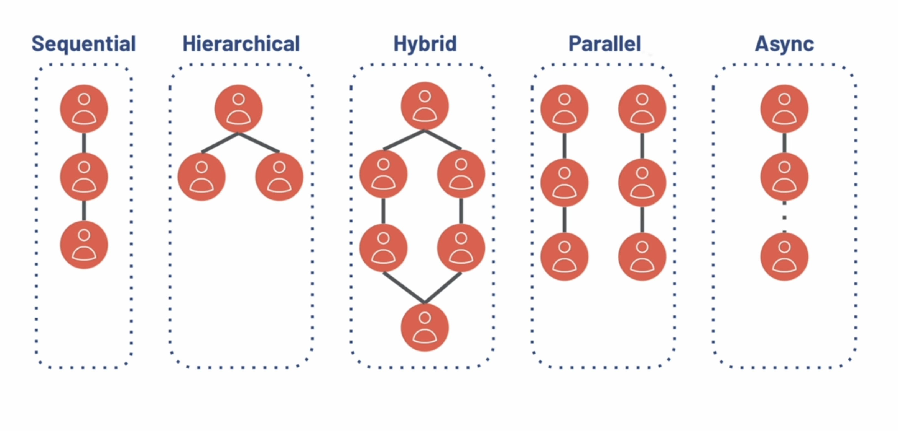
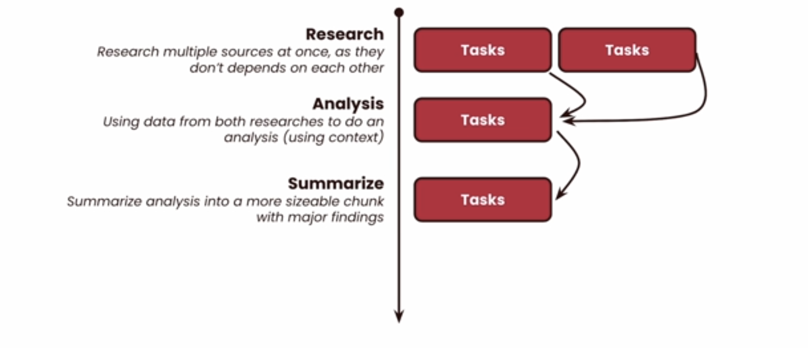
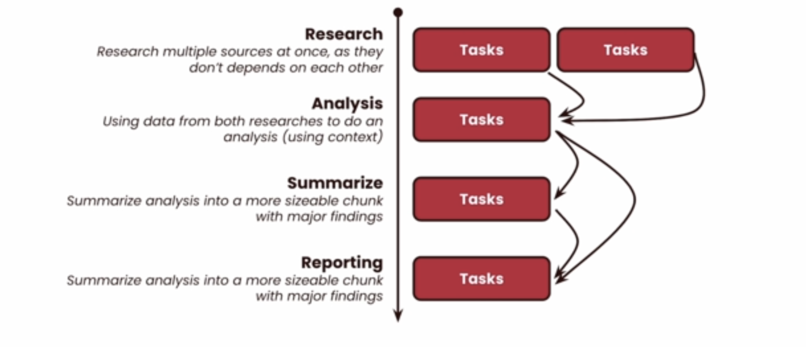
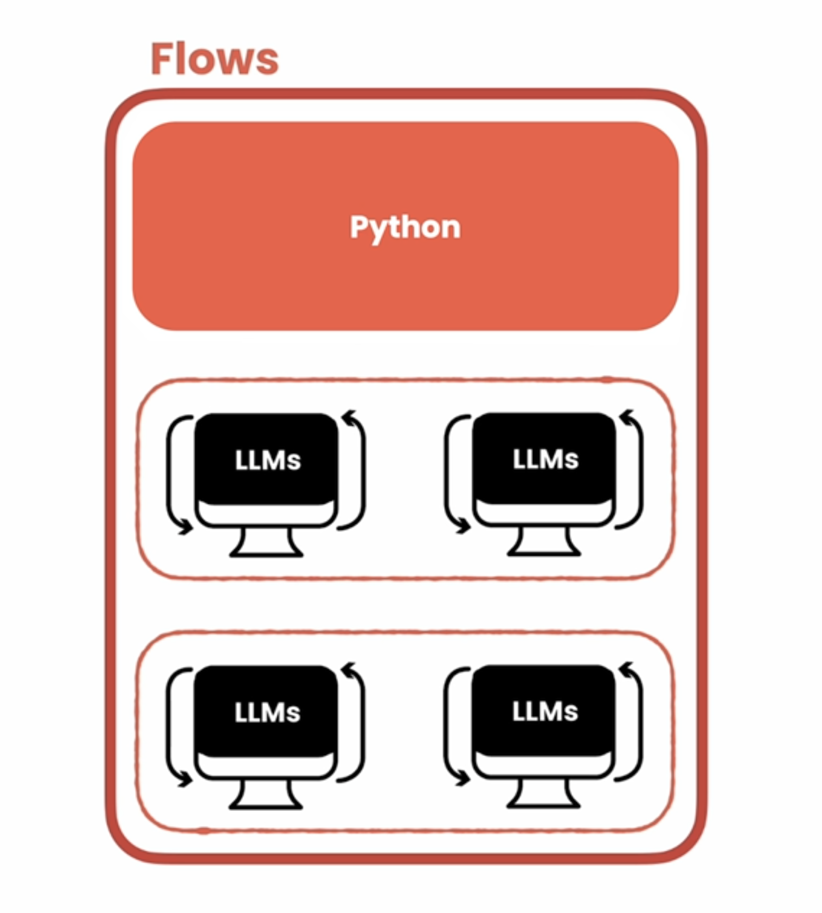
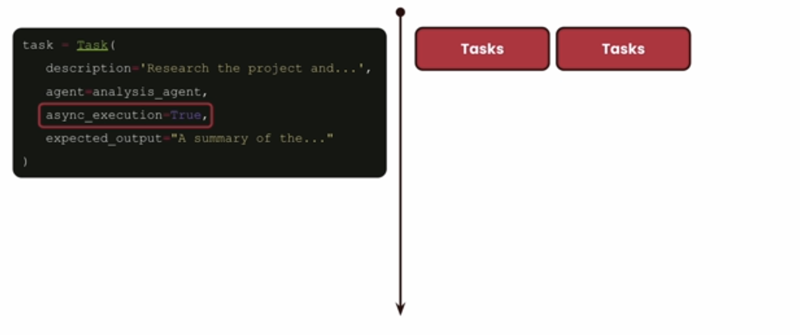
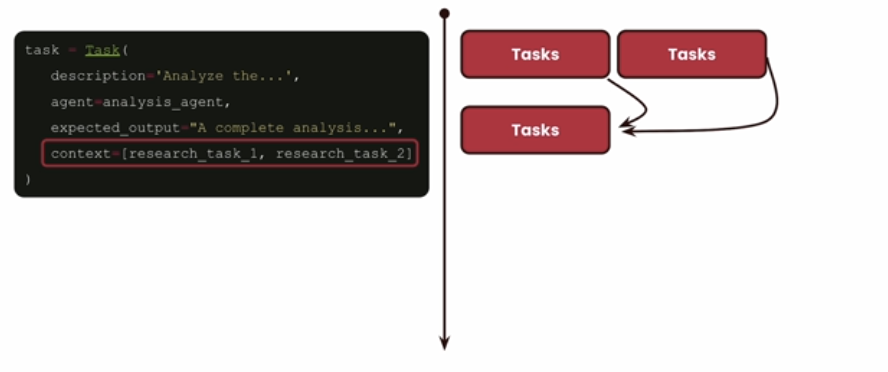

In this lesson, we're going to talk about complex crew setups.
We're going to talk about how you can not only be a crew with agents, but how you can connect multiple crews together and how you can use conditional logic to when to execute one and when to pass information into another.  
This is going to be super interesting because in a lot
of different use cases, use cases that were just not possible before.  
So buckle up because it's going to be pretty fun.
Let's dive into the lesson.  
We already chatted about all these different ways that you can get your agents to do work for you.  

You can get them to do work sequentially, hierarchically, or in a hybrid manner, even in parallel or asynchronously.
The thing is, between all those different options, you can also mix and match, and you can have a very fine control over how you want the work to get done. So let's look an example real quick.
Let's say that you can have your crew start to do two tasks in parallel. Let's say that those are research tasks.
So you can have initial tasks that doing research on a company.
In another one that might be doing research on an industry or a person.  
Those tasks don't depend on each other.  
And that means that you can have all of them starting at the same time.  
But then after that, let's say that you want to do some analysis, but you want to grab the results from all those different tasks before you actually do it.  
So in here, we can actually use an attribute that is called context that we're going to see in a bit on how you can get the output of those two tasks into this third one.  
Now we want to do a summarization, and this is a more straightforward task.  
So we can get of whatever was the output from the analysis into this task.  

To make sure that we write a nice summary.  
But then for our final task we want to do a full-blown report.  

And for that, we want to take the analysis and the summary, to make sure that we can view this final full report before we actually push this into an external system as a final report.  

So how would you go about it If you have to do this with CrewAl? Let me show you.  
For having our tasks running in parallel. You can set the attribute async execution to true.

And that means that your tasks are going to be performed in parallel.  
And for third task, you can actually set another attribute called context, that'll allow you to name one of the other tasks
that you want to wait to be done before you start this new one.

<!--2:49-->

And if you think about all the different tasks that you're talking about, they're all using different combinations of this.

But then you can get even more complex by using flows.
Flows are brand new feature for CrewAl and I'm so excited to show you this because Flows unlocks so many use cases and we are seeing people using this out there in production use cases already.  
What makes Flows so special is that allows you to not only have your crews, but also execute regular Python code.

You can execute this code before your crew, during your crew, or after your crew execution.  
So you can mix and match by having not only multiple crews connected together, but also using regular Python between them in case you need to grab files or grab data or send data.

You don't want to leave data for the agents to do.
This is very powerful, and we are so excited about what some of the people who are already building with Flows.

So now let's jump into the code and talk a little bit on how you can build Flows yourself.