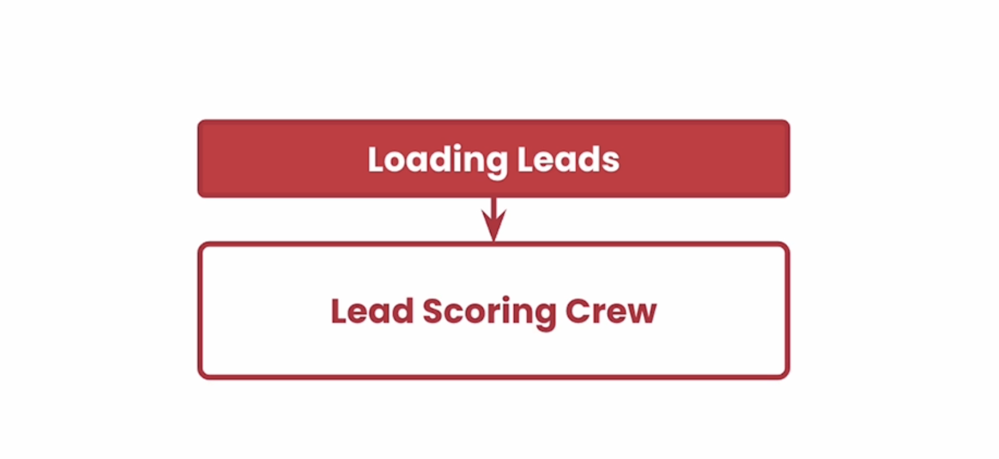
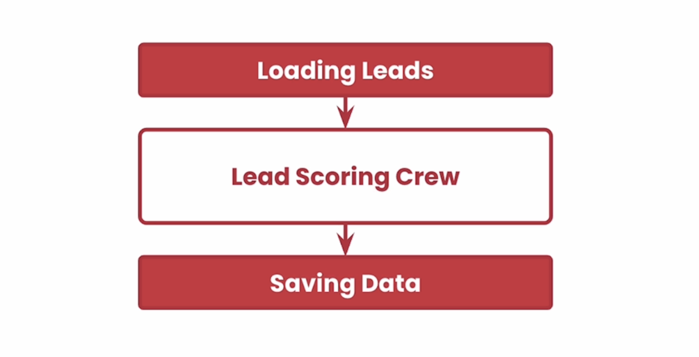
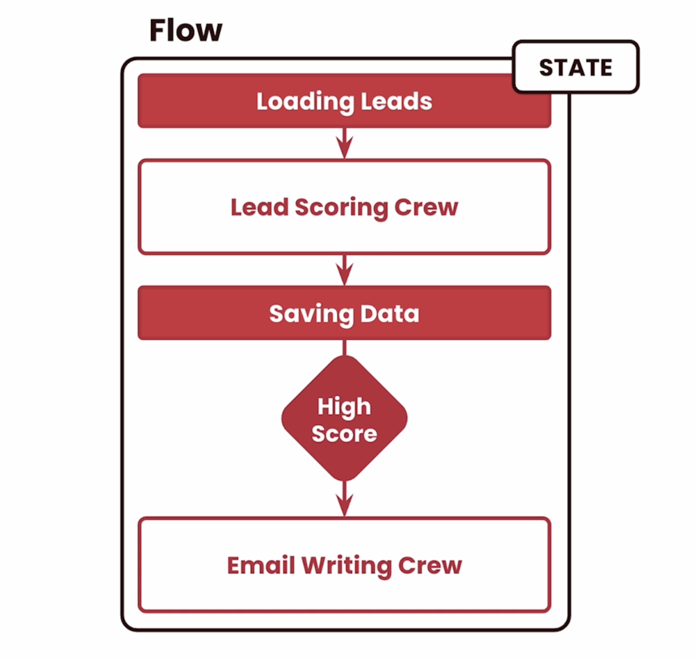
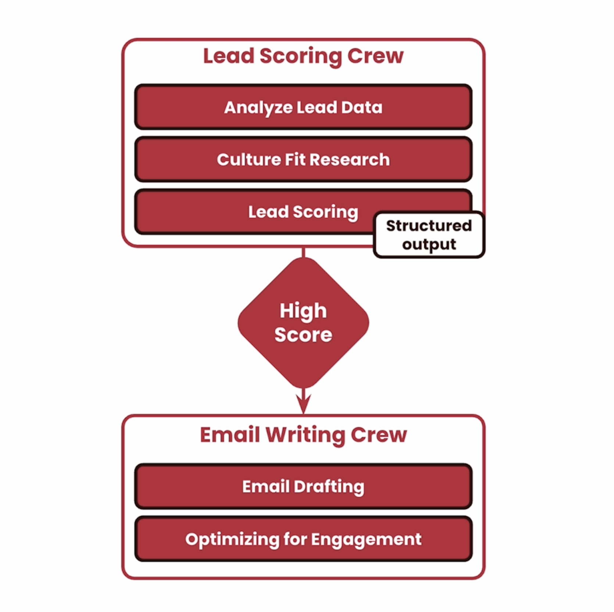

# L3: Agentic Sales Pipeline

I'm very excited about this use case.
you are going to use a new feature called Flows.
And you're going to use it to build an agentic
sales pipeline.  
Where we're going to have lead information, we're going to enrich it, we're going to score it and then write an email for this lead.
It's going to be very interesting.  
So before we start building this, let's talk about what this looks like.  

## Loading Leads
We're going to start by loading leads.
And that doesn't need to be agentic.


That can be regular Python code.
Tap from a database and loading all this data out.
Then from there, we're going to send this to a lead scoring crew that you're going to build that is going to search information about this lead, is going to try to understand how to be scoring and how good of a match  
this is for the product and business that you're trying to sell them.  
From that point on, we want to save this data back into another database.  


This again can be regular Python code. It doesn't need to be necessarily agentic.  
From here on, we want to make sure that you filter out any leads that are not that high score.  
We keep the ones that are so that we can send to our next crew.
This crew is going to use all the information that we found about this lead in order to write an email to them and optimize it for engagement.  


We're going to wrap all this into what we call a Flow.  
The Flow is going to basically have events to make sure that we are going through all these different steps. And a Flow also h  as a state where we can store information to access during the Flow execution or after the Flow execution.   


We're going to show how you can use that as well.    
Now let's zoom into the crews to talk about that for a second.  
The lead scoring crew is going to start by analyzing the lead data, then doing a research on the culture  
about that company and doing a final lead scoring.  
Then if the score is high enough, the email crew data is going to do an email drafting and then optimizing it for engagement.  
Another thing that I want to point out is that the lead scoring crew is going to output a structured data output, and we're going to use this in order to access this information and pass it along for the email writing crew.  
This is going to be super relevant, and also super interesting to see how you can have very complex structured data outputs from crews and agents.  

## Sales Pipeline

Now let's talk about what is the sales pipeline.
The sales pipeline is basically going to research
<p style="background-color:#fff6e4; padding:15px; border-width:3px; border-color:#f5ecda; border-style:solid; border-radius:6px"> ⏳ <b>Note <code>(Kernel Starting)</code>:</b> This notebook takes about 30 seconds to be ready to use. You may start and watch the video while you wait.</p>

## Initial Imports

```python
# Warning control
import warnings
warnings.filterwarnings('ignore')

# Load environment variables
from helper import load_env
load_env()

import os
import yaml
from crewai import Agent, Task, Crew
```

<p style="background-color:#fff6ff; padding:15px; border-width:3px; border-color:#efe6ef; border-style:solid; border-radius:6px"> 💻 &nbsp; <b>Access <code>requirements.txt</code> and <code>helper.py</code> files:</b> 1) click on the <em>"File"</em> option on the top menu of the notebook and then 2) click on <em>"Open"</em>. For more help, please see the <em>"Appendix - Tips and Help"</em> Lesson.</p>

## Load API tokens for our 3rd party APIs


```python
os.environ['OPENAI_MODEL_NAME'] = 'gpt-4o-mini'
```

## Loading Tasks and Agents YAML files


```python
# Define file paths for YAML configurations
files = {
    'lead_agents': 'config/lead_qualification_agents.yaml',
    'lead_tasks': 'config/lead_qualification_tasks.yaml',
    'email_agents': 'config/email_engagement_agents.yaml',
    'email_tasks': 'config/email_engagement_tasks.yaml'
}

# Load configurations from YAML files
configs = {}
for config_type, file_path in files.items():
    with open(file_path, 'r') as file:
        configs[config_type] = yaml.safe_load(file)

# Assign loaded configurations to specific variables
lead_agents_config = configs['lead_agents']
lead_tasks_config = configs['lead_tasks']
email_agents_config = configs['email_agents']
email_tasks_config = configs['email_tasks']
```

## Create Pydantic Models for Structured Output


```python
from pydantic import BaseModel, Field
from typing import Dict, Optional, List, Set, Tuple

class LeadPersonalInfo(BaseModel):
    name: str = Field(..., description="The full name of the lead.")
    job_title: str = Field(..., description="The job title of the lead.")
    role_relevance: int = Field(..., ge=0, le=10, description="A score representing how relevant the lead's role is to the decision-making process (0-10).")
    professional_background: Optional[str] = Field(..., description="A brief description of the lead's professional background.")

class CompanyInfo(BaseModel):
    company_name: str = Field(..., description="The name of the company the lead works for.")
    industry: str = Field(..., description="The industry in which the company operates.")
    company_size: int = Field(..., description="The size of the company in terms of employee count.")
    revenue: Optional[float] = Field(None, description="The annual revenue of the company, if available.")
    market_presence: int = Field(..., ge=0, le=10, description="A score representing the company's market presence (0-10).")

class LeadScore(BaseModel):
    score: int = Field(..., ge=0, le=100, description="The final score assigned to the lead (0-100).")
    scoring_criteria: List[str] = Field(..., description="The criteria used to determine the lead's score.")
    validation_notes: Optional[str] = Field(None, description="Any notes regarding the validation of the lead score.")

class LeadScoringResult(BaseModel):
    personal_info: LeadPersonalInfo = Field(..., description="Personal information about the lead.")
    company_info: CompanyInfo = Field(..., description="Information about the lead's company.")
    lead_score: LeadScore = Field(..., description="The calculated score and related information for the lead.")
```

## Importing Tools


```python
from crewai_tools import SerperDevTool, ScrapeWebsiteTool
```

## Lead Qualification Crew, Agents and Tasks


```python
# Creating Agents
lead_data_agent = Agent(
  config=lead_agents_config['lead_data_agent'],
  tools=[SerperDevTool(), ScrapeWebsiteTool()]
)

cultural_fit_agent = Agent(
  config=lead_agents_config['cultural_fit_agent'],
  tools=[SerperDevTool(), ScrapeWebsiteTool()]
)

scoring_validation_agent = Agent(
  config=lead_agents_config['scoring_validation_agent'],
  tools=[SerperDevTool(), ScrapeWebsiteTool()]
)

# Creating Tasks
lead_data_task = Task(
  config=lead_tasks_config['lead_data_collection'],
  agent=lead_data_agent
)

cultural_fit_task = Task(
  config=lead_tasks_config['cultural_fit_analysis'],
  agent=cultural_fit_agent
)

scoring_validation_task = Task(
  config=lead_tasks_config['lead_scoring_and_validation'],
  agent=scoring_validation_agent,
  context=[lead_data_task, cultural_fit_task],
  output_pydantic=LeadScoringResult
)

# Creating Crew
lead_scoring_crew = Crew(
  agents=[
    lead_data_agent,
    cultural_fit_agent,
    scoring_validation_agent
  ],
  tasks=[
    lead_data_task,
    cultural_fit_task,
    scoring_validation_task
  ],
  verbose=True
)
```

## Email Engagement Crew


```python
# Creating Agents
email_content_specialist = Agent(
  config=email_agents_config['email_content_specialist']
)

engagement_strategist = Agent(
  config=email_agents_config['engagement_strategist']
)

# Creating Tasks
email_drafting = Task(
  config=email_tasks_config['email_drafting'],
  agent=email_content_specialist
)

engagement_optimization = Task(
  config=email_tasks_config['engagement_optimization'],
  agent=engagement_strategist
)

# Creating Crew
email_writing_crew = Crew(
  agents=[
    email_content_specialist,
    engagement_strategist
  ],
  tasks=[
    email_drafting,
    engagement_optimization
  ],
  verbose=True
)
```

## Creating Complete Sales Flow


```python
from crewai import Flow
from crewai.flow.flow import listen, start

class SalesPipeline(Flow):
    @start()
    def fetch_leads(self):
        # Pull our leads from the database
        leads = [
            {
                "lead_data": {
                    "name": "João Moura",
                    "job_title": "Director of Engineering",
                    "company": "Clearbit",
                    "email": "joao@clearbit.com",
                    "use_case": "Using AI Agent to do better data enrichment."
                },
            },
        ]
        return leads

    @listen(fetch_leads)
    def score_leads(self, leads):
        scores = lead_scoring_crew.kickoff_for_each(leads)
        self.state["score_crews_results"] = scores
        return scores

    @listen(score_leads)
    def store_leads_score(self, scores):
        # Here we would store the scores in the database
        return scores

    @listen(score_leads)
    def filter_leads(self, scores):
        return [score for score in scores if score['lead_score'].score > 70]

    @listen(filter_leads)
    def write_email(self, leads):
        scored_leads = [lead.to_dict() for lead in leads]
        emails = email_writing_crew.kickoff_for_each(scored_leads)
        return emails

    @listen(write_email)
    def send_email(self, emails):
        # Here we would send the emails to the leads
        return emails

flow = SalesPipeline()
```

## Plotting the Flow


```python
flow.plot()
```


```python
from IPython.display import IFrame

IFrame(src='./crewai_flow.html', width='150%', height=600)
```

## Flow Kickoff


```python
emails = await flow.kickoff()
```

## Usage Metrics and Costs

Let’s see how much it would cost each time if this crew runs at scale.


```python
import pandas as pd

# Convert UsageMetrics instance to a DataFrame
df_usage_metrics = pd.DataFrame([flow.state["score_crews_results"][0].token_usage.dict()])

# Calculate total costs
costs = 0.150 * df_usage_metrics['total_tokens'].sum() / 1_000_000
print(f"Total costs: ${costs:.4f}")

# Display the DataFrame
df_usage_metrics
```


```python
import pandas as pd

# Convert UsageMetrics instance to a DataFrame
df_usage_metrics = pd.DataFrame([emails[0].token_usage.dict()])

# Calculate total costs
costs = 0.150 * df_usage_metrics['total_tokens'].sum() / 1_000_000
print(f"Total costs: ${costs:.4f}")

# Display the DataFrame
df_usage_metrics
```

## Inspecting Results


```python
scores = flow.state["score_crews_results"]
```


```python
import pandas as pd
from IPython.display import display, HTML

lead_scoring_result = scores[0].pydantic

# Create a dictionary with the nested structure flattened
data = {
    'Name': lead_scoring_result.personal_info.name,
    'Job Title': lead_scoring_result.personal_info.job_title,
    'Role Relevance': lead_scoring_result.personal_info.role_relevance,
    'Professional Background': lead_scoring_result.personal_info.professional_background,
    'Company Name': lead_scoring_result.company_info.company_name,
    'Industry': lead_scoring_result.company_info.industry,
    'Company Size': lead_scoring_result.company_info.company_size,
    'Revenue': lead_scoring_result.company_info.revenue,
    'Market Presence': lead_scoring_result.company_info.market_presence,
    'Lead Score': lead_scoring_result.lead_score.score,
    'Scoring Criteria': ', '.join(lead_scoring_result.lead_score.scoring_criteria),
    'Validation Notes': lead_scoring_result.lead_score.validation_notes
}

# Convert the dictionary to a DataFrame
df = pd.DataFrame.from_dict(data, orient='index', columns=['Value'])

# Reset the index to turn the original column names into a regular column
df = df.reset_index()

# Rename the index column to 'Attribute'
df = df.rename(columns={'index': 'Attribute'})

# Create HTML table with bold attributes and left-aligned values
html_table = df.style.set_properties(**{'text-align': 'left'}) \
                     .format({'Attribute': lambda x: f'<b>{x}</b>'}) \
                     .hide(axis='index') \
                     .to_html()

# Display the styled HTML table
display(HTML(html_table))
```

## Results


```python
import textwrap

result_text = emails[0].raw
wrapped_text = textwrap.fill(result_text, width=80)
print(wrapped_text)
```

## How Complex Can it Get?


```python
from crewai import Flow
from crewai.flow.flow import listen, start, and_, or_, router

class SalesPipeline(Flow):
    
  @start()
  def fetch_leads(self):
    # Pull our leads from the database
    # This is a mock, in a real-world scenario, this is where you would
    # fetch leads from a database
    leads = [
      {
        "lead_data": {
          "name": "João Moura",
          "job_title": "Director of Engineering",
          "company": "Clearbit",
          "email": "joao@clearbit.com",
          "use_case": "Using AI Agent to do better data enrichment."
        },
      },
    ]
    return leads

  @listen(fetch_leads)
  def score_leads(self, leads):
    scores = lead_scoring_crew.kickoff_for_each(leads)
    self.state["score_crews_results"] = scores
    return scores

  @listen(score_leads)
  def store_leads_score(self, scores):
    # Here we would store the scores in the database
    return scores

  @listen(score_leads)
  def filter_leads(self, scores):
    return [score for score in scores if score['lead_score'].score > 70]

  @listen(and_(filter_leads, store_leads_score))
  def log_leads(self, leads):
    print(f"Leads: {leads}")

  @router(filter_leads, paths=["high", "medium", "low"])
  def count_leads(self, scores):
    if len(scores) > 10:
      return 'high'
    elif len(scores) > 5:
      return 'medium'
    else:
      return 'low'

  @listen('high')
  def store_in_salesforce(self, leads):
    return leads

  @listen('medium')
  def send_to_sales_team(self, leads):
    return leads

  @listen('low')
  def write_email(self, leads):
    scored_leads = [lead.to_dict() for lead in leads]
    emails = email_writing_crew.kickoff_for_each(scored_leads)
    return emails

  @listen(write_email)
  def send_email(self, emails):
    # Here we would send the emails to the leads
    return emails
```

## Plotting the Flow


```python
flow = SalesPipeline()
flow.plot()
```


```python
from IPython.display import IFrame

IFrame(src='./crewai_flow_complex.html', width='150%', height=600)
```


```python

```


```python

```


```python

```


```python

```


```python

```


```python

```
