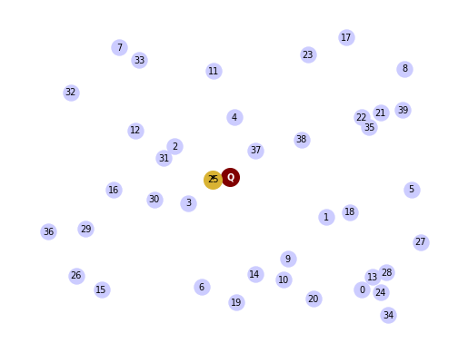
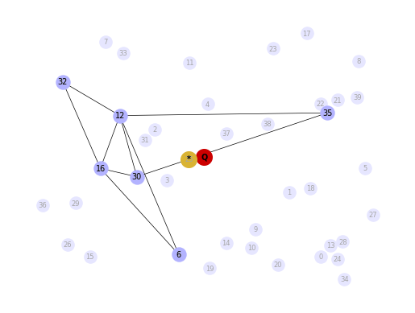
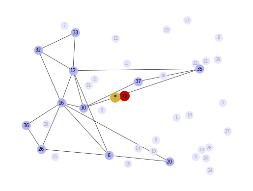
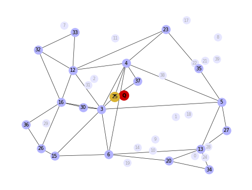
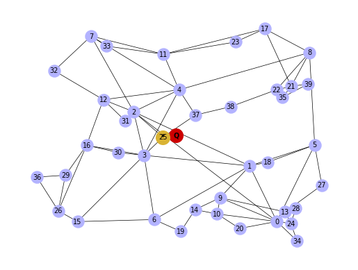
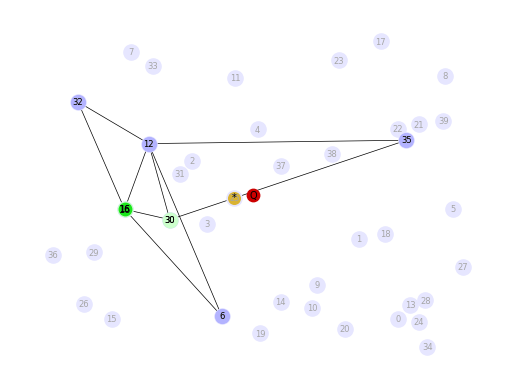
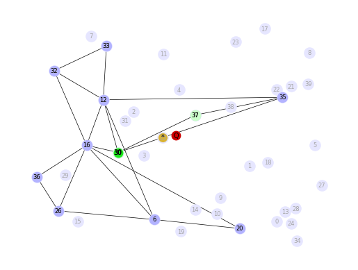
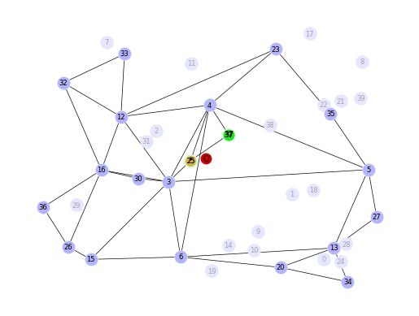
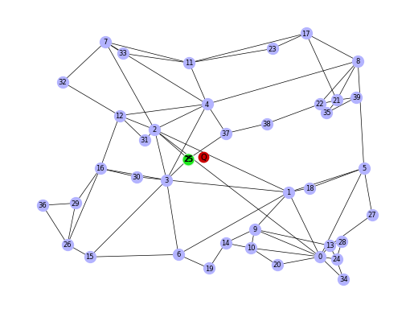

## Remove old Weaviate DB files


```python
!rm -rf ~/.local/share/weaviate
```

# Approximate Nearest Neighbors


```python
from random import random, randint
from math import floor, log
import networkx as nx
import numpy as np
import matplotlib as mtplt
from matplotlib import pyplot as plt
from utils import *

vec_num = 40 # Number of vectors (nodes)
dim = 2 ## Dimention. Set to be 2. All the graph plots are for dim 2. If changed, then plots should be commented. 
m_nearest_neighbor = 2 # M Nearest Neigbor used in construction of the Navigable Small World (NSW)

vec_pos = np.random.uniform(size=(vec_num, dim))
```

### Query Vector


```python
## Query
query_vec = [0.5, 0.5]

nodes = []
nodes.append(("Q",{"pos": query_vec}))

G_query = nx.Graph()
G_query.add_nodes_from(nodes)

print("nodes = ", nodes, flush=True)

pos_query=nx.get_node_attributes(G_query,'pos')
```

    nodes =  [('Q', {'pos': [0.5, 0.5]})]


## Brute Force


```python
(G_lin, G_best) = nearest_neigbor(vec_pos,query_vec)

pos_lin=nx.get_node_attributes(G_lin,'pos')
pos_best=nx.get_node_attributes(G_best,'pos')

fig, axs = plt.subplots()

nx.draw(G_lin, pos_lin, with_labels=True, node_size=150, node_color=[[0.8,0.8,1]], width=0.0, font_size=7, ax = axs)
nx.draw(G_query, pos_query, with_labels=True, node_size=200, node_color=[[0.5,0,0]], font_color='white', width=0.5, font_size=7, font_weight='bold', ax = axs)
nx.draw(G_best, pos_best, with_labels=True, node_size=200, node_color=[[0.85,0.7,0.2]], width=0.5, font_size=7, font_weight='bold', ax = axs)
```


    

    


### HNSW Construction


```python
GraphArray = construct_HNSW(vec_pos,m_nearest_neighbor)

for layer_i in range(len(GraphArray)-1,-1,-1):
    fig, axs = plt.subplots()

    print("layer_i = ", layer_i)
        
    if layer_i>0:
        pos_layer_0 = nx.get_node_attributes(GraphArray[0],'pos')
        nx.draw(GraphArray[0], pos_layer_0, with_labels=True, node_size=120, node_color=[[0.9,0.9,1]], width=0.0, font_size=6, font_color=(0.65,0.65,0.65), ax = axs)

    pos_layer_i = nx.get_node_attributes(GraphArray[layer_i],'pos')
    nx.draw(GraphArray[layer_i], pos_layer_i, with_labels=True, node_size=150, node_color=[[0.7,0.7,1]], width=0.5, font_size=7, ax = axs)
    nx.draw(G_query, pos_query, with_labels=True, node_size=200, node_color=[[0.8,0,0]], width=0.5, font_size=7, font_weight='bold', ax = axs)
    nx.draw(G_best, pos_best, with_labels=True, node_size=200, node_color=[[0.85,0.7,0.2]], width=0.5, font_size=7, font_weight='bold', ax = axs)
    plt.show()
```

    layer_i =  3


    

    


    layer_i =  2


    

    


    layer_i =  1


    

    


    layer_i =  0


    

    


### HNSW Search


```python
(SearchPathGraphArray, EntryGraphArray) = search_HNSW(GraphArray,G_query)

for layer_i in range(len(GraphArray)-1,-1,-1):
    fig, axs = plt.subplots()

    print("layer_i = ", layer_i)
    G_path_layer = SearchPathGraphArray[layer_i]
    pos_path = nx.get_node_attributes(G_path_layer,'pos')
    G_entry = EntryGraphArray[layer_i]
    pos_entry = nx.get_node_attributes(G_entry,'pos')

    if layer_i>0:
            pos_layer_0 = nx.get_node_attributes(GraphArray[0],'pos')
            nx.draw(GraphArray[0], pos_layer_0, with_labels=True, node_size=120, node_color=[[0.9,0.9,1]], width=0.0, font_size=6, font_color=(0.65,0.65,0.65), ax = axs)

    pos_layer_i = nx.get_node_attributes(GraphArray[layer_i],'pos')
    nx.draw(GraphArray[layer_i], pos_layer_i, with_labels=True, node_size=100, node_color=[[0.7,0.7,1]], width=0.5, font_size=6, ax = axs)
    nx.draw(G_path_layer, pos_path, with_labels=True, node_size=110, node_color=[[0.8,1,0.8]], width=0.5, font_size=6, ax = axs)
    nx.draw(G_query, pos_query, with_labels=True, node_size=80, node_color=[[0.8,0,0]], width=0.5, font_size=7, ax = axs)
    nx.draw(G_best, pos_best, with_labels=True, node_size=70, node_color=[[0.85,0.7,0.2]], width=0.5, font_size=7, ax = axs)
    nx.draw(G_entry, pos_entry, with_labels=True, node_size=80, node_color=[[0.1,0.9,0.1]], width=0.5, font_size=7, ax = axs)
    plt.show()
```

    layer_i =  3


    

    


    layer_i =  2


    

    


    layer_i =  1


    

    


    layer_i =  0


    

    


## Pure Vector Search - with a vector database


```python
import weaviate, json
from weaviate import EmbeddedOptions

client = weaviate.Client(
    embedded_options=EmbeddedOptions(),
)

client.is_ready()
```

    Binary /home/jovyan/.cache/weaviate-embedded did not exist. Downloading binary from https://github.com/weaviate/weaviate/releases/download/v1.22.3/weaviate-v1.22.3-Linux-amd64.tar.gz
    Started /home/jovyan/.cache/weaviate-embedded: process ID 178


    {"action":"startup","default_vectorizer_module":"none","level":"info","msg":"the default vectorizer modules is set to \"none\", as a result all new schema classes without an explicit vectorizer setting, will use this vectorizer","time":"2024-01-14T15:18:07Z"}
    {"action":"startup","auto_schema_enabled":true,"level":"info","msg":"auto schema enabled setting is set to \"true\"","time":"2024-01-14T15:18:07Z"}
    {"level":"warning","msg":"Multiple vector spaces are present, GraphQL Explore and REST API list objects endpoint module include params has been disabled as a result.","time":"2024-01-14T15:18:07Z"}
    {"action":"grpc_startup","level":"info","msg":"grpc server listening at [::]:50060","time":"2024-01-14T15:18:07Z"}
    {"action":"restapi_management","level":"info","msg":"Serving weaviate at http://127.0.0.1:8079","time":"2024-01-14T15:18:07Z"}


    True


```python
# resetting the schema. CAUTION: This will delete your collection 
# if client.schema.exists("MyCollection"):
#     client.schema.delete_class("MyCollection")

schema = {
    "class": "MyCollection",
    "vectorizer": "none",
    "vectorIndexConfig": {
        "distance": "cosine" # let's use cosine distance
    },
}

client.schema.create_class(schema)

print("Successfully created the schema.")
```


    ---------------------------------------------------------------------------

    UnexpectedStatusCodeException             Traceback (most recent call last)

    Cell In[10], line 13
          1 # resetting the schema. CAUTION: This will delete your collection 
          2 # if client.schema.exists("MyCollection"):
          3 #     client.schema.delete_class("MyCollection")
          5 schema = {
          6     "class": "MyCollection",
          7     "vectorizer": "none",
       (...)
         10     },
         11 }
    ---> 13 client.schema.create_class(schema)
         15 print("Successfully created the schema.")


    File /usr/local/lib/python3.9/site-packages/weaviate/schema/crud_schema.py:252, in Schema.create_class(self, schema_class)
        204 """
        205 Create a single class as part of the schema in Weaviate.
        206 
       (...)
        248     If the 'schema_class' could not be validated against the standard format.
        249 """
        251 loaded_schema_class = _get_dict_from_object(schema_class)
    --> 252 self._create_class_with_primitives(loaded_schema_class)
        253 self._create_complex_properties_from_class(loaded_schema_class)


    File /usr/local/lib/python3.9/site-packages/weaviate/schema/crud_schema.py:816, in Schema._create_class_with_primitives(self, weaviate_class)
        814     raise RequestsConnectionError("Class may not have been created properly.") from conn_err
        815 if response.status_code != 200:
    --> 816     raise UnexpectedStatusCodeException("Create class", response)


    UnexpectedStatusCodeException: Create class! Unexpected status code: 422, with response body: {'error': [{'message': 'class name "MyCollection" already exists'}]}.


### Import the Data


```python
data = [
   {
      "title": "First Object",
      "foo": 99, 
      "vector": [0.1, 0.1, 0.1, 0.1, 0.1, 0.1]
   },
   {
      "title": "Second Object",
      "foo": 77, 
      "vector": [0.2, 0.3, 0.4, 0.5, 0.6, 0.7]
   },
   {
      "title": "Third Object",
      "foo": 55, 
      "vector": [0.3, 0.1, -0.1, -0.3, -0.5, -0.7]
   },
   {
      "title": "Fourth Object",
      "foo": 33, 
      "vector": [0.4, 0.41, 0.42, 0.43, 0.44, 0.45]
   },
   {
      "title": "Fifth Object",
      "foo": 11,
      "vector": [0.5, 0.5, 0, 0, 0, 0]
   },
]
```


```python
client.batch.configure(batch_size=10)  # Configure batch

# Batch import all objects
# yes batch is an overkill for 5 objects, but it is recommended for large volumes of data
with client.batch as batch:
  for item in data:

      properties = {
         "title": item["title"],
         "foo": item["foo"],
      }

      # the call that performs data insert
      client.batch.add_data_object(
         class_name="MyCollection",
         data_object=properties,
         vector=item["vector"] # your vector embeddings go here
      )

```


```python
# Check number of objects
response = (
    client.query
    .aggregate("MyCollection")
    .with_meta_count()
    .do()
)

print(response)
```

    {'data': {'Aggregate': {'MyCollection': [{'meta': {'count': 5}}]}}}


### Query Weaviate: Vector Search (vector embeddings)


```python
response = (
    client.query
    .get("MyCollection", ["title"])
    .with_near_vector({
        "vector": [-0.012, 0.021, -0.23, -0.42, 0.5, 0.5]
    })
    .with_limit(2) # limit the output to only 2
    .do()
)

result = response["data"]["Get"]["MyCollection"]
print(json.dumps(result, indent=2))
```

    [
      {
        "title": "Second Object"
      },
      {
        "title": "Fourth Object"
      }
    ]


```python
response = (
    client.query
    .get("MyCollection", ["title"])
    .with_near_vector({
        "vector": [-0.012, 0.021, -0.23, -0.42, 0.5, 0.5]
    })
    .with_limit(2) # limit the output to only 2
    .with_additional(["distance", "vector, id"])
    .do()
)

result = response["data"]["Get"]["MyCollection"]
print(json.dumps(result, indent=2))
```

    [
      {
        "_additional": {
          "distance": 0.6506307,
          "id": "c7f64e67-b4be-4491-b402-001e15616663",
          "vector": [
            0.2,
            0.3,
            0.4,
            0.5,
            0.6,
            0.7
          ]
        },
        "title": "Second Object"
      },
      {
        "_additional": {
          "distance": 0.8072029,
          "id": "c7d69e17-0af0-4802-8eb7-e3d7355eb07e",
          "vector": [
            0.4,
            0.41,
            0.42,
            0.43,
            0.44,
            0.45
          ]
        },
        "title": "Fourth Object"
      }
    ]


### Vector Search with filters


```python
response = (
    client.query
    .get("MyCollection", ["title", "foo"])
    .with_near_vector({
        "vector": [-0.012, 0.021, -0.23, -0.42, 0.5, 0.5]
    })
    .with_additional(["distance, id"]) # output the distance of the query vector to the objects in the database
    .with_where({
        "path": ["foo"],
        "operator": "GreaterThan",
        "valueNumber": 44
    })
    .with_limit(2) # limit the output to only 2
    .do()
)

result = response["data"]["Get"]["MyCollection"]
print(json.dumps(result, indent=2))
```

    [
      {
        "_additional": {
          "distance": 0.6506307,
          "id": "c7f64e67-b4be-4491-b402-001e15616663"
        },
        "foo": 77,
        "title": "Second Object"
      },
      {
        "_additional": {
          "distance": 0.8284496,
          "id": "c3536c09-9aec-455e-b52f-24b2640c0bdc"
        },
        "foo": 99,
        "title": "First Object"
      }
    ]


### nearObject Example


```python
response = (
    client.query
    .get("MyCollection", ["title"])
    .with_near_object({ # the id of the the search object
        "id": result[0]['_additional']['id']
    })
    .with_limit(3)
    .with_additional(["distance"])
    .do()
)

result = response["data"]["Get"]["MyCollection"]
print(json.dumps(result, indent=2))
```

    [
      {
        "_additional": {
          "distance": 0
        },
        "title": "Second Object"
      },
      {
        "_additional": {
          "distance": 0.051573694
        },
        "title": "Fourth Object"
      },
      {
        "_additional": {
          "distance": 0.06506646
        },
        "title": "First Object"
      }
    ]


```python

```


```python

```


```python

```


```python

```


```python

```


```python

```


```python

```


```python

```


```python

```


```python

```


```python

```
