# Introduction

Before we start, I want to share with you a few tips on how to become a successful app creator with Replit agent.

## Key Principles

### Be Precise

Make sure to give Replit agent one task at a time. If you have a complex task in mind, break it down into smaller pieces. Otherwise, you will soon find out that adding multiple complex task at once can be really challenging for today's coding agents.

On a similar note, make your prompts specific and detailed. Much like human developers, coding agents work best when they receive clear and unambiguous instructions.

    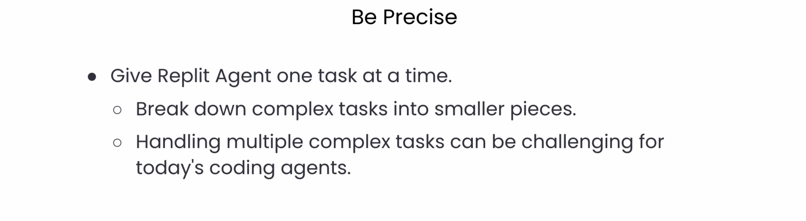
    
Figure 1: Breaking down complex tasks into smaller, manageable pieces

### Be Well Organized

Keep your project as tidy as possible. Add features step by step. Test thoroughly after each addition, and don't hesitate to roll back when something breaks. Always start with a fresh session for each new feature. In this way, it will be easier to go back to what was working well before.

And last but not least, do not hesitate to return to your last working version. If you keep piling up unstable code and features most likely will end up with a mess that will hinder you from making steady progress.

    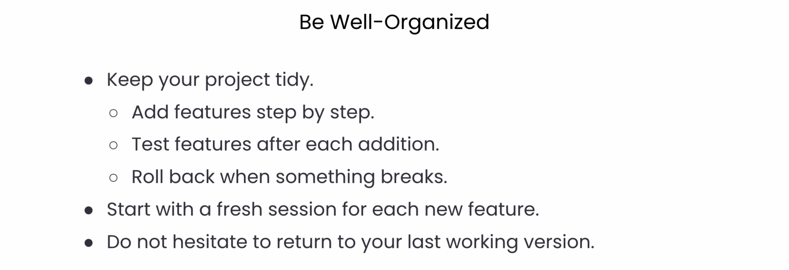
    
Figure 2: Maintaining a well-organized project structure

### Be Patient

Even if you're not technical, do your best to build an understanding of the app and its components as you go. Replit agent explains in detail the rationale behind each actually takes, describing both the thought process and the changes it makes on the code.

By reading carefully the output of Replit agent, you will quickly learn everything about the app that you are creating. So, as a natural follow-up, take a moment to review the suggestions before accepting them.

On one end, question things that don't make sense, but on the other end, trust that Replit agent might often surprise you with an effective solution to the issue that you're facing.

Be patient while debugging - it's part of the process when developing complex features. Even the best software developers spend most of their time debugging. Replit agent is getting better on a daily basis, but is still not perfect. So, allowing it the time to debug with different strategies will make you more successful than you might expect.

    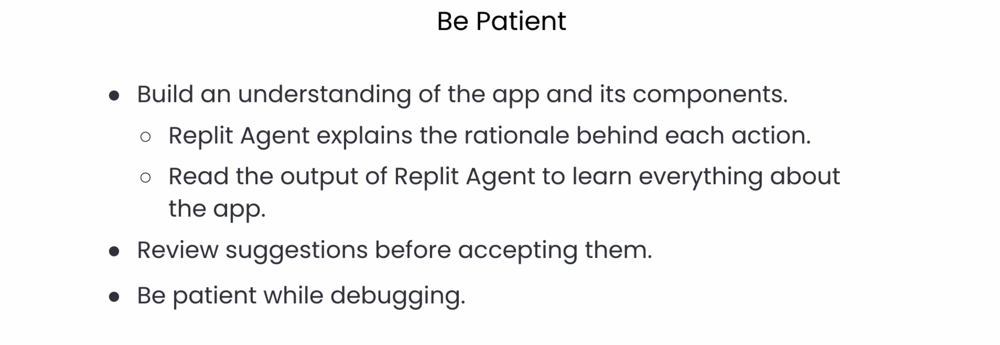
    
Figure 3: The importance of patience in the development process

# Course Overview

In this lesson, we'll explore the Replit platform and its AI-powered tools that accelerate development. You'll learn the fundamental concepts behind effective AI collaboration and key strategies for building applications with AI assistants. We'll also familiarize ourselves with Replit and walk through getting set up.

    
    
Figure 4: Modern development with AI-powered tools

## About the Instructor

I'm Matt, I head up developer Relations at Replit. You can find me on social on X or on YouTube.

    
    
Figure 5: Course overview and learning objectives

## What is Vibe Coding?

Vibe coding is typically leaning into our AI agents or AI tools to rely on writing the code rather than write it ourselves. What that means is that there's a large jump in productivity, and a lot of people have seen that they're able to build applications they never were able to create before. That means it can take you from an idea that lives in your head to a real application deployed on the web.

## Developer Experience

Developer experience means the experience of developing applications or the tools, the techniques, and the environments that developers use to build things. These tools can be intimidating, which is what we're going to cover today.

## Course Objectives

In this course, we're going to:
- Use AI to build real deployed apps
- Learn why tooling is important and how to make the most of the tools
- Learn how to communicate with AI effectively
- Gain skills for effective building that you can apply to every area of your life

# Replit Platform Overview

## What is Replit?

Replit is a unique environment that runs entirely in your browser in one tab, with no installation required. It includes AI tools for every step of the way and has everything you need to build full stack applications, including databases, object storage, authentication, and other tools and services.

    
    
Figure 6: The Replit platform interface

## Replit Tools

### Replit Agent and Assistant

Agent is our automated developer that allows you to build and configure an entire project from scratch with just your voice, generate and build a plan for your project, and make complex, multi-step changes to your code.

Assistant is our more lightweight tool for chat and quick edits. With Assistant, you can chat with AI about any topic, request quick one-off edits to code and ask questions about your project.

    
    
Figure 7: Replit's AI-powered development tools

## Pricing

Replit has a free tier that you can use for most, if not all, of this course. You get up to three free projects on Replit, which fits into the free tier, and you get a number of credits and checkpoints to use agent and Assistant without having to pay.

    
    
Figure 8: Replit's pricing structure and free tier features

# Key Skills for Vibe Coding

## 1. Thinking

The ability to think effectively is crucial when working with AI tools. Let's explore different types of thinking that will help you succeed.

    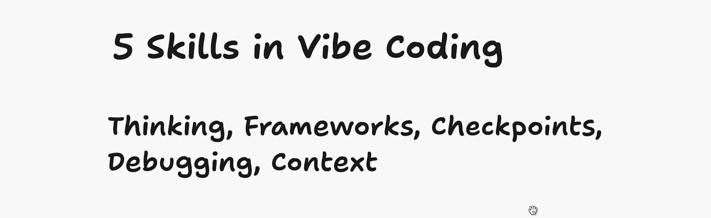
    
Figure 9: Essential skills for vibe coding

### Types of Thinking
- Logical thinking: Understanding the basic rules and concepts
- Analytical thinking: Breaking down problems and learning how to solve them
- Computational thinking: Understanding patterns and how to program computers
- Procedural thinking: Understanding how to excel at a task and handle edge cases

## 2. Frameworks

The important thing is to start thinking about how your app works. Start thinking through how your app works, how we're implementing solutions to these problems, and then think about the solutions that already exist.

    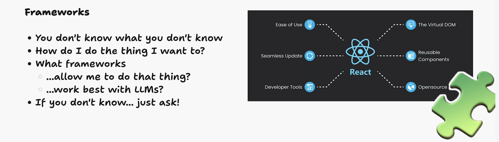
    
Figure 10: Understanding application frameworks and architecture

## 3. Checkpoints

An unfortunate fact in building is that things break. Every project in Replit has version control by default. We'll have checkpoints when we're building with AI and we're going to chunk up what we're building into logical steps.

    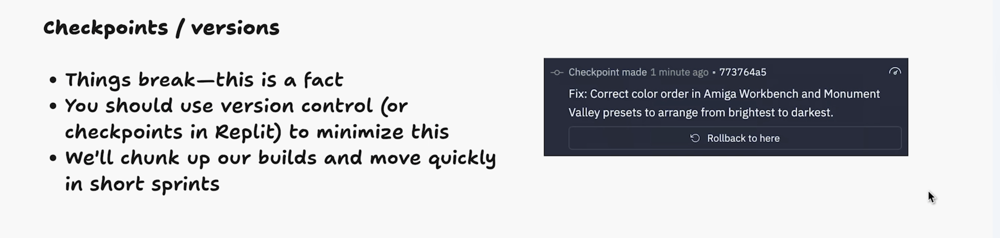
    
Figure 11: Using checkpoints for version control

## 4. Debugging

Debugging is the process of figuring out why things broke. The best debugging is methodical, thorough, and starts from first principles.

    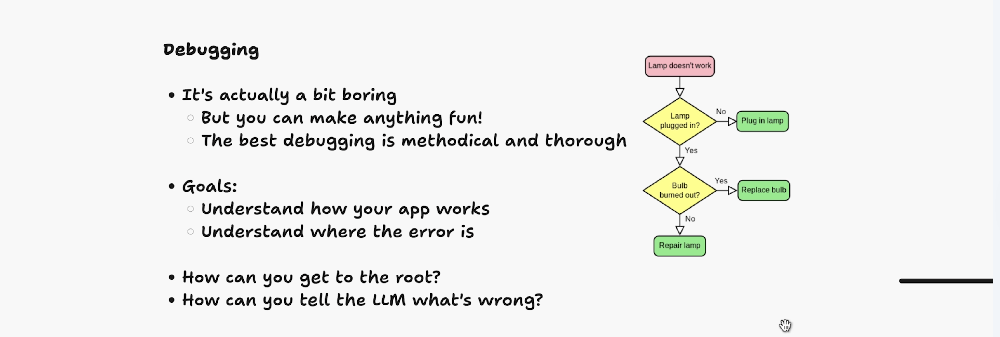
    
Figure 12: The debugging process and problem-solving

The goals in debugging are to:
1. Understand how our app works
2. Understand where the error is
3. Get to the root of the problem
4. Tell the LLM what's wrong so it can fix the problem

## 5. Context

The context window is the amount of tokens an LLM can process at a given time. We need to make sure context is relevant to what we're trying to do.

    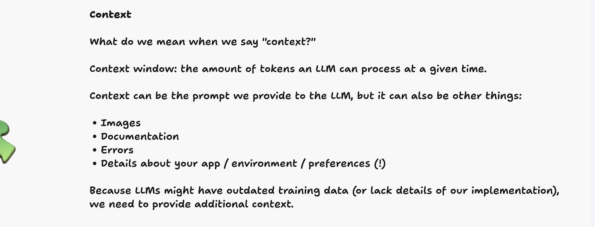
    
Figure 13: Understanding and managing AI context

Context can be:
- The prompt we provide to the LLM
- Images
- Documentation
- Errors or details about your app environment or preferences

# Building Process

## MVP Development

When building with AI:
1. Start with a minimum viable product (MVP)
2. Give AI only the information relevant to the MVP
3. Start small and work your way up to something full-featured
4. Provide foundational context and important details in the first prompt
5. Make incremental changes and use checkpoints
6. Roll back if anything goes wrong

    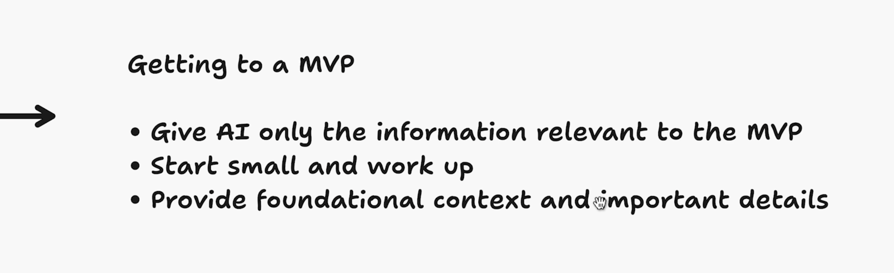
    
Figure 14: The MVP development process

## Development Cycle

The development pattern follows this cycle:
1. Prompt AI to get MVP or feature
2. Test the application
3. Debug if needed
4. Create a checkpoint
5. Move on to next MVP or feature

    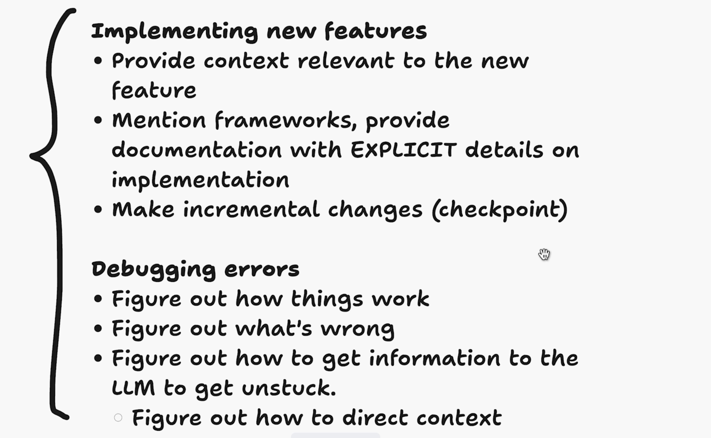
    
Figure 15: Adding new features to your application

    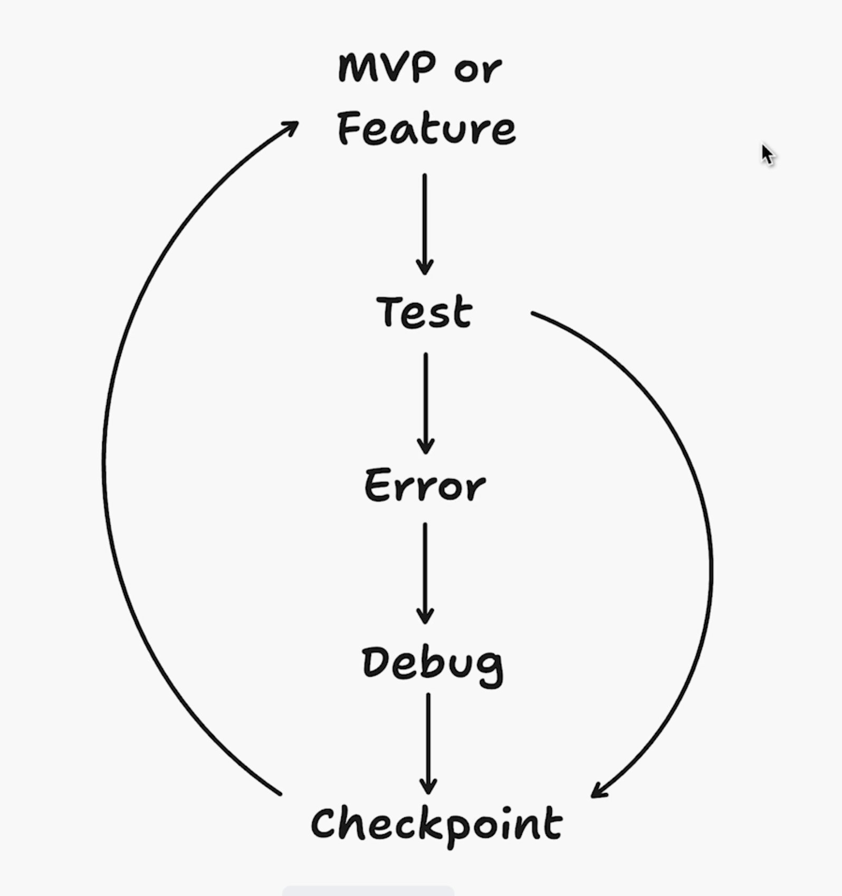
    
Figure 16: The iterative development cycle

# Getting Started with Replit

To get started:
1. Create an account on Replit.com
2. Use the chat-first interface to interact with Agent
3. Use the side pane to manage applications, view deployments, and manage your account

    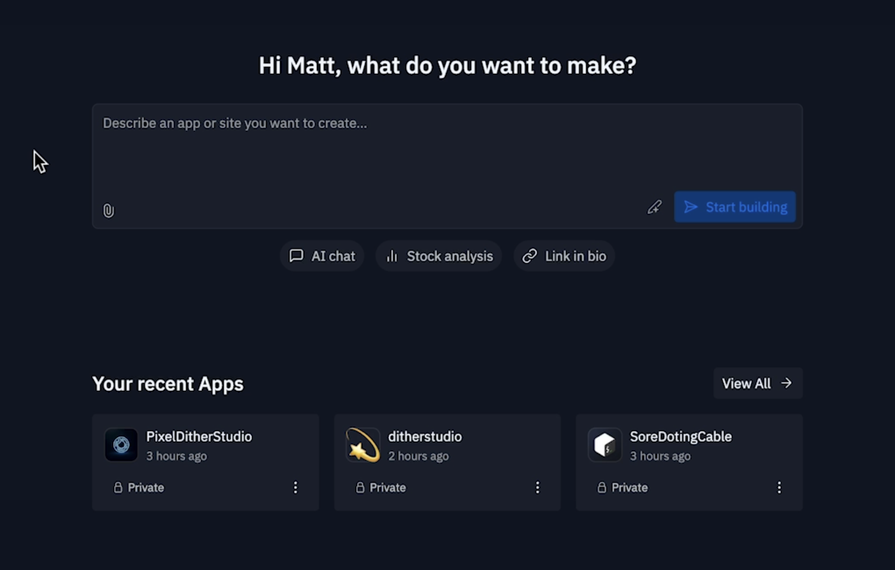
    
Figure 17: The Replit main interface

    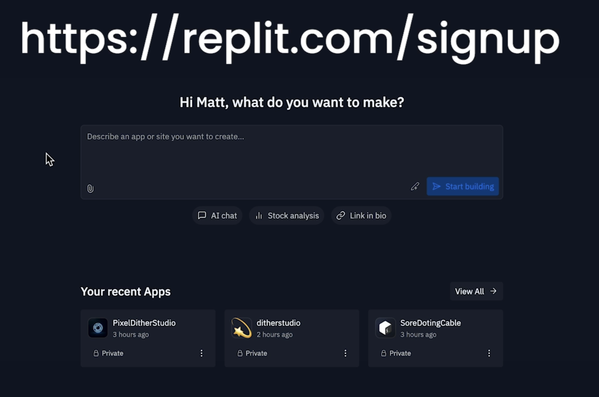
    
Figure 18: Project overview in Replit

    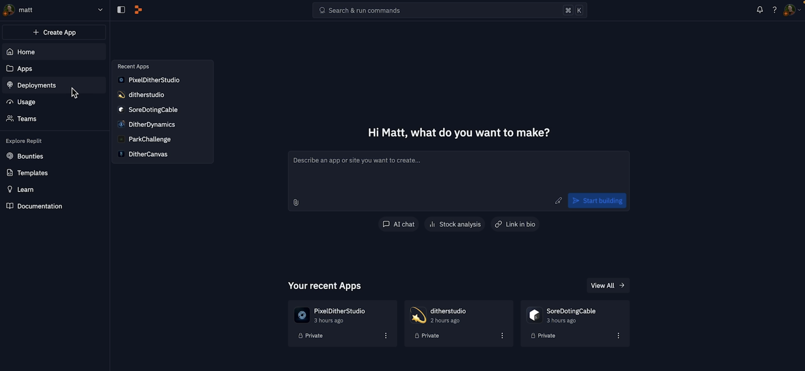
    
Figure 19: Key interface features in Replit

Let's get started building!

