# Planning and Building an SEO Analyzer

## Introduction
In this lesson, we'll build a website performance analyzer. You'll learn how to examine HTML content and understand website structure. That is, understanding the concepts that will be automating. We'll create a product requirements document or PRD and wireframe before leveraging Replit's Agent to build our first prototype.

## Project Overview
We're going to build an SEO analyzer where you can enter any website URL and view the site's load times and tags. We'll also cover exactly what these things are, and exactly why they're important.

## Core Functionality
The analyzer will allow us to check if the site is properly implemented and get insights on our SEO best practices. It's an interactive tool that allows you to enter a website URL, view a visual representation of the site's load times and tags to make sure what we're building is properly configured, and check if the site is properly implemented.

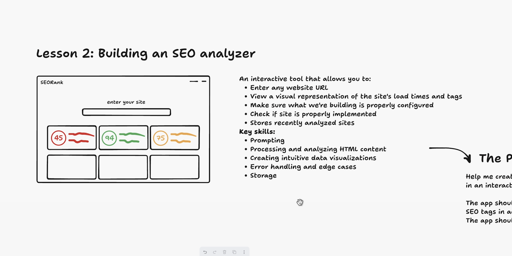

As a stretch goal, we might store recently analyzed sites in a database. The skills involved here are prompting, processing, and analyzing HTML content and creating intuitive data visualizations. It also involves handling errors and edge cases as well as storage.

## User Interface Design
The main entry point that users will engage with is a simple text box where you can enter a URL. From entering that URL, we want our app to return recommendations on the website that we enter. For example:
- Hey, you didn't give a title to your website
- You didn't give a description to your website

These issues make it hard for Google to find your website or hard for people to know what your website's about. These meta tags are embedded on every website. When building websites or deploying apps, it's actually important to consider these things. It's important to consider the preview of how your website shows up when people search for it.

## Development Approach
When we talk about vibe coding or just going with the flow, it can often be more helpful to go through this exercise and break down exactly what we want, conceptualize it, visualize it, so that we're not going into a tool without really any concept of what we're doing, or we understand at least a little bit better what we're trying to get to.

## Initial Prompt for Replit Agent
Our prompt is: "Help me create an interactive app that displays the SEO or meta tags for any website in an interactive and visual way to check that they're properly implemented."

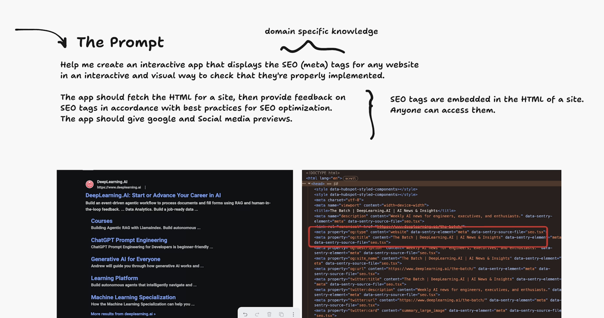

Note that this is domain-specific knowledge. You might not know what SEO tags are or what meta tags are. AI does, and by using those terms, by understanding the framework or understanding what we might not know about this domain, we're able to target and direct Replit Agent into what it's building.

The app should:
- Fetch the HTML for a site
- Provide feedback on SEO tags in accordance with best practices for SEO optimization
- Give Google and social media previews

## Technical Implementation
We're asking the app to fetch the HTML for the site - that's essentially scraping websites. For any website, we're going to scrape it and then get the contents. We want our app to return feedback - actionable insights on what we're doing.

SEO tags are embedded in the HTML of the site. Anyone can access them. That's how we know this app has a high likelihood of working and succeeding.

## Visual Example
When we search DeepLearning.AI on Google, the result that we're returning is actually the SEO title of the website, and the description is listed below. We can see this in the console or the actual underlying HTML of the page.

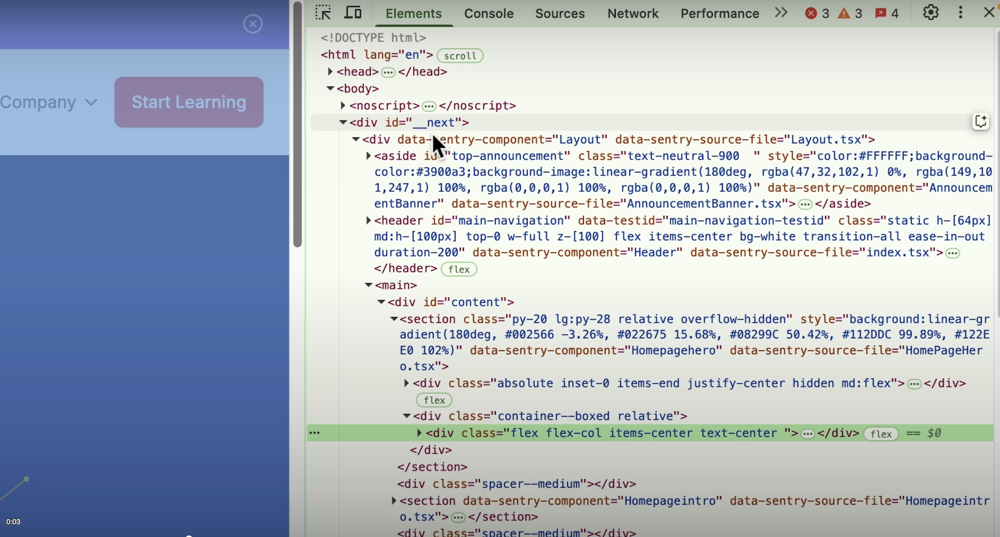

If you click into the page and then right-click and click inspect, you'll get what's known as a browser console or DevTools. This is just the underlying HTML for the website. In the HTML head section, you'll see meta tags, including the title and description.

## Building with Replit Agent
Once we type in our prompt and click start building on Replit, Agent will:
1. Analyze the prompt and present a plan
2. Build the initial prototype
3. Ask if we want any follow-up features
4. Mention any frameworks or integrations being used

Agent comes with many integrations. For example, if you wanted to build an app that uses the Anthropic API or has Stripe payments, we support those integrations natively.

## Development Process

Agent will:
1. Design a visual preview of our app in real-time
2. Create a fully interactive version
3. Scaffold the project
4. Install packages
5. Configure the environment

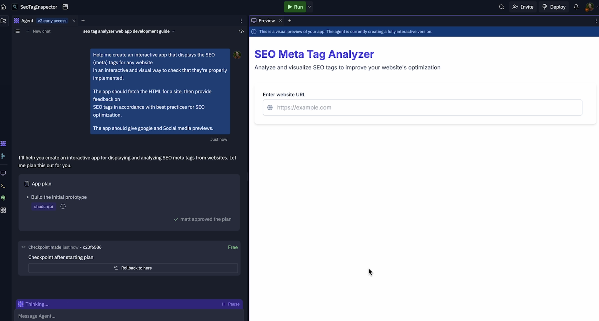

The development process might take 5-10 minutes for the first implementation, but you can expect a fully featured app. The way Agent is designed is to build these apps from start to MVP, which is why we stay high-level and keep the prompts simple.

## Workspace Features

Replit is more than just Agent and assistant - it's an entire environment, an entire workspace. You can:
- View files in the workspace
- Access a shell or console
  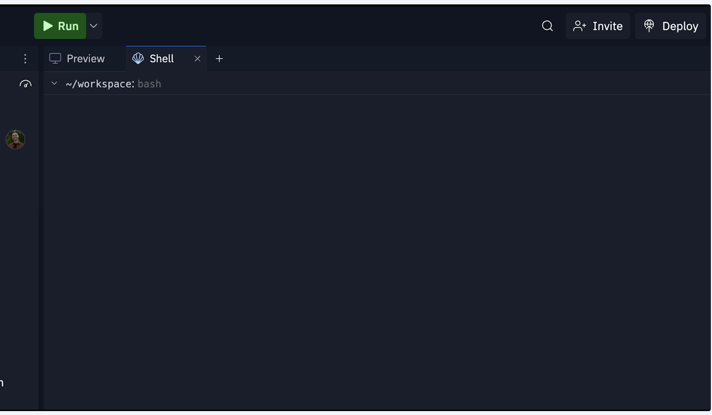
- Use the tab interface or All Tools section
 
- Integrate git
- Install dependencies
- View output
- Store secrets (environment variables)

You don't have to do these things if you're not familiar with programming - we can build entirely using natural language.

<!-- 8.02-->

## Initial App Implementation

But for the first implementation you can expect a fully featured app.

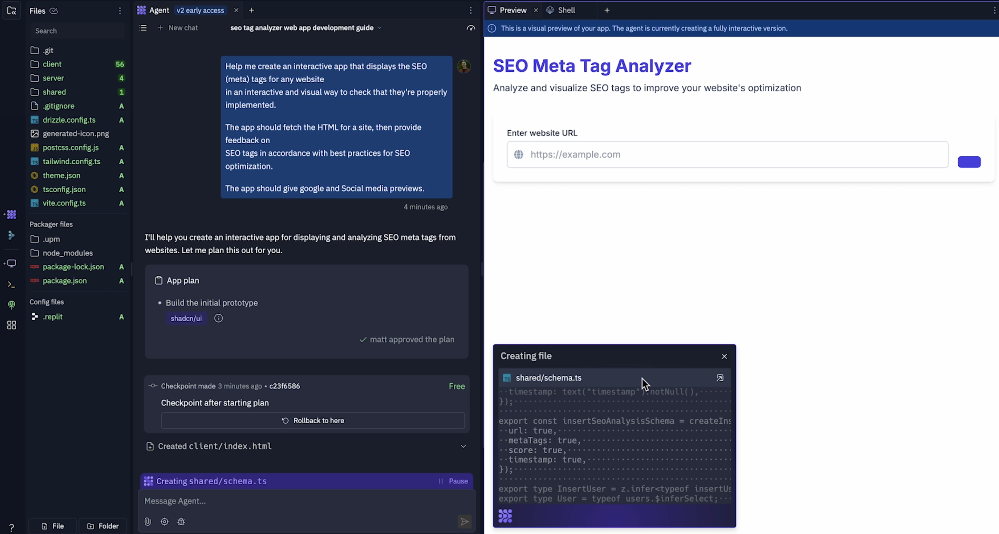

## Agent Actions and File Creation

As you can see on the left there, Agent just created a client, a server, and a whole host of other configuration files.

## Interactive File Writing

Now we see the Agent is actually writing and creating files in this interactive pane here.

## Focus on MVP and Transparency

And part of the reason that we do this is because we want to get you to an MVP as fast as possible, and so there's less back and forth required with Replit Agent. But along the way, Agent is going to show you exactly what it's doing.

## Observing File Structure

So we can see that it's writing this file server routes. It already wrote our client index and some other things. Now, it's not important to dig into how all of these things work, but what might be useful is to start to pay attention to how Agent creates these apps.

## Reverse Engineering for Learning

And start to reverse engineer how the applications work, because it can teach you a lot about programing. It can teach you a lot about building.

## Understanding Client, Server, and Shared Folders

For example, I see that there are folders here client, server, and shared. If you're unfamiliar, a client is typically a front-end and a server is typically a backend. So it makes sense that clicking to the server exposes things like routes.

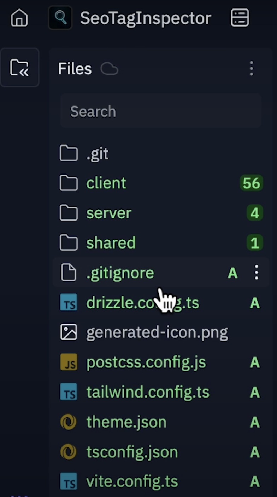

## Backend Communication (APIs)

If you're not familiar with APIs. This is a way, programmatic way for applications to communicate. And that happens in our backend.

## Frontend Structure

But in the client, we might see the source file and notice there's like an index HTML file, things like `app.tsx`, that might be a main sort of entry point for our app or `index.css`. CSS defines how the app is style.

## Optional Code Exploration

And so what I'm trying to drive home here is that you really don't need to look at any of this. You know, like if this is intimidating for you to just close that and don't look at it and you know, like we'll just keep vibe coding. But if you're trying to learn and follow along as you're building these things, you can start to poke around, start to pay attention.

## Component Observation

Oh, hey, Agent is defining this thing, this component called Social Media Preview. I bet if we go into our components folder and we look at the

<!-- 10:02-->
<!-->
10:03 So again, Agent is going to, on the first run, create this app from scratch. 10:09 Is going to implement the front-end and the backend.
10:11 This is a lot of talking. Yes.
10:13 But what we're going to have when Agent is done running is an MVP
10:17 that we can start iterating on.
10:18 It does that in order to deliver, use something that just works
10:22 and that we can kind of keep punching through
10:24 or we can keep iterating on once our application is stood up.
10:30 And so that's been our workspace overview.
10:32 We're going to let the Agent keep building.
10:34 You'll be able to see all of the things that it does.
10:36 And then we'll come back once we have our MVP and start iterating.
10:40 This is often how I develop my first prototypes when I'm building
10:43 with Replit Agent.
10:50 Cool.
10:50 So what you'll notice on the right is that we have an implemented version 10:54 of our app.
10:54 And I want to dig in for a second to the Agent
10:57 sort of history chat history here to see what was happening.
11:01 So as you saw when we were writing the application,
11:04 there are a bunch of file edits that happened.
11:06 Any time you can dig into these and you can even click the drop-down
$11: 09$ to see exactly what was created or exactly what changed.
11:12 Then, Agent went along and actually installed the dependencies
11:16 that we needed for our application, as well as some ancillary
$11: 19$ dependencies that I might have missed on the first pass.
11:22 Then it configured the run button up top here, to execute our app
11:26 and cycled through and actually recognized, hey,
11:28 we missed a package like this thing's not going to work unless we install it.
11:32 Then it did some final checks,
11:33 made an edit to our storage implementation, noticed an issue,
11:37 restarted the application and fixed that issue.
11:40 And so one of the great things about building with with Replit
11:42 building with Agent is that you don't have to worry about
11:44 like some of these like hassles and getting started.
$11: 46$ You can let Agent take the reins and kind of implement some of this functionality.-->

## Initial App Creation and MVP

So again, Agent is going to, on the first run, create this app from scratch, implementing the front-end and the backend. This is a lot of talking. Yes. But what we're going to have when Agent is done running is an MVP that we can start iterating on. It does that in order to deliver something that just works, allowing us to keep iterating once our application is stood up.

## Workspace Overview and Agent Building

And so that's been our workspace overview. We're going to let the Agent keep building. You'll be able to see all of the things that it does, and then we'll come back once we have our MVP and start iterating. This is often how I develop my first prototypes when I'm building with Replit Agent.

## Implemented App and Agent History

Cool. So what you'll notice on the right is that we have an implemented version of our app. And I want to dig in for a second to the Agent's chat history here to see what was happening. As you saw when we were writing the application, there are a bunch of file edits that happened. Any time you can dig into these and you can even click the drop-down to see exactly what was created or exactly what changed.

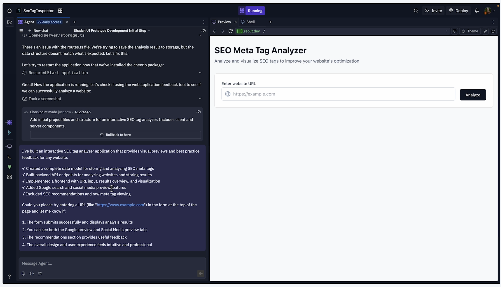

## Dependency Management and Configuration

Then, Agent went along and actually installed the dependencies that we needed for our application, as well as some ancillary dependencies that I might have missed on the first pass. Then it configured the run button up top here to execute our app and cycled through and actually recognized, hey, we missed a package, like this thing's not going to work unless we install it.

## Final Checks and Benefits of Agent

Then it did some final checks, made an edit to our storage implementation, noticed an issue, restarted the application, and fixed that issue. And so one of the great things about building with Replit Agent is that you don't have to worry about some of these hassles in getting started. 

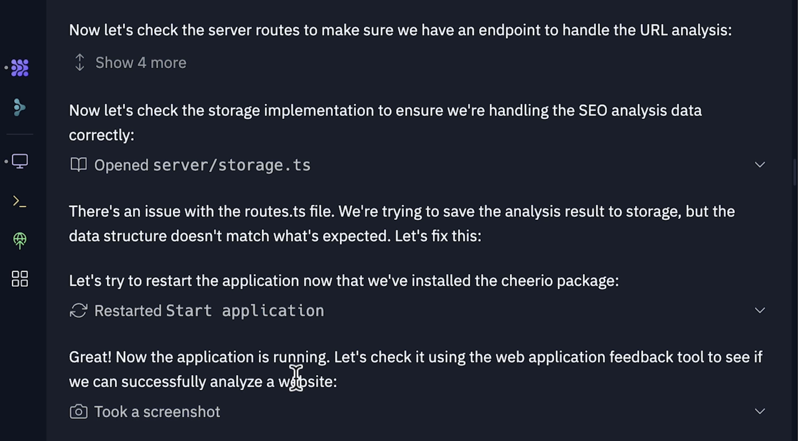

You can let Agent take the reins and kind of implement some of this functionality.
<!-- 11:46 -->

<!--11:51 From there, it confirmed exactly what it did and exactly what it created.
$11: 55$ Now, this is another good way to learn about what we're building.
11:58 Hey, we created a complete data model for storing and analyzing these tags.
12:02 We built back end API endpoints.

12:03 We implemented a front end with a URL input, results overview and visualization.
12:08 And we did a bunch of other stuff.
12:09 So, now we can see if it works.
12:11 We can start debugging. We can start testing our app.
12:13 We have our web view on the right which is going to
12:16 show us a preview of our app.
12:17 Now what's important to note if you've ever written code,
12:20 if you've ever built with another tool, you've probably did that on localhost,
12:24 which is basically running something on your local machine.
12:27 This WebView is going to look similar, but fundamentally,
12:31 this app, this Replit app, is running at an URL,
12:34 so you can actually access this from anywhere.
12:36 You can access it in your browser.
12:37 If I click this and it would open this WebView up in a new tab,
12:41 you could scan it and access it on your phone in real time
12:44 as you're developing. Your friends could access it while you're building.
12:47 It's important to mention that once you leave this app,
12:49 once you close this page, this URL will go to sleep.
12:52 This is not a deployment,
12:53 but it is a development environment that is live on the internet technically.
12:58 So fundamentally we're working with like a real web page.
13:01 So let's test this out. Let's see how it works.
13:02 I'm going to type in my blog and see what's going on.
13:08 So I click analyze.
13:09 We get an SEO summary.-->

### What We Built

From there, it confirmed exactly what it did and exactly what it created. Now, this is another good way to learn about what we're building. Hey, we created a complete data model for storing and analyzing these tags. We built back end API endpoints.

### Front End Implementation

We implemented a front end with a URL input, results overview and visualization. And we did a bunch of other stuff.

### Testing and Debugging

So, now we can see if it works. We can start debugging. We can start testing our app. We have our web view on the right which is going to show us a preview of our app.

### Replit App URL

Now what's important to note if you've ever written code, if you've ever built with another tool, you've probably did that on localhost, which is basically running something on your local machine. 

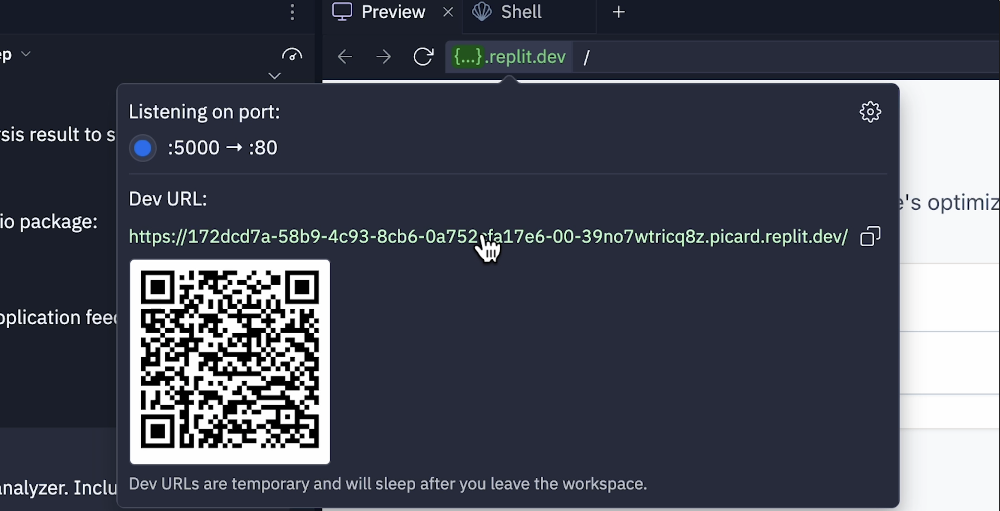

This WebView is going to look similar, but fundamentally, this app, this Replit app, is running at an URL, so you can actually access this from anywhere. You can access it in your browser. If I click this and it would open this WebView up in a new tab, you could scan it and access it on your phone in real time as you're developing. Your friends could access it while you're building. It's important to mention that once you leave this app, once you close this page, this URL will go to sleep. This is not a deployment, but it is a development environment that is live on the internet technically. So fundamentally we're working with like a real web page.

### Testing the App

So let's test this out. Let's see how it works. I'm going to type in my blog and see what's going on. So I click analyze. We get an SEO summary.

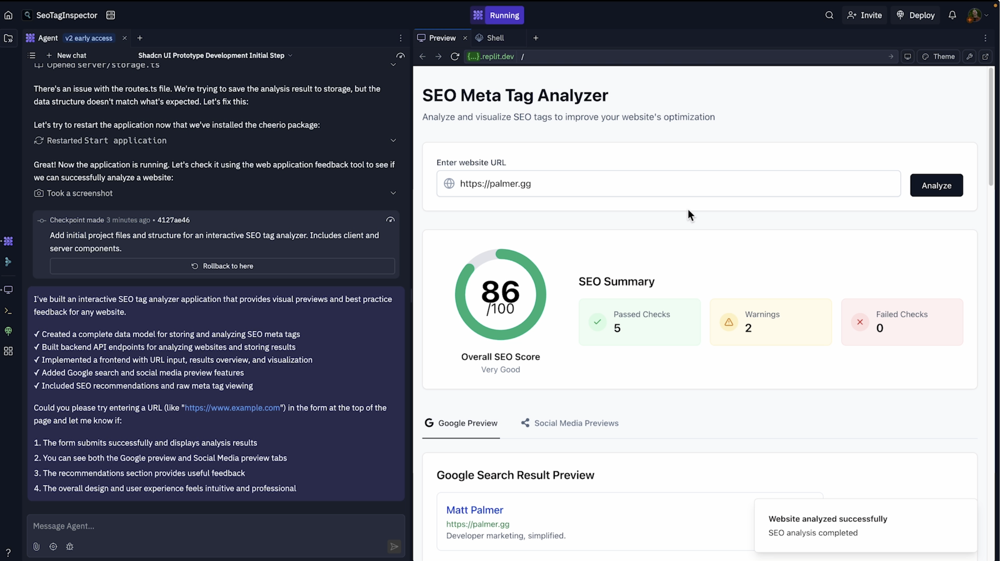

<!--13:11 86 out of 100 I guess that's not bad.
13:13 It might be like $a b, a b$ plus here.
13:15 I'm not complaining.
13:16 It seems like we have some some scores.
13:19 Let's see what's going on here.
13:21 So Matt Palmer. That's right.
13:22 Developer marketing simplified. That's right.
13:24 It looks like a warning.
13:25 Our title tag is too short a description.
13:28 The description is a bit too short.
13:30 The details there.
13:32 It looks like we're getting some best practices,
13:33 so this is pretty similar to what we wanted.
13:35 And we also have some keyword recommendations.
13:37 We're getting a kind of a pass there
13:40 and some other recommendations.
13:42 So what, our analyzer is telling us is, hey, if we want our website to show up on
13:48 search on Google, maybe even an indexing for LLMs, I don't know.
13:52 We could optimize our title, we could improve the description
13:55 and make it maybe a little bit longer.
13:57 So this is really great.
13:59 l'd say it's close to what we want.
14:01 It looks like
14:01 we also have some social media previews, so let's go see what's going on there.
14:04 So we have a Facebook preview and it is loading the image properly.
14:10 And we have a Twitter preview and it's also loading the image properly there.
14:14 So what we've done here is implemented this tool that they can
$14: 18$ then check to make sure that our website is displayed properly
14:22 on social media, and that it's being indexed properly by SEO.
14:25 And this was one shot, right?
14:26 We all we did was type in that initial prompt.
14:29 And let's try with another website.
14:30 Let's say, DeepLearning.AI

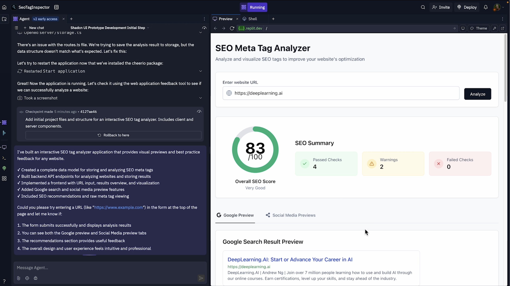

14:34 See what we get.
14:37 Okay.
14:37 So I just want to point out my website had a higher score.
14:40 I'm sure after I record this Andrew's website, we'll have a higher score.
14:44 I have no doubt he's going to be on top of that.
14:47 But, just to see that everything's coming through,
14:49 we do get our social media previews
14:51 and we do get our Twitter card previews and everything else.
14:54 So this is kind of the part we're talking about, right?
14:56 Like now I'm just testing the app.

14:57 I'm seeing if it does what I expect it to do.
15:00 Part of vibe coding, a large part of vibe coding is having an attention to detail
15:03 and having, really like dialed in product sense, for example.
15:08 I'm not crazy about the spacing here.
15:10 83 looks like it's on top of 100.
15:11 That's like not good enough. We're going to fix that.
15:13 We're going to make that better.
15:14 Some of the other elements down here
15:16 this looks nice but these are misaligned past isn't in the middle of this pill.
15:22 I think a lot of the other sort of visual
15:25 representations of this of this site are really good.
15:28 But, part of building with AI is being very descriptive about what
15:32 works, about what doesn't work, and about what you want to change.
15:35 Right?
15:35 And so another example. This, the padding could probably probably
15:40 be more padding on this website for it to look nice.
15:43 One of the interesting things about web development is that you want your
15:46 apps to be responsive.

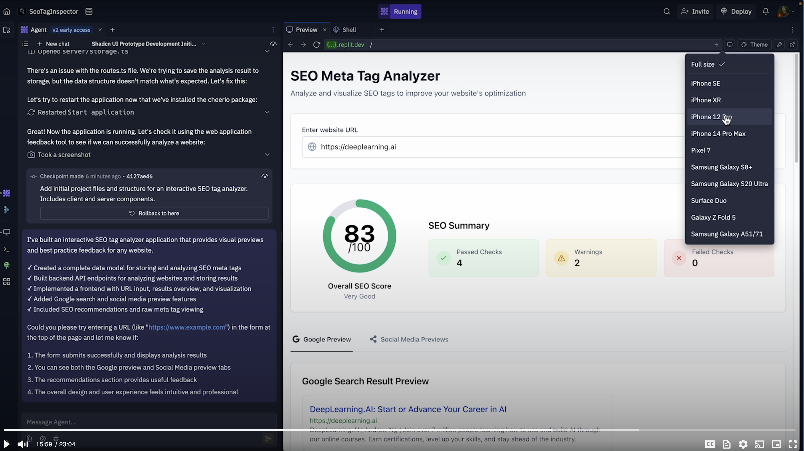

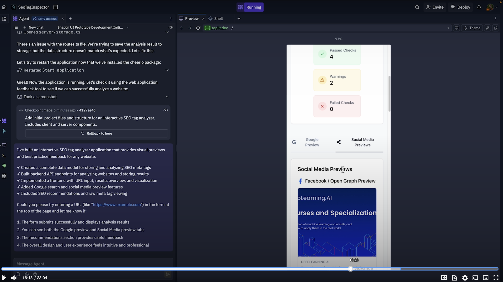

15:46 So you can see there, if we make this wider,
15:48 the padding actually looks a little bit better.
15:50 So what's going on here is probably that this is an optimized for small screens.
15:54 We can see that by resizing the WebView or by going to this handy
15:58 little screen size toggle here and seeing what it looks like on an iPhone.
16:01 Maybe we want to build this for an iPhone.
16:02 So it's important to check that out, right?
16:04 Like, hey, these pills, they're not really expanding the way I want them to.
16:09 These tabs, they might look a little compressed.
16:11 The icons might not be, aligned properly.
16:13 And then we don't get the same aspect ratio for these images.
16:17 Again, this might seem trivial, but it's really important to dig into the details.
16:21 Right? The text is overlapping here.
16:23 So all that considered we have an MVP.
16:27 We have something that works.
16:28 And I think it was pretty impressive that Agent did it in one shot.
16:30 So now we're going to follow up
16:32 and we're going to fix some of these characteristics.
16:34 So I'm going to say make my app fully responsive.

16:39 This prompt is important.
16:40 What is responsive mean?

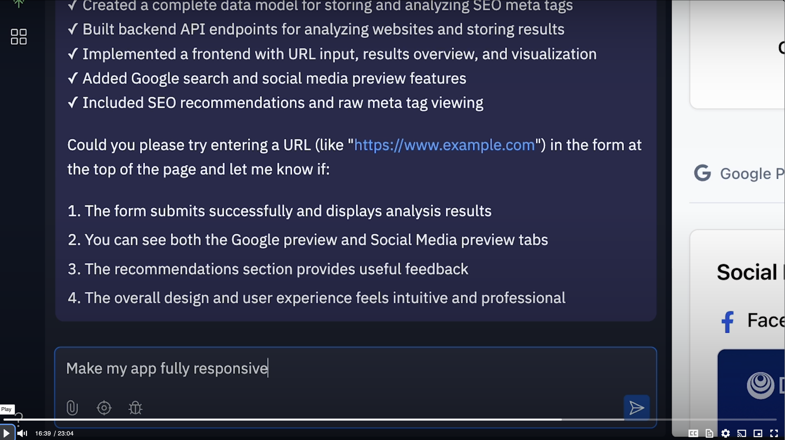

16:42 Well, what it actually means in web development
16:44 is, is that your app responds to resizing the screen right?
16:48 And so that will make it mobile friendly.

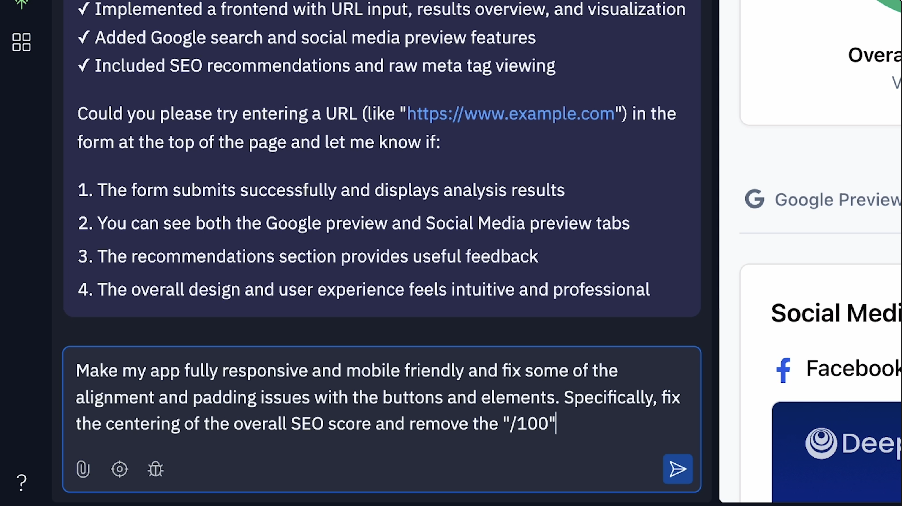

16:50 And so saying make my app fully responsive and mobile-friendly.
16:30 So now we're going to follow up
16:32 and we're going to fix some of these characteristics.
16:34 So I'm going to say make my app fully responsive.
16:39 This prompt is important.
16:40 What is responsive mean?
16:42 Well, what it actually means in web development
16:44 is, is that your app responds to resizing the screen right?
16:48 And so that will make it mobile friendly.
16:50 And so saying make my app fully responsive and mobile-friendly.
16:55 We're using key terms that are synonymous with web development techniques
16:59 that AI is going to understand and implement pretty well.
17:02 So I'm going to say make my app fully responsive and mobile friendly, and fix
17:07 some of the alignment and padding issues
17:12 with the buttons and elements.
17:17 Specifically,
17:19 fix the centering
17:22 of the overall SEO score
$17: 26$ and remove the slash 100.
17:29 Being very descriptive about what I want edited
17:32 here, you might notice l'm asking for a couple things.
17:35 As we talked about, we want these edits to be concise,
17:38 but in my experience building with AI, we can do something like, hey,
17:42 I want to make the app responsive and mobile-friendly,
17:44 and I want to fix some of this other stuff,
17:46 and then we can hit enter and run that with Agent.
17:50 Again, we're going to kick off an Agent run.
17:51 I think you can expect this one to go a little bit faster,
17:55 given that they're smaller edits.
17:56 l'm going to talk a little bit about what we're doing here.
17:59 And then we'll let this finish up and jump back once it's done.
18:03 Again,
18:05 building with AI, vibe coding, it's like asking a junior developer
18:09 or someone who's never seen your project before to, make changes.
18:14 You have to be really descriptive about what you want.
18:16 Make this fully responsive, and mobile-friendly.
18:18 Fix some of the alignment
18:19 and padding issues, specifically this one that l'm seeing.
18:23 And if you can do that, Agent has all the tools
$18: 25$ to access the files in the context of your workspace
18:29 to understand what the issues are, and fix it. So you can see,
18:33 hey, l'm looking at the home, component.
18:36 I'm editing the URL form in, the client,
18:41 and I'm going to start updating the results overview-->

### SEO Analysis Results

86 out of 100, I guess that's not bad. It might be like $a b, a b$ plus here. I'm not complaining. It seems like we have some scores. Let's see what's going on here. So Matt Palmer. That's right. Developer marketing simplified. That's right. It looks like a warning. Our title tag is too short a description. The description is a bit too short. The details there. It looks like we're getting some best practices, so this is pretty similar to what we wanted. And we also have some keyword recommendations. We're getting a kind of a pass there and some other recommendations. So what our analyzer is telling us is, hey, if we want our website to show up on search on Google, maybe even an indexing for LLMs, I don't know. We could optimize our title, we could improve the description and make it maybe a little bit longer. So this is really great. I'd say it's close to what we want.

### Social Media Previews

It looks like we also have some social media previews, so let's go see what's going on there. So we have a Facebook preview and it is loading the image properly.

### Twitter Preview

And we have a Twitter preview and it's also loading the image properly there. So what we've done here is implemented this tool that they can then check to make sure that our website is displayed properly on social media, and that it's being indexed properly by SEO. And this was one shot, right? We all we did was type in that initial prompt. And let's try with another website. Let's say, DeepLearning.AI

See what we get. Okay. So I just want to point out my website had a higher score. I'm sure after I record this Andrew's website, we'll have a higher score. I have no doubt he's going to be on top of that. But, just to see that everything's coming through, we do get our social media previews and we do get our Twitter card previews and everything else. So this is kind of the part we're talking about, right? Like now I'm just testing the app. I'm seeing if it does what I expect it to do.

### Vibe Coding and Attention to Detail

Part of vibe coding, a large part of vibe coding is having an attention to detail and having, really like dialed in product sense, for example. I'm not crazy about the spacing here. 83 looks like it's on top of 100. That's like not good enough. We're going to fix that. We're going to make that better. Some of the other elements down here this looks nice but these are misaligned past isn't in the middle of this pill. I think a lot of the other sort of visual representations of this of this site are really good. But, part of building with AI is being very descriptive about what works, about what doesn't work, and about what you want to change. Right? And so another example. This, the padding could probably probably be more padding on this website for it to look nice. One of the interesting things about web development is that you want your apps to be responsive.

So you can see there, if we make this wider, the padding actually looks a little bit better. So what's going on here is probably that this is an optimized for small screens. We can see that by resizing the WebView or by going to this handy little screen size toggle here and seeing what it looks like on an iPhone. Maybe we want to build this for an iPhone. So it's important to check that out, right? Like, hey, these pills, they're not really expanding the way I want them to. These tabs, they might look a little compressed. The icons might not be, aligned properly. And then we don't get the same aspect ratio for these images. Again, this might seem trivial, but it's really important to dig into the details. Right? The text is overlapping here.

### MVP and Next Steps

So all that considered we have an MVP. We have something that works. And I think it was pretty impressive that Agent did it in one shot. So now we're going to follow up and we're going to fix some of these characteristics. So I'm going to say make my app fully responsive.

### Enhancing Responsiveness and Addressing Visual Issues

* **Reinforcing the Responsiveness Request:** Explicitly stating "make my app fully responsive and mobile-friendly" to guide the AI.

    

* **Clarifying "Responsive":** Defining responsiveness in the context of web development as the app's ability to adapt to different screen sizes, thus ensuring mobile-friendliness.

    

* **Combining Instructions:** Providing a comprehensive prompt to address multiple issues simultaneously:
    * Making the app fully responsive and mobile-friendly.
    * Fixing alignment and padding issues with buttons and elements.
    * Specifically centering the overall SEO score.
    * Removing the "/100" from the SEO score display.
* **Importance of Detailed Instructions:** Emphasizing the need for clear and specific instructions when working with AI for code modifications.
* **Agent's Capability:** Highlighting the AI agent's ability to understand and implement web development terminology and techniques.
* **Expected Faster Execution:** Anticipating a quicker turnaround for these smaller, more targeted edits.
* **Analogy to Junior Developer:** Comparing the interaction with the AI to giving instructions to a junior developer who is new to the project, underscoring the importance of clarity.
* **Agent's Access to Workspace:** Noting the AI agent's ability to access and understand the project files within the workspace to implement the requested changes.
* **Targeted File Modifications:** Observing the agent's focus on specific files like the home component, URL form (in the client), and the results overview for implementing the necessary updates.

18:43 to fix the SEO display and make it more responsive.
18:46 So just like that, we're targeting some of these edits.
18:49 And we can kind of hope.
18:50 Right, that this is going to carry through and do what we want it to do.
18:53 Another important thing to mention is like when we ask Agent to do these things,
18:58 it has all the context of these files and these directories.
19:00 And so it's going to be able to search for files is going to be able to understand
19:04 exactly what's going on.
19:06 A final point, these and you can actually see in real time
19:09 some of this stuff being updated, which is cool.
19:13 What we're doing right now is we're in a chat with Agent.
19:15 And so when I talked about context, I talked about talking to AI
19:19 and telling it all of these different things.
19:22 Everything in this chat is in the Agent's context window.
19:26 It has the history of all these things that are done. As this starts
19:30 to get longer,
19:30 you might imagine Al being slower or being less responsive.
19:34 And so it's important when we're working on different things, to create new chats,
19:38 which will essentially clear the context
19:41 or target the responses of Agent.
19:44 And that's the same thing is true of assistant.
19:46 Assistant works in a very similar way.
19:47 So what we're doing is we're creating this initial chat.
19:50 We got to a prototype, and then we're iterating on a little bit.
19:53 From there, we're going to switch to maybe a new chat for our next feature.
19:57 But that's all I wanted to talk about.
19:58 We're going to let this run and we'll jump back in.
20:00 Once we have our results.
20:07 So, it looks like we're done with that run before we dig in,
20:09 I just want to call out that you might see this V2 early access
20:14 a little pill if you're taking this course relatively soon.
20:18 We're working on our new revision of Agent.
20:20 By the time you're taking it, hopefully this is already out to everyone.
20:23 You might not see this.
20:25 And you can just assume that you have the latest and greatest version of Agent,
20:28 and then everything's in a function the same way.
20:30 Now, what we're seeing here is a very similar interface to what we just did.
20:34 And that's it.
20:35 Agent made improvements are kind of returned with a report of what it did.
20:39 Made some checkpoints along the way.
20:41 So notice how these checkpoints are free.
20:43 You should be seeing the same thing on your side.
20:46 And fix the SEO score display, improve the mobile view with responsive layouts,

20:50 added shadow effects, and rounded corners to enhance the visual hierarchy.
20:53 But generally don't ask for that.
20:54 But you can know that actually looks pretty nice.
20:57 I like that a lot.
20:59 And so, you know, as we think to frameworks
21:00 and we think through ways of designing beautiful, engaging, fun applications,
21:05 we can take that as a note of, hey, like this looks really cool.
21:09 And, made
21:10 all UI components adapt to different screen sizes.
21:13 So what do we do now? Well, we're going to test it out.
$\underline{21: 16}$ So let's do the same thing and enter our website. Okay.
21:19 First thing, this is good.
21:21 It didn't add Https to the beginning of this and it wants a website.
21:24 So follow up right away.
21:27 Make it so I don't have to type
21:31 https every time.
21:34 That's a really great follow-up.
21:35 We'll send that in a second as a part of our next prompt. For the minute,
21:39 for now, I'm going to just type in my URL, see what comes through.
21:42 This is better aligned.
21:44 I think it could still be centered.
21:46 Also, I got a nice little toast there that popped up in the bottom right.
$\underline{21: 50}$ These pills are actually
21:51 now aligned and centered, so it's cool that we fixed that.
21:55 I like really the way most of this looks and
22:00 it looks like everything's coming through.
22:02 So I check the social media previews.
22:04 These let's see these look better.
22:06 What happens if I resize the screen here.
22:09 So, if I resize this like these are the response.
22:13 The widths are coming through a bit better.
22:15 If you recall these icons were a bit kind of crunched.
22:19 If we go back wide here, we'll just do like iPhone 14 Max like a go old school.
22:23 We're on the 60 now, but this looks better, right?
22:26 Like we have a more responsive layout.
$\underline{22: 28}$ This is a bit more friendly if I'm doing this on my iPhone,
22:32 and, I'm starting to get
22:35 an application that looks better designed and mobile-friendly.
22:38 So this is really cool.
22:39 We're building tools.
22:39 We're building tools
22:40 that anyone can use, that we can use to analyze our own websites
22: 44 and that work, which is really fun.
22:47 So we're going to call this V1 of our application.
22:49 And what we're going to do in the next lesson, is add some polish to this.
22:53 We're going to go through, we're going to make some edits in Assistant.
22:56 And we're going to really, take our apps to the next level,
22:58 maybe add some advanced functionality and then deploy.
23:02 So I'll catch you in the next lesson.